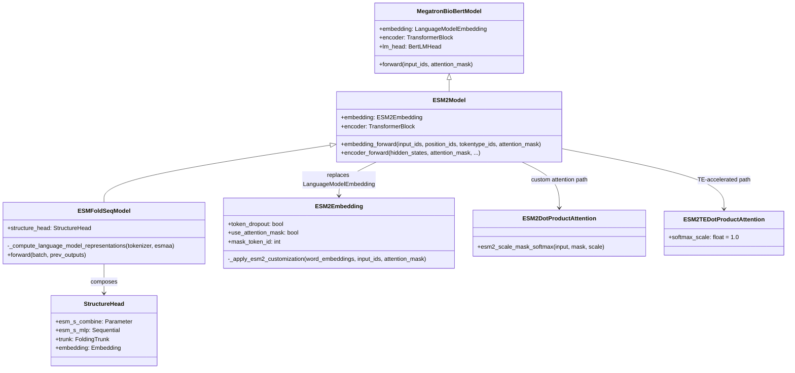
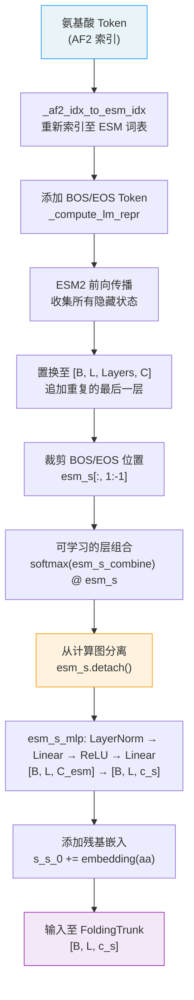

---
slug:8-esm2-sequence-encoder
blog_type:normal
---

PepTron 的 ESM2 序列编码器是一个基于 Megatron 分布式的蛋白质语言模型，它将氨基酸序列转换为丰富的逐残基表示，作为下游结构预测流程的冻结感知主干。该编码器基于 NVIDIA 的 BioNeMo 框架构建，通过三项关键的 ESM2 专属定制扩展了 `MegatronBioBertModel`——**Token Dropout 缩放**、**嵌入层注意力掩码**和**非归一化 Softmax 注意力**——这些定制在保持与原始 ESM2 预训练保真度的同时，实现了大规模的张量并行与流水线并行。

来源: [model.py](/esm2/model/model.py#L1-L669), [api.py](/esm2/api.py#L17-L28)

## 架构谱系与设计原理

ESM2 序列编码器占据了一个明确的架构生态位：它**不是**为结构预测而微调的通用语言模型，而是一个**冻结的特征提取器**，其预训练表示被 `StructureHead` 原封不动地消费。这一设计决策直接编码在模型构造器中——当 `config.training.encoder_frozen` 为 `True` 时，所有 ESM2 参数的 `requires_grad` 标志均被设为 `False`。编码器的输出在投影到主干序列状态空间之前，还会通过 `esm_s = esm_s.detach()` 从计算图中分离。

类层次结构为：`ESM2Model → MegatronBioBertModel → MegatronModel`。随后，`ESMFoldSeqModel` 通过将编码器与 `StructureHead` 组合来扩展 `ESM2Model`，构成了完整的 PepTron 架构。这种组合模式确保了 ESM2 的前向传播能产生所有中间隐藏状态（`include_hiddens=True`），随后结构头通过一种可学习的层加权机制对这些状态进行重组。

来源: [model.py](/peptron/model/model.py#L60-L118), [model.py](/esm2/model/model.py#L67-L199)

## 相较标准 BioBERT 的三项 ESM2 定制

ESM2 模型在三个精确界定的领域与标准 `MegatronBioBertModel` 产生了分歧。每项定制都是为了匹配原始 ESM2 的预训练行为，确保加载的检查点能够产生完全相同的输出。

### 1. ESM2Embedding — Token Dropout 与注意力掩码

`ESM2Embedding` 类替换了 `LanguageModelEmbedding`，并引入了两种在位置编码添加之前对原始词嵌入进行操作的相互关联的机制：

**Token Dropout 缩放**补偿了推理期间遇到的可变掩码比例。在 ESM2 预训练期间，15% 的 Token 被掩码处理，其中 80% 被替换为掩码 Token——由此产生的期望掩码比例为 `0.15 × 0.8 = 0.12`。在推理时，实际的掩码比例可能有所不同，因此嵌入会按 `(1 - ESM2_MASK_RATIO_TRAIN) / (1 - mask_ratio_observed)` 进行缩放。此外，掩码 Token 位置在嵌入空间中被置零，以防止信息泄露。这种缩放确保了无论有多少 Token 被掩码，输入到 Transformer 的期望幅度保持恒定。

**注意力掩码置零**将词嵌入乘以注意力掩码，确保填充位置在进入 Transformer 堆栈之前不贡献任何信号。这不仅应用于原始词嵌入（位置编码添加之前），还再次应用于组合嵌入（位置编码添加之后），为防止填充污染提供了双重保障。

| 定制 | 目的 | 影响阶段 | 配置标志 |
|---|---|---|---|
| Token Dropout 缩放 | 在可变掩码下归一化嵌入幅度 | 位置编码前 | `token_dropout: bool = True` |
| 掩码 Token 置零 | 移除掩码位置的信息 | 位置编码前 | `token_dropout: bool = True` |
| 注意力掩码置零 | 抑制填充信号 | 位置编码前与后 | `use_attention_mask: bool = True` |

来源: [embedding.py](/esm2/model/embedding.py#L31-L157)

### 2. ESM2DotProductAttention — 定制 Softmax 与掩码

`ESM2DotProductAttention` 通过两项行为变更覆盖了标准的 `DotProductAttention`。首先，当启用 `use_esm_attention` 时，注意力掩码采用 ESM2 的约定：填充位置被填充为 `finfo(dtype).min`（而非乘法掩码），并且掩码被切片为 `[b, np, 1, sk]` 形状，以匹配 ESM2 扩展的注意力掩码格式。其次，`esm2_scale_mask_softmax` 方法在可选的 fp32 精度下（由 `attention_softmax_in_fp32` 控制）执行 Softmax，随后转换回原精度，为半精度训练提供数值稳定性。

`ESM2TEDotProductAttention` 提供了 Transformer Engine 加速的等效实现。其唯一的定制是强制设定 `softmax_scale = 1.0`，这禁用了 TE 后端默认的 `1/√d_k` 缩放。这与 ESM2 的预训练行为相匹配，即注意力分数**不**按键维度进行归一化。

<CgxTip>当 `use_esm_attention = False`（默认值）时，模型使用标准的 Megatron 注意力机制并配合 Transformer Engine 加速，这仍然能通过黄金值测试。仅在需要原始 ESM2 注意力行为的精确按位复现时，才启用 `use_esm_attention = True`。</CgxTip>

来源: [attention.py](/esm2/model/attention.py#L44-L369)

### 3. 完整隐藏状态收集 — 多层表示提取

`encoder_forward` 方法覆盖了标准的 Transformer 块前向传播，以收集**每一层**（而不仅仅是最终输出）的隐藏状态。在每个 Transformer 层之后，隐藏状态会从 `[s, b, h]` 格式置换为 `[b, s, h]` 格式，并追加到 `all_hidden_states` 中。在最终的层归一化之后，最后一个隐藏状态也会被追加。这种收集对于下游的 `StructureHead` 至关重要，后者使用一种可学习的 Softmax 加权组合来跨所有层进行重组。

来源: [model.py](/esm2/model/model.py#L309-L398), [model.py](/esm2/model/model.py#L435-L448)

## 表示流：从 Token 到结构特征

从氨基酸 Token 到结构就绪特征的完整数据流遵循一个精确的流程。理解此流程对于诊断表示质量问题以及正确配置编码器至关重要。

`_compute_language_model_representations` 方法编排了该流程的前半部分。它在残基序列两端添加 BOS（`cls_token_id`）和 EOS（`eos_token_id`）Token，使用全 1 的注意力掩码运行完整的 ESM2 前向传播，并提取 `all_hidden_states` 张量。一个微妙但重要的细节是：最后一层的隐藏状态被**复制并追加**（`esm_s = torch.cat([esm_s, last], dim=2)`），使得表示与 HuggingFace ESM 检查点兼容，后者将最终层归一化的输出作为额外条目包含在内。

可学习的层组合使用了 `esm_s_combine`，一个长度为 `num_layers + 1` 的参数向量。其 Softmax 产生一个跨层的概率分布，加权和将层维度折叠：`esm_s = (softmax(esm_s_combine) @ esm_s).squeeze(2)`。这允许模型学习哪些 ESM2 层对结构预测最具信息量——这是一种可微的层选择形式。

来源: [model.py](/peptron/model/model.py#L120-L155), [model.py](/peptron/model/model.py#L289-L341)

## 配置参考

`ESM2GenericConfig` 数据类提供了编码器的所有可调参数。默认值对应于 ESM2-650M 架构。PepTron 使用 `ESM2Config` 子类（继承自 `ESM2GenericConfig`），该子类添加了训练专有字段，包括 `encoder_frozen` 和 `structure_frozen` 标志。

| 参数 | 默认值 | 描述 |
|---|---|---|
| `num_layers` | 33 | Transformer 层数（650M 模型） |
| `hidden_size` | 1280 | 每层的隐藏维度 |
| `num_attention_heads` | 20 | 多头注意力头数 |
| `ffn_hidden_size` | 5120 | 前馈网络隐藏层大小（4× hidden） |
| `hidden_dropout` | 0.0 | ESM2 移除了隐藏层的 Dropout |
| `attention_dropout` | 0.0 | ESM2 移除了注意力的 Dropout |
| `token_dropout` | True | 启用 ESM2 Token Dropout 缩放 |
| `use_attention_mask` | True | 将注意力掩码应用于嵌入 |
| `use_esm_attention` | False | 使用 ESM2 定制注意力（禁用 TE 加速） |
| `normalize_attention_scores` | False | 禁用注意力中的 1/√d_k 缩放 |
| `attention_softmax_in_fp32` | False | 在 fp32 下计算注意力 Softmax |
| `position_embedding_type` | `"rope"` | 旋转位置嵌入，用于长度外推 |
| `share_embeddings_and_output_weights` | True | 绑定输入/输出嵌入权重 |
| `seq_length` | 1024 | 最大输入序列长度 |
| `biobert_spec_option` | `esm2_bert_layer_with_transformer_engine_spec` | Transformer 层规格 |

<CgxTip>`biobert_spec_option` 字段控制使用哪种注意力实现。`esm2_bert_layer_with_transformer_engine_spec`（默认）选择 `ESM2TEDotProductAttention` 且 `apply_query_key_layer_scaling = False`。已弃用的 `esm2_bert_layer_local_spec` 选择 `ESM2DotProductAttention` 且 `apply_query_key_layer_scaling = True`。</CgxTip>

来源: [model.py](/esm2/model/model.py#L483-L649), [config_models.py](/esm2/run/config_models.py#L147-L229)

## 编码器冻结与选择性训练

`ESMFoldSeqModel` 支持两个级别的冻结，这对 PepTron 的训练策略至关重要：

**全编码器冻结**（`config.training.encoder_frozen = True`）：ESM2 模型中的每个参数——包括嵌入、所有 Transformer 层和输出头——都被冻结。表示作为固定特征流过，训练期间仅更新 `StructureHead` 参数。这是标准运行模式。

**结构部分冻结**（`config.training.structure_frozen = True`）：在 `StructureHead` 内部，特定的子模块可以按名称冻结。可配置的冻结集包括 `esm_s_combine`、`af2_to_esm`、`positional_encoding`、`esm_s_mlp`、`embedding`、`trunk`、`distogram_head`、`ptm_head`、`lm_head` 和 `lddt_head`。任何带点分隔的名称路径与此集合相交的参数都将设为 `requires_grad = False`。这实现了细粒度的消融研究——例如，在仅训练头时冻结主干。

来源: [model.py](/peptron/model/model.py#L70-L96)

## 推理接口

对于独立的 ESM2 推理（不带结构头），`infer_esm2.py` 脚本提供了一个完整的入口点。它支持由布尔标志控制的三种输出模式：`include_hiddens`（所有层的隐藏状态）、`include_embeddings`（按序列平均池化的嵌入）和 `include_logits`（Token 级别的 Logits）。推理流程通过构建一个 `skip_logits = not include_logits` 的 `ESM2Config`，以在未请求 Logits 时避免不必要的计算。

该模型支持多种配置类用于推理：`ESM2Config`（预训练编码器）、`ESM2FineTuneSeqConfig`（序列级回归头）和 `ESM2FineTuneTokenConfig`（Token 级分类头）。每种都可以通过 `--config-class` CLI 参数进行选择。

来源: [infer_esm2.py](/esm2/scripts/infer_esm2.py#L26-L200)

## 与下游组件的关系

ESM2 序列编码器产生两类输出，馈入后续流程阶段。**逐残基序列特征**（`s_s_0`，形状 `[B, L, c_s]`）作为初始单状态表示进入 `FoldingTrunk`，并在那里通过三角自注意力块进行精炼。**成对特征**（`s_z_0`，形状 `[B, L, L, c_z]`）独立于基于距离的输入成对嵌入和时间嵌入（来自流匹配调度）构建，随后同样在主干中进行精炼。ESM2 编码器不直接产生成对特征——这种关注点分离确保了序列编码器纯粹作为一个单向特征提取器，而成对关系则从 `InputPairStack` 处理的几何与时间输入中产生。

若要深入了解这些表示是如何被消费的，请参见 [Structure Head and FoldingTrunk](9-structure-head-and-foldingtrunk)。对于精炼它们的注意力机制，请参见 [Triangular Self-Attention Blocks](10-triangular-self-attention-blocks)。关于包含编码器初始化的完整训练设置，请参见 [Mixed PDB-IDRome Training Strategy](12-mixed-pdb-idrome-training-strategy)。