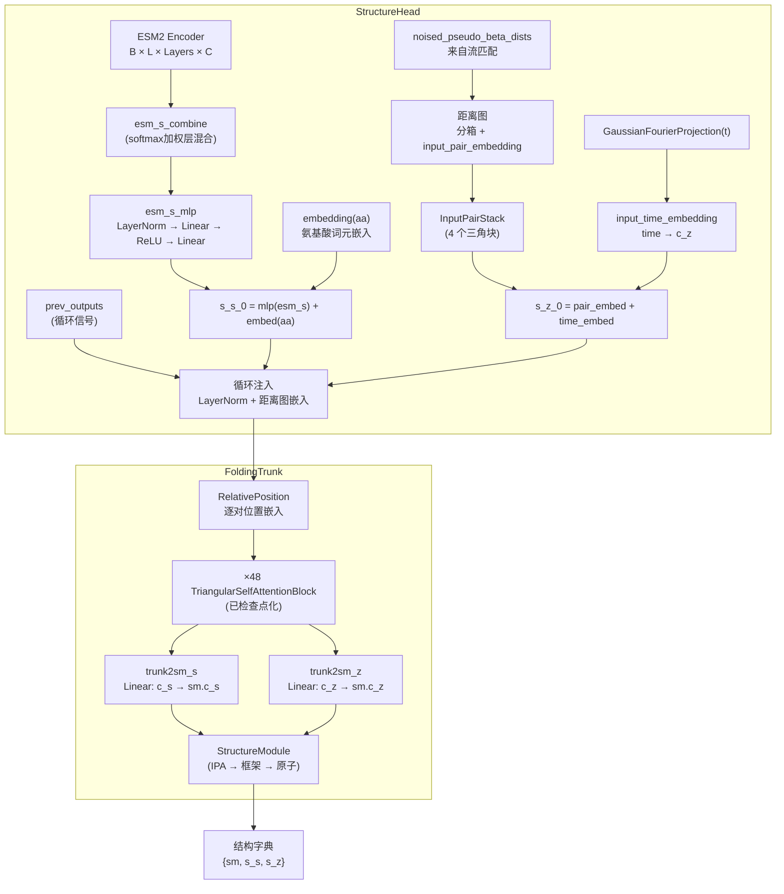

---
slug:9-structure-head-and-foldingtrunk
blog_type:normal
---

**StructureHead** 和 **FoldingTrunk** 构成了 PepTron 结构生成架构核心的两阶段几何推理流水线。StructureHead 负责编排完整的前向传播过程——从 ESM2 编码器输出，经逐对特征构建，直至 3D 坐标预测——而 FoldingTrunk 则通过堆叠的三角自注意力块执行繁重的表征精化，随后将结果移交给 OpenFold 的 StructureModule，以输出 SE(3) 框架和原子位置。两者协同作用，将序列级语义与逐对几何推理桥接起来，消耗来自流匹配过程的带噪距离输入，并生成完整的全原子结构预测。

来源: [model.py](peptron/model/model.py#L152-L509), [trunk.py](peptron/model/trunk.py#L70-L178)

## 架构概述

这两个模块间的数据流遵循精确的分级模式。StructureHead 充当**外部编排层**——它根据 ESM2 嵌入构建单序列和逐对表征，注入流匹配的时间和距离信号，处理来自先前结构预测的循环，并委托给 FoldingTrunk。FoldingTrunk 充当**内部表征引擎**——它应用相对位置编码，运行 `TriangularSelfAttentionBlock` 实例堆栈，并将精化后的表征投影到 OpenFold 的 `StructureModule` 以生成最终坐标。

来源: [model.py](peptron/model/model.py#L313-L427), [trunk.py](peptron/model/trunk.py#L132-L178)

## StructureHead: 编排层

### 序列表征构建

StructureHead 首先通过 `_af2_idx_to_esm_idx` 映射，将氨基酸索引从 OpenFold 的残基排序转换为 ESM2 的词元词汇表。ESM2 编码器生成所有层的隐藏状态，形状为 `[B, L, Layers, C]`。PepTron 并非仅使用最后一层，而是通过 `esm_s_combine` 在所有层上应用**可学习的 softmax 加权组合**——这是一个形状为 `[num_layers + 1]` 的参数向量，其 softmax 结果生成混合权重。这允许模型在各个训练阶段动态地关注信息量最大的 ESM2 层。组合后的表征经过 `esm_s_mlp`（LayerNorm → Linear → ReLU → Linear），从 ESM2 的特征维度（2560）投影到 Trunk 的序列状态维度（c_s = 1024），并与直接的氨基酸嵌入求和。

来源: [model.py](peptron/model/model.py#L350-L364)

### 带时间条件的逐对表征构建

逐对通道是 PepTron 的流匹配集成进入架构的地方。当批次中存在带噪距离时（在流匹配训练或推理期间），StructureHead 通过三个组件构建初始逐对状态 `s_z_0`：

1. **距离图嵌入**：带噪的逐对伪 β 距离被分入 `no_bins=39` 个直方图箱中，范围跨越 `[3.25, 50.75]` Å，然后通过 `input_pair_embedding`（Linear: 39 → 128）投影，并由 `InputPairStack` 精化——这是一个 4 块的三角更新栈，应用起始/结束节点注意力、出/入乘法更新和逐对过渡。

2. **时间嵌入**：流匹配时间标量 `t ∈ [0, 1]` 通过 `GaussianFourierProjection`（正弦编码至 256 维）投影，随后通过 `input_time_embedding`（Linear: 256 → 128），并在所有 L × L 逐对位置上进行**广播相加**。这在全局上将每个对条件化于当前的扩散时间步。

3. **额外输入（可选）**：当 `flow_matching.extra_input=True` 时，将通过独立的 `extra_input_pair_embedding` 和 `extra_input_pair_stack`，从真实或模板逐对距离构建额外的逐对嵌入，并将其加到主逐对状态中。这提供了来自已知构象的结构条件化。

来源: [model.py](peptron/model/model.py#L267-L401), [layers.py](peptron/model/layers.py#L14-L28), [input_stack.py](peptron/model/input_stack.py#L184-L303)

### 循环机制

当提供 `prev_outputs` 时（来自上一次结构预测迭代），StructureHead 将三个循环信号注入初始表征：

| 信号 | 目标 | 机制 |
|--------|--------|-----------|
| `prev_outputs['s_s']` | 序列状态 `s_s_0` | LayerNorm → 加性 |
| `prev_outputs['s_z']` | 逐对状态 `s_z_0` | LayerNorm → 加性 |
| `prev_outputs['sm']["positions"][-1]` | 逐对状态 `s_z_0` | 距离图 (15 箱, 3.375–21.375 Å) → 嵌入 → 加性 |

距离图由上一次 StructureModule 迭代的 N/CA/C 骨架位置计算得出，通过推断 Cβ 坐标并对逐对 Cβ–Cβ 距离进行分箱得到。当不存在先前输出时，会添加零值循环项，以在不影响计算的情况下保持 DDP 兼容性。

来源: [model.py](peptron/model/model.py#L404-L424), [trunk.py](peptron/model/trunk.py#L100-L104), [trunk.py](peptron/model/trunk.py#L180-L198)

### 辅助头

在 FoldingTrunk 返回精化后的结构字典后，StructureHead 应用四个辅助预测头：

- **距离图头**：从 `s_z`（128）到 `distogram_bins`（64）logits 的线性投影，通过与其转置取平均进行对称化。
- **语言建模头**：从 `s_s`（1024）到词元词汇表 logits 的线性投影。
- **pLDDT 头**：在 StructureModule 的单一表征（c_s = 384）上操作的 `PerResidueLDDTCaPredictor`，在 50 个箱中预测逐残基置信度，并缩放至 [0, 100]。
- **pTM 头**：从 `s_z` 到距离图箱的线性投影，随后调用 `compute_tm` 以生成预测的 TM 分数和预测的对齐误差。

最终的全原子位置从 atom14 表示转换为 atom37 表示，StructureModule 的最终 SE(3) 框架被提取为 `final_affine_tensor`。

来源: [model.py](peptron/model/model.py#L429-L504)

## FoldingTrunk: 表征引擎

### 内部架构

FoldingTrunk 封装了三个子组件：**相对位置嵌入**、**三角自注意力块堆栈**，以及带有其投影层的 **StructureModule**。其配置由 `TrunkConfig` 管理：

| 参数 | 默认值 | 描述 |
|-----------|---------|-------------|
| `num_blocks` | 48 | TriangularSelfAttentionBlock 实例的数量 |
| `sequence_state_dim` (c_s) | 1024 | 单一表征通道维度 |
| `pairwise_state_dim` (c_z) | 128 | 逐对表征通道维度 |
| `sequence_head_width` | 32 | 序列注意力的头宽度（→ 32 头） |
| `pairwise_head_width` | 32 | 逐对注意力的头宽度（→ 4 头） |
| `position_bins` | 32 | 相对位置编码的分箱数 |
| `dropout` | 0.0 | 块内的 Dropout 率 |
| `chunk_size` | None | 轴向注意力分块大小（None = 不分块） |

头数是隐式派生的：`sequence_num_heads = c_s / sequence_head_width = 32` 和 `pairwise_num_heads = c_z / pairwise_head_width = 4`。

来源: [trunk.py](peptron/model/trunk.py#L70-L111), [model.py](peptron/model/model.py#L530-L560)

### 相对位置编码

`RelativePosition` 模块将逐对残基距离嵌入到逐对表征中。给定残基索引，它计算 `diff = residx[:, None, :] - residx[:, :, None]`，截断至 `[-bins, bins]`，偏移 `bins + 1`（将索引 0 保留给被掩码的对），并查找形状为 `[2 * bins + 2, c_z]` 的可学习嵌入。对于被掩码的位置，diff 被设为 0（填充索引）。此编码在每个 Trunk 迭代开始时**加到**逐对状态中，为各块提供位置感知能力。

来源: [trunk.py](peptron/model/trunk.py#L35-L67), [trunk.py](peptron/model/trunk.py#L150)

### 前向传播与梯度检查点化

FoldingTrunk 的前向方法在块堆栈中执行单次传递（无内部循环——循环由 StructureHead 层级处理）。这些块通过 OpenFold 的 `checkpoint_blocks` 工具执行，且 `blocks_per_ckpt=1`，这意味着**每个 TriangularSelfAttentionBlock 都被单独进行梯度检查点化**。这以计算换取内存，将 Trunk 的内存占用从 O(L² × num_blocks) 降低至约 O(L²)，代价是在反向传播期间重新计算激活值。

在块堆栈生成精化的 `s_s` 和 `s_z` 之后，两个投影层将 Trunk 的维度映射到 StructureModule 的维度：`trunk2sm_s`: Linear(1024 → 384) 和 `trunk2sm_z`: Linear(128 → 128)。随后 StructureModule 生成最终的 SE(3) 框架和原子位置。Trunk 返回一个包含 StructureModule 输出（`sm`）、精化的单一表征（`s_s`）和精化的逐对表征（`s_z`）的字典——后两者对循环机制和辅助头至关重要。

来源: [trunk.py](peptron/model/trunk.py#L132-L178)

## 表征流与维度

下表追踪了在大小为 B 的批次和长度为 L 的序列下，张量形状贯穿完整 StructureHead → FoldingTrunk → StructureModule 流水线的变化：

| 阶段 | 张量 | 形状 | 备注 |
|-------|--------|-------|-------|
| ESM2 输出 | `esm_s` | B × L × 37 × 2560 | 所有隐藏状态 |
| 层组合 | `esm_s` | B × L × 2560 | softmax 加权混合 |
| MLP 投影 | `s_s_0` | B × L × 1024 | 序列状态 |
| 距离图 | `inp_z` | B × L × L × 128 | InputPairStack 之后 |
| 时间注入 | `inp_z` | B × L × L × 128 | 加广播时间嵌入 |
| 循环后 | `s_s_0, s_z_0` | B×L×1024, B×L×L×128 | 已添加循环信号 |
| RPE 后 | `z` | B × L × L × 128 | 已添加相对位置 |
| 48 块后 | `s_s, s_z` | B×L×1024, B×L×L×128 | 精化后的表征 |
| SM 投影 | `sm_s, sm_z` | B×L×384, B×L×L×128 | 维度适配 |
| StructureModule | `positions, frames` | B×L×14×3, B×L×(iter) | 全原子输出 |

来源: [model.py](peptron/model/model.py#L313-L504), [trunk.py](peptron/model/trunk.py#L132-L178)

## ESMFoldSeqModel 容器

`ESMFoldSeqModel` 将 ESM2 编码器和 StructureHead 包装成一个继承自 `ESM2Model` 的单一模型类。它支持两种关键的冻结策略：

- **`encoder_frozen=True`**（默认）：冻结所有 ESM2 参数，仅训练结构头。这是标准的 PepTron 训练机制。
- **`structure_frozen=True`**：冻结特定的折叠层（`esm_s_combine`、`af2_to_esm`、`positional_encoding`、`esm_s_mlp`、`embedding`、`trunk`、`distogram_head`、`ptm_head`、`lm_head`、`lddt_head`），同时保持其他参数可训练。

该模型的前向方法是一个轻量级包装器，它委托给 `structure_head(batch, prev_outputs)`，并返回 `{"structure_output": structure_output}`。这种简洁的接口允许流匹配引擎（`FlowSteps.predictor_fn`）通过构建包含 `t` 和 `noised_pseudo_beta_dists` 的批次、运行前向传递，并从预测的原子位置中提取伪 β 坐标来调用模型。

来源: [model.py](peptron/model/model.py#L56-L149), [flowmoco.py](peptron/model/flowmoco.py#L126-L154)

<CgxTip>`trunk2sm_s` 和 `trunk2sm_z` 投影层是 FoldingTrunk 的表征维度（c_s=1024, c_z=128）与 StructureModule 的维度（c_s=384, c_z=128）之间的**唯一**接口。如果修改 Trunk 的通道宽度，则必须相应地更新这些投影——c_z 维度默认恰好匹配，但 c_s 需要显式的 1024→384 降维投影。</CgxTip>

<CgxTip>当批次中缺少 `noised_pseudo_beta_dists` 时（例如，在非流匹配评估期间），StructureHead 仍会以**零距离和零掩码**运行输入逐对嵌入路径，以维持 DDP 参数同步。这并非无操作——InputPairStack 仍会对零输入应用其可学习的变换，从而从层偏置中产生非零的偏置项。对于纯序列推理，应将此隐式偏置考虑在内。</CgxTip>

## 配置参考

`ESMFoldSeqConfig` 数据类组合了所有子配置。与 StructureHead 和 FoldingTrunk 相关的关键配置类如下：

| 配置类 | 关键字段 | 默认值 |
|-------------|------------|----------------|
| `TrunkConfig` | `num_blocks`, `sequence_state_dim`, `pairwise_state_dim` | 48, 1024, 128 |
| `StructureModuleConfig` | `c_s`, `c_z`, `c_ipa`, `no_heads_ipa`, `no_blocks` | 384, 128, 16, 12, 8 |
| `InputPairEmbedderConfig` | `min_bin`, `max_bin`, `no_bins`, `time_emb_dim` | 3.25, 50.75, 39, 256 |
| `FlowMatchingConfig` | `noise_prob`, `extra_input`, `self_cond_prob` | 0.5, False, 0.5 |
| `ESM2Config` | `feats`, `num_layers`, `attention_heads` | 2560, 36, 40 |

Trunk 配置通过 `get_esmfoldconfig()` 从全局 `ConfigDict` 中提取，该函数在构造 `TrunkConfig` 之前将 `structure_module` 子字典与 Trunk 配置分离。cuequivariance 覆盖标志会被显式传播，以确保加载检查点的配置不会静默还原注意力后端的选择。

来源: [model.py](peptron/model/model.py#L511-L732), [config.py](peptron/model/config.py#L599-L629), [config.py](peptron/model/config.py#L734-L786)

## 与相邻组件的关系

StructureHead 和 FoldingTrunk 位于 PepTron 架构的中心，与周围系统具有明确定义的接口：

- **上游**：[ESM2 序列编码器](8-esm2-sequence-encoder)提供多层隐藏状态，StructureHead 通过 `esm_s_combine` 和 `esm_s_mlp` 消耗这些状态。
- **内部**：[三角自注意力块](10-triangular-self-attention-blocks)是 FoldingTrunk 内部的核心计算单元，执行成对的序列→逐对和逐对→序列更新。
- **下游**：[连续流匹配](5-continuous-flow-matching)引擎调用 `FlowSteps.predictor_fn`，该函数构建带噪批次并调用 StructureHead，以在每个积分步获得结构预测。
- **训练**：[损失函数和验证指标](13-loss-functions-and-validation-metrics)消耗 StructureHead 的输出字典——距离图 logits、pLDDT、pTM、StructureModule 框架上的 FAPE 以及原子位置——以计算训练信号。