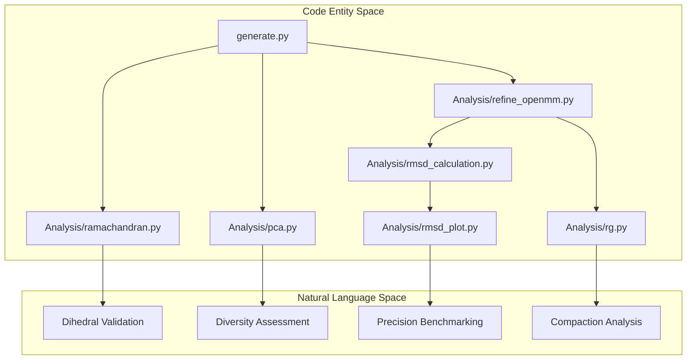

# Analysis and Validation

> **Relevant source files**
> * [Analysis/pca.py](https://github.com/Junjie-Zhu/Phanto-IDP/blob/8f82e775/Analysis/pca.py)
> * [Analysis/ramachandran.py](https://github.com/Junjie-Zhu/Phanto-IDP/blob/8f82e775/Analysis/ramachandran.py)
> * [Analysis/refine_openmm.py](https://github.com/Junjie-Zhu/Phanto-IDP/blob/8f82e775/Analysis/refine_openmm.py)
> * [Analysis/rg.py](https://github.com/Junjie-Zhu/Phanto-IDP/blob/8f82e775/Analysis/rg.py)
> * [Analysis/rmsd_calculation.py](https://github.com/Junjie-Zhu/Phanto-IDP/blob/8f82e775/Analysis/rmsd_calculation.py)
> * [Analysis/rmsd_plot.py](https://github.com/Junjie-Zhu/Phanto-IDP/blob/8f82e775/Analysis/rmsd_plot.py)
> * [ImgSrc/Phanto-IDP.png](https://github.com/Junjie-Zhu/Phanto-IDP/blob/8f82e775/ImgSrc/Phanto-IDP.png)
> * [README.md](https://github.com/Junjie-Zhu/Phanto-IDP/blob/8f82e775/README.md?plain=1)

The **Analysis and Validation** suite provides a set of post-generation tools to evaluate the structural quality, thermodynamic stability, and conformational diversity of the IDP ensembles generated by Phanto-IDP. These tools bridge the gap between raw coordinate generation and biological validation by analyzing backbone geometry, steric clashes, and ensemble distribution.

### System Overview

The analysis pipeline typically consumes predicted `.dat` or `.pdb` files and produces statistical distributions or refined structural models. The following diagram illustrates the relationship between the generation output and the various validation modules.

**Conformational Analysis Workflow**

**Sources:** [Analysis/ramachandran.py L1-L13](https://github.com/Junjie-Zhu/Phanto-IDP/blob/8f82e775/Analysis/ramachandran.py#L1-L13)

 [Analysis/pca.py L25-L27](https://github.com/Junjie-Zhu/Phanto-IDP/blob/8f82e775/Analysis/pca.py#L25-L27)

 [Analysis/refine_openmm.py L14-L18](https://github.com/Junjie-Zhu/Phanto-IDP/blob/8f82e775/Analysis/refine_openmm.py#L14-L18)

 [Analysis/rmsd_plot.py L5-L7](https://github.com/Junjie-Zhu/Phanto-IDP/blob/8f82e775/Analysis/rmsd_plot.py#L5-L7)

---

### 5.1 Ramachandran Plot Analysis

This module validates the local backbone geometry of generated structures by calculating $\phi$ (phi), $\psi$ (psi), and $\omega$ (omega) dihedral angles. It utilizes the `biotite` library to process structural data and enforces a 20,000-pair sampling threshold to ensure statistical significance. The output includes a 2D density histogram visualizing the distribution of these angles against known favorable regions.

For details, see [Ramachandran Plot Analysis](/Junjie-Zhu/Phanto-IDP/5.1-ramachandran-plot-analysis).

**Sources:** [Analysis/ramachandran.py L11-L29](https://github.com/Junjie-Zhu/Phanto-IDP/blob/8f82e775/Analysis/ramachandran.py#L11-L29)

 [Analysis/ramachandran.py L40-L53](https://github.com/Junjie-Zhu/Phanto-IDP/blob/8f82e775/Analysis/ramachandran.py#L40-L53)

---

### 5.2 RMSD Calculation and Distribution Plots

Validation of reconstruction precision is handled through Root Mean Square Deviation (RMSD) analysis. The suite includes tools for individual structure superimposition using `biotite.structure.superimpose` and batch visualization using Kernel Density Estimation (KDE) plots. These plots compare the generated ensembles for targets like RS1, PaaA2, and $\alpha$-synuclein against reference MD trajectories.

For details, see [RMSD Calculation and Distribution Plots](/Junjie-Zhu/Phanto-IDP/5.2-rmsd-calculation-and-distribution-plots).

**Sources:** [Analysis/rmsd_calculation.py L9-L11](https://github.com/Junjie-Zhu/Phanto-IDP/blob/8f82e775/Analysis/rmsd_calculation.py#L9-L11)

 [Analysis/rmsd_plot.py L20-L27](https://github.com/Junjie-Zhu/Phanto-IDP/blob/8f82e775/Analysis/rmsd_plot.py#L20-L27)

---

### 5.3 Radius of Gyration and Energy Refinement

To ensure generated structures are physically viable, Phanto-IDP employs a refinement pipeline using `OpenMM`. The `refine_openmm.py` script repairs missing atoms via `pdbfixer` and performs energy minimization using the `amber99sb` force field. Concurrently, the `rg.py` utility calculates the Radius of Gyration ($R_g$) to assess the global compaction of the generated IDP ensembles.

For details, see [Radius of Gyration and Energy Refinement](/Junjie-Zhu/Phanto-IDP/5.3-radius-of-gyration-and-energy-refinement).

**Sources:** [Analysis/refine_openmm.py L31-L43](https://github.com/Junjie-Zhu/Phanto-IDP/blob/8f82e775/Analysis/refine_openmm.py#L31-L43)

 [Analysis/refine_openmm.py L93-L116](https://github.com/Junjie-Zhu/Phanto-IDP/blob/8f82e775/Analysis/refine_openmm.py#L93-L116)

 [Analysis/rg.py L4-L17](https://github.com/Junjie-Zhu/Phanto-IDP/blob/8f82e775/Analysis/rg.py#L4-L17)

---

### 5.4 PCA of Conformational Ensembles

Principal Component Analysis (PCA) is used to project the high-dimensional conformational space into 2D for diversity assessment. The pipeline converts 3D coordinates into a Gram-matrix distance representation before applying `sklearn.decomposition.PCA`. This allows researchers to visualize whether the VAE successfully captured the breadth of the IDP's conformational landscape.

For details, see [PCA of Conformational Ensembles](/Junjie-Zhu/Phanto-IDP/5.4-pca-of-conformational-ensembles).

**Sources:** [Analysis/pca.py L13-L21](https://github.com/Junjie-Zhu/Phanto-IDP/blob/8f82e775/Analysis/pca.py#L13-L21)

 [Analysis/pca.py L33-L41](https://github.com/Junjie-Zhu/Phanto-IDP/blob/8f82e775/Analysis/pca.py#L33-L41)

---

### Analysis Tool Summary

| Tool | Input Entity | Primary Function | Code Symbol |
| --- | --- | --- | --- |
| **Geometry** | `predicted_*.dat` | Dihedral angle density | `struc.dihedral_backbone` |
| **Refinement** | `*.pdb` | Energy minimization | `simulation.minimizeEnergy` |
| **RMSD** | `*.pdb` | Structural alignment | `struc.superimpose` |
| **PCA** | `predicted_*.dat` | Latent space diversity | `coords_to_dist` |
| **Compaction** | `Rg_*.txt` | Ensemble mean/std $R_g$ | `rg_dict` |

**Sources:** [Analysis/ramachandran.py L17](https://github.com/Junjie-Zhu/Phanto-IDP/blob/8f82e775/Analysis/ramachandran.py#L17-L17)

 [Analysis/refine_openmm.py L111](https://github.com/Junjie-Zhu/Phanto-IDP/blob/8f82e775/Analysis/refine_openmm.py#L111-L111)

 [Analysis/rmsd_calculation.py L9](https://github.com/Junjie-Zhu/Phanto-IDP/blob/8f82e775/Analysis/rmsd_calculation.py#L9-L9)

 [Analysis/pca.py L13](https://github.com/Junjie-Zhu/Phanto-IDP/blob/8f82e775/Analysis/pca.py#L13-L13)

 [Analysis/rg.py L4](https://github.com/Junjie-Zhu/Phanto-IDP/blob/8f82e775/Analysis/rg.py#L4-L4)