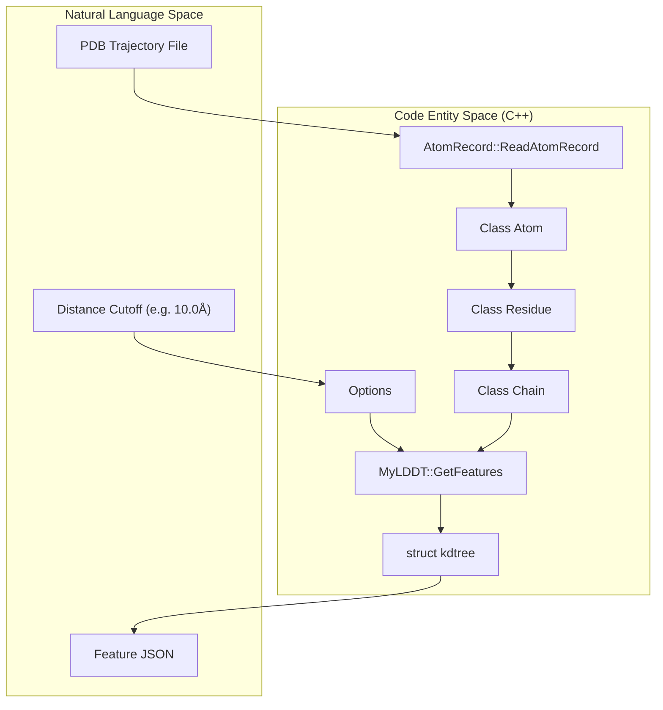
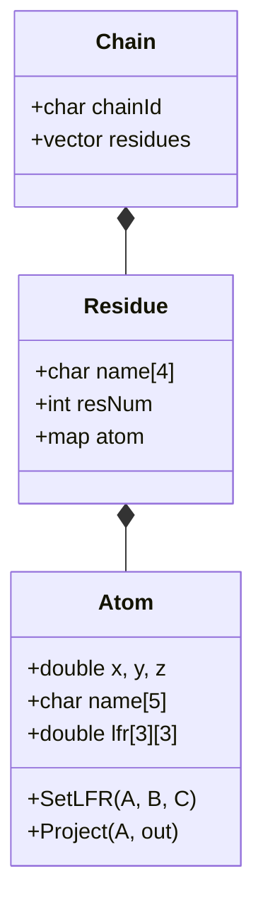

# C++ Feature Extractor (mylddt / get_features)

> **Relevant source files**
> * [preprocess/Makefile](https://github.com/Junjie-Zhu/Phanto-IDP/blob/8f82e775/preprocess/Makefile)
> * [preprocess/data/groups20.txt](https://github.com/Junjie-Zhu/Phanto-IDP/blob/8f82e775/preprocess/data/groups20.txt)
> * [preprocess/example/native.pdb](https://github.com/Junjie-Zhu/Phanto-IDP/blob/8f82e775/preprocess/example/native.pdb)
> * [preprocess/example/tag0001.al.json](https://github.com/Junjie-Zhu/Phanto-IDP/blob/8f82e775/preprocess/example/tag0001.al.json)
> * [preprocess/example/tag0001.al.pdb](https://github.com/Junjie-Zhu/Phanto-IDP/blob/8f82e775/preprocess/example/tag0001.al.pdb)
> * [preprocess/groups20.txt](https://github.com/Junjie-Zhu/Phanto-IDP/blob/8f82e775/preprocess/groups20.txt)
> * [preprocess/init.tar.gz](https://github.com/Junjie-Zhu/Phanto-IDP/blob/8f82e775/preprocess/init.tar.gz)
> * [preprocess/preprocessor.sh](https://github.com/Junjie-Zhu/Phanto-IDP/blob/8f82e775/preprocess/preprocessor.sh)
> * [preprocess/src/Atom.cpp](https://github.com/Junjie-Zhu/Phanto-IDP/blob/8f82e775/preprocess/src/Atom.cpp)
> * [preprocess/src/Atom.h](https://github.com/Junjie-Zhu/Phanto-IDP/blob/8f82e775/preprocess/src/Atom.h)
> * [preprocess/src/AtomRecord.cpp](https://github.com/Junjie-Zhu/Phanto-IDP/blob/8f82e775/preprocess/src/AtomRecord.cpp)
> * [preprocess/src/AtomRecord.h](https://github.com/Junjie-Zhu/Phanto-IDP/blob/8f82e775/preprocess/src/AtomRecord.h)
> * [preprocess/src/Chain.cpp](https://github.com/Junjie-Zhu/Phanto-IDP/blob/8f82e775/preprocess/src/Chain.cpp)
> * [preprocess/src/Chain.h](https://github.com/Junjie-Zhu/Phanto-IDP/blob/8f82e775/preprocess/src/Chain.h)
> * [preprocess/src/Math.cpp](https://github.com/Junjie-Zhu/Phanto-IDP/blob/8f82e775/preprocess/src/Math.cpp)
> * [preprocess/src/Math.h](https://github.com/Junjie-Zhu/Phanto-IDP/blob/8f82e775/preprocess/src/Math.h)
> * [preprocess/src/MyLDDT.cpp](https://github.com/Junjie-Zhu/Phanto-IDP/blob/8f82e775/preprocess/src/MyLDDT.cpp)
> * [preprocess/src/MyLDDT.h](https://github.com/Junjie-Zhu/Phanto-IDP/blob/8f82e775/preprocess/src/MyLDDT.h)
> * [preprocess/src/Options.cpp](https://github.com/Junjie-Zhu/Phanto-IDP/blob/8f82e775/preprocess/src/Options.cpp)
> * [preprocess/src/Options.h](https://github.com/Junjie-Zhu/Phanto-IDP/blob/8f82e775/preprocess/src/Options.h)
> * [preprocess/src/Residue.cpp](https://github.com/Junjie-Zhu/Phanto-IDP/blob/8f82e775/preprocess/src/Residue.cpp)
> * [preprocess/src/Residue.h](https://github.com/Junjie-Zhu/Phanto-IDP/blob/8f82e775/preprocess/src/Residue.h)
> * [preprocess/src/Topology.h](https://github.com/Junjie-Zhu/Phanto-IDP/blob/8f82e775/preprocess/src/Topology.h)
> * [preprocess/src/kdtree.cpp](https://github.com/Junjie-Zhu/Phanto-IDP/blob/8f82e775/preprocess/src/kdtree.cpp)
> * [preprocess/src/kdtree.h](https://github.com/Junjie-Zhu/Phanto-IDP/blob/8f82e775/preprocess/src/kdtree.h)
> * [preprocess/src/main.cpp](https://github.com/Junjie-Zhu/Phanto-IDP/blob/8f82e775/preprocess/src/main.cpp)

The **mylddt** toolset, located in `preprocess/src/`, provides a high-performance C++ implementation for extracting geometric and chemical features from protein structures stored in PDB format. The primary binary, `get_features`, parses atomic coordinates, calculates local frames of reference (LFR), and identifies spatial neighbors within a specified distance cutoff. These features are exported as JSON files, which serve as the intermediate representation for the Phanto-IDP preprocessing pipeline.

### System Architecture and Data Flow

The feature extraction process follows a hierarchical transformation from raw PDB text records to structured atomic objects and finally to a JSON neighbor graph.

#### Logical Flow Diagram

This diagram illustrates the relationship between the physical files, the C++ classes that process them, and the resulting data structures.



**Sources:** `preprocess/src/main.cpp`, `preprocess/src/AtomRecord.h`, `preprocess/src/MyLDDT.h`

---

### Core Components and Implementation

#### 1. Atomic Representation (Atom & AtomRecord)

The system distinguishes between the raw data found in a PDB file and the functional `Atom` object used for geometric calculations.

* **`AtomRecord::Atom`**: A POD (Plain Old Data) struct that maps directly to the fixed-width columns of a PDB `ATOM` record [preprocess/src/AtomRecord.h L11-L28](https://github.com/Junjie-Zhu/Phanto-IDP/blob/8f82e775/preprocess/src/AtomRecord.h#L11-L28)
* **`AtomRecord::ReadAtomRecord`**: A parser that reads a PDB line and populates the struct, handling the specific character offsets defined in the PDB standard [preprocess/src/AtomRecord.cpp L9-L85](https://github.com/Junjie-Zhu/Phanto-IDP/blob/8f82e775/preprocess/src/AtomRecord.cpp#L9-L85)
* **`Class Atom`**: Extends the raw record with methods for distance calculation [preprocess/src/Atom.cpp L122-L130](https://github.com/Junjie-Zhu/Phanto-IDP/blob/8f82e775/preprocess/src/Atom.cpp#L122-L130)  and Local Frame of Reference (LFR) projection [preprocess/src/Atom.cpp L181-L198](https://github.com/Junjie-Zhu/Phanto-IDP/blob/8f82e775/preprocess/src/Atom.cpp#L181-L198)

#### 2. Local Frame of Reference (LFR)

To make atomic positions invariant to global rotation and translation, each atom can be assigned an LFR based on its neighbors.

* **`Atom::SetLFR`**: Calculates a 3x3 rotation matrix `lfr[3][3]` using the cross product of vectors between three reference atoms (A, B, C) [preprocess/src/Atom.cpp L132-L157](https://github.com/Junjie-Zhu/Phanto-IDP/blob/8f82e775/preprocess/src/Atom.cpp#L132-L157)
* **`Atom::SetDefaultLFR`**: Uses the `topology::CANONICAL20_LFR` map to look up the standard reference atoms (e.g., N, CA, C) for a given residue type to establish a consistent coordinate system [preprocess/src/Atom.cpp L159-L179](https://github.com/Junjie-Zhu/Phanto-IDP/blob/8f82e775/preprocess/src/Atom.cpp#L159-L179)

#### 3. Spatial Neighbor Search (kdtree)

Efficient neighbor discovery is handled by a K-Dimensional Tree implementation.

* **`kdtree`**: Provides `kd_create`, `kd_insert`, and `kd_nearest_range` functions to find all atoms within a sphere of radius `d` (default 10.0Å) [preprocess/src/kdtree.h L46-L75](https://github.com/Junjie-Zhu/Phanto-IDP/blob/8f82e775/preprocess/src/kdtree.h#L46-L75)

#### 4. Feature Aggregation (MyLDDT)

The `MyLDDT` module acts as the controller for the extraction process.

* **`GetFeatures`**: Iterates through all chains and residues, builds the KD-tree, and performs the neighbor search. It formats the output into a JSON structure containing: * `atoms`: A list of atom types (e.g., "GLY_CA") [preprocess/example/tag0001.al.json L2](https://github.com/Junjie-Zhu/Phanto-IDP/blob/8f82e775/preprocess/example/tag0001.al.json#L2-L2) * `neighbors`: Indices of atoms within the cutoff. * `distances`: Euclidean distances between neighbors.

---

### Build System and Batch Execution

#### Makefile

The project uses a standard `g++` build system. It targets the C++11 standard and utilizes `-O3` and `-mtune=native` optimizations for high-throughput processing of MD trajectories [preprocess/Makefile L2-L3](https://github.com/Junjie-Zhu/Phanto-IDP/blob/8f82e775/preprocess/Makefile#L2-L3)

| Target | Command | Description |
| --- | --- | --- |
| `all` | `make` | Compiles all `.cpp` files in `src/` into the `get_features` binary [preprocess/Makefile L15-L21](https://github.com/Junjie-Zhu/Phanto-IDP/blob/8f82e775/preprocess/Makefile#L15-L21) |
| `clean` | `make clean` | Removes object files and the binary [preprocess/Makefile L26-L28](https://github.com/Junjie-Zhu/Phanto-IDP/blob/8f82e775/preprocess/Makefile#L26-L28) |

#### Batch Processing (preprocessor.sh)

Since MD trajectories often contain thousands of frames, `preprocessor.sh` automates the execution of `get_features` across an entire directory of PDB files.

```markdown
# Usage: ./preprocessor.sh <PDB_DIR> <JSON_OUTPUT_DIR>for f in $PDBDIR/*.pdbdo    ID=`basename $f .pdb`    $BIN -i $f -j $JSONDIR/$ID.json -d 10.0done
```

**Sources:** `preprocess/preprocessor.sh:1-20]`, `preprocess/Makefile:1-29]`

---

### Implementation Details: Data Entities

The following diagram maps the C++ class hierarchy to the structural organization of a protein.



**Sources:** `preprocess/src/Atom.h`, `preprocess/src/Residue.h`, `preprocess/src/Chain.h`

### Chemical Type Mapping

The preprocessor uses `groups20.txt` to categorize atoms into chemical groups (e.g., `ALA_CA` is mapped to `CAbb`, `ARG_NH1` to `Narg`). This reduces the dimensionality of the atom features while preserving chemical properties [preprocess/data/groups20.txt L1-L167](https://github.com/Junjie-Zhu/Phanto-IDP/blob/8f82e775/preprocess/data/groups20.txt#L1-L167)

**Sources:**

* `preprocess/src/Atom.cpp:16-198`
* `preprocess/src/AtomRecord.cpp:9-85`
* `preprocess/src/kdtree.h:46-75`
* `preprocess/preprocessor.sh:1-20`
* `preprocess/Makefile:1-29`
* `preprocess/data/groups20.txt:1-167`