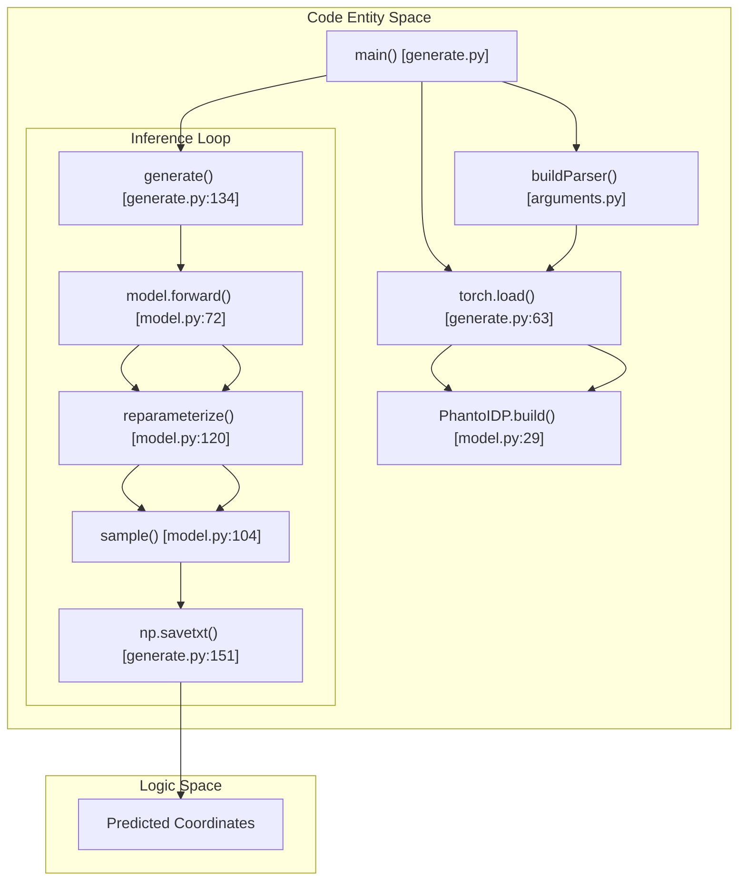
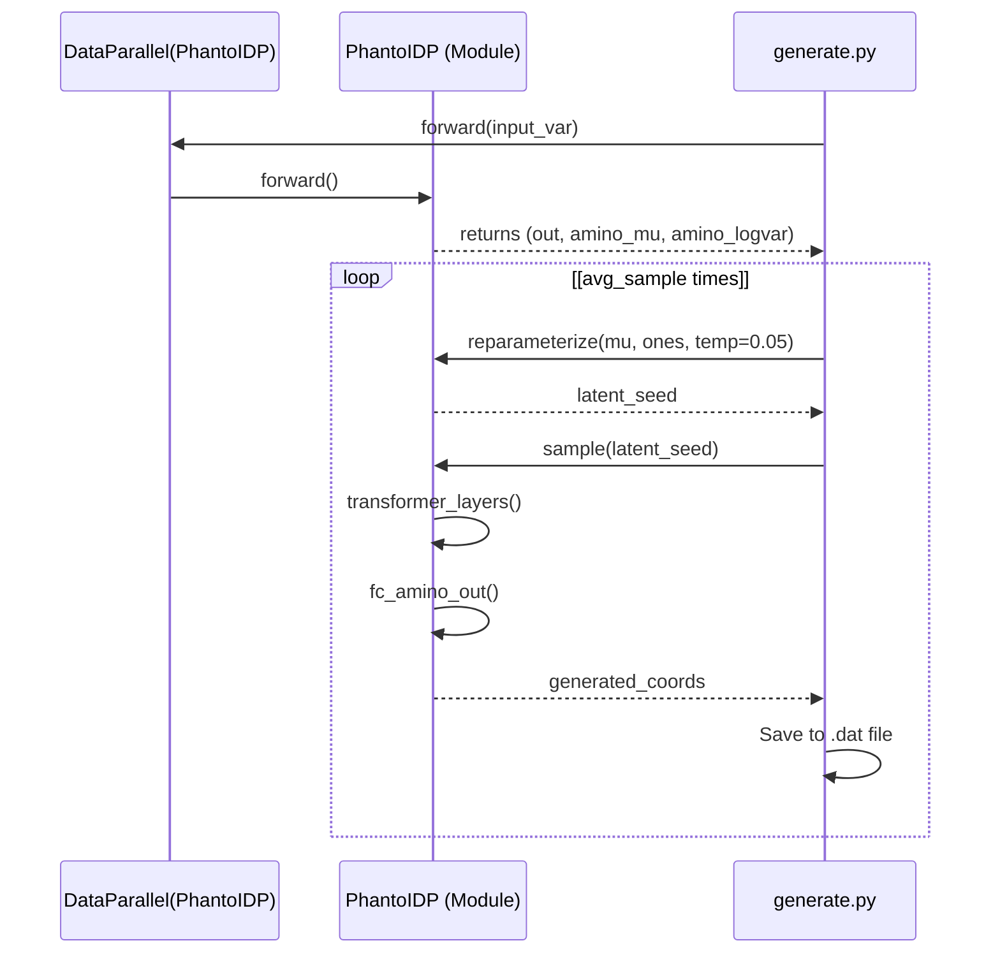

# Conformation Generation (generate.py)

> **Relevant source files**
> * [arguments.py](https://github.com/Junjie-Zhu/Phanto-IDP/blob/8f82e775/arguments.py)
> * [generate.py](https://github.com/Junjie-Zhu/Phanto-IDP/blob/8f82e775/generate.py)
> * [model.py](https://github.com/Junjie-Zhu/Phanto-IDP/blob/8f82e775/model.py)

The `generate.py` script serves as the inference engine for Phanto-IDP. It leverages pretrained Variational Autoencoder (VAE) checkpoints to sample new 3D backbone conformations for Intrinsically Disordered Proteins (IDPs). The script focuses on the stochastic sampling of the latent space to produce structural ensembles rather than single static structures.

### System Architecture for Inference

The inference process involves loading a `PhantoIDP` model, restoring its state from a `.pth.tar` checkpoint, and executing a sampling loop that bypasses the encoder once the latent distribution parameters ($\mu, \sigma$) are determined.

**Data Flow: From Checkpoint to Conformation**

**Sources:** [generate.py L17-L153](https://github.com/Junjie-Zhu/Phanto-IDP/blob/8f82e775/generate.py#L17-L153)

 [model.py L13-L124](https://github.com/Junjie-Zhu/Phanto-IDP/blob/8f82e775/model.py#L13-L124)

 [arguments.py L4-L49](https://github.com/Junjie-Zhu/Phanto-IDP/blob/8f82e775/arguments.py#L4-L49)

---

### Initialization and Checkpoint Loading

The script initializes the environment by parsing arguments and setting up the `ProteinDataset` [generate.py L17-L56](https://github.com/Junjie-Zhu/Phanto-IDP/blob/8f82e775/generate.py#L17-L56)

 A critical step is the synchronization of model hyperparameters (such as hidden dimensions `h_a`, `h_g`, and layer counts `n_conv`) with the values stored in the checkpoint to ensure architectural consistency [generate.py L60-L72](https://github.com/Junjie-Zhu/Phanto-IDP/blob/8f82e775/generate.py#L60-L72)

1. **Hyperparameter Restoration**: The script extracts the `args` namespace from the checkpoint dictionary and overrides local command-line arguments [generate.py L64-L70](https://github.com/Junjie-Zhu/Phanto-IDP/blob/8f82e775/generate.py#L64-L70)
2. **Model Instantiation**: The `PhantoIDP` class is initialized with these parameters and wrapped in `torch.nn.DataParallel` for GPU execution [generate.py L94-L96](https://github.com/Junjie-Zhu/Phanto-IDP/blob/8f82e775/generate.py#L94-L96)
3. **Weight Loading**: Both the model `state_dict` and the optimizer state are restored [generate.py L121-L124](https://github.com/Junjie-Zhu/Phanto-IDP/blob/8f82e775/generate.py#L121-L124)

**Sources:** [generate.py L60-L72](https://github.com/Junjie-Zhu/Phanto-IDP/blob/8f82e775/generate.py#L60-L72)

 [generate.py L119-L127](https://github.com/Junjie-Zhu/Phanto-IDP/blob/8f82e775/generate.py#L119-L127)

---

### The generate() Inference Loop

The `generate()` function iterates through the `test_loader` to produce new structural variants [generate.py L134](https://github.com/Junjie-Zhu/Phanto-IDP/blob/8f82e775/generate.py#L134-L134)

 Unlike the training phase, this loop uses `torch.no_grad()` and `model.eval()` to disable gradient tracking and dropout/batch-normalization updates [generate.py L141-L143](https://github.com/Junjie-Zhu/Phanto-IDP/blob/8f82e775/generate.py#L141-L143)

**Sampling Logic**
The sampling process is governed by two key parameters:

* `--avg_sample`: Determines how many distinct conformations are generated for every single input graph in the batch [generate.py L145](https://github.com/Junjie-Zhu/Phanto-IDP/blob/8f82e775/generate.py#L145-L145)
* `temp` (Temperature): A scaling factor applied during reparameterization to control the variance of the sampled latent vectors [generate.py L148](https://github.com/Junjie-Zhu/Phanto-IDP/blob/8f82e775/generate.py#L148-L148)

**Sources:** [generate.py L134-L153](https://github.com/Junjie-Zhu/Phanto-IDP/blob/8f82e775/generate.py#L134-L153)

 [model.py L104-L123](https://github.com/Junjie-Zhu/Phanto-IDP/blob/8f82e775/model.py#L104-L123)

---

### Reparameterization and Sampling Implementation

The core of the generation logic resides in the `reparameterize` and `sample` methods of the `PhantoIDP` class.

#### Reparameterize Method

This method implements the VAE reparameterization trick: $z = \mu + \epsilon \cdot \sigma \cdot T$, where $T$ is the temperature [model.py L120-L123](https://github.com/Junjie-Zhu/Phanto-IDP/blob/8f82e775/model.py#L120-L123)

* **Implementation**: It calculates standard deviation from `logvars`, generates random noise `eps` via `torch.randn_like`, and scales the result [model.py L121-L123](https://github.com/Junjie-Zhu/Phanto-IDP/blob/8f82e775/model.py#L121-L123)
* **Inference Override**: During generation in `generate.py`, the script passes `torch.ones` as the variance argument and a fixed temperature of `0.05` to provide controlled diversity around the predicted mean [generate.py L146-L148](https://github.com/Junjie-Zhu/Phanto-IDP/blob/8f82e775/generate.py#L146-L148)

#### Sample Method

The `sample()` method provides a "decoder-only" path [model.py L104-L117](https://github.com/Junjie-Zhu/Phanto-IDP/blob/8f82e775/model.py#L104-L117)

1. **Input**: Takes a latent tensor (residue-level embeddings).
2. **Transformation**: Passes the latent tensor through the `amino_to_fc` linear layer [model.py L106](https://github.com/Junjie-Zhu/Phanto-IDP/blob/8f82e775/model.py#L106-L106)
3. **Decoding**: Processes the embeddings through the `n_conv` number of `IdpGANBlock` (Transformer) layers [model.py L109-L110](https://github.com/Junjie-Zhu/Phanto-IDP/blob/8f82e775/model.py#L109-L110)
4. **Coordinate Projection**: The final `fc_amino_out` layer maps the transformer output to the final 3D coordinates [model.py L115](https://github.com/Junjie-Zhu/Phanto-IDP/blob/8f82e775/model.py#L115-L115)

**Sources:** [model.py L104-L123](https://github.com/Junjie-Zhu/Phanto-IDP/blob/8f82e775/model.py#L104-L123)

 [generate.py L145-L149](https://github.com/Junjie-Zhu/Phanto-IDP/blob/8f82e775/generate.py#L145-L149)

---

### Output Convention and Variance Control

#### Predicted .dat Files

Generated conformations are saved as text files using `np.savetxt` [generate.py L151](https://github.com/Junjie-Zhu/Phanto-IDP/blob/8f82e775/generate.py#L151-L151)

 The naming convention follows the pattern:
`predicted.[batch_iteration].[sample_index].[protein_index].dat`

* `batch_iteration`: The current batch index from the DataLoader.
* `sample_index`: The index within the `avg_sample` loop.
* `protein_index`: The index of the specific protein within the batch.

#### Temperature and Variance

While `generate.py` hardcodes a temperature of `0.05` in the `reparameterize` call [generate.py L148](https://github.com/Junjie-Zhu/Phanto-IDP/blob/8f82e775/generate.py#L148-L148)

 the `arguments.py` file defines a `-var` (Sampling Variance) argument intended for broader diversity control [arguments.py L31-L32](https://github.com/Junjie-Zhu/Phanto-IDP/blob/8f82e775/arguments.py#L31-L32)

 A larger `-var` value increases conformational diversity but may lead to physically unrealistic structures if the variance exceeds the learned distribution boundaries.

**Sources:** [generate.py L150-L151](https://github.com/Junjie-Zhu/Phanto-IDP/blob/8f82e775/generate.py#L150-L151)

 [arguments.py L29-L34](https://github.com/Junjie-Zhu/Phanto-IDP/blob/8f82e775/arguments.py#L29-L34)