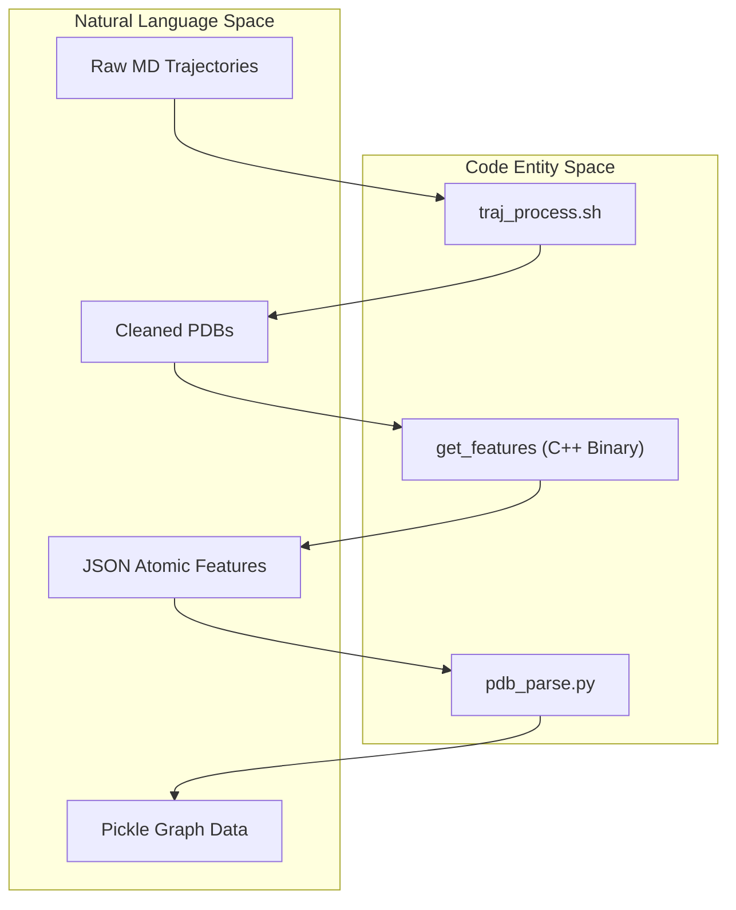
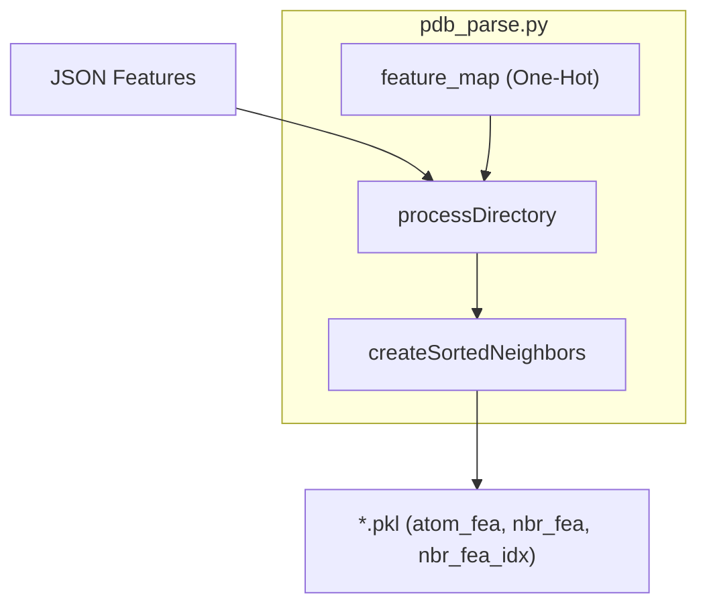

# Data Preprocessing Pipeline

> **Relevant source files**
> * [get_list.py](https://github.com/Junjie-Zhu/Phanto-IDP/blob/8f82e775/get_list.py)
> * [pdb_parse.py](https://github.com/Junjie-Zhu/Phanto-IDP/blob/8f82e775/pdb_parse.py)
> * [preprocess/preprocessor.sh](https://github.com/Junjie-Zhu/Phanto-IDP/blob/8f82e775/preprocess/preprocessor.sh)
> * [traj_process.sh](https://github.com/Junjie-Zhu/Phanto-IDP/blob/8f82e775/traj_process.sh)

The Data Preprocessing Pipeline in Phanto-IDP is a multi-stage workflow designed to transform raw Molecular Dynamics (MD) trajectory data into a graph-structured format suitable for deep learning. This pipeline bridges the gap between raw atomic coordinates in PDB files and the spatial graph representations used by the GCN encoder.

### Pipeline Architecture

The pipeline consists of three primary layers: a shell-based cleaning layer, a high-performance C++ feature extraction layer, and a Python-based graph construction layer.

#### Data Flow Diagram

The following diagram illustrates the transformation of data from raw trajectories to model-ready pickle files, mapping the process to specific scripts and binaries.

**Data Transformation Flow**

Sources: [traj_process.sh L1-L8](https://github.com/Junjie-Zhu/Phanto-IDP/blob/8f82e775/traj_process.sh#L1-L8)

 [pdb_parse.py L44-L55](https://github.com/Junjie-Zhu/Phanto-IDP/blob/8f82e775/pdb_parse.py#L44-L55)

 [pdb_parse.py L107-L130](https://github.com/Junjie-Zhu/Phanto-IDP/blob/8f82e775/pdb_parse.py#L107-L130)

---

### 1. Cleaning and Normalization

The initial stage involves filtering raw PDB files to retain only the essential backbone atoms (`N`, `CA`, `C`) required for the IDP model and normalizing residue naming conventions (e.g., converting `HIE` to `HIS`) to ensure consistency across different MD force fields.

* **PDB Discovery**: `get_list.py` scans directories to generate a manifest of files for batch processing [get_list.py L4-L10](https://github.com/Junjie-Zhu/Phanto-IDP/blob/8f82e775/get_list.py#L4-L10)
* **Backbone Filtering**: `traj_process.sh` uses `awk` to strip side-chain atoms, focusing the model on backbone topology [traj_process.sh L6](https://github.com/Junjie-Zhu/Phanto-IDP/blob/8f82e775/traj_process.sh#L6-L6)
* **Residue Normalization**: `sed` is used to standardize Histidine protonation states [traj_process.sh L8](https://github.com/Junjie-Zhu/Phanto-IDP/blob/8f82e775/traj_process.sh#L8-L8)

For details, see [Python Preprocessing Layer](/Junjie-Zhu/Phanto-IDP/2.2-python-preprocessing-layer).

---

### 2. C++ Feature Extraction

To handle the massive scale of MD trajectories, Phanto-IDP utilizes a high-performance C++ toolset (`mylddt`) for spatial analysis. This layer calculates atomic distances, identifies chemical bonds, and detects spatial contacts within a specified cutoff radius.

* **Binary**: The `get_features` executable processes individual PDB files [preprocess/preprocessor.sh L4-L18](https://github.com/Junjie-Zhu/Phanto-IDP/blob/8f82e775/preprocess/preprocessor.sh#L4-L18)
* **Output**: Generates JSON files containing lists of atoms, bonds, and spatial contacts [pdb_parse.py L49-L51](https://github.com/Junjie-Zhu/Phanto-IDP/blob/8f82e775/pdb_parse.py#L49-L51)
* **Batching**: The `preprocessor.sh` script provides a wrapper for bulk processing of PDB directories [preprocess/preprocessor.sh L14-L19](https://github.com/Junjie-Zhu/Phanto-IDP/blob/8f82e775/preprocess/preprocessor.sh#L14-L19)

For details, see [C++ Feature Extractor (mylddt / get_features)](/Junjie-Zhu/Phanto-IDP/2.1-c++-feature-extractor-(mylddt-get_features)).

---

### 3. Graph Construction and Serialization

The final stage in `pdb_parse.py` converts the raw spatial data into a fixed-size graph representation. This involves building a k-nearest neighbor (k-NN) graph for every atom in the protein.

**Graph Construction Logic**

* **One-Hot Encoding**: Amino acid types are mapped to 20-dimensional one-hot vectors using `groups20.txt` [pdb_parse.py L65-L76](https://github.com/Junjie-Zhu/Phanto-IDP/blob/8f82e775/pdb_parse.py#L65-L76)
* **Spatial Neighbors**: `createSortedNeighbors` identifies the top 50 closest neighbors for each atom, incorporating bond information [pdb_parse.py L79-L104](https://github.com/Junjie-Zhu/Phanto-IDP/blob/8f82e775/pdb_parse.py#L79-L104)
* **Parallelization**: The pipeline uses `joblib.Parallel` to distribute processing across multiple CPU cores [pdb_parse.py L136-L137](https://github.com/Junjie-Zhu/Phanto-IDP/blob/8f82e775/pdb_parse.py#L136-L137)

For details, see [Python Preprocessing Layer](/Junjie-Zhu/Phanto-IDP/2.2-python-preprocessing-layer).

---

### 4. Dataset Integration

The resulting `.pkl` files are consumed by the `ProteinDataset` class, which handles the final conversion into PyTorch Tensors for the training loop.

* **Data Structures**: The pipeline outputs `atom_fea` (node features), `nbr_fea` (edge features), and `nbr_fea_idx` (adjacency list) [pdb_parse.py L120-L129](https://github.com/Junjie-Zhu/Phanto-IDP/blob/8f82e775/pdb_parse.py#L120-L129)
* **Coordinate Extraction**: The dataset also extracts the target backbone coordinates (`target_n`, `target_ca`, `target_c`) used for loss calculation.

For details, see [Dataset and DataLoader](/Junjie-Zhu/Phanto-IDP/2.3-dataset-and-dataloader).

Sources: [pdb_parse.py L9-L31](https://github.com/Junjie-Zhu/Phanto-IDP/blob/8f82e775/pdb_parse.py#L9-L31)

 [pdb_parse.py L112-L130](https://github.com/Junjie-Zhu/Phanto-IDP/blob/8f82e775/pdb_parse.py#L112-L130)

 [traj_process.sh L1-L8](https://github.com/Junjie-Zhu/Phanto-IDP/blob/8f82e775/traj_process.sh#L1-L8)