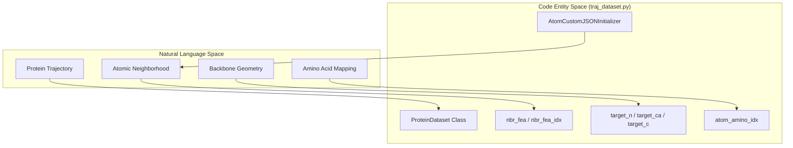
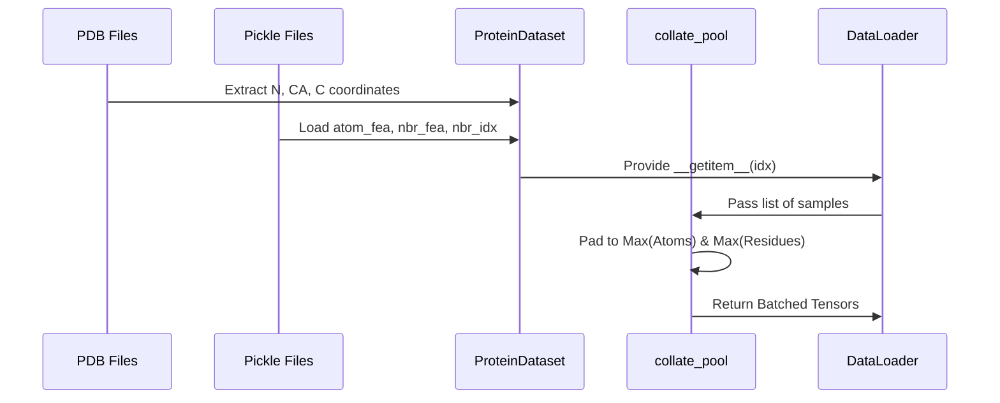

# Dataset and DataLoader

> **Relevant source files**
> * [traj_dataset.py](https://github.com/Junjie-Zhu/Phanto-IDP/blob/8f82e775/traj_dataset.py)

The `Dataset` and `DataLoader` components in Phanto-IDP are responsible for bridging the gap between preprocessed structural data (in `.pkl` and `.pdb` formats) and the graph-based neural network architecture. This layer handles the ingestion of atomic graphs, spatial neighbor features, and the extraction of ground-truth backbone coordinates used for supervised training and FAPE loss calculation.

### System Entity Mapping

The following diagram illustrates how natural language concepts for protein data map to specific classes and data structures within the `traj_dataset.py` module.

**Protein Data to Code Entity Mapping**

**Sources:** [traj_dataset.py L42-L64](https://github.com/Junjie-Zhu/Phanto-IDP/blob/8f82e775/traj_dataset.py#L42-L64)

 [traj_dataset.py L91-L104](https://github.com/Junjie-Zhu/Phanto-IDP/blob/8f82e775/traj_dataset.py#L91-L104)

 [traj_dataset.py L105-L146](https://github.com/Junjie-Zhu/Phanto-IDP/blob/8f82e775/traj_dataset.py#L105-L146)

---

### ProteinDataset Class

The `ProteinDataset` class [traj_dataset.py L105-L167](https://github.com/Junjie-Zhu/Phanto-IDP/blob/8f82e775/traj_dataset.py#L105-L167)

 is the primary data container. It performs two main roles: loading graph-structured features from pickle files and extracting Cartesian coordinates for backbone atoms ($N, C\alpha, C$) directly from PDB files.

#### Coordinate Extraction

During initialization, the class parses PDB files to extract target coordinates for the three backbone atoms of every residue. These are used as the ground truth for the model's structural predictions.

* **target_n**: Coordinates of the Nitrogen atom [traj_dataset.py L141-L142](https://github.com/Junjie-Zhu/Phanto-IDP/blob/8f82e775/traj_dataset.py#L141-L142)
* **target_ca**: Coordinates of the Alpha Carbon atom [traj_dataset.py L137-L138](https://github.com/Junjie-Zhu/Phanto-IDP/blob/8f82e775/traj_dataset.py#L137-L138)
* **target_c**: Coordinates of the Carbonyl Carbon atom [traj_dataset.py L139-L140](https://github.com/Junjie-Zhu/Phanto-IDP/blob/8f82e775/traj_dataset.py#L139-L140)

#### Graph Feature Loading

The `get_idx` method [traj_dataset.py L154-L167](https://github.com/Junjie-Zhu/Phanto-IDP/blob/8f82e775/traj_dataset.py#L154-L167)

 retrieves the graph representation for a specific protein frame:

* **atom_fea**: Initial atom features derived via `AtomCustomJSONInitializer` [traj_dataset.py L158-L159](https://github.com/Junjie-Zhu/Phanto-IDP/blob/8f82e775/traj_dataset.py#L158-L159)
* **nbr_fea**: Edge features representing spatial relationships between atoms [traj_dataset.py L160](https://github.com/Junjie-Zhu/Phanto-IDP/blob/8f82e775/traj_dataset.py#L160-L160)
* **nbr_fea_idx**: An adjacency list (indices) defining the graph connectivity [traj_dataset.py L161](https://github.com/Junjie-Zhu/Phanto-IDP/blob/8f82e775/traj_dataset.py#L161-L161)
* **atom_amino_idx**: A mapping tensor that identifies which residue each atom belongs to, facilitating the pooling from atom-level embeddings to residue-level embeddings [traj_dataset.py L163-L164](https://github.com/Junjie-Zhu/Phanto-IDP/blob/8f82e775/traj_dataset.py#L163-L164)

**Sources:** [traj_dataset.py L105-L167](https://github.com/Junjie-Zhu/Phanto-IDP/blob/8f82e775/traj_dataset.py#L105-L167)

---

### Data Loading and Batching

Because protein structures vary in size (number of atoms and residues), Phanto-IDP utilizes a custom collation function to handle batching in a `DataLoader`.

#### collate_pool Function

The `collate_pool` function [traj_dataset.py L42-L64](https://github.com/Junjie-Zhu/Phanto-IDP/blob/8f82e775/traj_dataset.py#L42-L64)

 aggregates individual protein graphs into a single batch tensor. It dynamically calculates the maximum number of atoms (`N`) and residues (`A`) in the current batch to pad the tensors appropriately [traj_dataset.py L43-L46](https://github.com/Junjie-Zhu/Phanto-IDP/blob/8f82e775/traj_dataset.py#L43-L46)

| Variable | Description | Source |
| --- | --- | --- |
| `final_protein_atom_fea` | BATCH x MAX_ATOMS tensor of atom types | [traj_dataset.py L49](https://github.com/Junjie-Zhu/Phanto-IDP/blob/8f82e775/traj_dataset.py#L49-L49) |
| `final_nbr_fea` | BATCH x MAX_ATOMS x M x FEA_LEN edge features | [traj_dataset.py L50](https://github.com/Junjie-Zhu/Phanto-IDP/blob/8f82e775/traj_dataset.py#L50-L50) |
| `final_nbr_fea_idx` | BATCH x MAX_ATOMS x M adjacency indices | [traj_dataset.py L51](https://github.com/Junjie-Zhu/Phanto-IDP/blob/8f82e775/traj_dataset.py#L51-L51) |
| `final_target_n/ca/c` | BATCH x MAX_RESIDUES x 3 coordinate tensors | [traj_dataset.py L53](https://github.com/Junjie-Zhu/Phanto-IDP/blob/8f82e775/traj_dataset.py#L53-L53) |

#### splitDataset Utility

The `splitDataset` function [traj_dataset.py L15-L39](https://github.com/Junjie-Zhu/Phanto-IDP/blob/8f82e775/traj_dataset.py#L15-L39)

 manages the partition of the data into `train`, `val`, and `test` sets. It uses `SubsetRandomSampler` [traj_dataset.py L25-L27](https://github.com/Junjie-Zhu/Phanto-IDP/blob/8f82e775/traj_dataset.py#L25-L27)

 to ensure that indices corresponding to specific trajectory directories are correctly assigned to their respective `DataLoader` instances.

**Sources:** [traj_dataset.py L15-L64](https://github.com/Junjie-Zhu/Phanto-IDP/blob/8f82e775/traj_dataset.py#L15-L64)

---

### Feature Initialization

The `AtomCustomJSONInitializer` class [traj_dataset.py L91-L104](https://github.com/Junjie-Zhu/Phanto-IDP/blob/8f82e775/traj_dataset.py#L91-L104)

 handles the mapping of atom types (e.g., 'C', 'N', 'O') to numerical embeddings. It reads a JSON configuration file and assigns a unique index to each atom type found in the dataset [traj_dataset.py L99-L102](https://github.com/Junjie-Zhu/Phanto-IDP/blob/8f82e775/traj_dataset.py#L99-L102)

**Data Flow: From Files to Model Input**

**Sources:** [traj_dataset.py L42-L64](https://github.com/Junjie-Zhu/Phanto-IDP/blob/8f82e775/traj_dataset.py#L42-L64)

 [traj_dataset.py L105-L167](https://github.com/Junjie-Zhu/Phanto-IDP/blob/8f82e775/traj_dataset.py#L105-L167)