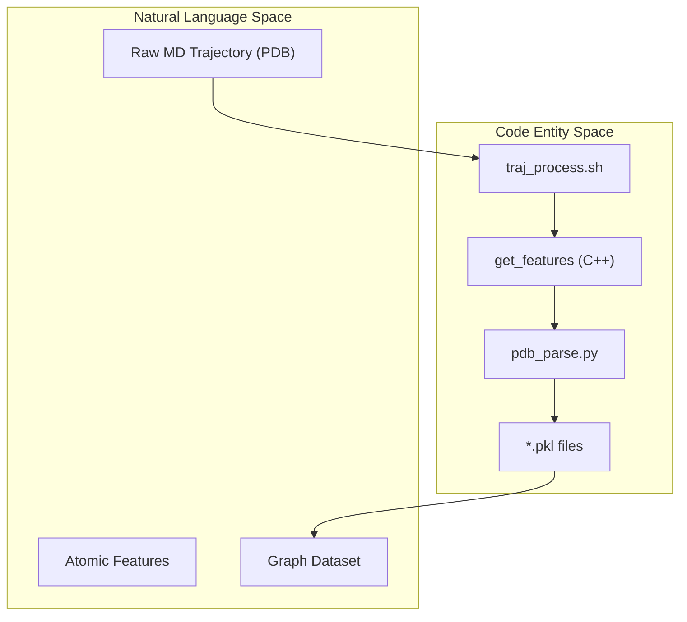
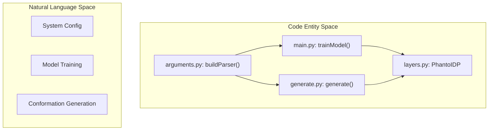

# Getting Started

> **Relevant source files**
> * [Analysis/ramachandran.py](https://github.com/Junjie-Zhu/Phanto-IDP/blob/8f82e775/Analysis/ramachandran.py)
> * [ImgSrc/Phanto-IDP.png](https://github.com/Junjie-Zhu/Phanto-IDP/blob/8f82e775/ImgSrc/Phanto-IDP.png)
> * [README.md](https://github.com/Junjie-Zhu/Phanto-IDP/blob/8f82e775/README.md?plain=1)
> * [arguments.py](https://github.com/Junjie-Zhu/Phanto-IDP/blob/8f82e775/arguments.py)
> * [config.py](https://github.com/Junjie-Zhu/Phanto-IDP/blob/8f82e775/config.py)
> * [preprocess/Makefile](https://github.com/Junjie-Zhu/Phanto-IDP/blob/8f82e775/preprocess/Makefile)
> * [preprocess/README.md](https://github.com/Junjie-Zhu/Phanto-IDP/blob/8f82e775/preprocess/README.md?plain=1)

Phanto-IDP is a VAE-based generative deep learning model designed to precisely reconstruct Intrinsically Disordered Protein (IDP) conformational ensembles and generate novel structures at high speed [README.md L1-L5](https://github.com/Junjie-Zhu/Phanto-IDP/blob/8f82e775/README.md?plain=1#L1-L5)

 This guide provides the technical steps to set up the environment, process raw Molecular Dynamics (MD) trajectories, and execute the generation pipeline.

## Environment Setup

The system requires a Python 3.8+ environment with CUDA support for efficient training and generation.

### Core Dependencies

The following packages are essential for the core model and data processing:

* **PyTorch (1.8.0):** Deep learning framework [README.md L18](https://github.com/Junjie-Zhu/Phanto-IDP/blob/8f82e775/README.md?plain=1#L18-L18)
* **ConfigArgParse (1.2):** Argument parsing and configuration management [README.md L16](https://github.com/Junjie-Zhu/Phanto-IDP/blob/8f82e775/README.md?plain=1#L16-L16)
* **Joblib (0.14.1):** Parallel processing for PDB parsing [README.md L17](https://github.com/Junjie-Zhu/Phanto-IDP/blob/8f82e775/README.md?plain=1#L17-L17)
* **Einops (0.4.1):** Tensor operations used in the Transformer decoder [README.md L19](https://github.com/Junjie-Zhu/Phanto-IDP/blob/8f82e775/README.md?plain=1#L19-L19)
* **NumPy (1.19.5):** Numerical computation [README.md L15](https://github.com/Junjie-Zhu/Phanto-IDP/blob/8f82e775/README.md?plain=1#L15-L15)

### Analysis Dependencies

For structural validation and plotting, install:

* **Biotite (0.37.0):** Structural bioinformatics toolkit used for dihedral angle calculation and RMSD analysis [README.md L24](https://github.com/Junjie-Zhu/Phanto-IDP/blob/8f82e775/README.md?plain=1#L24-L24)  [Analysis/ramachandran.py L3-L4](https://github.com/Junjie-Zhu/Phanto-IDP/blob/8f82e775/Analysis/ramachandran.py#L3-L4)
* **Matplotlib (3.3.4):** Visualization library [README.md L23](https://github.com/Junjie-Zhu/Phanto-IDP/blob/8f82e775/README.md?plain=1#L23-L23)

### Device Configuration

The system automatically detects CUDA availability. Global tensor types are defined in `config.py`:

* `device`: Set to `cuda` if available [config.py L3](https://github.com/Junjie-Zhu/Phanto-IDP/blob/8f82e775/config.py#L3-L3)
* `FloatTensor` / `LongTensor`: Mapped to `torch.cuda` variants if GPU is detected [config.py L4-L5](https://github.com/Junjie-Zhu/Phanto-IDP/blob/8f82e775/config.py#L4-L5)

---

## Toolset Compilation

Before processing data, you must compile the `mylddt` C++ toolset located in the `preprocess/` directory. This toolset is responsible for high-performance atomic feature extraction.

### Compilation Steps

1. Navigate to the preprocess directory: `cd ./preprocess` [README.md L31](https://github.com/Junjie-Zhu/Phanto-IDP/blob/8f82e775/README.md?plain=1#L31-L31)
2. Execute the Makefile: `make all` [README.md L32](https://github.com/Junjie-Zhu/Phanto-IDP/blob/8f82e775/README.md?plain=1#L32-L32)

The Makefile uses `g++` with `-O3` optimization and `-std=c++11` [preprocess/Makefile L2-L3](https://github.com/Junjie-Zhu/Phanto-IDP/blob/8f82e775/preprocess/Makefile#L2-L3)

 It compiles source files from `preprocess/src/` into a binary named `get_features` [preprocess/Makefile L20-L21](https://github.com/Junjie-Zhu/Phanto-IDP/blob/8f82e775/preprocess/Makefile#L20-L21)

**Sources:** [README.md L28-L33](https://github.com/Junjie-Zhu/Phanto-IDP/blob/8f82e775/README.md?plain=1#L28-L33)

 [preprocess/Makefile L1-L28](https://github.com/Junjie-Zhu/Phanto-IDP/blob/8f82e775/preprocess/Makefile#L1-L28)

---

## Data Preprocessing Pipeline

Phanto-IDP operates on graph representations of protein structures. Converting raw PDB trajectories into these representations involves a three-step pipeline.

### Pipeline Overview

1. **`traj_process.sh`**: Normalizes PDB files (e.g., handling histidine naming) and filters backbone atoms [README.md L40](https://github.com/Junjie-Zhu/Phanto-IDP/blob/8f82e775/README.md?plain=1#L40-L40)
2. **`get_features`**: The C++ binary extracts atomic contacts and spatial features into JSON format [preprocess/README.md L17-L21](https://github.com/Junjie-Zhu/Phanto-IDP/blob/8f82e775/preprocess/README.md?plain=1#L17-L21)
3. **`pdb_parse.py`**: Converts JSON features into serialized `.pkl` files containing the graph structure (atoms as nodes, bonds/contacts as edges) [README.md L41](https://github.com/Junjie-Zhu/Phanto-IDP/blob/8f82e775/README.md?plain=1#L41-L41)

### Data Flow Diagram

The following diagram illustrates the transformation from raw PDB files to the model-ready graph dataset.

"Data Transformation Pipeline"



**Sources:** [README.md L37-L42](https://github.com/Junjie-Zhu/Phanto-IDP/blob/8f82e775/README.md?plain=1#L37-L42)

 [preprocess/README.md L17-L21](https://github.com/Junjie-Zhu/Phanto-IDP/blob/8f82e775/preprocess/README.md?plain=1#L17-L21)

 [preprocess/Makefile L20-L21](https://github.com/Junjie-Zhu/Phanto-IDP/blob/8f82e775/preprocess/Makefile#L20-L21)

---

## Training and Generation

### User-Defined Training

To train the model on a custom trajectory, ensure your processed `.pkl` files are in the directory specified by `--pkl_dir` in `arguments.py` [arguments.py L9](https://github.com/Junjie-Zhu/Phanto-IDP/blob/8f82e775/arguments.py#L9-L9)

```
python main.py <task_name> --epochs 400 --batch_size 32
```

* **Convergence**: 400 epochs is typically sufficient for convergence on a dataset of ~38,000 conformations [README.md L53](https://github.com/Junjie-Zhu/Phanto-IDP/blob/8f82e775/README.md?plain=1#L53-L53)
* **Logging**: The `Logger` class in `utils.py` tracks training progress.

### Structure Generation

Generation uses the VAE decoder to sample new conformations from the latent space.

```javascript
python generate.py <task_name> --temp 0.1 -n 5 -var 0.1
```

* **`-temp`**: Controls the sampling temperature [README.md L60](https://github.com/Junjie-Zhu/Phanto-IDP/blob/8f82e775/README.md?plain=1#L60-L60)
* **`-n`**: Number of structures to sample [arguments.py L30](https://github.com/Junjie-Zhu/Phanto-IDP/blob/8f82e775/arguments.py#L30-L30)
* **`-var`**: Sampling variance; higher values increase diversity but may reduce structural quality [arguments.py L31-L32](https://github.com/Junjie-Zhu/Phanto-IDP/blob/8f82e775/arguments.py#L31-L32)

### Execution Logic Diagram

"System Execution Flow"



**Sources:** [README.md L49-L60](https://github.com/Junjie-Zhu/Phanto-IDP/blob/8f82e775/README.md?plain=1#L49-L60)

 [arguments.py L4-L49](https://github.com/Junjie-Zhu/Phanto-IDP/blob/8f82e775/arguments.py#L4-L49)

 [config.py L1-L5](https://github.com/Junjie-Zhu/Phanto-IDP/blob/8f82e775/config.py#L1-L5)

---

## Post-Generation Analysis

Generated structures are typically output as `.dat` or `.pdb` files. The `Analysis/` suite provides tools to validate the physical plausibility of these structures.

| Script | Purpose | Key Functions |
| --- | --- | --- |
| `ramachandran.py` | Calculates $\phi$ and $\psi$ angles to verify backbone geometry. | `struc.dihedral_backbone()` [Analysis/ramachandran.py L17](https://github.com/Junjie-Zhu/Phanto-IDP/blob/8f82e775/Analysis/ramachandran.py#L17-L17) |
| `refine_openmm.py` | Performs energy minimization to resolve steric clashes. | Uses OpenMM and Amber99SB forcefield. |
| `rmsd_calculation.py` | Measures structural deviation from reference structures. | Uses `biotite.structure` superimposition. |

**Sources:** [Analysis/ramachandran.py L11-L53](https://github.com/Junjie-Zhu/Phanto-IDP/blob/8f82e775/Analysis/ramachandran.py#L11-L53)

 [README.md L21-L25](https://github.com/Junjie-Zhu/Phanto-IDP/blob/8f82e775/README.md?plain=1#L21-L25)