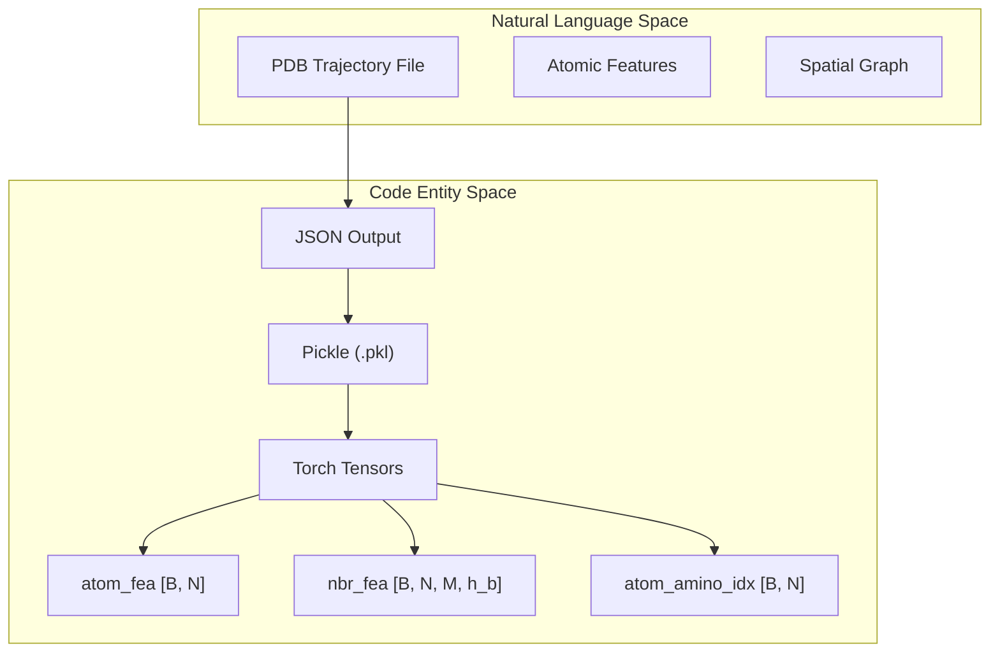
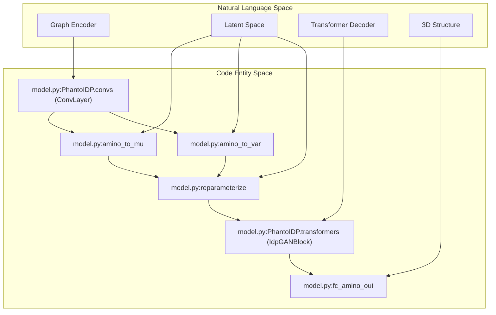

# Glossary

> **Relevant source files**
> * [Analysis/ramachandran.py](https://github.com/Junjie-Zhu/Phanto-IDP/blob/8f82e775/Analysis/ramachandran.py)
> * [Analysis/refine_openmm.py](https://github.com/Junjie-Zhu/Phanto-IDP/blob/8f82e775/Analysis/refine_openmm.py)
> * [Analysis/rg.py](https://github.com/Junjie-Zhu/Phanto-IDP/blob/8f82e775/Analysis/rg.py)
> * [Analysis/rmsd_calculation.py](https://github.com/Junjie-Zhu/Phanto-IDP/blob/8f82e775/Analysis/rmsd_calculation.py)
> * [Analysis/rmsd_plot.py](https://github.com/Junjie-Zhu/Phanto-IDP/blob/8f82e775/Analysis/rmsd_plot.py)
> * [ImgSrc/Phanto-IDP.png](https://github.com/Junjie-Zhu/Phanto-IDP/blob/8f82e775/ImgSrc/Phanto-IDP.png)
> * [README.md](https://github.com/Junjie-Zhu/Phanto-IDP/blob/8f82e775/README.md?plain=1)
> * [Scripts/biotite_utils.py](https://github.com/Junjie-Zhu/Phanto-IDP/blob/8f82e775/Scripts/biotite_utils.py)
> * [get_list.py](https://github.com/Junjie-Zhu/Phanto-IDP/blob/8f82e775/get_list.py)
> * [layers.py](https://github.com/Junjie-Zhu/Phanto-IDP/blob/8f82e775/layers.py)
> * [model.py](https://github.com/Junjie-Zhu/Phanto-IDP/blob/8f82e775/model.py)
> * [pdb_parse.py](https://github.com/Junjie-Zhu/Phanto-IDP/blob/8f82e775/pdb_parse.py)
> * [preprocess/src/MyLDDT.h](https://github.com/Junjie-Zhu/Phanto-IDP/blob/8f82e775/preprocess/src/MyLDDT.h)
> * [traj_dataset.py](https://github.com/Junjie-Zhu/Phanto-IDP/blob/8f82e775/traj_dataset.py)
> * [utils.py](https://github.com/Junjie-Zhu/Phanto-IDP/blob/8f82e775/utils.py)

This page provides technical definitions and implementation details for terms, biological concepts, and architectural jargon specific to the **Phanto-IDP** codebase.

## Core Biological Concepts

### IDP (Intrinsically Disordered Protein)

Proteins that lack a fixed or ordered three-dimensional structure under physiological conditions. Phanto-IDP is specifically designed to generate conformational ensembles for these proteins, such as **RS1**, **PaaA2**, and **$\alpha$-synuclein** [README.md L55-L57](https://github.com/Junjie-Zhu/Phanto-IDP/blob/8f82e775/README.md?plain=1#L55-L57)

.

### Backbone Coordinates

The 3D spatial positions of the main chain atoms in a protein. Phanto-IDP specifically targets the reconstruction and generation of three atoms per residue:

* **N**: The amide nitrogen.
* **CA**: The alpha carbon.
* **C**: The carbonyl carbon.

These are extracted during dataset initialization in `ProteinDataset` [traj_dataset.py L137-L142](https://github.com/Junjie-Zhu/Phanto-IDP/blob/8f82e775/traj_dataset.py#L137-L142)

 and represented as `target_n`, `target_ca`, and `target_c` [traj_dataset.py L53-L64](https://github.com/Junjie-Zhu/Phanto-IDP/blob/8f82e775/traj_dataset.py#L53-L64)

.

### Dihedral Angles ($\phi, \psi, \omega$)

The rotation angles about the backbone bonds.

* **$\phi$ (Phi)**: Rotation around the $N-C\alpha$ bond.
* **$\psi$ (Psi)**: Rotation around the $C\alpha-C$ bond.
* **$\omega$ (Omega)**: Rotation around the $C-N$ peptide bond.

In Phanto-IDP, these are extracted using `biotite.structure.dihedral_backbone` for Ramachandran plot analysis [Analysis/ramachandran.py L17-L25](https://github.com/Junjie-Zhu/Phanto-IDP/blob/8f82e775/Analysis/ramachandran.py#L17-L25)

 and [Scripts/biotite_utils.py L86-L97](https://github.com/Junjie-Zhu/Phanto-IDP/blob/8f82e775/Scripts/biotite_utils.py#L86-L97)

.

---

## Architectural Jargon

### FAPE (Frame Aligned Point Error)

A structural loss function that measures the distance between predicted and target coordinates after aligning them using local coordinate frames.

* **Implementation**: Defined in the `FAPEloss` class [utils.py L88-L130](https://github.com/Junjie-Zhu/Phanto-IDP/blob/8f82e775/utils.py#L88-L130) .
* **Frame Construction**: Uses the `from_3_points` static method in `PhantoIDP` to construct rotation matrices and translation vectors from $N, CA, C$ atoms using a Gram-Schmidt-like process [model.py L132-L172](https://github.com/Junjie-Zhu/Phanto-IDP/blob/8f82e775/model.py#L132-L172) .

### GCN Encoder

A Graph Convolutional Network used to process the atomic graph representation of the protein.

* **ConvLayer**: The fundamental building block performing gated message passing between atoms [model.py L53](https://github.com/Junjie-Zhu/Phanto-IDP/blob/8f82e775/model.py#L53-L53) .
* **Atom Embeddings**: Initialized from one-hot encodings defined in `protein_atom_init.json` [model.py L31-L36](https://github.com/Junjie-Zhu/Phanto-IDP/blob/8f82e775/model.py#L31-L36) .

### Transformer Decoder

A sequence-based module that processes residue-level latent embeddings to generate backbone structures.

* **IdpGANBlock**: A custom transformer block with multi-head attention and feed-forward networks [model.py L60-L70](https://github.com/Junjie-Zhu/Phanto-IDP/blob/8f82e775/model.py#L60-L70) .
* **Latent Space**: The model uses a VAE (Variational Autoencoder) bottleneck where residue embeddings are mapped to `amino_mu` and `amino_logvar` [model.py L88-L90](https://github.com/Junjie-Zhu/Phanto-IDP/blob/8f82e775/model.py#L88-L90) .

### Reparameterization Trick

A method to allow backpropagation through a random sampling process in a VAE.

* **Function**: `PhantoIDP.reparameterize(means, logvars, temp)` [model.py L119-L123](https://github.com/Junjie-Zhu/Phanto-IDP/blob/8f82e775/model.py#L119-L123) .
* **Temperature (`temp`)**: A scaling factor used during generation to control conformational diversity [generate.py L60](https://github.com/Junjie-Zhu/Phanto-IDP/blob/8f82e775/generate.py#L60-L60) .

---

## Data & Implementation Terms

### Atomic Graph Representation

The input format for Phanto-IDP, where atoms are nodes and spatial neighbors/bonds are edges.

* **`atom_fea`**: One-hot encoded features for each atom type [pdb_parse.py L65-L76](https://github.com/Junjie-Zhu/Phanto-IDP/blob/8f82e775/pdb_parse.py#L65-L76) .
* **`nbr_fea`**: Edge features including distances and relative coordinates [pdb_parse.py L122](https://github.com/Junjie-Zhu/Phanto-IDP/blob/8f82e775/pdb_parse.py#L122-L122) .
* **`nbr_fea_idx`**: Indices of neighbor atoms for each node [pdb_parse.py L121](https://github.com/Junjie-Zhu/Phanto-IDP/blob/8f82e775/pdb_parse.py#L121-L121) .

### mylddt

A C++ toolset used for high-speed feature extraction from PDB files.

* **Binary**: `get_features` [pdb_parse.py L13-L14](https://github.com/Junjie-Zhu/Phanto-IDP/blob/8f82e775/pdb_parse.py#L13-L14) .
* **Usage**: Called via `commandRunner` to generate intermediate JSON files containing contact and bond information [pdb_parse.py L44-L55](https://github.com/Junjie-Zhu/Phanto-IDP/blob/8f82e775/pdb_parse.py#L44-L55) .

### RMSD (Root Mean Square Deviation)

A measure of the average distance between the atoms of superimposed protein structures.

* **Code**: Implemented via `biotite` in `rmsd_calculation.py` [Analysis/rmsd_calculation.py L1-L11](https://github.com/Junjie-Zhu/Phanto-IDP/blob/8f82e775/Analysis/rmsd_calculation.py#L1-L11)  and as a internal method `PhantoIDP.calc_rmsd` using quaternions [model.py L174-L182](https://github.com/Junjie-Zhu/Phanto-IDP/blob/8f82e775/model.py#L174-L182) .

---

## System Mapping Diagrams

### Data Flow: From PDB to Graph Latents

This diagram bridges the biological file format to the internal code representations used by the `ProteinDataset`.

**Sources:** [pdb_parse.py L107-L131](https://github.com/Junjie-Zhu/Phanto-IDP/blob/8f82e775/pdb_parse.py#L107-L131)

, [traj_dataset.py L154-L167](https://github.com/Junjie-Zhu/Phanto-IDP/blob/8f82e775/traj_dataset.py#L154-L167)

, [README.md L35-L42](https://github.com/Junjie-Zhu/Phanto-IDP/blob/8f82e775/README.md?plain=1#L35-L42)

.

### Model Architecture: VAE Pipeline

This diagram maps the logical VAE components to the specific classes and methods in `model.py` and `layers.py`.

**Sources:** [model.py L48-L70](https://github.com/Junjie-Zhu/Phanto-IDP/blob/8f82e775/model.py#L48-L70)

, [model.py L72-L102](https://github.com/Junjie-Zhu/Phanto-IDP/blob/8f82e775/model.py#L72-L102)

, [layers.py](https://github.com/Junjie-Zhu/Phanto-IDP/blob/8f82e775/layers.py)

.

---

## Summary Table of Key Code Symbols

| Symbol | File | Description |
| --- | --- | --- |
| `PhantoIDP` | [model.py L13](https://github.com/Junjie-Zhu/Phanto-IDP/blob/8f82e775/model.py#L13-L13) | Main VAE model class. |
| `ProteinDataset` | [traj_dataset.py L105](https://github.com/Junjie-Zhu/Phanto-IDP/blob/8f82e775/traj_dataset.py#L105-L105) | Loads graph `.pkl` and coordinate `.pdb` data. |
| `FAPEloss` | [utils.py L88](https://github.com/Junjie-Zhu/Phanto-IDP/blob/8f82e775/utils.py#L88-L88) | Structural loss implementation. |
| `IdpGANBlock` | [layers.py](https://github.com/Junjie-Zhu/Phanto-IDP/blob/8f82e775/layers.py) | Transformer block for residue sequence decoding. |
| `ConvLayer` | [layers.py](https://github.com/Junjie-Zhu/Phanto-IDP/blob/8f82e775/layers.py) | Gated Graph Convolution layer for atom encoding. |
| `reparameterize` | [model.py L119](https://github.com/Junjie-Zhu/Phanto-IDP/blob/8f82e775/model.py#L119-L119) | VAE sampling function for latent vectors. |
| `fix_structure` | [Analysis/refine_openmm.py L31](https://github.com/Junjie-Zhu/Phanto-IDP/blob/8f82e775/Analysis/refine_openmm.py#L31-L31) | Uses `pdbfixer` to repair generated structures. |
| `extract_dihedral` | [Scripts/biotite_utils.py L83](https://github.com/Junjie-Zhu/Phanto-IDP/blob/8f82e775/Scripts/biotite_utils.py#L83-L83) | Utility to calculate backbone angles. |

**Sources:** [model.py L1-L182](https://github.com/Junjie-Zhu/Phanto-IDP/blob/8f82e775/model.py#L1-L182)

, [traj_dataset.py L1-L167](https://github.com/Junjie-Zhu/Phanto-IDP/blob/8f82e775/traj_dataset.py#L1-L167)

, [utils.py L1-L193](https://github.com/Junjie-Zhu/Phanto-IDP/blob/8f82e775/utils.py#L1-L193)

, [Analysis/refine_openmm.py L1-L169](https://github.com/Junjie-Zhu/Phanto-IDP/blob/8f82e775/Analysis/refine_openmm.py#L1-L169)

.