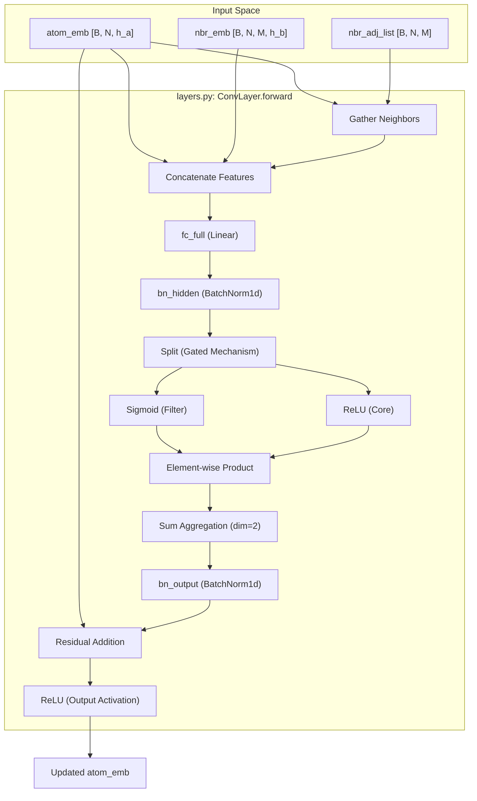
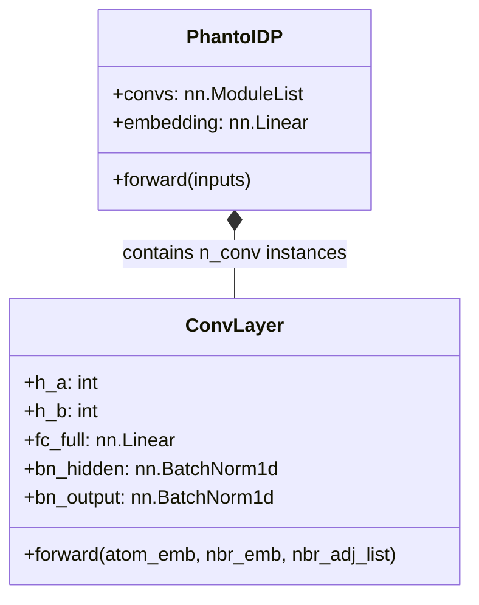

# Graph Convolutional Encoder (ConvLayer)

> **Relevant source files**
> * [layers.py](https://github.com/Junjie-Zhu/Phanto-IDP/blob/8f82e775/layers.py)
> * [model.py](https://github.com/Junjie-Zhu/Phanto-IDP/blob/8f82e775/model.py)

The **Graph Convolutional Encoder** is the primary structural feature extractor in Phanto-IDP. It processes the atomic graph representation of a protein—where atoms are nodes and spatial proximities are edges—to produce high-dimensional latent embeddings for each atom. This component implements a gated message-passing mechanism that captures the local chemical environment and geometric constraints of Intrinsically Disordered Proteins (IDPs).

### Architectural Overview

The encoder consists of a sequence of `ConvLayer` modules [model.py L53](https://github.com/Junjie-Zhu/Phanto-IDP/blob/8f82e775/model.py#L53-L53)

 These layers are responsible for updating atom embeddings by aggregating information from neighboring atoms and the bonds (edges) connecting them. The architecture utilizes residual connections and batch normalization to ensure stable training across deep stacks of convolutions.

#### ConvLayer Data Flow Diagram

This diagram illustrates the transformation of atomic and neighbor features within a single `ConvLayer` instance.

**Sources:** [layers.py L7-L37](https://github.com/Junjie-Zhu/Phanto-IDP/blob/8f82e775/layers.py#L7-L37)

 [model.py L81-L82](https://github.com/Junjie-Zhu/Phanto-IDP/blob/8f82e775/model.py#L81-L82)

---

### Implementation Details

#### 1. Input Processing and Neighbor Gathering

The `ConvLayer` receives three primary inputs:

* `atom_emb`: Current atom hidden states of dimension `h_a`.
* `nbr_emb`: Static bond/neighbor features of dimension `h_b`.
* `nbr_adj_list`: Indices of the $M$ nearest neighbors for each of the $N$ atoms.

The layer first aligns neighbor embeddings with their respective central atoms using `torch.arange` and the adjacency list to create a neighbor-centric view of the atom features [layers.py L25](https://github.com/Junjie-Zhu/Phanto-IDP/blob/8f82e775/layers.py#L25-L25)

#### 2. Gated Message Passing

Phanto-IDP employs a gated convolution mechanism rather than a simple linear aggregation. The concatenated feature vector—consisting of the central atom, the neighbor atom, and the bond between them—is passed through a linear layer `fc_full` [layers.py L14](https://github.com/Junjie-Zhu/Phanto-IDP/blob/8f82e775/layers.py#L14-L14)

The output is split into two equal parts:

* **Neighbor Filter (`nbr_filter`)**: Passed through a Sigmoid function to act as a gate, determining the importance of each neighbor [layers.py L30-L31](https://github.com/Junjie-Zhu/Phanto-IDP/blob/8f82e775/layers.py#L30-L31)
* **Neighbor Core (`nbr_core`)**: Passed through a ReLU activation to represent the message content [layers.py L32](https://github.com/Junjie-Zhu/Phanto-IDP/blob/8f82e775/layers.py#L32-L32)

The final neighbor contribution is the element-wise product of the filter and the core, summed over all $M$ neighbors [layers.py L33](https://github.com/Junjie-Zhu/Phanto-IDP/blob/8f82e775/layers.py#L33-L33)

#### 3. Normalization and Residuals

To prevent vanishing gradients and internal covariate shift, the layer applies `BatchNorm1d` at two stages:

1. **Hidden Batch Norm**: Applied to the concatenated gated embeddings [layers.py L29](https://github.com/Junjie-Zhu/Phanto-IDP/blob/8f82e775/layers.py#L29-L29)
2. **Output Batch Norm**: Applied to the aggregated neighbor sum [layers.py L34](https://github.com/Junjie-Zhu/Phanto-IDP/blob/8f82e775/layers.py#L34-L34)

A residual connection adds the original `atom_emb` to the aggregated neighbor information before the final ReLU activation [layers.py L35](https://github.com/Junjie-Zhu/Phanto-IDP/blob/8f82e775/layers.py#L35-L35)

**Sources:** [layers.py L14-L19](https://github.com/Junjie-Zhu/Phanto-IDP/blob/8f82e775/layers.py#L14-L19)

 [layers.py L25-L35](https://github.com/Junjie-Zhu/Phanto-IDP/blob/8f82e775/layers.py#L25-L35)

---

### Code Entity Mapping

The following table and diagram map the mathematical concepts of graph convolution to specific code entities in `layers.py`.

| Concept | Code Entity | Description |
| --- | --- | --- |
| **Node Features** | `atom_emb` | Latent representation of atoms (e.g., C, N, O). |
| **Edge Features** | `nbr_emb` | Spatial and chemical relationship between neighbors. |
| **Gating Function** | `self.sigmoid(nbr_filter)` | Learns which neighbors influence the central atom. |
| **Aggregation** | `torch.sum(..., dim=2)` | Pools information from the neighborhood. |
| **Residual** | `atom_emb + nbr_sumed` | Preserves identity information across layers. |

**Sources:** [layers.py L7-L20](https://github.com/Junjie-Zhu/Phanto-IDP/blob/8f82e775/layers.py#L7-L20)

 [model.py L52-L53](https://github.com/Junjie-Zhu/Phanto-IDP/blob/8f82e775/model.py#L52-L53)

### Integration in PhantoIDP

In the `PhantoIDP.forward` pass, the encoder follows these steps:

1. **Initial Embedding**: Atom indices are converted to one-hot vectors and projected to `h_a` dimension via `self.embedding` [model.py L78-L79](https://github.com/Junjie-Zhu/Phanto-IDP/blob/8f82e775/model.py#L78-L79)
2. **Iterative Refinement**: The `atom_emb` is passed through `n_conv` layers (default 4) [model.py L81-L82](https://github.com/Junjie-Zhu/Phanto-IDP/blob/8f82e775/model.py#L81-L82)
3. **Reshaping**: The final atomic embeddings are reshaped to prepare for residue-level pooling [model.py L85](https://github.com/Junjie-Zhu/Phanto-IDP/blob/8f82e775/model.py#L85-L85)

**Sources:** [model.py L44](https://github.com/Junjie-Zhu/Phanto-IDP/blob/8f82e775/model.py#L44-L44)

 [model.py L78-L85](https://github.com/Junjie-Zhu/Phanto-IDP/blob/8f82e775/model.py#L78-L85)