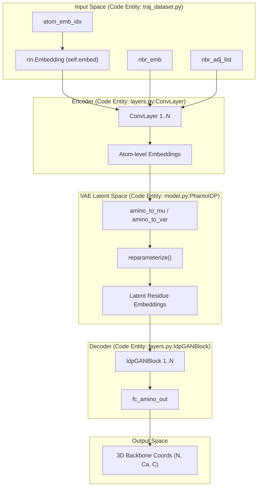

# Model Architecture

> **Relevant source files**
> * [layers.py](https://github.com/Junjie-Zhu/Phanto-IDP/blob/8f82e775/layers.py)
> * [model.py](https://github.com/Junjie-Zhu/Phanto-IDP/blob/8f82e775/model.py)

The Phanto-IDP model is a hybrid deep learning architecture designed to generate 3D conformational ensembles of Intrinsically Disordered Proteins (IDPs). It utilizes a **Variational Autoencoder (VAE)** framework where the encoder is a **Graph Convolutional Network (GCN)** that processes atomic-level structural information, and the decoder is a **Transformer-based** generator that outputs residue-level backbone coordinates.

### System Overview

The architecture bridges the gap between discrete atomic graph representations and continuous 3D coordinate space. The model is defined in the `PhantoIDP` class [model.py L13-L172](https://github.com/Junjie-Zhu/Phanto-IDP/blob/8f82e775/model.py#L13-L172)

1. **Input**: Atomic features, bond features, and neighbor adjacency lists [model.py L74](https://github.com/Junjie-Zhu/Phanto-IDP/blob/8f82e775/model.py#L74-L74)
2. **Encoder**: A series of gated graph convolutions (`ConvLayer`) that aggregate local atomic environments into high-dimensional embeddings [model.py L81-L82](https://github.com/Junjie-Zhu/Phanto-IDP/blob/8f82e775/model.py#L81-L82)
3. **Latent Space**: A VAE bottleneck that maps aggregated atom embeddings to a stochastic latent space representing residue-level conformational degrees of freedom [model.py L88-L90](https://github.com/Junjie-Zhu/Phanto-IDP/blob/8f82e775/model.py#L88-L90)
4. **Decoder**: A sequence of Transformer blocks (`IdpGANBlock`) that process latent embeddings to predict the relative 3D positions of N, Ca, and C backbone atoms [model.py L94-L95](https://github.com/Junjie-Zhu/Phanto-IDP/blob/8f82e775/model.py#L94-L95)
5. **Output**: A tensor of shape `[Batch, Residues, 3, 3]` representing the 3D coordinates of the backbone [model.py L102](https://github.com/Junjie-Zhu/Phanto-IDP/blob/8f82e775/model.py#L102-L102)

### Architectural Flow Diagram

The following diagram illustrates the flow from the raw graph input through the neural layers to the final 3D coordinates.

**Phanto-IDP Data Flow**

**Sources:** [model.py L13-L117](https://github.com/Junjie-Zhu/Phanto-IDP/blob/8f82e775/model.py#L13-L117)

 [layers.py L7-L143](https://github.com/Junjie-Zhu/Phanto-IDP/blob/8f82e775/layers.py#L7-L143)

---

### Component Details

#### 1. Graph Convolutional Encoder (ConvLayer)

The encoder uses `ConvLayer` modules to perform message passing across the atomic graph. Each layer updates atom embeddings by aggregating features from neighboring atoms and the bonds connecting them. It employs a gated mechanism where a sigmoid-activated filter controls the flow of information from neighbors.

* **Key Class**: `ConvLayer` [layers.py L7-L37](https://github.com/Junjie-Zhu/Phanto-IDP/blob/8f82e775/layers.py#L7-L37)
* **Mechanism**: Gated aggregation of `atom_emb` and `nbr_emb` [layers.py L27-L33](https://github.com/Junjie-Zhu/Phanto-IDP/blob/8f82e775/layers.py#L27-L33)
* **Details**: For a deep dive into message passing and residual connections, see **[Graph Convolutional Encoder (ConvLayer)](/Junjie-Zhu/Phanto-IDP/3.1-graph-convolutional-encoder-(convlayer))**.

#### 2. Transformer Decoder (IdpGANBlock)

The decoder translates the latent representation into spatial coordinates. Unlike the encoder which operates on atoms, the decoder operates on a sequence of residues. It uses `IdpGANBlock` which encapsulates multi-head self-attention and feedforward networks to capture long-range dependencies within the protein chain.

* **Key Class**: `IdpGANBlock` [layers.py L40-L143](https://github.com/Junjie-Zhu/Phanto-IDP/blob/8f82e775/layers.py#L40-L143)
* **Mechanism**: Multi-head attention via `IdpGANLayer` [layers.py L146-L200](https://github.com/Junjie-Zhu/Phanto-IDP/blob/8f82e775/layers.py#L146-L200)  followed by a feedforward updater.
* **Details**: For information on attention mechanisms and layer normalization, see **[Transformer Decoder (IdpGANBlock / IdpGANLayer)](/Junjie-Zhu/Phanto-IDP/3.2-transformer-decoder-(idpganblock-idpganlayer))**.

#### 3. VAE Latent Space and Loss Functions

The model is trained as a VAE to learn the distribution of IDP conformations. The `reparameterize` function allows for backpropagation through the stochastic sampling process. The training objective is a composite loss function combining **FAPE (Frame Aligned Point Error)** for structural accuracy and **KL Divergence** for latent space regularization.

* **Key Methods**: `reparameterize` [model.py L119-L123](https://github.com/Junjie-Zhu/Phanto-IDP/blob/8f82e775/model.py#L119-L123)  `FAPEloss` [utils.py L177-L193](https://github.com/Junjie-Zhu/Phanto-IDP/blob/8f82e775/utils.py#L177-L193)
* **Mechanism**: Mapping atom clusters to `mu` and `logvar` [model.py L88-L89](https://github.com/Junjie-Zhu/Phanto-IDP/blob/8f82e775/model.py#L88-L89)
* **Details**: For details on the loss weighting schedule and rigid frame construction, see **[VAE Latent Space and Loss Functions](/Junjie-Zhu/Phanto-IDP/3.3-vae-latent-space-and-loss-functions)**.

---

### Mapping: System Components to Code Entities

| System Component | Code Entity (Class/Function) | File Location |
| --- | --- | --- |
| **Main Model Container** | `PhantoIDP` | [model.py L13](https://github.com/Junjie-Zhu/Phanto-IDP/blob/8f82e775/model.py#L13-L13) |
| **Atomic Feature Aggregator** | `ConvLayer` | [layers.py L7](https://github.com/Junjie-Zhu/Phanto-IDP/blob/8f82e775/layers.py#L7-L7) |
| **Attention-based Generator** | `IdpGANBlock` | [layers.py L40](https://github.com/Junjie-Zhu/Phanto-IDP/blob/8f82e775/layers.py#L40-L40) |
| **Stochastic Sampling** | `reparameterize` | [model.py L119](https://github.com/Junjie-Zhu/Phanto-IDP/blob/8f82e775/model.py#L119-L119) |
| **Structural Loss** | `FAPEloss` | [utils.py L177](https://github.com/Junjie-Zhu/Phanto-IDP/blob/8f82e775/utils.py#L177-L177) |
| **Rigid Frame Construction** | `from_3_points` | [model.py L132](https://github.com/Junjie-Zhu/Phanto-IDP/blob/8f82e775/model.py#L132-L132) |
| **Optimization** | `optim.Adam` | [model.py L27](https://github.com/Junjie-Zhu/Phanto-IDP/blob/8f82e775/model.py#L27-L27) |

**Sources:** [model.py L13-L172](https://github.com/Junjie-Zhu/Phanto-IDP/blob/8f82e775/model.py#L13-L172)

 [layers.py L7-L200](https://github.com/Junjie-Zhu/Phanto-IDP/blob/8f82e775/layers.py#L7-L200)

 [utils.py L177-L193](https://github.com/Junjie-Zhu/Phanto-IDP/blob/8f82e775/utils.py#L177-L193)