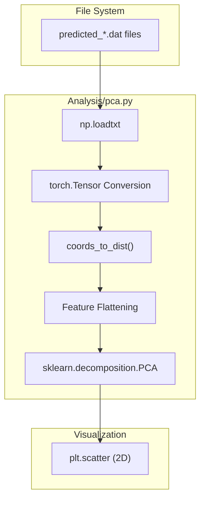
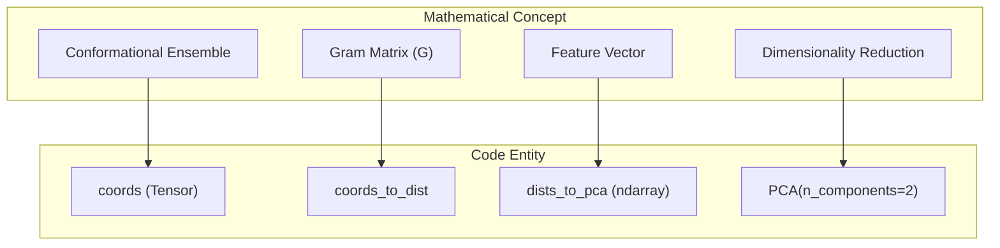

# PCA of Conformational Ensembles

> **Relevant source files**
> * [Analysis/pca.py](https://github.com/Junjie-Zhu/Phanto-IDP/blob/8f82e775/Analysis/pca.py)

The `Analysis/pca.py` script provides a tool for visualizing the conformational diversity of generated protein structures. By transforming high-dimensional coordinate data into a 2D space using Principal Component Analysis (PCA), the system allows researchers to observe the distribution and clustering of generated ensembles.

## Implementation Overview

The analysis pipeline follows a specific data flow: loading generated `.dat` files, calculating pairwise distance matrices for residues, flattening these matrices into feature vectors, and performing dimensionality reduction via `sklearn.decomposition.PCA`.

### Coordinate to Distance Transformation

To ensure the PCA is invariant to global rotation and translation, the script converts raw 3D coordinates into a distance matrix. This is implemented in the `coords_to_dist` function [Analysis/pca.py L13-L21](https://github.com/Junjie-Zhu/Phanto-IDP/blob/8f82e775/Analysis/pca.py#L13-L21)

The implementation uses the Gram matrix $G = XX^T$ to compute Euclidean distances efficiently for a batch of structures:

1. **Gram Matrix Calculation**: Computes `torch.bmm(coord, coord.transpose(1, 2))` [Analysis/pca.py L16](https://github.com/Junjie-Zhu/Phanto-IDP/blob/8f82e775/Analysis/pca.py#L16-L16)
2. **Diagonal Extraction**: Extracts the squared norms of the vectors [Analysis/pca.py L17](https://github.com/Junjie-Zhu/Phanto-IDP/blob/8f82e775/Analysis/pca.py#L17-L17)
3. **Distance Computation**: Uses the identity $|a-b|^2 = |a|^2 + |b|^2 - 2\langle a,b \rangle$ to derive the squared distance matrix [Analysis/pca.py L19](https://github.com/Junjie-Zhu/Phanto-IDP/blob/8f82e775/Analysis/pca.py#L19-L19)
4. **Rooting**: Applies `torch.sqrt` to obtain the final distance matrix [Analysis/pca.py L20](https://github.com/Junjie-Zhu/Phanto-IDP/blob/8f82e775/Analysis/pca.py#L20-L20)

### Data Flow and Processing

The script processes a subset of generated conformations to maintain computational efficiency.

| Step | Operation | Code Reference |
| --- | --- | --- |
| **1. Loading** | Reads `.dat` files starting with `predicted` from the provided path. | [Analysis/pca.py L25-L27](https://github.com/Junjie-Zhu/Phanto-IDP/blob/8f82e775/Analysis/pca.py#L25-L27) |
| **2. Sampling** | Limits the analysis to the first 60 batches of data. | [Analysis/pca.py L28-L29](https://github.com/Junjie-Zhu/Phanto-IDP/blob/8f82e775/Analysis/pca.py#L28-L29) |
| **3. Reshaping** | Views the data as `[Batch, Samples, Residues, Coordinates]`. | [Analysis/pca.py L31](https://github.com/Junjie-Zhu/Phanto-IDP/blob/8f82e775/Analysis/pca.py#L31-L31) |
| **4. Batch Dist** | Iteratively calls `coords_to_dist` for each batch. | [Analysis/pca.py L34-L35](https://github.com/Junjie-Zhu/Phanto-IDP/blob/8f82e775/Analysis/pca.py#L34-L35) |
| **5. Flattening** | Flattens the $N \times N$ distance matrix into a 1D feature vector per conformation. | [Analysis/pca.py L37-L38](https://github.com/Junjie-Zhu/Phanto-IDP/blob/8f82e775/Analysis/pca.py#L37-L38) |

**Sources:** [Analysis/pca.py L13-L38](https://github.com/Junjie-Zhu/Phanto-IDP/blob/8f82e775/Analysis/pca.py#L13-L38)

## System Architecture Diagrams

### Logical Data Flow: Coordinates to PCA Space

This diagram illustrates how raw coordinate files are transformed into a 2D scatter plot.

**Sources:** [Analysis/pca.py L13-L45](https://github.com/Junjie-Zhu/Phanto-IDP/blob/8f82e775/Analysis/pca.py#L13-L45)

### Code Entity Association

This diagram maps the mathematical concepts of conformational analysis to the specific Python entities in `Analysis/pca.py`.

**Sources:** [Analysis/pca.py L13](https://github.com/Junjie-Zhu/Phanto-IDP/blob/8f82e775/Analysis/pca.py#L13-L13)

 [Analysis/pca.py L30](https://github.com/Junjie-Zhu/Phanto-IDP/blob/8f82e775/Analysis/pca.py#L30-L30)

 [Analysis/pca.py L38](https://github.com/Junjie-Zhu/Phanto-IDP/blob/8f82e775/Analysis/pca.py#L38-L38)

 [Analysis/pca.py L40](https://github.com/Junjie-Zhu/Phanto-IDP/blob/8f82e775/Analysis/pca.py#L40-L40)

## Execution and Visualization

The script is executed via the command line, taking the directory containing `.dat` files as the primary argument [Analysis/pca.py L10](https://github.com/Junjie-Zhu/Phanto-IDP/blob/8f82e775/Analysis/pca.py#L10-L10)

### Dimensionality Reduction Details

The PCA object is configured for two components:

* **Components**: `n_components=2` [Analysis/pca.py L40](https://github.com/Junjie-Zhu/Phanto-IDP/blob/8f82e775/Analysis/pca.py#L40-L40)
* **Fit**: The `fit_transform` method is called on the flattened distance matrices [Analysis/pca.py L41](https://github.com/Junjie-Zhu/Phanto-IDP/blob/8f82e775/Analysis/pca.py#L41-L41)
* **Output**: A scatter plot is generated using `matplotlib`, displaying the relationship between the first two principal components [Analysis/pca.py L43-L45](https://github.com/Junjie-Zhu/Phanto-IDP/blob/8f82e775/Analysis/pca.py#L43-L45)

**Sources:** [Analysis/pca.py L40-L45](https://github.com/Junjie-Zhu/Phanto-IDP/blob/8f82e775/Analysis/pca.py#L40-L45)