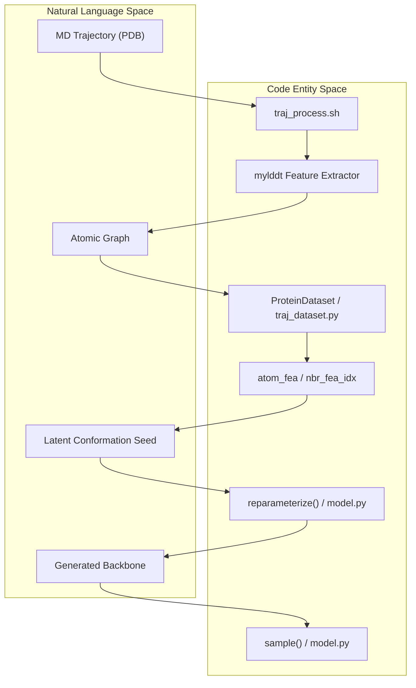
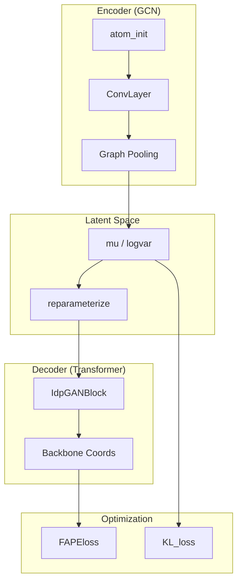

# Phanto-IDP Overview

> **Relevant source files**
> * [Analysis/ramachandran.py](https://github.com/Junjie-Zhu/Phanto-IDP/blob/8f82e775/Analysis/ramachandran.py)
> * [ImgSrc/Phanto-IDP.png](https://github.com/Junjie-Zhu/Phanto-IDP/blob/8f82e775/ImgSrc/Phanto-IDP.png)
> * [README.md](https://github.com/Junjie-Zhu/Phanto-IDP/blob/8f82e775/README.md?plain=1)
> * [generate.py](https://github.com/Junjie-Zhu/Phanto-IDP/blob/8f82e775/generate.py)
> * [main.py](https://github.com/Junjie-Zhu/Phanto-IDP/blob/8f82e775/main.py)

Phanto-IDP is a generative deep learning framework designed for the precise reconstruction and rapid generation of **Intrinsically Disordered Protein (IDP)** backbone conformation ensembles. Unlike folded proteins, IDPs lack a stable 3D structure, necessitating computational tools that can capture their high conformational flexibility. Phanto-IDP leverages a Variational Autoencoder (VAE) architecture, combining Graph Convolutional Networks (GCNs) for atomic encoding and Transformer-based decoders for 3D coordinate generation [README.md L1-L5](https://github.com/Junjie-Zhu/Phanto-IDP/blob/8f82e775/README.md?plain=1#L1-L5)

## Scientific Motivation and Capabilities

The primary objective of Phanto-IDP is to bridge the gap between slow, physics-based molecular dynamics (MD) simulations and the need for large-scale conformational sampling. Key capabilities include:

* **High-Speed Generation**: Rapidly produces unseen structures from a learned latent space [README.md L5](https://github.com/Junjie-Zhu/Phanto-IDP/blob/8f82e775/README.md?plain=1#L5-L5)
* **Precise Reconstruction**: Maintains structural validity (e.g., Ramachandran preferences) while exploring the IDP energy landscape [Analysis/ramachandran.py L11-L30](https://github.com/Junjie-Zhu/Phanto-IDP/blob/8f82e775/Analysis/ramachandran.py#L11-L30)
* **Multi-Target Support**: Pre-trained checkpoints are provided for diverse IDP targets including RS1, PaaA2, and $\alpha$-synuclein [README.md L57-L58](https://github.com/Junjie-Zhu/Phanto-IDP/blob/8f82e775/README.md?plain=1#L57-L58)

## System Architecture

The system follows a pipeline that transitions from raw structural data to a graph-based representation, and finally to a generative latent space.

### Data Flow: Natural Language to Code Entities

The following diagram illustrates how high-level concepts in IDP modeling are mapped to specific code entities and data structures within the Phanto-IDP repository.

**System Mapping Diagram**

**Sources:** [README.md L35-L43](https://github.com/Junjie-Zhu/Phanto-IDP/blob/8f82e775/README.md?plain=1#L35-L43)

 [traj_dataset.py L57-L59](https://github.com/Junjie-Zhu/Phanto-IDP/blob/8f82e775/traj_dataset.py#L57-L59)

 [generate.py L146-L151](https://github.com/Junjie-Zhu/Phanto-IDP/blob/8f82e775/generate.py#L146-L151)

### Architectural Components

The core model, `PhantoIDP`, is implemented as a VAE that processes protein graphs to output backbone coordinates.

**Component Interaction Diagram**

**Sources:** [main.py L78-L95](https://github.com/Junjie-Zhu/Phanto-IDP/blob/8f82e775/main.py#L78-L95)

 [generate.py L144-L149](https://github.com/Junjie-Zhu/Phanto-IDP/blob/8f82e775/generate.py#L144-L149)

 [main.py L172-L178](https://github.com/Junjie-Zhu/Phanto-IDP/blob/8f82e775/main.py#L172-L178)

## Major Subsystems

### 1. Data Preprocessing

The pipeline begins by converting raw PDB trajectories into a structured format suitable for graph neural networks. This involves a C++ toolset (`mylddt`) for feature extraction and Python scripts for graph construction.

* **Key Files**: `traj_process.sh`, `pdb_parse.py`, `preprocess/src/`.
* **For details, see [Data Preprocessing Pipeline](/Junjie-Zhu/Phanto-IDP/2-data-preprocessing-pipeline)**.

### 2. Model Architecture

The `PhantoIDP` class integrates a gated GCN encoder with a Transformer-based decoder. It utilizes Frame Aligned Point Error (FAPE) loss to ensure structural accuracy of the generated backbones.

* **Key Files**: `model.py`, `layers.py`, `utils.py`.
* **For details, see [Model Architecture](/Junjie-Zhu/Phanto-IDP/3-model-architecture)**.

### 3. Training and Generation

Phanto-IDP supports multi-GPU training via `DataParallel`. The generation script allows users to sample new conformations using pre-trained checkpoints by adjusting temperature and variance parameters.

* **Key Files**: `main.py`, `generate.py`, `arguments.py`.
* **For details, see [Training and Generation](/Junjie-Zhu/Phanto-IDP/4-training-and-generation)**.

### 4. Analysis and Validation

Post-generation, the software provides tools to validate the ensemble quality, including Ramachandran plot density analysis, RMSD distributions, and Radius of Gyration (Rg) calculations.

* **Key Files**: `Analysis/ramachandran.py`, `Analysis/rmsd_plot.py`, `Analysis/rg.py`.
* **For details, see [Analysis and Validation](/Junjie-Zhu/Phanto-IDP/5-analysis-and-validation)**.

## Getting Started

To begin using Phanto-IDP, you must set up the Python environment (PyTorch, Biotite, etc.) and compile the C++ preprocessing tools.

* **For details, see [Getting Started](/Junjie-Zhu/Phanto-IDP/1.1-getting-started)**.
* **For information on pre-trained models, see [Supported Proteins and Checkpoints](/Junjie-Zhu/Phanto-IDP/1.2-supported-proteins-and-checkpoints)**.

**Sources:** [README.md L11-L33](https://github.com/Junjie-Zhu/Phanto-IDP/blob/8f82e775/README.md?plain=1#L11-L33)

 [README.md L57-L60](https://github.com/Junjie-Zhu/Phanto-IDP/blob/8f82e775/README.md?plain=1#L57-L60)