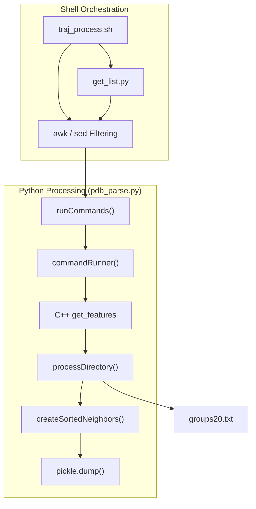
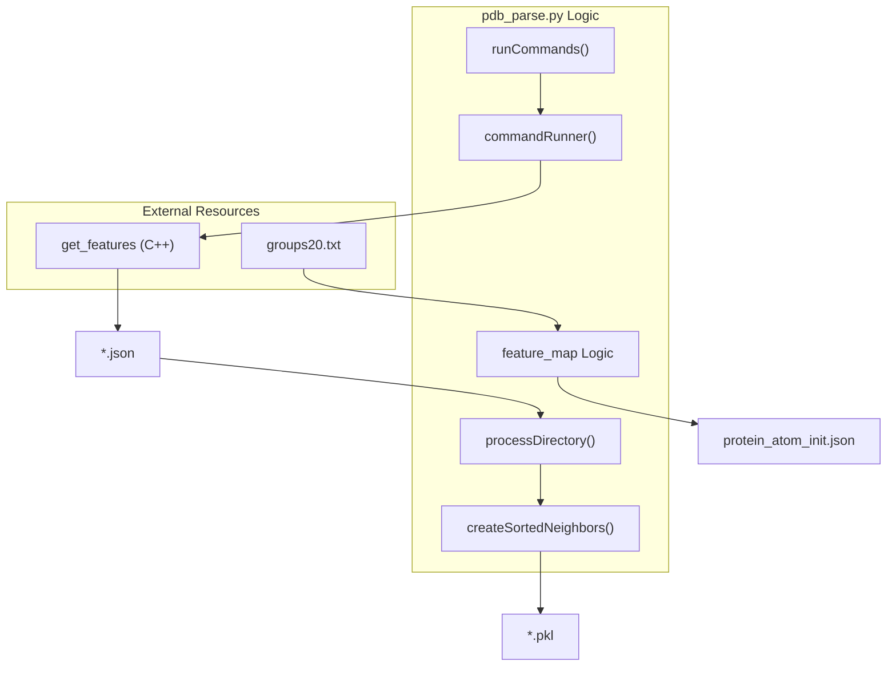

# Python Preprocessing Layer

> **Relevant source files**
> * [get_list.py](https://github.com/Junjie-Zhu/Phanto-IDP/blob/8f82e775/get_list.py)
> * [pdb_parse.py](https://github.com/Junjie-Zhu/Phanto-IDP/blob/8f82e775/pdb_parse.py)
> * [preprocess/data/groups20.txt](https://github.com/Junjie-Zhu/Phanto-IDP/blob/8f82e775/preprocess/data/groups20.txt)
> * [traj_process.sh](https://github.com/Junjie-Zhu/Phanto-IDP/blob/8f82e775/traj_process.sh)

The Python Preprocessing Layer serves as the bridge between raw Molecular Dynamics (MD) trajectory data and the graph-structured inputs required by the Phanto-IDP model. It handles file discovery, backbone atom filtering, residue normalization, and the conversion of C++ generated JSON features into optimized Python pickle files containing spatial neighbor graphs and one-hot encoded amino acid features.

## Data Flow Overview

The preprocessing pipeline follows a linear progression from shell-based filtering to parallelized Python parsing.

### Preprocessing Pipeline Sequence

1. **Discovery**: `get_list.py` identifies all `.pdb` files in a target directory.
2. **Filtering**: `traj_process.sh` uses `awk` to extract backbone atoms (C, N, CA) and `sed` to normalize Histidine naming.
3. **Feature Extraction**: `pdb_parse.py` orchestrates the C++ `get_features` binary to generate atomic contact and bond data.
4. **Graph Construction**: `pdb_parse.py` builds spatial neighbor graphs and serializes the final training data.

### System Entity Map

This diagram maps the logical preprocessing steps to the specific scripts and functions that implement them.

**Sources:** `traj_process.sh` [1-9](https://github.com/Junjie-Zhu/Phanto-IDP/blob/8f82e775/1-9)

 `get_list.py` [4-10](https://github.com/Junjie-Zhu/Phanto-IDP/blob/8f82e775/4-10)

 `pdb_parse.py` [40-56](https://github.com/Junjie-Zhu/Phanto-IDP/blob/8f82e775/40-56)

 `pdb_parse.py` [107-130](https://github.com/Junjie-Zhu/Phanto-IDP/blob/8f82e775/107-130)

---

## Shell-Level Preprocessing

### File Discovery (get_list.py)

The script `get_list.py` accepts a directory path as a command-line argument and scans for files ending in `.pdb` [get_list.py L4-L7](https://github.com/Junjie-Zhu/Phanto-IDP/blob/8f82e775/get_list.py#L4-L7)

 It generates a manifest file named `pdb_list.dat` containing one filename per line [get_list.py L8-L10](https://github.com/Junjie-Zhu/Phanto-IDP/blob/8f82e775/get_list.py#L8-L10)

### Backbone Filtering and Normalization (traj_process.sh)

This script automates the initial cleanup of MD trajectories:

* **Backbone Filtering**: It iterates through `pdb_list.dat` and uses `awk` to retain only the `C`, `N`, and `CA` atoms [traj_process.sh L5-L7](https://github.com/Junjie-Zhu/Phanto-IDP/blob/8f82e775/traj_process.sh#L5-L7)  This reduction is critical for focusing the model on backbone topology.
* **Residue Normalization**: It performs a global search-and-replace using `sed` to convert `HIE` (a specific protonation state of Histidine) to the standard `HIS` label [traj_process.sh L8](https://github.com/Junjie-Zhu/Phanto-IDP/blob/8f82e775/traj_process.sh#L8-L8)

**Sources:** `get_list.py` [1-12](https://github.com/Junjie-Zhu/Phanto-IDP/blob/8f82e775/1-12)

 `traj_process.sh` [1-9](https://github.com/Junjie-Zhu/Phanto-IDP/blob/8f82e775/1-9)

---

## Python Parsing and Graph Construction (pdb_parse.py)

The `pdb_parse.py` script is the primary orchestrator for transforming filtered PDBs into model-ready datasets.

### Parallel Execution

The script utilizes `joblib.Parallel` to speed up processing by distributing tasks across multiple CPU cores [pdb_parse.py L6](https://github.com/Junjie-Zhu/Phanto-IDP/blob/8f82e775/pdb_parse.py#L6-L6)

* **JSON Generation**: Calls the C++ `get_features` executable for each PDB file in parallel [pdb_parse.py L54-L55](https://github.com/Junjie-Zhu/Phanto-IDP/blob/8f82e775/pdb_parse.py#L54-L55)
* **Pickle Serialization**: Processes the resulting JSON files into `.pkl` format in parallel [pdb_parse.py L136-L137](https://github.com/Junjie-Zhu/Phanto-IDP/blob/8f82e775/pdb_parse.py#L136-L137)

### Feature Encoding

The script implements a one-hot encoding scheme for amino acid types:

* **Amino Acid Mapping**: It reads `groups20.txt` to identify the 167 unique atom-residue combinations (e.g., `ALA_CA`, `ARG_NH1`) [preprocess/data/groups20.txt L1-L167](https://github.com/Junjie-Zhu/Phanto-IDP/blob/8f82e775/preprocess/data/groups20.txt#L1-L167)
* **One-Hot Vectorization**: Each atom type is mapped to a bit vector of length `len_amino` [pdb_parse.py L69-L73](https://github.com/Junjie-Zhu/Phanto-IDP/blob/8f82e775/pdb_parse.py#L69-L73)
* **Initialization File**: The resulting `feature_map` is saved as `protein_atom_init.json` for use during the model's embedding phase [pdb_parse.py L75-L76](https://github.com/Junjie-Zhu/Phanto-IDP/blob/8f82e775/pdb_parse.py#L75-L76)

### Spatial Neighbor Graph Construction

The `createSortedNeighbors` function transforms raw contact lists into fixed-size adjacency representations [pdb_parse.py L79](https://github.com/Junjie-Zhu/Phanto-IDP/blob/8f82e775/pdb_parse.py#L79-L79)

| Feature | Implementation Detail |
| --- | --- |
| **Input Data** | Contacts, Bonds, and `max_neighbors` (default 50) [pdb_parse.py L59-L79](https://github.com/Junjie-Zhu/Phanto-IDP/blob/8f82e775/pdb_parse.py#L59-L79) |
| **Bond Flagging** | Distinguishes between spatial neighbors and covalently bonded neighbors [pdb_parse.py L80-L92](https://github.com/Junjie-Zhu/Phanto-IDP/blob/8f82e775/pdb_parse.py#L80-L92) |
| **Sorting** | Neighbors are sorted by Euclidean distance using a `mergesort` algorithm [pdb_parse.py L97-L101](https://github.com/Junjie-Zhu/Phanto-IDP/blob/8f82e775/pdb_parse.py#L97-L101) |
| **Padding** | If an atom has `< 50` neighbors, the list is zero-padded to maintain consistent tensor shapes [pdb_parse.py L98](https://github.com/Junjie-Zhu/Phanto-IDP/blob/8f82e775/pdb_parse.py#L98-L98) |

### Data Serialization Logic

The `processDirectory` function extracts and saves five key components into a single pickle file for every structure [pdb_parse.py L107-L130](https://github.com/Junjie-Zhu/Phanto-IDP/blob/8f82e775/pdb_parse.py#L107-L130)

:

1. `atom_fea`: The atomic features.
2. `nbr_fea`: Spatial neighbor features (distance, relative coordinates, bond flag).
3. `nbr_fea_idx`: Indices of the neighbor atoms.
4. `amino_atom_idx`: Residue indices for each atom.
5. `save_filename`: The unique identifier for the conformation.

**Sources:** `pdb_parse.py` [6-76](https://github.com/Junjie-Zhu/Phanto-IDP/blob/8f82e775/6-76)

 `pdb_parse.py` [79-104](https://github.com/Junjie-Zhu/Phanto-IDP/blob/8f82e775/79-104)

 `pdb_parse.py` [107-138](https://github.com/Junjie-Zhu/Phanto-IDP/blob/8f82e775/107-138)

---

## Execution Logic and Parameters

### Key Function Associations

This diagram illustrates how internal functions in `pdb_parse.py` interact with external data and executables.

### Configuration Arguments

The script uses `argparse` to manage environment-specific paths and performance settings [pdb_parse.py L9-L21](https://github.com/Junjie-Zhu/Phanto-IDP/blob/8f82e775/pdb_parse.py#L9-L21)

| Argument | Default Value | Description |
| --- | --- | --- |
| `-datapath` | `../Traj/processed/` | Source directory for filtered PDB files [pdb_parse.py L11](https://github.com/Junjie-Zhu/Phanto-IDP/blob/8f82e775/pdb_parse.py#L11-L11) |
| `-savepath` | `./data/pkl/` | Output directory for serialized pickle files [pdb_parse.py L12](https://github.com/Junjie-Zhu/Phanto-IDP/blob/8f82e775/pdb_parse.py#L12-L12) |
| `-cpp_executable` | `./preprocess/get_features` | Path to the compiled C++ feature extractor [pdb_parse.py L13-L14](https://github.com/Junjie-Zhu/Phanto-IDP/blob/8f82e775/pdb_parse.py#L13-L14) |
| `-parallel_jobs` | `5` | Number of concurrent threads for `joblib` [pdb_parse.py L17](https://github.com/Junjie-Zhu/Phanto-IDP/blob/8f82e775/pdb_parse.py#L17-L17) |
| `-groups20_filepath` | `./preprocess/groups20.txt` | Mapping file for atom-residue one-hot encoding [pdb_parse.py L15-L16](https://github.com/Junjie-Zhu/Phanto-IDP/blob/8f82e775/pdb_parse.py#L15-L16) |

**Sources:** `pdb_parse.py` [9-31](https://github.com/Junjie-Zhu/Phanto-IDP/blob/8f82e775/9-31)

 `pdb_parse.py` [40-55](https://github.com/Junjie-Zhu/Phanto-IDP/blob/8f82e775/40-55)

 `pdb_parse.py` [65-76](https://github.com/Junjie-Zhu/Phanto-IDP/blob/8f82e775/65-76)