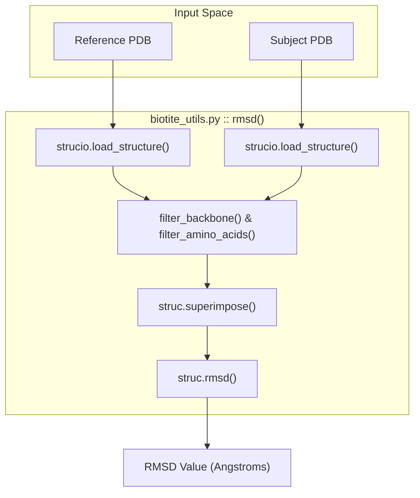
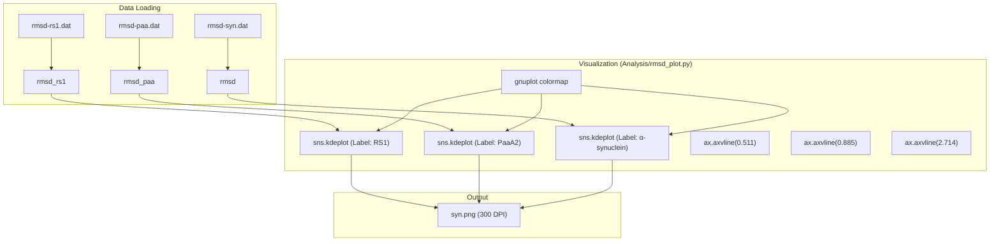

# RMSD Calculation and Distribution Plots

> **Relevant source files**
> * [Analysis/rmsd_calculation.py](https://github.com/Junjie-Zhu/Phanto-IDP/blob/8f82e775/Analysis/rmsd_calculation.py)
> * [Analysis/rmsd_plot.py](https://github.com/Junjie-Zhu/Phanto-IDP/blob/8f82e775/Analysis/rmsd_plot.py)
> * [Scripts/biotite_utils.py](https://github.com/Junjie-Zhu/Phanto-IDP/blob/8f82e775/Scripts/biotite_utils.py)

The validation of Phanto-IDP's generative performance involves assessing the structural similarity between generated conformations and reference ensembles. This is primarily achieved through Root Mean Square Deviation (RMSD) analysis. The pipeline includes point-to-point calculation of backbone RMSD and the visualization of these deviations across diverse datasets using Kernel Density Estimation (KDE).

## RMSD Calculation Implementation

The calculation of RMSD is handled using the `biotite` library, which provides robust algorithms for structural superimposition and distance measurement.

### Pairwise RMSD Logic

The calculation process involves two main steps:

1. **Superimposition**: Aligning the subject structure to the reference structure to minimize the distance between corresponding atoms.
2. **RMSD Computation**: Calculating the square root of the average squared distance between the aligned atoms.

In `Analysis/rmsd_calculation.py`, this is implemented for individual structure pairs [Analysis/rmsd_calculation.py L1-L11](https://github.com/Junjie-Zhu/Phanto-IDP/blob/8f82e775/Analysis/rmsd_calculation.py#L1-L11)

 The utility function `rmsd` in `Scripts/biotite_utils.py` generalizes this by filtering for backbone atoms (N, CA, C, O) and canonical amino acids before performing the superimposition [Scripts/biotite_utils.py L145-L156](https://github.com/Junjie-Zhu/Phanto-IDP/blob/8f82e775/Scripts/biotite_utils.py#L145-L156)

### Structure Alignment Data Flow

The following diagram illustrates the data flow from PDB files to the final RMSD scalar value.

**RMSD Calculation Workflow**

**Sources:** [Analysis/rmsd_calculation.py L1-L11](https://github.com/Junjie-Zhu/Phanto-IDP/blob/8f82e775/Analysis/rmsd_calculation.py#L1-L11)

 [Scripts/biotite_utils.py L145-L156](https://github.com/Junjie-Zhu/Phanto-IDP/blob/8f82e775/Scripts/biotite_utils.py#L145-L156)

## Distribution Plotting

The `Analysis/rmsd_plot.py` script visualizes the distribution of backbone reconstruction RMSDs across three key IDP datasets: RS1, PaaA2, and $\alpha$-synuclein.

### KDE Visualization

The script utilizes `seaborn.kdeplot` to create a smoothed representation of the RMSD distributions [Analysis/rmsd_plot.py L20-L23](https://github.com/Junjie-Zhu/Phanto-IDP/blob/8f82e775/Analysis/rmsd_plot.py#L20-L23)

 This allows for a comparative analysis of how well the model reconstructs different protein topologies.

### Key Plotting Features

* **Colormap Styling**: Uses the `gnuplot` colormap via `sns.color_palette` to distinguish between the three datasets [Analysis/rmsd_plot.py L11-L16](https://github.com/Junjie-Zhu/Phanto-IDP/blob/8f82e775/Analysis/rmsd_plot.py#L11-L16)
* **Mean Markers**: Vertical dashed lines (`ax.axvline`) are plotted to indicate the mean RMSD for each dataset (RS1: 0.511, PaaA2: 0.885, $\alpha$-synuclein: 2.714) [Analysis/rmsd_plot.py L25-L27](https://github.com/Junjie-Zhu/Phanto-IDP/blob/8f82e775/Analysis/rmsd_plot.py#L25-L27)
* **Aesthetics**: The Y-axis is hidden, and the top/right/left spines are removed to focus purely on the distribution shapes [Analysis/rmsd_plot.py L32-L35](https://github.com/Junjie-Zhu/Phanto-IDP/blob/8f82e775/Analysis/rmsd_plot.py#L32-L35)

### Distribution Plotting Mapping

The diagram below maps the script entities to the visualization components.

**RMSD Distribution Entity Mapping**

**Sources:** [Analysis/rmsd_plot.py L5-L43](https://github.com/Junjie-Zhu/Phanto-IDP/blob/8f82e775/Analysis/rmsd_plot.py#L5-L43)

## Key Functions and Variables

| Entity | Location | Description |
| --- | --- | --- |
| `rmsd(reference, target)` | `Scripts/biotite_utils.py` | Loads structures, filters for N, CA, C, O backbone atoms, superimposes, and returns RMSD. |
| `struc.superimpose` | `biotite.structure` | Core algorithm used to align two `AtomArray` objects. |
| `rmsd_rs1`, `rmsd_paa`, `rmsd` | `Analysis/rmsd_plot.py` | Arrays containing pre-calculated RMSD values for RS1, PaaA2, and synuclein respectively. |
| `ax.axvline` | `matplotlib.axes` | Used to draw mean reconstruction error markers on the KDE plot. |

**Sources:** [Scripts/biotite_utils.py L145-L156](https://github.com/Junjie-Zhu/Phanto-IDP/blob/8f82e775/Scripts/biotite_utils.py#L145-L156)

 [Analysis/rmsd_plot.py L5-L27](https://github.com/Junjie-Zhu/Phanto-IDP/blob/8f82e775/Analysis/rmsd_plot.py#L5-L27)