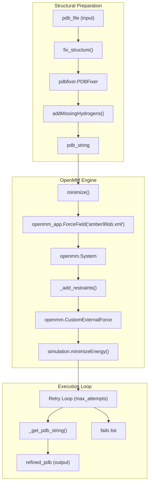
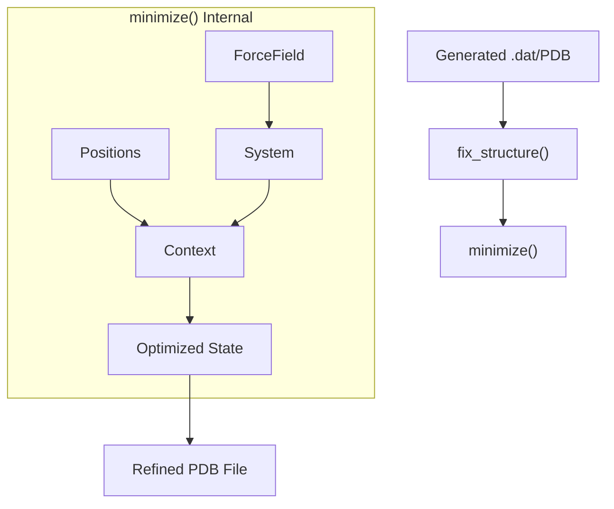

# Radius of Gyration and Energy Refinement

> **Relevant source files**
> * [Analysis/refine_openmm.py](https://github.com/Junjie-Zhu/Phanto-IDP/blob/8f82e775/Analysis/refine_openmm.py)
> * [Analysis/rg.py](https://github.com/Junjie-Zhu/Phanto-IDP/blob/8f82e775/Analysis/rg.py)

This page documents the post-generation validation and structural refinement utilities of the Phanto-IDP pipeline. These tools provide quantitative metrics for the size of generated ensembles and a robust workflow for correcting structural irregularities via physics-based energy minimization.

## Radius of Gyration Analysis

The `Analysis/rg.py` script is designed to aggregate and summarize Radius of Gyration ($R_g$) data across multiple generated ensembles. It specifically targets three protein systems: RS1, PaaA2, and $\alpha$-synuclein.

### Data Aggregation Flow

The script identifies files in the current directory that follow the naming convention `Rg_[ProteinName]_*.dat` [Analysis/rg.py L5-L7](https://github.com/Junjie-Zhu/Phanto-IDP/blob/8f82e775/Analysis/rg.py#L5-L7)

 It parses these files to extract the $R_g$ values (typically the last column of the file) and stores them in a protein-specific dictionary [Analysis/rg.py L8-L10](https://github.com/Junjie-Zhu/Phanto-IDP/blob/8f82e775/Analysis/rg.py#L8-L10)

Once all files are processed, the script calculates the mean and standard deviation for each protein system to characterize the spatial extent of the generated conformations [Analysis/rg.py L12-L17](https://github.com/Junjie-Zhu/Phanto-IDP/blob/8f82e775/Analysis/rg.py#L12-L17)

### Rg Analysis Logic

| Component | Identifier | Description |
| --- | --- | --- |
| **Data Store** | `rg_dict` | Dictionary mapping 'RS1', 'PaaA2', and 'synuclein' to lists of $R_g$ values [Analysis/rg.py L4](https://github.com/Junjie-Zhu/Phanto-IDP/blob/8f82e775/Analysis/rg.py#L4-L4) |
| **File Filter** | `fsplit[0] == 'Rg'` | Filters for files prefixed with "Rg" [Analysis/rg.py L7](https://github.com/Junjie-Zhu/Phanto-IDP/blob/8f82e775/Analysis/rg.py#L7-L7) |
| **Statistical Output** | `_mean`, `_std` | Lists containing aggregated statistics for the three target proteins [Analysis/rg.py L12-L17](https://github.com/Junjie-Zhu/Phanto-IDP/blob/8f82e775/Analysis/rg.py#L12-L17) |

**Sources:**

* [Analysis/rg.py L1-L19](https://github.com/Junjie-Zhu/Phanto-IDP/blob/8f82e775/Analysis/rg.py#L1-L19)

---

## Energy Refinement with OpenMM

The `Analysis/refine_openmm.py` script provides a robust pipeline for repairing generated PDB structures and performing energy minimization using the OpenMM framework. This step is critical for resolving steric clashes or unphysical bond lengths that may arise during generative sampling.

### Structural Repair (PDBFixer)

Before minimization, structures are processed via `pdbfixer` to ensure chemical completeness. The `fix_structure` function performs the following operations:

1. Identifies and adds missing residues and atoms [Analysis/refine_openmm.py L34-L35](https://github.com/Junjie-Zhu/Phanto-IDP/blob/8f82e775/Analysis/refine_openmm.py#L34-L35)
2. Adds missing hydrogens to the topology [Analysis/refine_openmm.py L37](https://github.com/Junjie-Zhu/Phanto-IDP/blob/8f82e775/Analysis/refine_openmm.py#L37-L37)
3. Returns a standardized PDB string for subsequent OpenMM processing [Analysis/refine_openmm.py L43](https://github.com/Junjie-Zhu/Phanto-IDP/blob/8f82e775/Analysis/refine_openmm.py#L43-L43)

### Energy Minimization Workflow

The minimization process uses the **Amber99SB** force field [Analysis/refine_openmm.py L93](https://github.com/Junjie-Zhu/Phanto-IDP/blob/8f82e775/Analysis/refine_openmm.py#L93-L93)

 with **HBonds** constraints [Analysis/refine_openmm.py L94](https://github.com/Junjie-Zhu/Phanto-IDP/blob/8f82e775/Analysis/refine_openmm.py#L94-L94)

#### Harmonic Restraints

To prevent the protein from deviating too far from the generated backbone during refinement, the script implements `_add_restraints` [Analysis/refine_openmm.py L46-L69](https://github.com/Junjie-Zhu/Phanto-IDP/blob/8f82e775/Analysis/refine_openmm.py#L46-L69)

 This adds a `CustomExternalForce` representing a harmonic potential:
$$E_{restraint} = 0.5 \cdot k \cdot ((x-x_0)^2 + (y-y_0)^2 + (z-z_0)^2)$$
The user can choose to restrain all `non_hydrogen` atoms or only `c_alpha` atoms [Analysis/refine_openmm.py L74-L77](https://github.com/Junjie-Zhu/Phanto-IDP/blob/8f82e775/Analysis/refine_openmm.py#L74-L77)

#### Platform and Execution

The script supports both **CUDA** and **CPU** platforms, defaulting to CPU unless `use_gpu` is toggled [Analysis/refine_openmm.py L101](https://github.com/Junjie-Zhu/Phanto-IDP/blob/8f82e775/Analysis/refine_openmm.py#L101-L101)

 It employs a retry loop (up to `max_attempts = 1000`) to handle potential convergence failures during the `simulation.minimizeEnergy` call [Analysis/refine_openmm.py L25-L158](https://github.com/Junjie-Zhu/Phanto-IDP/blob/8f82e775/Analysis/refine_openmm.py#L25-L158)

### Code Entity Relationship Diagram

The following diagram illustrates the relationship between the OpenMM simulation components and the refinement logic.

**Refinement System Architecture**

**Sources:**

* [Analysis/refine_openmm.py L31-L43](https://github.com/Junjie-Zhu/Phanto-IDP/blob/8f82e775/Analysis/refine_openmm.py#L31-L43)  (Structural Preparation)
* [Analysis/refine_openmm.py L46-L69](https://github.com/Junjie-Zhu/Phanto-IDP/blob/8f82e775/Analysis/refine_openmm.py#L46-L69)  (Restraints)
* [Analysis/refine_openmm.py L80-L116](https://github.com/Junjie-Zhu/Phanto-IDP/blob/8f82e775/Analysis/refine_openmm.py#L80-L116)  (Minimization Logic)
* [Analysis/refine_openmm.py L136-L166](https://github.com/Junjie-Zhu/Phanto-IDP/blob/8f82e775/Analysis/refine_openmm.py#L136-L166)  (Execution Loop)

### Key Parameters and Constants

| Parameter | Code Variable | Default Value | Source |
| --- | --- | --- | --- |
| Force Field | `force_field` | `amber99sb.xml` | [Analysis/refine_openmm.py L93](https://github.com/Junjie-Zhu/Phanto-IDP/blob/8f82e775/Analysis/refine_openmm.py#L93-L93) |
| Restraint Weight | `stiffness` | `10.0 kcal/mol/A^2` | [Analysis/refine_openmm.py L23](https://github.com/Junjie-Zhu/Phanto-IDP/blob/8f82e775/Analysis/refine_openmm.py#L23-L23) |
| Energy Tolerance | `tolerance` | `2.39 kcal/mol` | [Analysis/refine_openmm.py L22](https://github.com/Junjie-Zhu/Phanto-IDP/blob/8f82e775/Analysis/refine_openmm.py#L22-L22) |
| Integrator | `LangevinIntegrator` | `0 friction, 0.01 step` | [Analysis/refine_openmm.py L100](https://github.com/Junjie-Zhu/Phanto-IDP/blob/8f82e775/Analysis/refine_openmm.py#L100-L100) |
| Max Attempts | `max_attempts` | `1000` | [Analysis/refine_openmm.py L25](https://github.com/Junjie-Zhu/Phanto-IDP/blob/8f82e775/Analysis/refine_openmm.py#L25-L25) |

### Data Flow: Generation to Refinement

This diagram maps the transition from generated coordinates to a physically valid PDB file.

**Conformation Refinement Data Flow**

**Sources:**

* [Analysis/refine_openmm.py L80-L116](https://github.com/Junjie-Zhu/Phanto-IDP/blob/8f82e775/Analysis/refine_openmm.py#L80-L116)
* [Analysis/refine_openmm.py L136-L166](https://github.com/Junjie-Zhu/Phanto-IDP/blob/8f82e775/Analysis/refine_openmm.py#L136-L166)