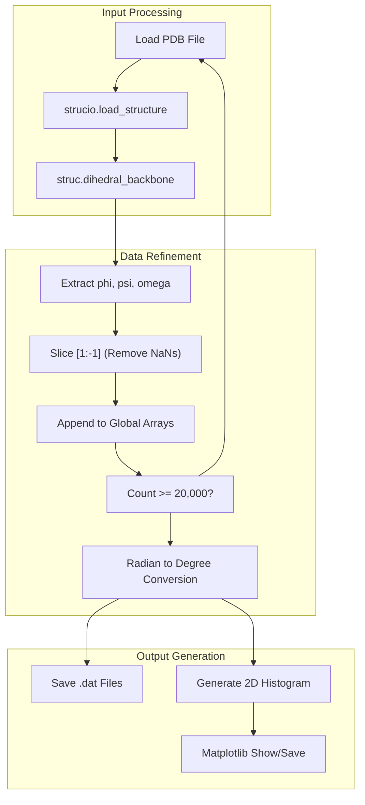
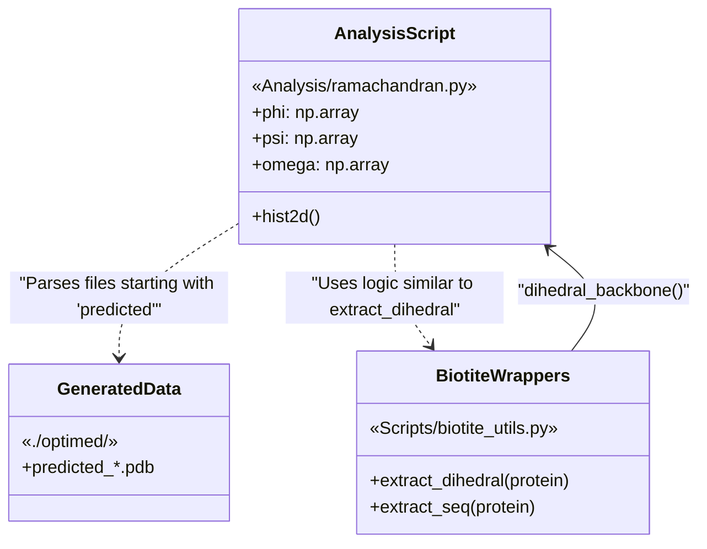

# Ramachandran Plot Analysis

> **Relevant source files**
> * [Analysis/ramachandran.py](https://github.com/Junjie-Zhu/Phanto-IDP/blob/8f82e775/Analysis/ramachandran.py)
> * [ImgSrc/Phanto-IDP.png](https://github.com/Junjie-Zhu/Phanto-IDP/blob/8f82e775/ImgSrc/Phanto-IDP.png)
> * [README.md](https://github.com/Junjie-Zhu/Phanto-IDP/blob/8f82e775/README.md?plain=1)
> * [Scripts/biotite_utils.py](https://github.com/Junjie-Zhu/Phanto-IDP/blob/8f82e775/Scripts/biotite_utils.py)

The Ramachandran Plot Analysis is a validation step in the Phanto-IDP pipeline used to evaluate the structural quality and conformational distribution of generated protein backbones. This analysis extracts the $\phi$ (phi), $\psi$ (psi), and $\omega$ (omega) dihedral angles from predicted structures to ensure they conform to energetically favorable regions of the Ramachandran space, which is critical for validating intrinsically disordered protein (IDP) ensembles.

## Implementation Overview

The analysis is implemented in `Analysis/ramachandran.py`. It utilizes the `biotite` library to parse generated PDB-like structures and calculate backbone dihedrals. The script processes generated files starting with the prefix `predicted` (typically located in the `./optimed/` directory) until a statistical threshold of 20,000 angle pairs is reached [Analysis/ramachandran.py L8-L29](https://github.com/Junjie-Zhu/Phanto-IDP/blob/8f82e775/Analysis/ramachandran.py#L8-L29)

### Key Components

| Component | Description |
| --- | --- |
| **Data Extraction** | Iterates through generated PDB files and extracts backbone dihedrals using `biotite.structure.dihedral_backbone` [Analysis/ramachandran.py L12-L17](https://github.com/Junjie-Zhu/Phanto-IDP/blob/8f82e775/Analysis/ramachandran.py#L12-L17) |
| **Data Cleaning** | Removes `NaN` values typically found at the N-terminal and C-terminal residues where specific dihedrals are undefined [Analysis/ramachandran.py L19-L25](https://github.com/Junjie-Zhu/Phanto-IDP/blob/8f82e775/Analysis/ramachandran.py#L19-L25) |
| **Unit Conversion** | Converts angles from radians (Biotite default) to degrees for standard plotting [Analysis/ramachandran.py L31-L33](https://github.com/Junjie-Zhu/Phanto-IDP/blob/8f82e775/Analysis/ramachandran.py#L31-L33) |
| **Visualization** | Generates a 2D density histogram using a 200x200 bin grid and the `RdYlGn_r` colormap [Analysis/ramachandran.py L40-L53](https://github.com/Junjie-Zhu/Phanto-IDP/blob/8f82e775/Analysis/ramachandran.py#L40-L53) |

**Sources:** [Analysis/ramachandran.py L1-L53](https://github.com/Junjie-Zhu/Phanto-IDP/blob/8f82e775/Analysis/ramachandran.py#L1-L53)

 [Scripts/biotite_utils.py L83-L97](https://github.com/Junjie-Zhu/Phanto-IDP/blob/8f82e775/Scripts/biotite_utils.py#L83-L97)

## Data Flow and Implementation Logic

The logic follows a linear path from raw generated coordinates to a statistical distribution plot.

### Logic Flow Diagram

"Logic Flow of ramachandran.py"



**Sources:** [Analysis/ramachandran.py L11-L53](https://github.com/Junjie-Zhu/Phanto-IDP/blob/8f82e775/Analysis/ramachandran.py#L11-L53)

## Technical Details

### Dihedral Extraction

The extraction relies on the `biotite.structure` module. While `Analysis/ramachandran.py` performs this inline for batch processing, a utility wrapper `extract_dihedral` is also available in `Scripts/biotite_utils.py` [Scripts/biotite_utils.py L83-L97](https://github.com/Junjie-Zhu/Phanto-IDP/blob/8f82e775/Scripts/biotite_utils.py#L83-L97)

The extraction process targets the backbone atoms ($N, C\alpha, C$) to determine:

* **Phi ($\phi$):** Rotation around the $N-C\alpha$ bond.
* **Psi ($\psi$):** Rotation around the $C\alpha-C$ bond.
* **Omega ($\omega$):** Rotation around the peptide bond ($C-N$).

### Statistical Thresholding

To ensure representative sampling without excessive computational cost, the script implements a break condition:

```
if len(phi) >= 20000:    break
```

[Analysis/ramachandran.py L27-L29](https://github.com/Junjie-Zhu/Phanto-IDP/blob/8f82e775/Analysis/ramachandran.py#L27-L29)

### Output Files

The script generates three space-delimited `.dat` files containing the raw degree values for further external analysis:

* `phi.dat` [Analysis/ramachandran.py L36](https://github.com/Junjie-Zhu/Phanto-IDP/blob/8f82e775/Analysis/ramachandran.py#L36-L36)
* `psi.dat` [Analysis/ramachandran.py L37](https://github.com/Junjie-Zhu/Phanto-IDP/blob/8f82e775/Analysis/ramachandran.py#L37-L37)
* `omega.dat` [Analysis/ramachandran.py L38](https://github.com/Junjie-Zhu/Phanto-IDP/blob/8f82e775/Analysis/ramachandran.py#L38-L38)

## Code Entity Space Mapping

The following diagram maps the scientific concepts of Ramachandran analysis to the specific entities in the `Phanto-IDP` codebase.

"System Mapping: Analysis to Code Entities"



**Sources:** [Analysis/ramachandran.py L8-L17](https://github.com/Junjie-Zhu/Phanto-IDP/blob/8f82e775/Analysis/ramachandran.py#L8-L17)

 [Scripts/biotite_utils.py L83-L88](https://github.com/Junjie-Zhu/Phanto-IDP/blob/8f82e775/Scripts/biotite_utils.py#L83-L88)

## Visualization Parameters

The density plot is configured to highlight the distribution of conformations:

* **Bins:** `(200, 200)` for high resolution [Analysis/ramachandran.py L43](https://github.com/Junjie-Zhu/Phanto-IDP/blob/8f82e775/Analysis/ramachandran.py#L43-L43)
* **Colormap:** `RdYlGn_r` (Red-Yellow-Green reversed), where green typically indicates higher density regions [Analysis/ramachandran.py L44](https://github.com/Junjie-Zhu/Phanto-IDP/blob/8f82e775/Analysis/ramachandran.py#L44-L44)
* **Limits:** Axis limits are set from -180 to 175 degrees to cover the full rotational range [Analysis/ramachandran.py L48-L49](https://github.com/Junjie-Zhu/Phanto-IDP/blob/8f82e775/Analysis/ramachandran.py#L48-L49)

**Sources:** [Analysis/ramachandran.py L40-L53](https://github.com/Junjie-Zhu/Phanto-IDP/blob/8f82e775/Analysis/ramachandran.py#L40-L53)