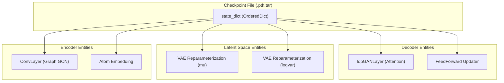
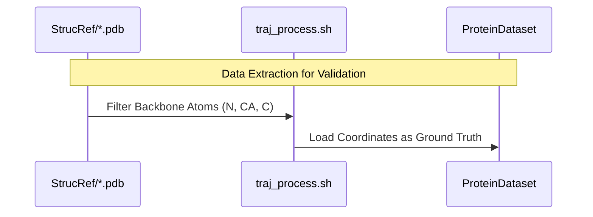

# Supported Proteins and Checkpoints

> **Relevant source files**
> * [StrucRef/PaaA2.gen.1.pdb](https://github.com/Junjie-Zhu/Phanto-IDP/blob/8f82e775/StrucRef/PaaA2.gen.1.pdb)
> * [StrucRef/PaaA2.gen.2.pdb](https://github.com/Junjie-Zhu/Phanto-IDP/blob/8f82e775/StrucRef/PaaA2.gen.2.pdb)
> * [StrucRef/PaaA2.gen.3.pdb](https://github.com/Junjie-Zhu/Phanto-IDP/blob/8f82e775/StrucRef/PaaA2.gen.3.pdb)
> * [StrucRef/PaaA2.gen.4.pdb](https://github.com/Junjie-Zhu/Phanto-IDP/blob/8f82e775/StrucRef/PaaA2.gen.4.pdb)
> * [StrucRef/PaaA2.gen.5.pdb](https://github.com/Junjie-Zhu/Phanto-IDP/blob/8f82e775/StrucRef/PaaA2.gen.5.pdb)
> * [ckpt/AAQAA3.pth.tar](https://github.com/Junjie-Zhu/Phanto-IDP/blob/8f82e775/ckpt/AAQAA3.pth.tar)
> * [ckpt/ACTR_best.pth.tar](https://github.com/Junjie-Zhu/Phanto-IDP/blob/8f82e775/ckpt/ACTR_best.pth.tar)
> * [ckpt/Abeta40_best.pth.tar](https://github.com/Junjie-Zhu/Phanto-IDP/blob/8f82e775/ckpt/Abeta40_best.pth.tar)
> * [ckpt/CspTm_best.pth.tar](https://github.com/Junjie-Zhu/Phanto-IDP/blob/8f82e775/ckpt/CspTm_best.pth.tar)
> * [ckpt/Histain5_best.pth.tar](https://github.com/Junjie-Zhu/Phanto-IDP/blob/8f82e775/ckpt/Histain5_best.pth.tar)
> * [ckpt/PaaA2_best.pth.tar](https://github.com/Junjie-Zhu/Phanto-IDP/blob/8f82e775/ckpt/PaaA2_best.pth.tar)
> * [ckpt/R17_best.pth.tar](https://github.com/Junjie-Zhu/Phanto-IDP/blob/8f82e775/ckpt/R17_best.pth.tar)
> * [ckpt/RS1_best.pth.tar](https://github.com/Junjie-Zhu/Phanto-IDP/blob/8f82e775/ckpt/RS1_best.pth.tar)
> * [ckpt/SPR17_best.pth.tar](https://github.com/Junjie-Zhu/Phanto-IDP/blob/8f82e775/ckpt/SPR17_best.pth.tar)
> * [ckpt/abeta42_best.pth.tar](https://github.com/Junjie-Zhu/Phanto-IDP/blob/8f82e775/ckpt/abeta42_best.pth.tar)
> * [ckpt/drkN_best.pth.tar](https://github.com/Junjie-Zhu/Phanto-IDP/blob/8f82e775/ckpt/drkN_best.pth.tar)
> * [ckpt/p15PAF_best.pth.tar](https://github.com/Junjie-Zhu/Phanto-IDP/blob/8f82e775/ckpt/p15PAF_best.pth.tar)
> * [ckpt/synuclein_best.pth.tar](https://github.com/Junjie-Zhu/Phanto-IDP/blob/8f82e775/ckpt/synuclein_best.pth.tar)
> * [ckpt/ubiquitin_best.pth.tar](https://github.com/Junjie-Zhu/Phanto-IDP/blob/8f82e775/ckpt/ubiquitin_best.pth.tar)

This page catalogs the Intrinsically Disordered Protein (IDP) targets supported by Phanto-IDP, the pretrained model checkpoints available in the `ckpt/` directory, and the reference structural data used for validation in `StrucRef/`.

## Supported IDP Targets

Phanto-IDP is designed to model the conformational ensembles of a wide variety of IDPs. The following table lists the proteins currently supported by the pipeline, including their associated checkpoint files and reference structures.

| Protein Target | Checkpoint File (`ckpt/`) | Reference Structure (`StrucRef/`) |
| --- | --- | --- |
| **RS1** | `RS1_best.pth.tar` | N/A |
| **PaaA2** | `PaaA2_best.pth.tar` | `PaaA2.gen.[1-5].pdb` |
| **α-synuclein** | `synuclein_best.pth.tar` | N/A |
| **Abeta40** | `Abeta40_best.pth.tar` | N/A |
| **Abeta42** | `abeta42_best.pth.tar` | N/A |
| **ACTR** | `ACTR_best.pth.tar` | N/A |
| **CspTm** | `CspTm_best.pth.tar` | N/A |
| **Histatin5** | `Histain5_best.pth.tar` | N/A |
| **R17** | `R17_best.pth.tar` | N/A |
| **SPR17** | `SPR17_best.pth.tar` | N/A |
| **drkN** | `drkN_best.pth.tar` | N/A |
| **p15PAF** | `p15PAF_best.pth.tar` | N/A |
| **Ubiquitin** | `ubiquitin_best.pth.tar` | N/A |
| **AAQAA3** | `AAQAA3.pth.tar` | N/A |

Sources: `ckpt/AAQAA3.pth.tar` (1-13), `ckpt/ACTR_best.pth.tar` (1-13), `ckpt/Abeta40_best.pth.tar` (1-13), `ckpt/CspTm_best.pth.tar` (1-13), `ckpt/Histain5_best.pth.tar` (1-13), `ckpt/PaaA2_best.pth.tar` (1-13), `ckpt/R17_best.pth.tar` (1-13).

## Pretrained Checkpoints (ckpt/)

The checkpoints are stored as PyTorch serialized files (`.pth.tar`). Each file contains the complete `state_dict` of the PhantoIDP model, including weights for the Graph Convolutional Encoder and the Transformer Decoder.

### Checkpoint Data Structure

The checkpoint files are structured as a dictionary containing:

* `epoch`: The training epoch at which the checkpoint was saved.
* `state_dict`: An `OrderedDict` mapping layer names to parameter tensors.

**Key Model Entities in `state_dict`:**

* `embed.weight`: Initial atom feature embeddings.
* `convs.[n]`: Weights for the `ConvLayer` graph convolution blocks.
* `amino_to_mu` / `amino_to_var`: Linear layers mapping residue-level features to the VAE latent space.
* `transformers.[n]`: Weights for the `IdpGANLayer` transformer blocks, including multi-head attention (`idp_attn`) and feed-forward updaters.

### Model Entity Mapping

The following diagram maps the logical components of the Phanto-IDP architecture to the keys found within the checkpoint `state_dict`.

**Checkpoint to Model Entity Mapping**

Sources: `ckpt/AAQAA3.pth.tar:1-13`(), `ckpt/PaaA2_best.pth.tar:1-13`().

## Reference Structures (StrucRef/)

The `StrucRef/` directory contains ground-truth or validated structural ensembles used for benchmarking the generative performance of Phanto-IDP. These are standard PDB files containing atomic coordinates.

### PaaA2 Ensemble Example

The `PaaA2` reference consists of multiple generated conformations (e.g., `PaaA2.gen.1.pdb` through `PaaA2.gen.5.pdb`). These files follow the standard PDB format:

* **ATOM Records**: Contain the atom type (N, CA, C, O, CB, etc.), residue name (MET, ASP, TYR, etc.), and Cartesian coordinates (X, Y, Z).
* **Backbone Focus**: While Phanto-IDP predicts backbone coordinates (N, CA, C), the reference structures often include side-chain atoms (e.g., `SD`, `CE` for MET) for full-atom energy refinement or validation.

**Reference Data Flow**

Sources: `StrucRef/PaaA2.gen.1.pdb:2-20`(), `StrucRef/PaaA2.gen.2.pdb:2-20`(), `StrucRef/PaaA2.gen.3.pdb:2-20`(), `StrucRef/PaaA2.gen.4.pdb:2-20`(), `StrucRef/PaaA2.gen.5.pdb:2-20`().

## Implementation Details

The checkpoints are loaded during inference via the `generate.py` script and during training/evaluation via `main.py`.

* **Loading Mechanism**: The model uses `torch.load()` to ingest the `.pth.tar` files. The `state_dict` is then loaded into the model instance using `model.load_state_dict()`.
* **Residue Handling**: The number of residues and the specific amino acid sequence must match the target protein the checkpoint was trained on, as the `IdpGANLayer` expects residue-specific embeddings.

Sources: `ckpt/AAQAA3.pth.tar:1-13`(), `ckpt/PaaA2_best.pth.tar:1-13`().