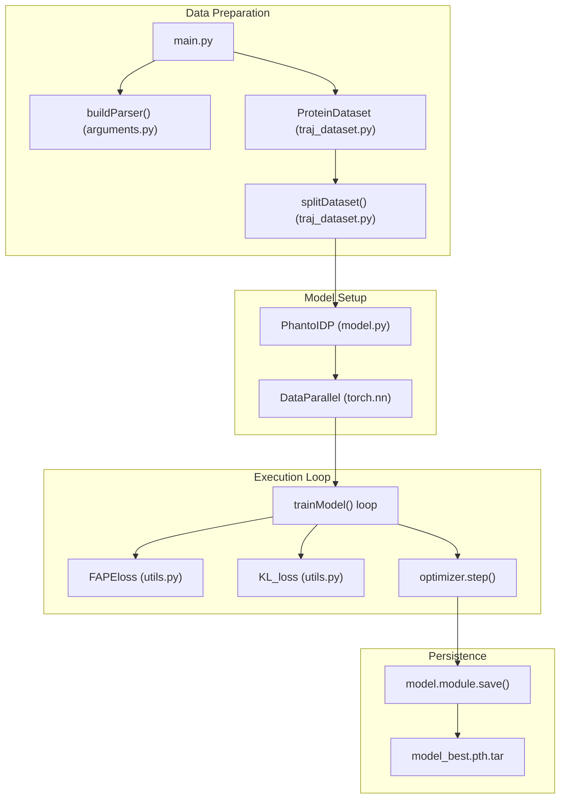
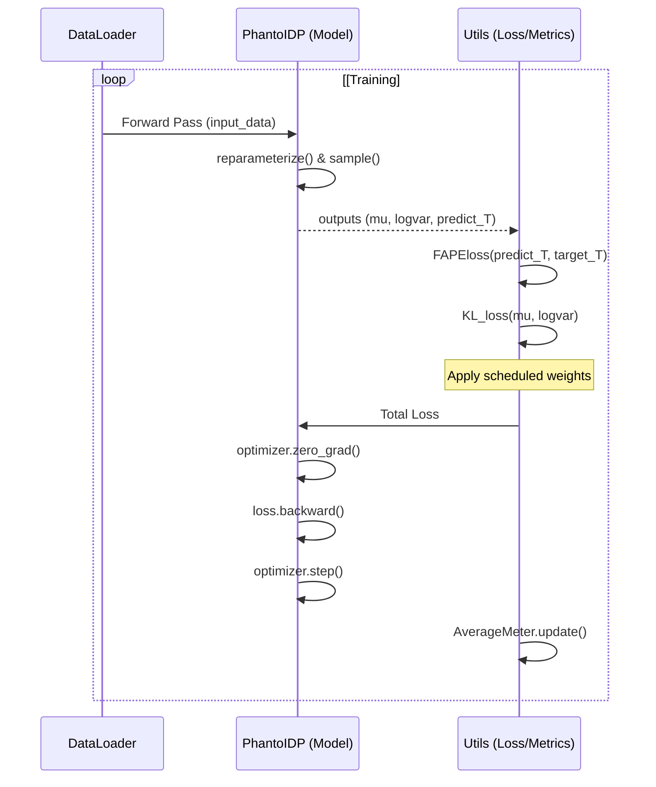

# Training Pipeline (main.py)

> **Relevant source files**
> * [arguments.py](https://github.com/Junjie-Zhu/Phanto-IDP/blob/8f82e775/arguments.py)
> * [config.py](https://github.com/Junjie-Zhu/Phanto-IDP/blob/8f82e775/config.py)
> * [main.py](https://github.com/Junjie-Zhu/Phanto-IDP/blob/8f82e775/main.py)
> * [utils.py](https://github.com/Junjie-Zhu/Phanto-IDP/blob/8f82e775/utils.py)

The `main.py` script serves as the primary entry point for the Phanto-IDP training and evaluation lifecycle. It orchestrates dataset management, model instantiation, multi-GPU distribution, and the execution of the training loop featuring scheduled loss weighting.

### Execution Workflow

The pipeline follows a structured sequence from argument parsing to final test-set evaluation.

#### 1. Argument Parsing and Environment Setup

The system utilizes `configargparse` via `arguments.py` to handle configuration from both command-line arguments and `settings.conf` files [arguments.py L4-L6](https://github.com/Junjie-Zhu/Phanto-IDP/blob/8f82e775/arguments.py#L4-L6)

 It initializes the global `savepath` [main.py L29-L31](https://github.com/Junjie-Zhu/Phanto-IDP/blob/8f82e775/main.py#L29-L31)

 and sets the random seed across Python and PyTorch to ensure reproducibility [main.py L33](https://github.com/Junjie-Zhu/Phanto-IDP/blob/8f82e775/main.py#L33-L33)

 [utils.py L171-L178](https://github.com/Junjie-Zhu/Phanto-IDP/blob/8f82e775/utils.py#L171-L178)

#### 2. Dataset Splitting

Phanto-IDP splits the data at the directory level (each directory typically representing a trajectory or protein variant).

* **Discovery**: It lists all subdirectories in the `protein_dir` [main.py L37](https://github.com/Junjie-Zhu/Phanto-IDP/blob/8f82e775/main.py#L37-L37)
* **Shuffling**: Indices are randomly shuffled based on the provided seed [main.py L39-L40](https://github.com/Junjie-Zhu/Phanto-IDP/blob/8f82e775/main.py#L39-L40)
* **Partitioning**: The dataset is split into `train`, `val`, and `test` sets based on user-defined ratios (e.g., 0.5, 0.25, 0.25) [main.py L42-L54](https://github.com/Junjie-Zhu/Phanto-IDP/blob/8f82e775/main.py#L42-L54)

#### 3. Model Initialization and Checkpoint Loading

The model is initialized as a `PhantoIDP` instance [main.py L95](https://github.com/Junjie-Zhu/Phanto-IDP/blob/8f82e775/main.py#L95-L95)

 If a `--pretrained` path is provided, the script:

1. Loads the model hyperparameters (`h_a`, `h_g`, `n_conv`, `lr`) from the checkpoint to ensure architectural consistency [main.py L62-L73](https://github.com/Junjie-Zhu/Phanto-IDP/blob/8f82e775/main.py#L62-L73)
2. Loads the `state_dict` for both the model and the optimizer [main.py L124-L125](https://github.com/Junjie-Zhu/Phanto-IDP/blob/8f82e775/main.py#L124-L125)

#### 4. Multi-GPU Setup

The model is wrapped in `torch.nn.DataParallel` to enable distributed training across all available CUDA devices [main.py L98-L99](https://github.com/Junjie-Zhu/Phanto-IDP/blob/8f82e775/main.py#L98-L99)

 Device selection is handled globally via `config.py` [config.py L3-L5](https://github.com/Junjie-Zhu/Phanto-IDP/blob/8f82e775/config.py#L3-L5)

### Training Pipeline Logic

The following diagram illustrates the data flow and entity relationships during the training process.

**Training System Architecture**

**Sources:** [main.py L17-L163](https://github.com/Junjie-Zhu/Phanto-IDP/blob/8f82e775/main.py#L17-L163)

 [arguments.py L4-L49](https://github.com/Junjie-Zhu/Phanto-IDP/blob/8f82e775/arguments.py#L4-L49)

 [utils.py L88-L134](https://github.com/Junjie-Zhu/Phanto-IDP/blob/8f82e775/utils.py#L88-L134)

### Loss Weight Scheduling

A critical component of the `trainModel` function is the dynamic scheduling of loss weights. Phanto-IDP balances the **Frame Aligned Point Error (FAPE)** and **Kullback–Leibler (KL) Divergence** to stabilize the VAE latent space while ensuring structural accuracy.

| Epoch Range | FAPE Weight ($w_{fape}$) | KL Weight ($w_{kl}$) |
| --- | --- | --- |
| 0 - 59 | 10.0 (if epoch < 400) | 1e-4 |
| 60 - 119 | 10.0 | 5e-4 |
| 120 - 179 | 10.0 | 1e-3 |
| 180 - 239 | 10.0 | 2.5e-3 |
| 240 - 299 | 10.0 | 7.5e-3 |
| 300 - 359 | 10.0 | 1e-2 |
| 360 - 399 | 10.0 | 1.5e-2 |
| 400 - 799 | 2.0 | 1.5e-2 |
| 800+ | 1.0 | 1.5e-2 |

The logic for this scheduling is implemented within the `trainModel` function [main.py L173-L178](https://github.com/Junjie-Zhu/Phanto-IDP/blob/8f82e775/main.py#L173-L178)

**Sources:** [main.py L173-L178](https://github.com/Junjie-Zhu/Phanto-IDP/blob/8f82e775/main.py#L173-L178)

 [utils.py L132-L134](https://github.com/Junjie-Zhu/Phanto-IDP/blob/8f82e775/utils.py#L132-L134)

### The trainModel Loop

The `trainModel` function handles training, validation, and testing modes [main.py L164](https://github.com/Junjie-Zhu/Phanto-IDP/blob/8f82e775/main.py#L164-L164)

**Data Flow in trainModel**

**Key Internal Components:**

* **`AverageMeter`**: Tracks running losses and batch times [utils.py L55-L86](https://github.com/Junjie-Zhu/Phanto-IDP/blob/8f82e775/utils.py#L55-L86)
* **`FAPEloss`**: Computes the error between predicted and target rigid frames [utils.py L88-L130](https://github.com/Junjie-Zhu/Phanto-IDP/blob/8f82e775/utils.py#L88-L130)
* **`KL_loss`**: Computes the divergence for the VAE latent bottleneck [utils.py L132-L134](https://github.com/Junjie-Zhu/Phanto-IDP/blob/8f82e775/utils.py#L132-L134)
* **Checkpointing**: If `is_best` is true (based on validation loss), the model state, optimizer state, and arguments are serialized to `model_best.pth.tar` [main.py L139-L149](https://github.com/Junjie-Zhu/Phanto-IDP/blob/8f82e775/main.py#L139-L149)

**Sources:** [main.py L164-L210](https://github.com/Junjie-Zhu/Phanto-IDP/blob/8f82e775/main.py#L164-L210)

 [utils.py L55-L134](https://github.com/Junjie-Zhu/Phanto-IDP/blob/8f82e775/utils.py#L55-L134)

 [config.py L3-L5](https://github.com/Junjie-Zhu/Phanto-IDP/blob/8f82e775/config.py#L3-L5)