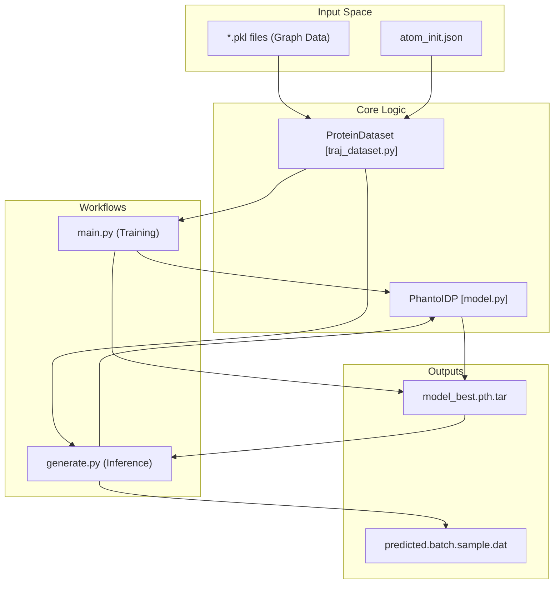
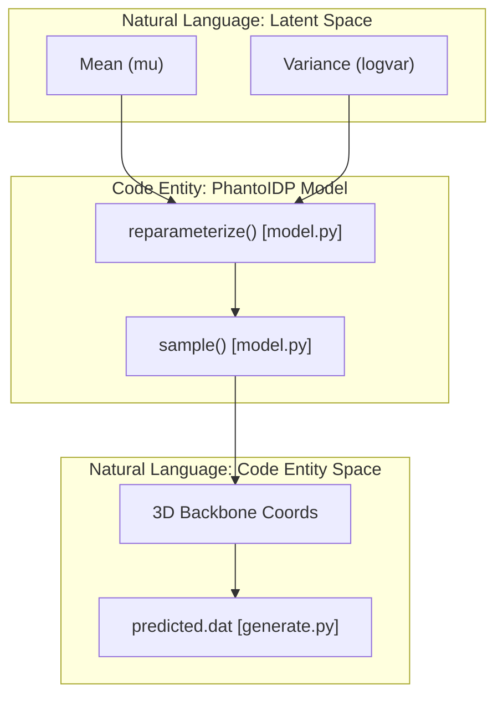

# Training and Generation

> **Relevant source files**
> * [arguments.py](https://github.com/Junjie-Zhu/Phanto-IDP/blob/8f82e775/arguments.py)
> * [generate.py](https://github.com/Junjie-Zhu/Phanto-IDP/blob/8f82e775/generate.py)
> * [main.py](https://github.com/Junjie-Zhu/Phanto-IDP/blob/8f82e775/main.py)

This section provides a high-level overview of the Phanto-IDP lifecycle, encompassing the model training process and the subsequent generation of novel protein conformations. The system utilizes a Variational Autoencoder (VAE) framework where training focuses on reconstructing backbone coordinates from atomic graphs, while generation leverages the learned latent space to sample diverse structural ensembles.

## System Workflow Overview

The transition from training to inference involves shared components for data handling and model initialization. Both workflows rely on the `PhantoIDP` model architecture and the `ProteinDataset` to manage graph-structured input features.

### Training vs. Generation Flow

The following diagram illustrates how `main.py` and `generate.py` utilize the core library components to achieve their respective goals.

"Training and Inference Architecture"

**Sources:**

* `traj_dataset.py:56-58` (ProteinDataset initialization)
* `main.py:95-99` (Model setup and DataParallel)
* `generate.py:146-151` (Generation and file output)

---

## Training Pipeline

The training workflow is managed by `main.py`, which orchestrates the optimization of the `PhantoIDP` model. It handles the dataset lifecycle, including splitting the raw protein directories into training, validation, and test sets based on user-defined ratios [main.py L41-L54](https://github.com/Junjie-Zhu/Phanto-IDP/blob/8f82e775/main.py#L41-L54)

Key characteristics of the training pipeline include:

* **Argument Parsing:** Configuration is handled via `arguments.py`, supporting both command-line flags and `settings.conf` files [arguments.py L5-L49](https://github.com/Junjie-Zhu/Phanto-IDP/blob/8f82e775/arguments.py#L5-L49)
* **Loss Scheduling:** The `trainModel` function implements a dynamic weighting schedule for FAPE (Frame Aligned Point Error) and KL divergence losses to balance reconstruction accuracy with latent space regularity [main.py L173-L179](https://github.com/Junjie-Zhu/Phanto-IDP/blob/8f82e775/main.py#L173-L179)
* **Multi-GPU Support:** The model is wrapped in `torch.nn.DataParallel` to distribute batches across available CUDA devices [main.py L94-L98](https://github.com/Junjie-Zhu/Phanto-IDP/blob/8f82e775/main.py#L94-L98)

For a deep dive into the optimization loop, loss functions, and checkpointing logic, see **[Training Pipeline (main.py)](/Junjie-Zhu/Phanto-IDP/4.1-training-pipeline-(main.py))**.

**Sources:**

* `main.py:133-149` (Main training loop and checkpoint saving)
* `main.py:173-179` (Loss weighting schedule)
* `arguments.py:23-26` (Data split arguments)

---

## Conformation Generation

Once a model is trained, `generate.py` is used to sample new intrinsically disordered protein (IDP) conformations. This process bypasses the encoder's reconstruction and focuses on the decoder's ability to map latent vectors to 3D space.

The generation workflow involves:

* **Latent Sampling:** Using the `reparameterize` and `sample` methods of the `PhantoIDP` class to generate structures from the learned distribution [generate.py L146-L149](https://github.com/Junjie-Zhu/Phanto-IDP/blob/8f82e775/generate.py#L146-L149)
* **Diversity Control:** Users can influence the variety of generated structures using the `-var` (variance) and `temp` (temperature) parameters [arguments.py L31-L32](https://github.com/Junjie-Zhu/Phanto-IDP/blob/8f82e775/arguments.py#L31-L32)
* **Batch Output:** The system produces `.dat` files containing coordinate matrices for the predicted backbone atoms [generate.py L150-L151](https://github.com/Junjie-Zhu/Phanto-IDP/blob/8f82e775/generate.py#L150-L151)

For detailed instructions on loading checkpoints and controlling sampling parameters, see **[Conformation Generation (generate.py)](/Junjie-Zhu/Phanto-IDP/4.2-conformation-generation-(generate.py))**.

### Data Entity Mapping: Latent to Coordinate Space

This diagram shows how internal model methods map the abstract "Latent Space" to the physical "Coordinate Space" during the generation phase.

"Code Entity Mapping: Generation Pipeline"

**Sources:**

* `generate.py:144-151` (Inference loop and reparameterization)
* `model.py` (Referencing internal PhantoIDP methods)

**Sources:**

* `generate.py:145-149` (Generation loop logic)
* `arguments.py:30-33` (Generation CLI arguments)