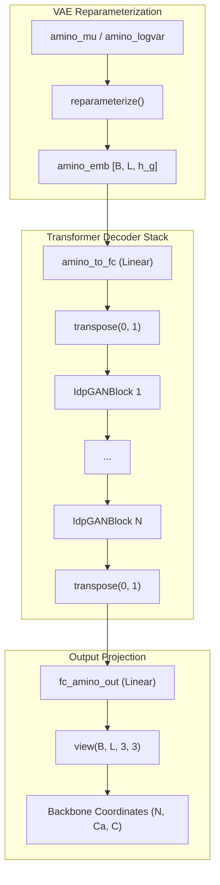
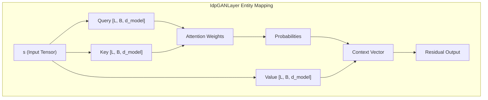

# Transformer Decoder (IdpGANBlock / IdpGANLayer)

> **Relevant source files**
> * [layers.py](https://github.com/Junjie-Zhu/Phanto-IDP/blob/8f82e775/layers.py)
> * [model.py](https://github.com/Junjie-Zhu/Phanto-IDP/blob/8f82e775/model.py)

The Transformer Decoder in Phanto-IDP is responsible for mapping residue-level latent embeddings—generated by the Graph Convolutional Encoder and VAE reparameterization—into 3D backbone coordinates. It employs a specialized Transformer architecture consisting of multiple blocks that process sequential information across the protein backbone to ensure structural coherence in the generated intrinsically disordered protein (IDP) ensembles.

## Architectural Overview

The decoder is implemented as a sequence of `IdpGANBlock` modules [model.py L60-L70](https://github.com/Junjie-Zhu/Phanto-IDP/blob/8f82e775/model.py#L60-L70)

 These blocks process the latent residue embeddings `amino_emb` after they have been projected from the VAE latent space [model.py L92-L95](https://github.com/Junjie-Zhu/Phanto-IDP/blob/8f82e775/model.py#L92-L95)

### Data Flow: Latent Space to 3D Coordinates

The following diagram illustrates how the latent representation is transformed into spatial coordinates through the Transformer layers.

**Transformer Decoder Data Flow**

**Sources:** [model.py L88-L102](https://github.com/Junjie-Zhu/Phanto-IDP/blob/8f82e775/model.py#L88-L102)

 [model.py L58-L60](https://github.com/Junjie-Zhu/Phanto-IDP/blob/8f82e775/model.py#L58-L60)

## IdpGANBlock Implementation

The `IdpGANBlock` [layers.py L40-L144](https://github.com/Junjie-Zhu/Phanto-IDP/blob/8f82e775/layers.py#L40-L144)

 serves as the primary container for the decoder's attention and update logic. It implements a standard Transformer block structure with configurable normalization positions ("pre" or "post") and residual connections.

### Key Components

* **Attention Mechanism**: Encapsulated in the `IdpGANLayer` class [layers.py L65-L70](https://github.com/Junjie-Zhu/Phanto-IDP/blob/8f82e775/layers.py#L65-L70)
* **Updater Module**: A feedforward neural network (FFN) consisting of two linear layers with an activation function (defaulting to ReLU) and dropout [layers.py L79-L99](https://github.com/Junjie-Zhu/Phanto-IDP/blob/8f82e775/layers.py#L79-L99)
* **Normalization**: Uses `nn.LayerNorm` [layers.py L83-L85](https://github.com/Junjie-Zhu/Phanto-IDP/blob/8f82e775/layers.py#L83-L85)  The model supports both Pre-LN and Post-LN configurations [layers.py L117-L126](https://github.com/Junjie-Zhu/Phanto-IDP/blob/8f82e775/layers.py#L117-L126)

**Sources:** [layers.py L40-L51](https://github.com/Junjie-Zhu/Phanto-IDP/blob/8f82e775/layers.py#L40-L51)

 [layers.py L79-L85](https://github.com/Junjie-Zhu/Phanto-IDP/blob/8f82e775/layers.py#L79-L85)

## IdpGANLayer (Multi-Head Attention)

The `IdpGANLayer` [layers.py L146-L218](https://github.com/Junjie-Zhu/Phanto-IDP/blob/8f82e775/layers.py#L146-L218)

 implements the multi-head self-attention mechanism. It projects input embeddings into Query ($Q$), Key ($K$), and Value ($V$) tensors to calculate attention scores.

### Implementation Details

* **Linear Projections**: Three separate linear layers (without bias) map the input dimension to the model dimension `d_model` [layers.py L168-L170](https://github.com/Junjie-Zhu/Phanto-IDP/blob/8f82e775/layers.py#L168-L170)
* **Attention Calculation**: Uses scaled dot-product attention. The scaling factor is derived from either the full `d_model` or the individual `head_dim` [layers.py L195-L197](https://github.com/Junjie-Zhu/Phanto-IDP/blob/8f82e775/layers.py#L195-L197)
* **2D Bias Support**: The layer includes an `mlp_2d` branch designed to incorporate 2D spatial information (e.g., contact maps) as a bias to the attention matrix, although this is optional [layers.py L177-L181](https://github.com/Junjie-Zhu/Phanto-IDP/blob/8f82e775/layers.py#L177-L181)  [layers.py L201-L203](https://github.com/Junjie-Zhu/Phanto-IDP/blob/8f82e775/layers.py#L201-L203)

**Entity Mapping: Code to Logic**

**Sources:** [layers.py L168-L174](https://github.com/Junjie-Zhu/Phanto-IDP/blob/8f82e775/layers.py#L168-L174)

 [layers.py L190-L213](https://github.com/Junjie-Zhu/Phanto-IDP/blob/8f82e775/layers.py#L190-L213)

## Coordinate Mapping and Output

After passing through the `n_conv` transformer blocks, the decoder maps the final hidden states back to physical space:

1. **Linear Projection**: The `fc_amino_out` layer [model.py L59](https://github.com/Junjie-Zhu/Phanto-IDP/blob/8f82e775/model.py#L59-L59)  projects the 32-dimensional transformer output to a 9-dimensional vector.
2. **Reshaping**: The 9-dimensional vector is reshaped into a `(3, 3)` tensor per residue [model.py L102](https://github.com/Junjie-Zhu/Phanto-IDP/blob/8f82e775/model.py#L102-L102)
3. **Coordinate Interpretation**: These 9 values represent the $(x, y, z)$ coordinates for the three backbone atoms: $N$, $C\alpha$, and $C$ [model.py L102](https://github.com/Junjie-Zhu/Phanto-IDP/blob/8f82e775/model.py#L102-L102)

During inference (`sample` method), the same transformation path is followed, starting directly from sampled latent embeddings [model.py L104-L117](https://github.com/Junjie-Zhu/Phanto-IDP/blob/8f82e775/model.py#L104-L117)

| Parameter | Default Value | Description |
| --- | --- | --- |
| `embed_dim` | 32 | Dimension of the residue embedding |
| `d_model` | 128 | Internal dimension for attention |
| `nhead` | 8 | Number of attention heads |
| `dim_feedforward` | 128 | Hidden dimension of the FFN |
| `n_conv` | 4 | Number of Transformer blocks |

**Sources:** [model.py L59-L70](https://github.com/Junjie-Zhu/Phanto-IDP/blob/8f82e775/model.py#L59-L70)

 [model.py L100-L102](https://github.com/Junjie-Zhu/Phanto-IDP/blob/8f82e775/model.py#L100-L102)

 [layers.py L42-L51](https://github.com/Junjie-Zhu/Phanto-IDP/blob/8f82e775/layers.py#L42-L51)