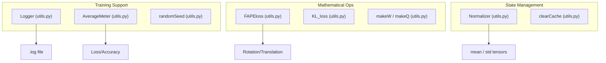
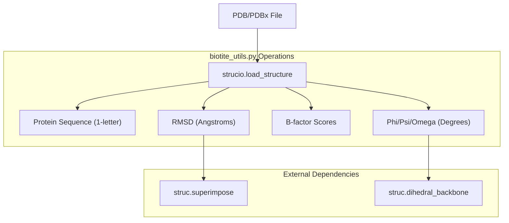

# Utilities and Supporting Modules

> **Relevant source files**
> * [Scripts/biotite_utils.py](https://github.com/Junjie-Zhu/Phanto-IDP/blob/8f82e775/Scripts/biotite_utils.py)
> * [config.py](https://github.com/Junjie-Zhu/Phanto-IDP/blob/8f82e775/config.py)
> * [utils.py](https://github.com/Junjie-Zhu/Phanto-IDP/blob/8f82e775/utils.py)

This section provides technical documentation for the cross-cutting utility modules and supporting scripts in the Phanto-IDP codebase. These modules handle global configurations, specialized loss functions, structural bioinformatics operations, and training telemetry.

## Global Configuration

The `config.py` module manages the hardware abstraction layer for the project, ensuring that tensors are allocated to the correct device (CPU or GPU) and use the appropriate data types.

| Entity | Description |
| --- | --- |
| `device` | A `torch.device` object initialized to `'cuda'` if available, otherwise `'cpu'` [config.py L3](https://github.com/Junjie-Zhu/Phanto-IDP/blob/8f82e775/config.py#L3-L3) |
| `FloatTensor` | Default floating-point tensor type based on CUDA availability [config.py L4](https://github.com/Junjie-Zhu/Phanto-IDP/blob/8f82e775/config.py#L4-L4) |
| `LongTensor` | Default integer tensor type based on CUDA availability [config.py L5](https://github.com/Junjie-Zhu/Phanto-IDP/blob/8f82e775/config.py#L5-L5) |

**Sources:** [config.py L1-L5](https://github.com/Junjie-Zhu/Phanto-IDP/blob/8f82e775/config.py#L1-L5)

---

## Core Utilities (utils.py)

The `utils.py` module contains classes and functions for training monitoring, data normalization, and specialized structural loss calculations.

### Training Infrastructure

* **`Logger`**: A dual-stream writer that simultaneously outputs logs to the terminal (`sys.stdout`) and a local `logfile.log` [utils.py L10-L25](https://github.com/Junjie-Zhu/Phanto-IDP/blob/8f82e775/utils.py#L10-L25)
* **`Normalizer`**: Handles Z-score normalization and denormalization of tensors. It stores `mean` and `std` in a `state_dict` for persistence [utils.py L28-L54](https://github.com/Junjie-Zhu/Phanto-IDP/blob/8f82e775/utils.py#L28-L54)
* **`AverageMeter`**: Tracks metrics (sum, count, average) during training. It supports both scalar values and multi-dimensional tensors [utils.py L55-L86](https://github.com/Junjie-Zhu/Phanto-IDP/blob/8f82e775/utils.py#L55-L86)
* **`randomSeed`**: Sets the manual seed for both `torch` and `torch.cuda` to ensure reproducibility [utils.py L171-L178](https://github.com/Junjie-Zhu/Phanto-IDP/blob/8f82e775/utils.py#L171-L178)
* **`clearCache`**: A wrapper for `torch.cuda.empty_cache()` to manage GPU memory [utils.py L192-L193](https://github.com/Junjie-Zhu/Phanto-IDP/blob/8f82e775/utils.py#L192-L193)

### Loss Functions and Math

* **`FAPEloss`**: Implements the Frame Aligned Point Error. It calculates the distance between predicted and target coordinates after transforming them into local reference frames using rotation matrices and translation vectors [utils.py L88-L130](https://github.com/Junjie-Zhu/Phanto-IDP/blob/8f82e775/utils.py#L88-L130)
* **`KL_loss`**: Computes the Kullback-Leibler divergence for the VAE latent space, weighted by a scheduling factor [utils.py L132-L134](https://github.com/Junjie-Zhu/Phanto-IDP/blob/8f82e775/utils.py#L132-L134)
* **`makeW` / `makeQ`**: Helper functions that construct $4 \times 4$ matrices used in quaternion-based rotation calculations [utils.py L137-L164](https://github.com/Junjie-Zhu/Phanto-IDP/blob/8f82e775/utils.py#L137-L164)

### Utility Entity Mapping

The following diagram bridges the logical utility concepts to their implementation entities in `utils.py`.

**Utility Module Architecture**

**Sources:** [utils.py L10-L193](https://github.com/Junjie-Zhu/Phanto-IDP/blob/8f82e775/utils.py#L10-L193)

---

## Structural Bioinformatics (biotite_utils.py)

The `Scripts/biotite_utils.py` module serves as a wrapper around the `biotite` library to perform protein-specific operations such as sequence extraction, dihedral angle calculation, and structural alignment.

### Sequence and Atom Extraction

* **`extract_seq`**: Loads a structure from a file or `AtomArray` and extracts the 1-letter amino acid sequence for specified chains [Scripts/biotite_utils.py L52-L81](https://github.com/Junjie-Zhu/Phanto-IDP/blob/8f82e775/Scripts/biotite_utils.py#L52-L81)
* **`extract_plddt`**: Extracts pLDDT scores (stored in the B-factor column) specifically for $C\alpha$ atoms [Scripts/biotite_utils.py L99-L138](https://github.com/Junjie-Zhu/Phanto-IDP/blob/8f82e775/Scripts/biotite_utils.py#L99-L138)
* **`alphabet` / `alphabet_map`**: Dictionaries for converting between 3-letter and 1-letter amino acid codes [Scripts/biotite_utils.py L44-L50](https://github.com/Junjie-Zhu/Phanto-IDP/blob/8f82e775/Scripts/biotite_utils.py#L44-L50)

### Structural Metrics

* **`extract_dihedral`**: Calculates $\phi$ (phi), $\psi$ (psi), and $\omega$ (omega) backbone dihedral angles, converting them from radians to degrees and filtering out invalid (NaN) terminal values [Scripts/biotite_utils.py L83-L97](https://github.com/Junjie-Zhu/Phanto-IDP/blob/8f82e775/Scripts/biotite_utils.py#L83-L97)
* **`rmsd`**: Performs structural superimposition of a target structure onto a reference structure using backbone atoms (N, $C\alpha$, C, O) and returns the Root Mean Square Deviation [Scripts/biotite_utils.py L145-L156](https://github.com/Junjie-Zhu/Phanto-IDP/blob/8f82e775/Scripts/biotite_utils.py#L145-L156)
* **`secondary_structure`**: A wrapper for `biotite.structure.annotate_sse` to determine residue-level secondary structure elements [Scripts/biotite_utils.py L140-L143](https://github.com/Junjie-Zhu/Phanto-IDP/blob/8f82e775/Scripts/biotite_utils.py#L140-L143)

### Bioinformatics Data Flow

This diagram illustrates how biological data is processed through `biotite_utils.py`.

**Structural Data Processing Flow**

**Sources:** [Scripts/biotite_utils.py L1-L166](https://github.com/Junjie-Zhu/Phanto-IDP/blob/8f82e775/Scripts/biotite_utils.py#L1-L166)

---

## Summary Table of Key Functions

| Module | Function/Class | Primary Role |
| --- | --- | --- |
| `utils.py` | `FAPEloss` | Calculates frame-aligned coordinate error [utils.py L88](https://github.com/Junjie-Zhu/Phanto-IDP/blob/8f82e775/utils.py#L88-L88) |
| `utils.py` | `AverageMeter` | Computes running averages for training metrics [utils.py L55](https://github.com/Junjie-Zhu/Phanto-IDP/blob/8f82e775/utils.py#L55-L55) |
| `utils.py` | `Normalizer` | Standardizes input feature tensors [utils.py L28](https://github.com/Junjie-Zhu/Phanto-IDP/blob/8f82e775/utils.py#L28-L28) |
| `biotite_utils.py` | `extract_dihedral` | Extracts backbone torsion angles in degrees [Scripts/biotite_utils.py L83](https://github.com/Junjie-Zhu/Phanto-IDP/blob/8f82e775/Scripts/biotite_utils.py#L83-L83) |
| `biotite_utils.py` | `rmsd` | Aligns structures and calculates RMSD [Scripts/biotite_utils.py L145](https://github.com/Junjie-Zhu/Phanto-IDP/blob/8f82e775/Scripts/biotite_utils.py#L145-L145) |
| `config.py` | `device` | Defines global execution hardware (CPU/GPU) [config.py L3](https://github.com/Junjie-Zhu/Phanto-IDP/blob/8f82e775/config.py#L3-L3) |

**Sources:** [utils.py L1-L193](https://github.com/Junjie-Zhu/Phanto-IDP/blob/8f82e775/utils.py#L1-L193)

 [Scripts/biotite_utils.py L1-L166](https://github.com/Junjie-Zhu/Phanto-IDP/blob/8f82e775/Scripts/biotite_utils.py#L1-L166)

 [config.py L1-L5](https://github.com/Junjie-Zhu/Phanto-IDP/blob/8f82e775/config.py#L1-L5)