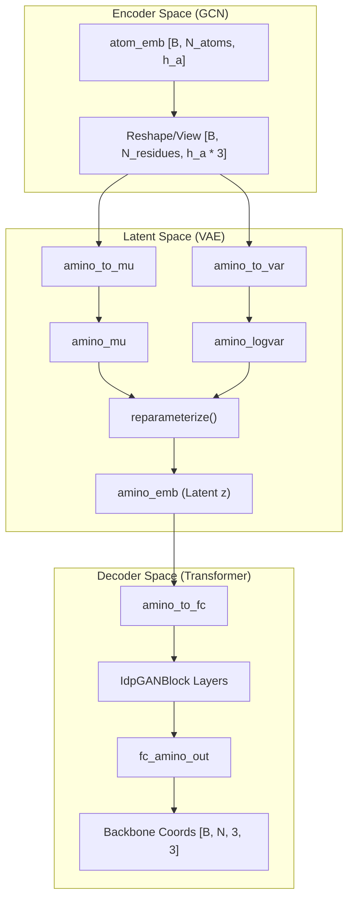
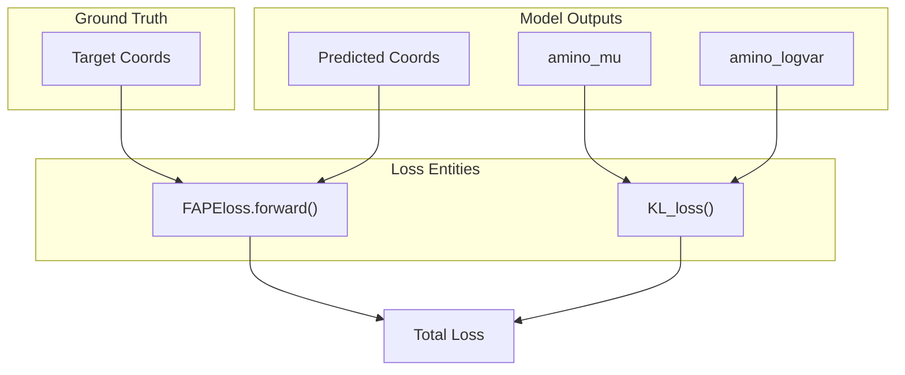

# VAE Latent Space and Loss Functions

> **Relevant source files**
> * [model.py](https://github.com/Junjie-Zhu/Phanto-IDP/blob/8f82e775/model.py)
> * [utils.py](https://github.com/Junjie-Zhu/Phanto-IDP/blob/8f82e775/utils.py)

This page details the implementation of the Variational Autoencoder (VAE) latent space within PhantoIDP, the specific loss functions used to optimize structural generation, and the geometric utilities for frame construction and RMSD calculation.

## VAE Reparameterization and Sampling

PhantoIDP utilizes a VAE architecture to map atomic graphs into a continuous latent space. The transition from the Graph Convolutional Encoder to the Transformer Decoder occurs at the residue level through a learned latent distribution.

### Reparameterization Trick

To allow backpropagation through the stochastic sampling process, the model implements the reparameterization trick. The encoder outputs two vectors for each residue: $\mu$ (mean) and $\log(\sigma^2)$ (log-variance).

* **`amino_to_mu`**: A linear layer mapping pooled atom embeddings to the mean of the latent distribution [model.py L55](https://github.com/Junjie-Zhu/Phanto-IDP/blob/8f82e775/model.py#L55-L55)
* **`amino_to_var`**: A linear layer mapping pooled atom embeddings to the log-variance [model.py L56](https://github.com/Junjie-Zhu/Phanto-IDP/blob/8f82e775/model.py#L56-L56)
* **`reparameterize`**: A static method that computes $z = \mu + \epsilon \cdot \sigma \cdot \text{temp}$, where $\epsilon \sim \mathcal{N}(0, 1)$ [model.py L119-L123](https://github.com/Junjie-Zhu/Phanto-IDP/blob/8f82e775/model.py#L119-L123)

### Sampling Workflow

During inference, the `sample` method bypasses the encoder and directly feeds latent vectors into the Transformer blocks to generate backbone coordinates [model.py L104-L117](https://github.com/Junjie-Zhu/Phanto-IDP/blob/8f82e775/model.py#L104-L117)

### Data Flow: Encoder to Latent Space

The following diagram illustrates how atomic embeddings are compressed into the residue-level latent space.

**Latent Space Construction Diagram**

**Sources:** [model.py L55-L70](https://github.com/Junjie-Zhu/Phanto-IDP/blob/8f82e775/model.py#L55-L70)

 [model.py L85-L102](https://github.com/Junjie-Zhu/Phanto-IDP/blob/8f82e775/model.py#L85-L102)

 [model.py L119-L123](https://github.com/Junjie-Zhu/Phanto-IDP/blob/8f82e775/model.py#L119-L123)

---

## Loss Functions

PhantoIDP uses a composite loss function consisting of Frame Aligned Point Error (FAPE) and Kullback-Leibler (KL) divergence.

### FAPE Loss (FAPEloss class)

The `FAPEloss` measures the structural difference between predicted and target backbone coordinates by aligning them to local rigid frames. This ensures the loss is invariant to global rotation and translation [utils.py L88-L130](https://github.com/Junjie-Zhu/Phanto-IDP/blob/8f82e775/utils.py#L88-L130)

* **Rigid Frame Construction**: The `from_3_points` method implements the Gram-Schmidt algorithm to construct local coordinate systems (frames) from the N, CA, and C atoms of each residue [model.py L131-L171](https://github.com/Junjie-Zhu/Phanto-IDP/blob/8f82e775/model.py#L131-L171)
* **Point Projection**: Predicted coordinates are projected into these local frames using `torch.einsum` to compute relative positions [utils.py L116-L117](https://github.com/Junjie-Zhu/Phanto-IDP/blob/8f82e775/utils.py#L116-L117)
* **Clamping**: The error is clamped at a maximum value (default 10.0) to prevent outlier gradients from destabilizing training [utils.py L120](https://github.com/Junjie-Zhu/Phanto-IDP/blob/8f82e775/utils.py#L120-L120)

### KL Divergence Loss (KL_loss)

The `KL_loss` function penalizes the latent distribution for deviating from a standard normal distribution $\mathcal{N}(0, 1)$. This regularizes the latent space, ensuring it is continuous and suitable for sampling [utils.py L132-L134](https://github.com/Junjie-Zhu/Phanto-IDP/blob/8f82e775/utils.py#L132-L134)

### Loss Weighting Schedule

In the training loop (`trainModel`), the total loss is calculated as:
$$\text{Total Loss} = \text{FAPE} + (\lambda \cdot \text{KL})$$
The weight $\lambda$ is typically scaled during training to balance reconstruction accuracy with latent space regularity.

**Loss Computation Flow**

**Sources:** [utils.py L88-L134](https://github.com/Junjie-Zhu/Phanto-IDP/blob/8f82e775/utils.py#L88-L134)

 [model.py L131-L171](https://github.com/Junjie-Zhu/Phanto-IDP/blob/8f82e775/model.py#L131-L171)

---

## Geometric Utilities and RMSD

PhantoIDP includes specialized utilities for handling 3D rotations and evaluating structural similarity.

### Quaternion Helpers

The model uses quaternions for internal rotation representations. Two helper functions facilitate the construction of matrices for quaternion multiplication:

* **`makeW`**: Constructs the $W$ matrix involved in quaternion rotation [utils.py L137-L149](https://github.com/Junjie-Zhu/Phanto-IDP/blob/8f82e775/utils.py#L137-L149)
* **`makeQ`**: Constructs the $Q$ matrix involved in quaternion rotation [utils.py L152-L164](https://github.com/Junjie-Zhu/Phanto-IDP/blob/8f82e775/utils.py#L152-L164)

### RMSD Calculation

The `calc_rmsd` method provides a differentiable way to calculate the Root Mean Square Deviation between structures [model.py L173-L182](https://github.com/Junjie-Zhu/Phanto-IDP/blob/8f82e775/model.py#L173-L182)

| Function | Purpose | Implementation Detail |
| --- | --- | --- |
| `calc_rmsd` | Structural similarity metric | Centers structures by subtracting the mean before calculation. |
| `from_3_points` | Frame generation | Uses `torch.unbind` and `torch.cross` (via manual e2 calculation) for Gram-Schmidt. |
| `KL_loss` | Latent regularization | Normalizes by residue count: `0.5 / outputs[0].size(1)`. |

**Sources:** [utils.py L137-L164](https://github.com/Junjie-Zhu/Phanto-IDP/blob/8f82e775/utils.py#L137-L164)

 [model.py L131-L182](https://github.com/Junjie-Zhu/Phanto-IDP/blob/8f82e775/model.py#L131-L182)