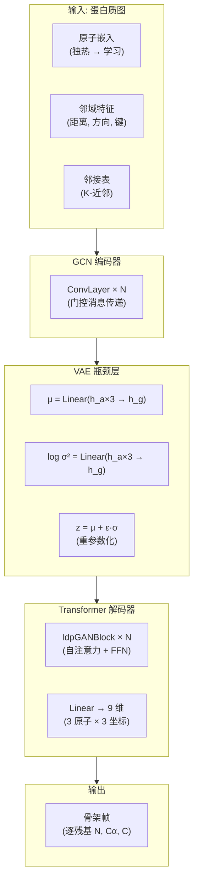
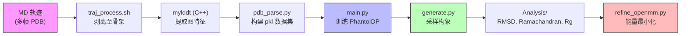

---
slug:1-overview
blog_type:normal
---


**Phanto-IDP** 是一个基于 VAE 的生成式深度学习模型，旨在**精确重建**内在无序蛋白（IDP）的构象系综，并**快速生成**未见过的骨架结构。它结合了用于空间编码的图卷积网络和用于序列解码的 Transformer 解码器模块，在直接监督 3D 结构保真度的 **Frame-Aligned Point Error (FAPE)** 损失函数下进行训练。该模型学习了骨架原子 (N, Cα, C) 坐标的潜空间，从而既能进行确定性重建，也能对多样化且物理上合理的 IDP 构象进行随机采样。


来源: [README.md](/README.md#L1-L5), [model.py](/model.py#L12-L16)

## Phanto-IDP 解决了什么问题？

内在无序蛋白（IDP）不会折叠成单一稳定结构——相反，它们在溶液中呈现出**广泛的构象系综**。传统的分子动力学（MD）模拟可以对这些系综进行采样，但计算成本高昂，通常需要微秒级的模拟时间。Phanto-IDP 通过从 MD 轨迹中学习 IDP 骨架几何结构的分布来解决这一问题，其生成新构象的速度比运行额外模拟**快数个数量级**，同时保持了由 RMSD 和 Ramachandran 分布与参考数据的一致性所衡量的结构准确性。

来源: [README.md](/README.md#L1-L5)

## 架构概览

该模型遵循 **GCN 编码器 → VAE 瓶颈层 → Transformer 解码器** 流程。蛋白质结构首先被表示为原子级图，其邻域特征由 C++ 预处理工具 (mylddt) 提取。GCN 编码器将这些图转换为逐残基嵌入，随后投影到变分潜空间中。Transformer 解码器接着将采样得到的潜向量细化为逐残基的 3×3 旋转帧预测，对应于 (N, Cα, C) 骨架原子坐标。



来源: [model.py](/model.py#L31-L99), [layers.py](/layers.py#L8-L46), [layers.py](/layers.py#L49-L130)

## 核心组件

下表总结了各主要子系统及其在 Phanto-IDP 中的作用：

| 组件 | 核心文件 | 作用 | 关键参数 |
|---|---|---|---|
| **GCN ConvLayer** | `layers.py` | 原子-邻域图上的门控消息传递 | `h_a=64`, `h_b` (键维度), `n_conv` 层 |
| **IdpGANBlock** | `layers.py` | 带有自注意力与前馈网络的 Transformer 解码器块 | `d_model=128`, `nhead=8`, `embed_dim=32` |
| **IdpGANLayer** | `layers.py` | 带有缩放点积亲和度的多头注意力 | `head_dim=16`, `dp_attn_norm=d_model` |
| **PhantoIDP 模型** | `model.py` | 完整 VAE：编码器、瓶颈层、解码器、损失计算 | `h_a`, `h_g`, `n_conv` |
| **FAPE 损失** | `utils.py` | 旋转变换距离上的帧对齐点误差 | `Z=10`, `clamp=10` |
| **KL 散度** | `utils.py` | 针对 μ 和 log σ² 的标准 VAE 正则化项 | 调度权重 |
| **ProteinDataset** | `traj_dataset.py` | 加载图 pkl 与 PDB 目标的 PyTorch Dataset | `pkl_dir`, `protein_dir` |
| **C++ 预处理器** | `preprocess/src/` | 从 PDB 提取原子、键、触点及 LDDT | `dmax`, `topn` 邻居 |

来源: [layers.py](/layers.py#L8-L247), [model.py](/model.py#L12-L99), [utils.py](/utils.py#L80-L120), [traj_dataset.py](/traj_dataset.py#L76-L174)

## 项目结构

```
Phanto-IDP/
├── main.py                  # 训练入口
├── generate.py              # 构象生成入口
├── model.py                 # PhantoIDP VAE 模型定义
├── layers.py                # ConvLayer, IdpGANBlock, IdpGANLayer
├── utils.py                 # FAPE 损失, KL 损失, RMSD, 辅助函数
├── arguments.py             # CLI 参数定义
├── config.py                # 设备与张量类型配置
├── pdb_parse.py             # PDB→图 pkl 转换 (Python)
├── traj_dataset.py          # PyTorch Dataset 与 DataLoader
├── get_list.py              # 轨迹文件列表工具
├── traj_process.sh          # Shell: 从 PDB 中剥离非骨架原子
├── ckpt/                    # 预训练模型检查点 (14 种蛋白)
├── preprocess/              # 用于图提取的 C++ mylddt 工具集
│   ├── src/                 #   Atom, Chain, MyLDDT, kdtree 源码
│   ├── Makefile             #   构建指令
│   └── preprocessor.sh      #   自动化脚本
├── Analysis/                # 生成后分析工具
│   ├── rmsd_calculation.py  #   基于 Biotite 叠加的 RMSD 计算
│   ├── rmsd_plot.py         #   KDE 分布绘图
│   ├── ramachandran.py      #   φ/ψ 二面角密度图
│   ├── pca.py               #   距离矩阵 PCA
│   ├── rg.py                #   回转半径统计
│   └── refine_openmm.py     #   OpenMM 能量最小化
├── Scripts/                 # 共享分析工具
│   └── biotite_utils.py     #   序列、二面角、RMSD、pLDDT 提取器
└── StrucRef/                # 用于评估的参考结构
```

来源: [main.py](/main.py#L1-L20), [generate.py](/generate.py#L1-L20), [arguments.py](/arguments.py#L1-L50), [preprocess/src/main.cpp](/preprocess/src/main.cpp#L1-L30)

## 预训练检查点

Phanto-IDP 提供了 **14 个预训练检查点**，涵盖了一系列经过充分研究的 IDP 和无序区域。这些检查点允许无需训练即可直接生成：

| 检查点 | 蛋白质 / 区域 | 类型 |
|---|---|---|
| `RS1_best.pth.tar` | RS1 | 无序区域 |
| `PaaA2_best.pth.tar` | PaaA2 | 无序区域 |
| `synuclein_best.pth.tar` | α-突触核蛋白 | 完整 IDP |
| `Abeta40_best.pth.tar` | Aβ40 | 淀粉样肽 |
| `abeta42_best.pth.tar` | Aβ42 | 淀粉样肽 |
| `ACTR_best.pth.tar` | ACTR | 无序区域 |
| `CspTm_best.pth.tar` | CspTm | 冷激蛋白 |
| `drkN_best.pth.tar` | drkN SH3 | 无序区域 |
| `Histain5_best.pth.tar` | Histatin-5 | 抗菌肽 |
| `p15PAF_best.pth.tar` | p15PAF | 无序区域 |
| `R17_best.pth.tar` | R17 | 无序区域 |
| `SPR17_best.pth.tar` | SPR17 | 无序区域 |
| `ubiquitin_best.pth.tar` | 泛素 | 折叠蛋白 (基准) |
| `AAQAA3.pth.tar` | (AAQAA)₃ | 重复肽 |

来源: [ckpt/](/ckpt/), [README.md](/README.md#L38-L43)

## 端到端工作流

从原始 MD 轨迹到验证结构的完整流程包含以下阶段：



来源: [traj_process.sh](/traj_process.sh#L1-L9), [pdb_parse.py](/pdb_parse.py#L1-L30), [main.py](/main.py#L22-L80), [generate.py](/generate.py#L100-L130)

<CgxTip>训练损失结合了 FAPE（权重由初始 10.0 衰减至 1.0 的调度控制）与 KL 散度（权重由 1e-4 逐步增加至 1.5e-2 的调度控制）。这种课程式的权重策略至关重要：训练早期侧重于结构准确性（高 FAPE 权重），随后逐步提高 KL 权重以正则化潜空间。权重调度在 `trainModel()` 中按epoch进行索引。</CgxTip>

<CgxTip>生成过程使用了**低温度**重参数化（默认 `temp=0.05`）在所学均值附近采样，以生成接近训练分布的结构。提高温度会产生更多样但准确性较低的构象——在高温下的无条件生成仍然是一个开放挑战。</CgxTip>

## 核心技术亮点

- **基于图的输入表示**：每个构象被编码为原子级图，其 K-近邻边包含距离和方向特征，由高性能 C++ 预处理器提取
- **门控 GCN 卷积**：消息传递对邻居消息使用 Sigmoid 门控滤波，使模型能够学习哪些空间触点对每个原子具有信息量
- **旋转帧输出**：模型预测逐残基的 3×3 旋转矩阵（通过 N/Cα/C 坐标的 Gram-Schmidt 正交化），FAPE 损失在该帧下运算——使损失**对全局刚体变换保持不变性**
- **多 GPU 训练**：内置 `DataParallel` 支持，可跨可用 GPU 自动分配批次

来源: [layers.py](/layers.py#L8-L46), [model.py](/model.py#L136-L165), [utils.py](/utils.py#L80-L110), [main.py](/main.py#L86-L95)

## 接下来读什么

如需新手友好的入门指导，请遵循以下文档阅读路径：

1. **[快速开始](2-quick-start)** — 在 10 分钟内使用预训练模型运行 Phanto-IDP
2. **[架构概览](3-architecture-overview)** — 完整模型架构与数据流的深度解析
3. **[VAE 编码器-解码器设计](4-vae-encoder-decoder-design)** — 变分瓶颈层如何连接编码器与解码器
4. **[构象生成](12-conformation-generation)** — 生成并评估新的 IDP 结构
5. **[RMSD 与 Ramachandran 分析](13-rmsd-and-ramachandran-analysis)** — 参照参考数据验证生成的系综