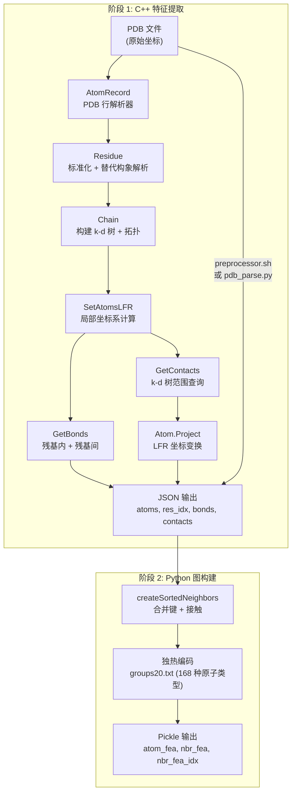

---
slug:10-pdb-preprocessing-pipeline
blog_type:normal
---


PDB 预处理流水线是一个**两阶段特征提取系统**，它将原始 PDB 结构文件转换为 Phanto-IDP 神经网络所需的图兼容 JSON 和 pickle 表示形式。第一阶段是一个高性能 C++ 可执行程序（`get_features`），用于解析 PDB 文件、计算分子拓扑、提取局部坐标系表示并识别空间接触。第二阶段是一个 Python 编排器（`pdb_parse.py`），它在整个轨迹目录中并行化 C++ 特征提取，并将生成的 JSON 特征转换为基于 pickle 的邻居图以供训练。

## 架构概述

该流水线遵循清晰的关注点分离原则：**C++ 负责处理几何密集型计算**（PDB 解析、坐标变换、k-d 树空间查询、LDDT 评分），而 **Python 负责处理编排和图构建**（并行任务分发、邻居排序、独热编码、pickle 序列化）。这种设计确保了计算密集型的逐原子操作（局部坐标系旋转、接触投影、距离计算）能够受益于原生编译，而 I/O 密集型的批处理则利用 Python 的 `joblib` 并行机制。



来源：[main.cpp](/preprocess/src/main.cpp#L1-L228), [pdb_parse.py](/pdb_parse.py#L1-L138)

## C++ 类层级结构

`preprocess/src/` 下的预处理源代码实现了一个四层对象层级结构，该结构映射了 PDB 格式的自然结构：**AtomRecord → Atom → Residue → Chain**。每一层级都增加了相应的行为能力——分别对应解析、坐标变换、标准化和空间查询。

| 类 | 职责 | 关键数据 | 关键方法 |
|-------|---------------|----------|-------------|
| **AtomRecord** | PDB ATOM 行解析 | 所有 80 列 PDB 字段 | `ReadAtomRecord()` |
| **Atom** | 坐标几何 + 局部坐标系 | `(x,y,z)`, `lfr[3][3]`, `chem_type` | `Dist()`, `SetLFR()`, `Project()` |
| **Residue** | 标准化 + 替代构象 | `atoms[]`, `atom{}` 映射, `type`, `name` | `Standardize()`, `Flip()`, `SetAtomMap()` |
| **Chain** | 拓扑 + 空间查询 | `residues[]`, `atoms[]`, k-d 树 | `GetBonds()`, `GetContacts()`, `SetAtomsLFR()` |
| **MyLDDT** | 相对参考结构的质量评分 | 模型/参考子结构 | `GetScore()` (HA/TS 模式) |

来源：[Atom.h](/preprocess/src/Atom.h#L1-L51), [Residue.h](/preprocess/src/Residue.h#L1-L49), [Chain.h](/preprocess/src/Chain.h#L1-L66), [MyLDDT.h](/preprocess/src/MyLDDT.h#L1-L59)

## 阶段 1：C++ 特征提取

### PDB 解析与残基标准化

`Chain` 构造函数逐行读取 PDB 文件，仅筛选 `ATOM` 记录。每一行由 `AtomRecord::ReadAtomRecord()` 进行解析，该方法对固定宽度的 PDB 格式执行**逆向字段提取**——从第 80 列向前读取，以正确处理右对齐的元素符号和电荷字段。原子通过比较 `(resNum, insCode)` 对被动态分组到残基中。

一旦所有原子记录加载完毕，流水线将通过 `Residue::Standardize()` 应用**残基标准化**。这个关键步骤执行三项操作：(1) 通过包含 80 多种修饰残基映射的 `CANONICAL20_MAP` 查找表，映射非标准残基名称（例如，`MSE` → `MET`，`HSE` → `HIS`）；(2) 将原子过滤为仅保留该残基类型的 `CANONICAL20_ATOMS` 拓扑集中的原子，丢弃氢原子和非标准原子；(3) 构建 `atom{}` 名称到指针的映射，并标记任何缺失的重原子。标准化失败的残基（非标准类型或缺失骨架 N/CA/C 原子）将从链中**静默丢弃**。

对于具有**替代构象**的残基（altLoc 指示符），构造函数通过为每个原子名称选择**最高占有率**的构象来解决歧义，从而确保生成单一且一致的结构。

来源：[Chain.cpp](/preprocess/src/Chain.cpp#L30-L80), [AtomRecord.cpp](/preprocess/src/AtomRecord.cpp#L1-L88), [Residue.cpp](/preprocess/src/Residue.cpp#L48-L130)

### 键拓扑提取

`Chain::GetBonds()` 通过两种机制计算分子键图。**残基内键**纯粹由拓扑决定——每个残基的标准键集定义在 `CANONICAL20_BONDS` 中（例如，ALA 具有键 N–CA, CA–C, C–O, CA–CB）。**残基间键**将残基 *i* 的羰基 C 连接到残基 *i+1* 的骨架 N，但前提是它们的欧几里得距离低于 4.5 Å，这巧妙地处理了结构中的链断裂。

来源：[Chain.cpp](/preprocess/src/Chain.cpp#L213-L240), [Topology.h](/preprocess/src/Topology.h#L215-L235)

### 局部坐标系表示 (LFR)

局部坐标系表示是该流水线最具特色的几何贡献。每个原子存储一个 **3×3 规范正交坐标系**（`lfr[3][3]`），它定义了以该原子为原点的局部坐标系。此坐标系用于将原子间的位移向量投影到**旋转不变的局部表示**中，这对于 FAPE 损失函数的坐标系感知结构比较至关重要。

坐标系构建遵循两步策略：

1. **默认 LFR**（`Atom::SetDefaultLFR()`）：每个原子从 `CANONICAL20_LFR` 查找其定义三元组 (A, B, C)。例如，ALA-CB 使用三元组 (CA, N, CB)，这意味着坐标系由 CA→N 和 N→CB 向量构建。三个坐标轴计算如下：**z** = (B−A) − (C−B)（类似角平分线），**x** = (B−A) × (C−B)（叉积），**y** = z × x（构成右手系），随后进行归一化。

2. **骨架校正**（`Chain::SetAtomsLFR()`）：设置默认坐标系后，骨架原子 N、C 和 O 接收包含**残基间上下文**的校正坐标系——N 使用前一个残基的 C 原子，而 C 和 O 使用下一个残基的 N 原子。这确保了肽键处的局部坐标系能够捕获跨越相邻残基的二面角几何结构。

随后，`Atom::Project()` 方法将任何其他原子的位置投影到此局部坐标系中：`out[i] = Σ_j lfr[i][j] * (self[j] − other[j])`，生成存储在 JSON 接触数组中的 3D 局部坐标。

来源：[Atom.cpp](/preprocess/src/Atom.cpp#L139-L198), [Chain.cpp](/preprocess/src/Chain.cpp#L355-L393), [Topology.h](/preprocess/src/Topology.h#L26-L200)

### 基于 k-d 树的接触检测

空间接触使用在 `Chain::SetKD()` 方法中基于所有原子位置构建的 **k-d 树**（通过 `kdtree` 库）进行识别。`Chain::GetContacts(dmax, topn)` 对每个原子执行范围查询 `kd_nearest_range3(kd, x, y, z, dmax)`，收集距离截断值内的所有原子对。每个原子的接触按距离排序，并**截断至最近的 Top-N**，以防止密集结构导致内存激增。典型配置使用 `dmax=10.0 Å` 且每个原子 `topn=100` 个接触。

对于每个接触对，JSON 输出存储：`[a, b, distance, xyz_ab[0:3], xyz_ba[0:3]]`，其中 `xyz_ab` 是原子 b 投影到原子 a 的局部坐标系中的坐标，而 `xyz_ba` 是反向投影。这种双向 LFR 投影为神经网络提供了每个接触的**完整相对几何描述**。

来源：[Chain.cpp](/preprocess/src/Chain.cpp#L270-L340), [main.cpp](/preprocess/src/main.cpp#L40-L43)

### LDDT 质量评分（可选）

当通过 `-r` 标志提供参考 PDB 时，`MyLDDT` 类将计算**局部距离差异测试**分数——这是一种既有的结构质量度量，用于比较模型与参考之间的原子间距离分布。支持两种模式：**HA**（高精度，分箱：0.5, 1.0, 2.0, 4.0 Å）和 **TS**（模板搜索，分箱：1.0, 2.0, 4.0, 8.0 Å）。在评分前，MyLDDT 执行**非对称残基翻转**——它探测交换模糊原子对（ASP: OD1↔OD2, GLU: OE1↔OE2, PHE/TYR: CD1↔CD2 / CE1↔CE2, ARG: NH1↔NH2）是否会提高分数，如果改善超过 1e-3 则执行翻转。最终逐原子、逐残基和全局的 LDDT 分数将被写入 JSON 输出。

来源：[MyLDDT.cpp](/preprocess/src/MyLDDT.cpp#L1-L293), [MyLDDT.h](/preprocess/src/MyLDDT.h#L1-L59)

### JSON 输出模式

C++ 可执行程序生成一个包含以下字段的 JSON 文件：

| 字段 | 类型 | 描述 |
|-------|------|-------------|
| `atoms` | `string[]` | `"RES_ATOM"` 格式的原子类型标签（例如 `"GLY_CA"`） |
| `res_idx` | `int[]` | 每个原子的残基索引（从 0 开始，连续） |
| `bonds` | `int[2][]` | 表示共价键的原子索引对 |
| `contacts` | `float[9][]` | `[a, b, dist, lfr_ab_x, lfr_ab_y, lfr_ab_z, lfr_ba_x, lfr_ba_y, lfr_ba_z]` |
| `ref_dist` | `float[]` | *（可选）* 每个接触的参考距离 |
| `rscores` | `float[2][]` | *（可选）* 逐残基 [HA, TS] LDDT 分数 |
| `ascores` | `float[2][]` | *（可选）* 逐原子 [HA, TS] LDDT 分数 |
| `lddt` | `float[2]` | *（可选）* 全局 [HA, TS] LDDT 分数 |

来源：[main.cpp](/preprocess/src/main.cpp#L73-L190), [示例 JSON](/preprocess/example/tag0001.al.json#L1-L7)

## 阶段 2：Python 图构建

### 并行 C++ 执行

`pdb_parse.py` 使用具有可配置线程数（`-parallel_jobs`，默认为 5）的 `joblib.Parallel` 编排批量特征提取。对于数据目录中的每个 PDB 文件，它使用适当的 `-i` 和 `-j` 标志调用 C++ 可执行程序，为每个结构生成一个 JSON 文件。

### 邻居图组装

`createSortedNeighbors()` 函数将 JSON 的 `bonds` 和 `contacts` 数组合并为一个**逐原子邻居列表**。对于每个接触，它确定该原子对是否也是共价键，并相应地设置一个布尔标志。邻居按距离排序，并**填充或截断至每个原子确切 `max_neighbors=50` 个条目**，填充使用零值哨兵元组。这种固定大小的表示能够在训练期间实现高效的批量张量操作。

### 独热原子类型编码

`groups20.txt` 文件在 20 种标准氨基酸中定义了 **168 种独立原子类型**，将每个 `RES_ATOM` 标签映射到一个化学组（例如，`ALA_CB → CH3`，`ARG_NE → Narg`，`PHE_CG → aroC`）。Python 流水线从此映射构建 **168 维独热编码**，保存为 `protein_atom_init.json`。此编码同时捕获残基身份和原子化学环境，为 GCN 提供节点特征输入。

### Pickle 序列化

每个处理后的结构被序列化为一个 pickle 文件，包含按顺序写入的五个对象：(1) `atom_fea` — 原子类型标签，(2) `nbr_fea` — 邻居特征（距离、局部坐标、键标志），(3) `nbr_fea_idx` — 邻居原子索引，(4) `amino_atom_idx` — 残基到原子的映射，(5) `save_filename` — 结构标识符。

来源：[pdb_parse.py](/pdb_parse.py#L62-L138), [groups20.txt](/preprocess/data/groups20.txt#L1-L168)

## 命令行界面与构建

### 构建 C++ 可执行程序

```bash
cd preprocess
make    # 生成 ./get_features
```

Makefile 使用 `g++` 编译所有 `src/*.cpp` 文件，采用 C++11 标准、`-O3` 优化以及针对平台特定调优的 `-mtune=native`。目标文件放置在 `obj/` 子目录中。

### 运行单文件提取

```bash
./get_features -i input.pdb -j output.json -d 10.0
```

| 标志 | 必需 | 默认值 | 描述 |
|------|----------|---------|-------------|
| `-i` | **是** | — | 输入 PDB 文件路径 |
| `-r` | 否 | — | 用于 LDDT 评分的参考 PDB |
| `-j` | 否 | — | 输出 JSON 路径（原子特征） |
| `-p` | 否 | — | 输出 PDB 路径（清理后的模型） |
| `-d` | 否 | `999.99` | 接触距离截断值 (Å) |
| `-t` | 否 | `100` | 每个原子保留的 Top-N 接触数 |
| `-v` | 否 | `1` | 详细级别 |

### 批处理

```bash
# Shell 脚本（简单循环）
./preprocessor.sh ./pdb_dir ./json_dir

# Python（并行图构建）
python pdb_parse.py -datapath ./Traj/processed/ -savepath ./data/pkl/ -parallel_jobs 8
```

来源：[Makefile](/preprocess/Makefile#L1-L29), [README.md](/preprocess/README.md#L1-L58), [preprocessor.sh](/preprocess/preprocessor.sh#L1-L20), [Options.cpp](/preprocess/src/Options.cpp#L1-L64)

## 数据流总结

完整流水线通过四种表示形式转换数据：

| 阶段 | 输入 | 输出 | 格式 |
|-------|-------|--------|--------|
| PDB 解析 | 原始 `.pdb` | 内存中的 `Chain` 对象 | C++ 类层级结构 |
| 特征提取 | `Chain` | `.json` | JSON（原子、键、接触、LFR 投影） |
| 图构建 | `.json` | 内存中的邻居映射 | Python 字典/数组 |
| 序列化 | 邻居映射 | `.pkl` | Pickle (atom_fea, nbr_fea, nbr_fea_idx, res_idx) |

<CgxTip>`-d 10.0` 距离截断值和 `-t 100` Top-N 参数直接控制生成图的稀疏度和内存占用。对于具有扩展构象的 IDP 系综，可能需要更大的 `dmax`（例如 12–15 Å）以捕获定义全局折叠的长程接触。</CgxTip>

<CgxTip>`CANONICAL20_LFR` 拓扑表是最重要的单一配置产物——它定义了每个原子的局部坐标系如何由其邻居构建。不正确的 LFR 定义将产生垃圾接触，从而静默破坏训练。在添加对非标准残基的支持时，你必须同时扩展 `Topology.h` 中的 `CANONICAL20_ATOMS` 和 `CANONICAL20_LFR`。</CgxTip>

来源：[main.cpp](/preprocess/src/main.cpp#L1-L228), [pdb_parse.py](/pdb_parse.py#L1-L138), [Topology.h](/preprocess/src/Topology.h#L1-L269)

## 后续内容

此流水线生成的 pickle 文件作为图数据集加载器的直接输入。要了解这些特征如何被神经网络使用，请前往 [图数据集构建](11-graph-dataset-construction)。有关预处理如何融入训练和生成的更广泛上下文，请参阅 [训练流水线](7-training-pipeline) 和 [配置与参数参考](15-configuration-and-arguments-reference)。