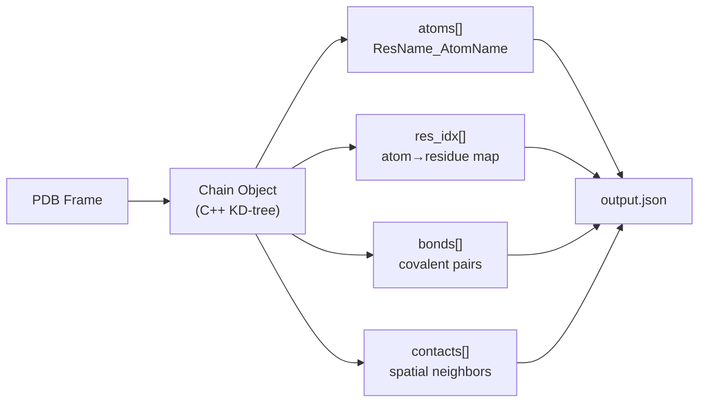
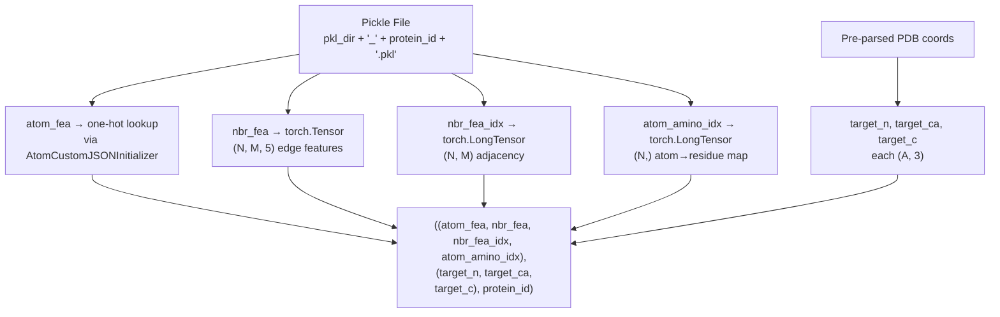

---
slug:11-graph-dataset-construction
blog_type:normal
---


Phanto-IDP 将本质上无序的蛋白质构象表示为**原子级几何图**，其中节点是原子，边编码了空间邻居关系，并富含局部坐标系投影的距离向量和共价键指示符。本页说明了原始的 PDB 轨迹帧如何转换为图结构张量，以供 GCN 消耗——这搭建了 C++ 特征提取器、Python 序列化管线以及为训练提供数据的 PyTorch `Dataset` 之间的桥梁。

## 从 PDB 到 JSON：C++ 特征提取器

图构建管线以编译好的 C++ 可执行文件（`get_features`）为起点，该文件解析 PDB 文件并提取四个结构化字段写入 JSON：**atoms**、**res_idx**、**bonds** 和 **contacts**。该可执行文件通过 `pdb_parse.py` 的 `runCommands` 函数逐帧调用，该函数会对轨迹目录中的每个 `.pdb` 文件执行 shell 命令。



`Chain` 构造函数逐行读取 PDB，将 `ATOM` 记录分组为 `Residue` 对象，过滤出**20 种标准氨基酸**，并要求每个残基具有主链原子 N、CA 和 C。随后在所有原子坐标上构建 **KD-树**，以实现高效的空间查询。接着，原子编号从零开始重新排序——这是所有下游索引所依赖的关键不变量。

**键提取**（`Chain::GetBonds`）分两个阶段进行。首先，残基内键通过硬编码的拓扑表（`topology::CANONICAL20_BONDS`）解析，该表将每个氨基酸名称映射到其共价原子对集合。其次，残基间肽键在相邻残基之间检测：如果原子间距离低于 4.5 Å，则声明 C–N 对成键。这将产生 `bonds` 字段：一个 `[atom_i, atom_j]` 索引对列表。

**接触提取**（`Chain::GetContacts(dmax, topn)`）在每个原子的 `dmax`（默认 999.99 Å）范围内执行 KD-树范围查询，然后对于每个原子，仅保留按距离排序的前 `topn`（默认 100）个最近邻居。每个接触被序列化为一个 9 元素元组：`[atom_a, atom_b, distance, x_ab, y_ab, z_ab, x_ba, y_ba, z_ba]`，其中 `(x_ab, y_ab, z_ab)` 是原子 B 的位置在原子 A 坐标系上的**局部坐标系投影**，反之亦然。这些投影通过 `Atom::Project` 计算，该函数将原子间位移向量转换为每个原子的**局部参考系（LFR）**——这是一个 3×3 正交基，通过 `SetAtomsLFR` 从每个原子的成键邻居分配。对于主链原子，LFR 由相邻的主链原子设置（例如，N 使用 C_prev→N→CA；C 使用 CA→C→N_next），而侧链原子则使用规范的查找表。

`res_idx` 字段将每个原子映射到其父残基索引，从而实现从原子级到残基级表示的下游聚合。`atoms` 字段存储 `"RESNAME_ATOMNAME"` 形式的字符串标签（例如，`"HIS_ND1"`、`"GLY_CA"`），作为原子类型嵌入表的键。

来源: [main.cpp](/preprocess/src/main.cpp#L8-L200), [Chain.cpp](/preprocess/src/Chain.cpp#L20-L81), [Chain.cpp](/preprocess/src/Chain.cpp#L230-L320), [Atom.cpp](/preprocess/src/Atom.cpp#L132-L198), [Chain.h](/preprocess/src/Chain.h#L16-L63)

## 从 JSON 到 Pickle：Python 序列化层

一旦生成了 JSON 文件，`pdb_parse.py` 的 `processDirectory` 函数就会将它们转换为 **pickle 文件**，以存储预计算的图张量。这是关键的一步，原始图拓扑在此被具体化为模型消耗的固定大小填充数组。

### 原子类型嵌入初始化

在处理任何 JSON 之前，会从 `groups20.txt` 构建一个**独热嵌入映射**，该文件列出了 20 种标准氨基酸。每个氨基酸名称被分配一个 20 维的独热向量。此映射被序列化为 `protein_atom_init.json`，随后由 `AtomCustomJSONInitializer` 加载以编码原子类型。

```python
# One-hot encoding: 20 amino acids → 20-dim vectors
feature_map = {}
with open(groups20_filepath, 'r') as f:
    data = f.readlines()
    len_amino = sum(1 for row in data)
    for idx, line in enumerate(data):
        a = [0] * len_amino
        a[idx] = 1
        name, _ = line.split(" ")
        feature_map[name] = a
```

请注意，嵌入键是**残基名称**（例如，`"GLY"`、`"HIS"`），而不是完整的原子标签。`AtomCustomJSONInitializer` 进一步将每个键映射到用于 `nn.Embedding` 查找的整数索引。

### 邻居排序与填充

核心图构建逻辑位于 `createSortedNeighbors` 中，它将 JSON 接触和键转换为每个原子的**固定大小邻居列表**，其中 `max_neighbors = 50`：

| 步骤 | 操作 | 详情 |
|------|------|------|
| 1 | **边分类** | 每个接触都会与键列表进行核对——成键对获得 `bool_bond = 1`，非成键的空间邻居获得 `bool_bond = 0` |
| 2 | **按距离排序** | 使用 NumPy 结构化数组上的归并排序，按欧几里得距离升序对每个原子的邻居列表进行排序 |
| 3 | **截断** | 仅保留前 `max_neighbors` 个最近邻居 |
| 4 | **零填充** | 具有少于 `max_neighbors` 个接触的原子将用 `(0, 0, 0, 0, 0, 0)` 哨兵元组填充 |

每个邻居条目是一个 6 元组：`(neighbor_index, distance, x_proj, y_proj, z_proj, is_bond)`。`is_bond` 标志是区分共价键和空间接触的唯一显式拓扑信号——GCN 卷积层通过边特征向量隐式地使用了它。

### Pickle 序列化格式

对于每个 JSON 文件，`processDirectory` 写入一个名为 `{directory}_{filename}.pkl` 的 pickle 文件，其中包含**四个连续的 pickle 转储**：

| 转储顺序 | 内容 | 形状语义 | 张量作用 |
|----------|------|----------|----------|
| 1 | `atom_fea` | `(N_atoms,)` 字符串列表 | 原子类型标签 → 独热查找 |
| 2 | `nbr_fea` | `(N_atoms, M, 5)` | 边特征：`[distance, x_proj, y_proj, z_proj, is_bond]` |
| 3 | `nbr_fea_idx` | `(N_atoms, M)` | 定义图邻接关系的邻居原子索引 |
| 4 | `amino_atom_idx` | `(N_atoms,)` | 用于池化的原子到残基映射 |

其中 `N_atoms` 是每帧的原子数，`M = max_neighbors = 50`。蛋白质 ID 字符串也作为第五个条目转储，用于标识。

来源: [pdb_parse.py](/pdb_parse.py#L57-L137), [pdb_parse.py](/pdb_parse.py#L79-L104)

## ProteinDataset：将图加载到 PyTorch 中

`ProteinDataset` 类在序列化的 pickle 文件和 PyTorch 训练循环之间搭建了桥梁。其设计遵循两阶段初始化模式：构建时的**急切坐标解析**，以及 `__getitem__` 时的**惰性图加载**。

### 初始化：从 PDB 提取坐标

在 `__init__` 期间，数据集扫描 `protein_dir` 中的所有 `.pdb` 文件，并使用直接的 PDB 行解析（第 30–53 列）从每一帧中提取**主链 N、CA、C 坐标目标**。这三个坐标数组（`self.n_crd`、`self.ca_crd`、`self.c_crd`）作为 VAE 解码器的 **3D 重建目标**——它们定义了 FAPE 损失所依据的真实主链帧。原子初始化器（`AtomCustomJSONInitializer`）也从共享的 `protein_atom_init.json` 加载。

```python
# PDB coordinate parsing — column-based extraction
if lines[13] == 'C' and lines[14] == 'A':     # CA atom
    self.ca_crd[i].append([float(lines[30:38]), float(lines[38:46]), float(lines[46:54])])
elif lines[13] == 'C' and lines[14] == ' ':   # C atom
    self.c_crd[i].append(...)
elif lines[13] == 'N' and lines[14] == ' ':   # N atom
    self.n_crd[i].append(...)
```

### 条目访问：图张量组装

`__getitem__` 方法为请求的帧加载预计算的 pickle 文件，并组装最终的张量元组：



原子特征通过 `self.ari.get_atom_fea(atom)` 从字符串标签转换为整数索引，然后堆叠成一维张量。该整数张量随后在模型的前向传播中通过 `nn.Embedding.from_pretrained`，以获得独热嵌入向量。

来源: [traj_dataset.py](/traj_dataset.py#L105-L173)

## 批次整理：变尺寸图填充

由于不同的蛋白质帧可能包含不同数量的原子和残基，`collate_pool` 函数将批次中的所有图填充到该批次内的**最大维度**：

| 张量 | 形状 | 填充策略 |
|------|------|----------|
| `final_protein_atom_fea` | `(B, N_max)` | 零填充至最大原子数 |
| `final_nbr_fea` | `(B, N_max, M, h_b)` | 零填充（哨兵邻居已在 pickle 中） |
| `final_nbr_fea_idx` | `(B, N_max, M)` | 零填充（索引 0 为哨兵） |
| `final_target_n/ca/c` | `(B, A_max, 3)` | 零填充至最大残基数 |

其中 `B` 是批次大小，`N_max` 是批次中的最大原子数，`M = 50` 是固定的邻居数，`h_b = 5` 是边特征维度，`A_max` 是最大残基数。`atom_amino_idx` 映射在模型的原子到残基池化步骤中被内部消耗（将 `atom_emb` 从 `(B, N, h_a)` 重塑为 `(B, A, h_a * 3)`，其中 3 是池化中使用的每个残基的主链原子数）。

来源: [traj_dataset.py](/traj_dataset.py#L42-L64)

## 训练/验证/测试集划分

`splitDataset` 函数实现了**基于目录的划分**：它不是按随机比例划分，而是按蛋白质身份对数据集进行分区。训练、验证和测试目录列表被显式提供，`SubsetRandomSampler` 仅选择属于每个划分的帧。这确保了来自同一 MD 轨迹的帧不会跨划分泄露——对于 IDP 构象生成而言，这是一个关键的设计选择，因为单一轨迹内的结构多样性正是建模目标。

来源: [traj_dataset.py](/traj_dataset.py#L15-L39)

## 端到端数据流总结

完整的图构建管线，从原始 MD 轨迹到模型就绪的批次，经过五个不同阶段：

| 阶段 | 输入 | 输出 | 执行器 |
|------|------|------|--------|
| 1. 特征提取 | PDB 帧 | JSON (atoms, bonds, contacts, res_idx) | C++ `get_features` |
| 2. 图序列化 | JSON | Pickle (atom_fea, nbr_fea, nbr_fea_idx, amino_atom_idx) | Python `pdb_parse.py` |
| 3. 数据集初始化 | Pickle 目录 + PDB 目录 | 内存中的坐标目标 + 原子初始化器 | `ProteinDataset.__init__` |
| 4. 条目加载 | Pickle 文件 + 坐标 | 张量元组 (图 + 目标) | `ProteinDataset.__getitem__` |
| 5. 批次整理 | 张量元组列表 | 填充的批次张量 | `collate_pool` |

<CgxTip>`max_neighbors = 50` 参数是控制图密度的主要旋钮。对于小型 IDP（< 50 个残基），大多数原子在默认的 `dmax` 内的真实空间邻居将远少于 50 个，这意味着大多数邻居槽位都是零填充的哨兵。GCN 的门控卷积通过 sigmoid 门控机制自然地抑制了这些哨兵，但过大的 `max_neighbors` 会浪费内存。对于较大的蛋白质，可能需要增加此值以捕获长程接触。</CgxTip>

<CgxTip>边特征中的局部坐标系投影向量（`x_proj, y_proj, z_proj`）在构造上是**旋转等变的**——它们在每个原子自身的坐标系中而非全局笛卡尔坐标中表达邻居位置。这使得图表示对输入结构的刚体旋转具有内在的不变性，FAPE 损失在训练期间进一步在残基级别上利用了这一性质。</CgxTip>

来源: [pdb_parse.py](/pdb_parse.py#L1-L30), [traj_dataset.py](/traj_dataset.py#L42-L64), [model.py](/model.py#L72-L102)

## 下一步

理解了图数据集构建之后，下一步合乎逻辑的做法是了解这些图张量如何流经模型的 GCN 编码器和 Transformer 解码器以生成 3D 构象：[构象生成](12-conformation-generation)。至于在提取的主链坐标目标上进行训练的损失函数，请参阅 [FAPE 损失函数](8-fape-loss-function)。