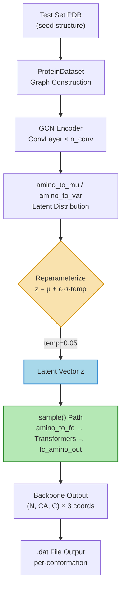
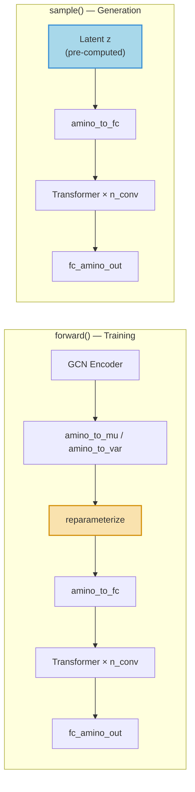
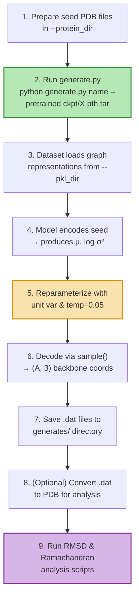

---
slug:12-conformation-generation
blog_type:normal
---


构象生成是 Phanto-IDP 的最终目标——为内在无序蛋白生成多样且结构合理的骨架系综。本页剖析了将训练好的 VAE 模型转化为生成引擎的**隐空间采样与解码流程**，涵盖了专属的 `generate.py` 入口、重参数化策略、仅解码器的 `sample()` 路径，以及生成结构的输出格式。

## 生成流程概述

Phanto-IDP 通过一个**条件式两阶段过程**生成构象：GCN 编码器将真实构象的图表示压缩为隐分布 (μ, log σ²)，随后 VAE 重参数化技巧从该分布中采样隐向量，最后 Transformer 解码器合成新的 3D 骨架。关键的洞察在于，生成**并非无条件**的——它需要来自测试集的种子结构来锚定隐空间，但低温采样确保了输出偏离种子，从而生成新颖的构象。



来源: [generate.py](/generate.py#L134-L153), [model.py](/model.py#L72-L102)

## `generate.py` 入口

`generate.py` 脚本是专属的生成入口，在架构上与 `main.py` 平行，但用**纯生成循环**取代了训练/评估循环。它与 `main.py` 共享完全相同的模型构建、检查点加载和数据集划分逻辑，随后在测试 DataLoader 上调用 `generate()` 函数。

### 模型与检查点加载

该脚本通过提取存储在检查点文件内部的超参数来重建模型架构——这确保了架构一致性，无需手动重新指定 `h_a`、`h_g` 或 `n_conv`：

```python
model_checkpoint = torch.load(args.pretrained, map_location=lambda storage, loc: storage)
model_args = argparse.Namespace(**model_checkpoint['args'])
args.h_a = model_args.h_a
args.h_g = model_args.h_g
args.n_conv = model_args.n_conv
```

在构建 `PhantoIDP(**kwargs)` 并将其包装入 `DataParallel` 后，保存的 `state_dict` 和优化器状态会被恢复。键嵌入维度 `h_b` 是从数据集的第一个样本推断得出的，而非被存储，因为它由图预处理流程决定。

来源: [generate.py](/generate.py#L61-L98), [arguments.py](/arguments.py#L15-L18)

### `generate()` 函数

核心生成逻辑位于一个遍历批次、采样迭代和单个结构的三重嵌套循环中：

```python
def generate(data_loader, model):
    for protein_batch_iter, (input_data, target_data) in enumerate(data_loader):
        input_var, target_var = getInputs(input_data, target_data)
        with torch.no_grad():
            model.eval()
            predicted = model(input_var)           # forward pass → (output, μ, log σ²)
            for i in range(args.avg_sample):        # multiple samples per seed
                conf_seed = model.module.reparameterize(
                    predicted[1],                   # μ from encoder
                    torch.ones(predicted[2].shape)  # unit variance override
                        .to(predicted[2].device),
                    temp=0.05)                      # low temperature
                generated = model.module.sample(conf_seed)
                for j in range(generated.shape[0]):
                    np.savetxt("generates/predicted.%d.%d.%d.dat"
                               % (protein_batch_iter, i, j),
                               generated[j].cpu().numpy())
```

存在三个嵌套层级的迭代，每层服务于不同的目的：

| 循环变量 | 范围 | 目的 |
|---|---|---|
| `protein_batch_iter` | DataLoader 批次 | 遍历测试集中的所有种子结构 |
| `i` | `args.avg_sample` (默认 2) | 为每个种子提取多个隐空间样本，以保证系综多样性 |
| `j` | `generated.shape[0]` (批次大小) | 独立保存批次中的每个结构 |

来源: [generate.py](/generate.py#L134-L153), [arguments.py](/arguments.py#L17-L18)

## 生成的重参数化策略

`reparameterize()` 静态方法实现了标准的 VAE 重参数化技巧：**z = μ + ε · σ · temp**，其中 ε ~ N(0, I)。在训练期间，这使得梯度能够流经随机采样操作。在生成期间，它则成为**多样性控制旋钮**。

### 温度缩放

`temp` 参数缩放随机噪声分量。在 `temp=0.05`（生成默认值）时，采样出的隐向量紧密集中在均值 μ 附近，生成的构象为**近众数**——在结构上接近给定种子下最可能的构象，仅有微小变异。这与 `temp=1.0`（训练默认值）形成对比，后者使用完整的所学方差进行标准 VAE 采样。

```python
@staticmethod
def reparameterize(means, logvars, temp=1.0):
    std = torch.exp(0.5 * logvars)
    eps = torch.randn_like(std)
    return means + eps * std * temp
```

### 单位方差覆写

生成代码中的一个关键架构选择：不使用编码器的**所学对数方差**（`predicted[2]`），生成流程将**单位方差**（`torch.ones(...)`）代入 logvar 参数。这意味着 `std = exp(0.5 * 0) = 1.0`，有效地摒弃了编码器的不确定性估计，代之以各向同性高斯噪声。结合 `temp=0.05`，实际采样公式变为 **z = μ + ε · 1.0 · 0.05 = μ + 0.05ε**，在编码器均值附近产生极其紧凑、受控的扰动。

<CgxTip>单位方差覆写将生成多样性与编码器所学方差场解耦，因为对于分布外种子，所学方差场可能校准不佳。这使得温度成为唯一的多样性控制手段，简化了生成质量与多样性之间的权衡。</CgxTip>

来源: [model.py](/model.py#L119-L123), [generate.py](/generate.py#L146-L148)

## 仅解码器的 `sample()` 路径

`sample()` 方法提供了一种**局部前向传播**，完全跳过编码器，从预计算的隐向量开始。这是针对生成的专属路径，对应于完整的 `forward()` 方法：



### 实现

```python
def sample(self, inputs):
    amino_emb = inputs
    amino_emb = self.amino_to_fc(amino_emb).transpose(0, 1)
    batch_size = amino_emb.shape[1]
    for idx in range(self.n_conv):
        amino_emb = self.transformers[idx](amino_emb)
    amino_emb = amino_emb.transpose(0, 1)
    out = self.fc_amino_out(amino_emb)    # [B, A, 3]
    return out
```

数据流映射了 `forward()` 的解码器部分：隐嵌入经过 `amino_to_fc` (Linear: h_g → 32) 投影，转置为序列优先格式 `(A, B, 32)` 以供 Transformer 块处理，再经由 `n_conv` 个连续的 `IdpGANBlock` 实例处理，最后通过 `fc_amino_out` (Linear: 32 → 9) 投影为 9 维。输出形状 `[B, A, 3]` 表示每个残基包含**3 个骨架原子 (N, CA, C) 及其 3D 坐标**。

来源: [model.py](/model.py#L104-L117), [model.py](/model.py#L72-L102)

## 输出格式与文件结构

### 坐标编码

每个生成的构象以 NumPy 文本文件保存，命名规范如下：

```
generates/predicted.{batch_idx}.{sample_idx}.{structure_idx}.dat
```

每个 `.dat` 文件的内容是一个形状为 **(A, 9)** 的矩阵，其中 A 是氨基酸残基数，9 编码了三个骨架原子 × 三个空间坐标：每行为 **[N_x, N_y, N_z, CA_x, CA_y, CA_z, C_x, C_y, C_z]**。这种展平表示源自 `fc_amino_out` 为每个残基生成一个 9 维向量，该向量在训练期间被重塑为 `(A, 3, 3)` 用于 FAPE 损失计算，但在 `sample()` 输出中保留为 `(A, 3)`（其中最后一个维度索引三个原子）。

### 对比：训练与生成输出

| 方面 | 训练 (`main.py`) | 生成 (`generate.py`) |
|---|---|---|
| 输出目录 | `outputs/` | `generates/` |
| 文件前缀 | `predicted.{batch}.{struct}.dat` | `predicted.{batch}.{sample}.{struct}.dat` |
| 方差来源 | 编码器所学对数方差 | 单位方差 (ones) |
| 温度 | 1.0 (隐式) | 0.05 (显式) |
| 前向路径 | `model(input_var)` → 完整前向 | `model(input_var)` → 重参数化 → `sample()` |
| 梯度计算 | 训练时启用 | `torch.no_grad()` 上下文 |
| 目标文件保存 | 是 (`target.*.dat`) | 否 (仅预测) |

来源: [generate.py](/generate.py#L150-L151), [main.py](/main.py#L217-L220)

## 端到端生成工作流

从训练检查点到构象系综的完整流程遵循以下步骤：



### 命令行调用

```shell
python generate.py generate_trial \
    --pretrained ckpt/PaaA2_best.pth.tar \
    --pkl_dir ./data/pkl/PaaA2-simp/ \
    --protein_dir ../Traj/PaaA2-simp/ \
    --avg_sample 5
```

`--avg_sample` 标志直接控制**每个种子结构**生成的构象数量。增大此值将线性扩展系综规模。若要更广泛地探索构象景观，可以通过 `--test` 划分比例来增加测试集大小。

<CgxTip>生成质量严重依赖于种子结构距离训练分布的远近。从同一蛋白的 MD 轨迹中提取的种子能产生最可靠的输出；跨蛋白种子可能会产生结构上不合理的构象，因为 GCN 编码器尚未学会表征该结构空间区域。</CgxTip>

### 可用的预训练检查点

本仓库在 `ckpt/` 目录下内置了 14 个预训练检查点，覆盖了多种 IDP 系统：

| 检查点 | 蛋白质系统 | 残基 |
|---|---|---|
| `AAQAA3.pth.tar` | (AAQAA)₃ 重复 | ~15 |
| `ACTR_best.pth.tar` | ACTR | ~45 |
| `Abeta40_best.pth.tar` | Aβ40 | 40 |
| `abeta42_best.pth.tar` | Aβ42 | 42 |
| `CspTm_best.pth.tar` | CspTm | ~66 |
| `drkN_best.pth.tar` | drkN SH3 | ~59 |
| `RS1_best.pth.tar` | RS1 | ~44 |
| `synuclein_best.pth.tar` | α-synuclein | 140 |
| `ubiquitin_best.pth.tar` | Ubiquitin | 76 |

来源: [generate.py](/generate.py#L17-L31), [arguments.py](/arguments.py#L29-L34)

## 生成与训练前向传播：架构分歧

生成流程与训练前向传播在两个基本方面存在分歧，值得深入理解：

**1. 隐向量注入点。** 在训练期间，`forward()` 在单次传播中执行编码 → 重参数化 → 解码，梯度流经所有阶段。在生成期间，流程将此拆分为两个独立步骤：`model(input_var)` 产生 `(output, μ, log σ²)`，然后分别调用 `reparameterize()` 和 `sample()`。这种分离使得能够从**同一**编码器输出中提取多个样本，而无需冗余编码。

**2. 输出形状解释。** 训练的 `forward()` 返回 `out.view(batch_size, -1, 3, 3)`——将 9 维输出重塑为 `(B, A, 3, 3)` 以进行帧对齐点误差 (FAPE) 计算，其中最后两个维度代表 3 个骨架原子 × 3 个空间坐标。生成的 `sample()` 返回未重塑的 `(B, A, 3)` 张量（其中最后一个维度是 9 维展平坐标向量），随后直接保存而无需构建帧。

来源: [model.py](/model.py#L99-L102), [model.py](/model.py#L114-L117), [generate.py](/generate.py#L144-L151)

## 后续步骤

在生成构象系综后，自然的下一步是定量评估和物理精细化：

- **[RMSD 与 Ramachandran 分析](13-rmsd-and-ramachandran-analysis)** — 评估生成系综的结构多样性和骨架二面角分布质量
- **[OpenMM 结构精细化](14-openmm-structure-refinement)** — 使用分子动力学弛豫生成的构象，以消除空间位阻并提高物理合理性
- **[配置与参数参考](15-configuration-and-arguments-reference)** — 用于调节生成行为的完整参数参考