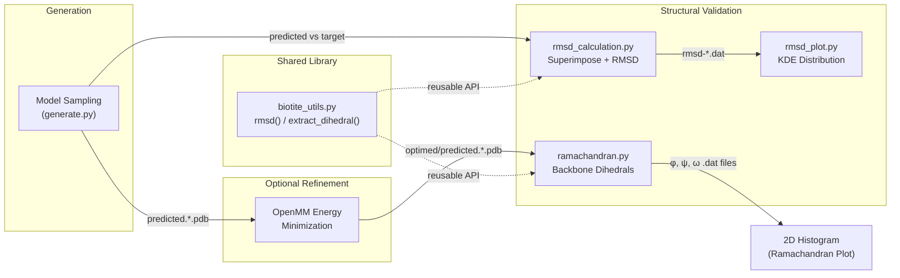

---
slug:13-rmsd-and-ramachandran-analysis
blog_type:normal
---


在 Phanto-IDP 生成一组本质无序蛋白构象后，两项互补的结构验证分析会确认采样结构的物理合理性与重构保真度。**RMSD 分析**量化了预测结构与参考结构之间的骨架偏差，提供标量精度指标；而**Ramachandran 分析**则映射了整个构象系的骨架二面角分布，揭示模型是否遵循立体化学约束。这两项分析共同构成了关键的生成后验证层，连接了[构象生成](12-conformation-generation)与[OpenMM 结构精修](14-openmm-structure-refinement)。

## 分析流水线架构

RMSD 和 Ramachandran 分析位于构象生成的下游，也可选位于 OpenMM 精修的下游。下图说明了数据如何从生成的结构流入每项分析，以及每项分析的产出：



流水线在生成步骤后发生分支：RMSD 分析将预测结构与已知参考结构进行对比（需要 subject 和 target），而 Ramachandran 分析则纯粹在预测构象系上进行操作，完全不需要参考结构。

来源：[rmsd_calculation.py](Analysis/rmsd_calculation.py#L1-L12), [rmsd_plot.py](Analysis/rmsd_plot.py#L1-L45), [ramachandran.py](Analysis/ramachandran.py#L1-L54), [biotite_utils.py](Scripts/biotite_utils.py#L1-L167)

## RMSD 计算

### 核心算法

RMSD（均方根偏差）计算遵循标准的结构生物学协议：**先叠合，后测量**。如果不进行叠合，RMSD 会将结构差异与刚体位移混为一谈，产生误导性的过大值。`rmsd_calculation.py` 中的实现将这两个步骤均委托给 **biotite** 库：

1. **加载** subject（预测）和 reference（目标）结构，通过 `biotite.structure.io.load_structure` 转换为 `AtomArray` 对象。
2. **叠合** subject 至 reference 上，使用 `biotite.structure.superimpose`，该函数会寻找最小化最小二乘距离的最优旋转与平移。
3. **计算 RMSD**，在 reference 与叠合后的 subject 之间通过 `biotite.structure.rmsd` 进行计算。

```python
subject_array = strucio.load_structure(subject)
reference_array = strucio.load_structure(reference)
superimposed, _ = struc.superimpose(reference_array, subject_array)
print(struc.rmsd(reference_array, superimposed))
```

<CgxTip>独立的 `rmsd_calculation.py` 会对 PDB 文件中的**所有原子**进行操作。若仅需计算骨架 RMSD（N, CA, C, O），请改用 `biotite_utils.py` 中的 `rmsd()` 函数——它会在叠合前应用原子名掩码，这是蛋白质结构评估中的标准做法。</CgxTip>

### 骨架过滤 RMSD (biotite_utils)

共享工具库中的 `rmsd()` 函数提供了更严格的**骨架限制** RMSD，与 CASP 及类似基准测试中使用的惯例保持一致。在执行叠合前，它会过滤 reference 和 target，仅保留规范氨基酸残基的骨架重原子（N, CA, C, O）：

| 步骤 | 操作 | 原理 |
|------|-----------|-----------|
| 加载 | `load_structure(..., model=1)` | 仅使用多模型 PDB 中的第一个模型 |
| 掩码 | `atom_name ∈ {N, CA, C, O} ∧ filter_amino_acids` | 排除侧链与非标准残基 |
| 叠合 | `struc.superimpose(ref, target)` | 最优刚体对齐 |
| 测量 | `struc.rmsd(ref, superimposed)` | 以 Å 为单位的标量偏差 |

来源：[rmsd_calculation.py](Analysis/rmsd_calculation.py#L1-L12), [biotite_utils.py](Scripts/biotite_utils.py#L145-L156)

## RMSD 分布绘图

### 从标量到分布

单一预测结构与其参考结构之间的单个 RMSD 值虽有参考意义，但不足以评估 IDP 构象的**系综**。`rmsd_plot.py` 脚本通过绘制跨多个蛋白质系统的 RMSD 值的**核密度估计 (KDE)** 来解决此问题，生成平滑的概率密度曲线，以揭示重构误差的分布范围与模态。

### 实现细节

该脚本加载三个蛋白质系统的预计算 RMSD 数据文件（纯文本列），并将它们的 KDE 曲线叠加在同一图表中：

| 蛋白质 | 数据文件 | 平均 RMSD (Å) | 线型 |
|---------|-----------|---------------|------------|
| RS1 | `rmsd-rs1.dat` | 0.511 | 竖虚线 |
| PaaA2 | `rmsd-paa.dat` | 0.885 | 竖虚线 |
| α-synuclein | `rmsd-syn.dat` | 2.714 | 竖虚线 |

竖虚线 (`axvline`) 标记了每个蛋白质的平均 RMSD，为直观比较分布中心与平均值的关系提供参考。色彩映射 (`gnuplot`) 因其在印刷中的感知均匀性而被选用；Y 轴被隐藏，以强调密度的形状而非绝对概率值——这是结构生物学出版物中的常见惯例。

<CgxTip>硬编码的平均 RMSD 值（0.511, 0.885, 2.714）**并非动态计算**——如果底层数据发生变化，必须手动更新它们。对于可复现的工作流，应使用 `np.mean(rmsd_array)` 从加载的数组中计算这些均值，并以编程方式传递给 `axvline`。</CgxTip>

来源：[rmsd_plot.py](Analysis/rmsd_plot.py#L1-L45)

## Ramachandran 分析

### 二面角提取

Ramachandran 图是骨架立体化学的标准诊断方法。它将每个残基的 **φ (phi)** 和 **ψ (psi)** 二面角映射到二维平面上，在允许区域（α-螺旋、β-折叠、左手螺旋）内的聚集表明构象具有物理合理性，而在禁阻区域内的密度则指示存在空间位阻或几何伪影。

`ramachandran.py` 脚本以批处理方式处理整个预测结构系综：

1. **遍历**输入目录 (`./optimed/`) 中所有以 `predicted` 开头的文件。
2. **加载**每个结构，并通过 `biotite.structure.dihedral_backbone` 计算骨架二面角，该函数以**弧度**返回 φ、ψ 和 ω 数组。
3. **剔除**首尾残基（由于其前驱/后继原子缺失，φ/ψ 未定义），移除 `NaN` 值。
4. **累积**所有结构的角度，直至达到 **20,000 角度阈值**——此举措可限制大型系综的内存占用与绘图密度。
5. **转换**从弧度至角度（× 180/π）。
6. **持久化**将 φ、ψ 和 ω 保存至 `.dat` 文件，供下游复用。

### 可视化

该脚本使用 `ax.hist2d` 生成 **2D 直方图**（而非散点图），配置 200×200 的分箱与 `RdYlGn_r` 色彩映射（红色 = 高密度，绿色 = 低密度）。此分箱策略至关重要：对于包含数千个构象的 IDP 系综，散点图会产生严重的过度绘制，而直方图则能揭示**群体密度**——即模型的 φ-ψ 空间中哪些区域被优先采样。

| 绘图参数 | 值 | 目的 |
|----------------|-------|---------|
| 分箱 | 200 × 200 | 高粒度密度分辨率 |
| 色彩映射 | `RdYlGn_r` | 红色 = 高密度，绿色 = 稀疏 |
| `cmin` | 1 | 抑制零计数分箱（白色背景） |
| 坐标轴范围 | [−180, 175] | 完整二面角范围并略留边距 |
| 宽高比 | `equal` | 在图中保持角度几何关系 |

来源：[ramachandran.py](Analysis/ramachandran.py#L1-L54)

### biotite_utils 中的二面角提取

共享库提供了可复用的 `extract_dihedral()` 函数，具有相同的核心逻辑，但采用**单文件、单链**的 API 设计。它仅加载模型 1，过滤至链 A，计算骨架二面角，剔除 NaN 边界，并转换为角度——以元组形式返回这三个角度数组。此函数是二面角分析的编程入口点，而 `ramachandran.py` 则是用于全系综可视化的批处理脚本。

来源：[biotite_utils.py](Scripts/biotite_utils.py#L83-L97)

## 对比分析：脚本 vs. 共享库

Analysis 目录包含用于直接执行与临时探索的**独立脚本**，而 `Scripts/biotite_utils.py` 则提供用于编程集成的**可导入 API 函数**。下表总结了它们的关系：

| 功能 | 独立脚本 | biotite_utils 函数 |
|------------|------------------|-----------------------|
| RMSD (所有原子) | `rmsd_calculation.py` | — |
| RMSD (仅骨架) | — | `rmsd(reference, target)` |
| 二面角批量提取 | `ramachandran.py` | — |
| 二面角单文件提取 | — | `extract_dihedral(protein)` |
| 序列提取 | — | `extract_seq(protein)` |
| pLDDT 提取 | — | `extract_plddt(protein)` |
| SSE 注释 | — | `secondary_structure(protein)` |

在构建自动化评估流水线时，推荐使用 `biotite_utils` 函数，因为其具备输入验证、链过滤和一致的返回类型。若需进行快速的临时分析，或直接从命令行生成出版级图像，请使用独立脚本。

来源：[biotite_utils.py](Scripts/biotite_utils.py#L1-L167), [rmsd_calculation.py](Analysis/rmsd_calculation.py#L1-L12), [ramachandran.py](Analysis/ramachandran.py#L1-L54)

## 典型工作流

构象生成后的端到端分析工作流如下：

1. 使用[构象生成](12-conformation-generation)**生成构象**，产出 `predicted.*.pdb` 文件。
2. （可选）使用 [OpenMM 结构精修](14-openmm-structure-refinement)进行**精修**，在 `./optimed/` 中产出能量最小化结构。
3. 使用 `rmsd_calculation.py` 或 `biotite_utils.rmsd()` 计算每个预测结构与其参考之间的 **RMSD**。将结果收集至 `.dat` 文件中。
4. 使用 `rmsd_plot.py` **绘制 RMSD 分布**，跨蛋白质系统比较重构质量。
5. 在精修后的系综上使用 `ramachandran.py` **计算 Ramachandran 角度**，验证立体化学合理性。
6. **解读结果**：较低的平均 RMSD（< 2 Å）且 Ramachandran 密度集中于允许区域，表明生成模型表现良好。

若要深入了解生成这些构象的模型，请参阅 [VAE 编码器-解码器设计](4-vae-encoder-decoder-design)。关于通常在 Ramachandran 分析之前的精修步骤，请参阅 [OpenMM 结构精修](14-openmm-structure-refinement)。获取完整的参数与配置参考，请参阅[配置与参数参考](15-configuration-and-arguments-reference)。