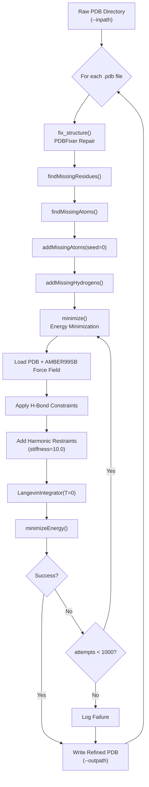
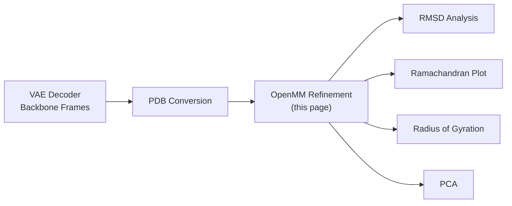

---
slug:14-openmm-structure-refinement
blog_type:normal
---


Phanto-IDP 的 VAE 解码器将内无序蛋白 (IDP) 的骨架坐标生成为连续的 3D 点，这些点虽然在拓扑上合理，但可能包含局部空间位阻冲突、扭曲的键角几何，或违背物理化学约束的高能构象。**OpenMM 结构精修**模块作为关键的生成后校正层：它通过 PDBFixer 修复结构缺陷，然后在 AMBER99SB 力场下对每种构象执行**受限能量最小化**，生成适合下游分析（如 RMSD 比较、Ramachandran 图绘制或回旋半径计算）的符合物理规律的 PDB 结构。

来源: [refine_openmm.py](/Analysis/refine_openmm.py#L1-L170)

## 精修流水线架构

精修流水线作为一个批处理器在原始 PDB 文件目录上运行，对每种构象独立应用两阶段转换——**结构修复**和随后的**能量最小化**。下图展示了端到端的数据流：



来源: [refine_openmm.py](/Analysis/refine_openmm.py#L136-L169)

## 阶段 1：使用 PDBFixer 进行结构修复

`fix_structure` 函数处理 ML 生成的 PDB 文件中常见的问题类别：VAE 骨架表示遗漏的**缺失原子**（侧链重原子、端帽原子）、不完整链建模导致的**缺失残基**，以及全原子 AMBER 力场所需的**缺失氢原子**。修复序列遵循严格的依赖顺序——必须先识别缺失残基，然后才能解决这些残基内的缺失原子问题，而氢原子最后添加，因为其位置取决于完整的重原子几何结构。

该函数读取 PDB 文件句柄，应用四步 PDBFixer 流水线，然后使用 OpenMM 的 `PDBFile.writeFile`（设置 `keepIds=True` 以保留原始原子和残基编号）将修复后的拓扑和位置序列化回 PDB 格式的字符串。确定性的 `seed=0` 确保了跨运行时氢原子放置的可复现性。

| 修复步骤 | PDBFixer 方法 | 目的 | 依赖 |
|---|---|---|---|
| 1 | `findMissingResidues()` | 检测链序列中的空缺 | 无 |
| 2 | `findMissingAtoms()` | 识别每个残基中缺失的重原子 | 步骤 1 |
| 3 | `addMissingAtoms(seed=0)` | 在理想几何位置插入原子 | 步骤 2 |
| 4 | `addMissingHydrogens()` | 放置与化合价一致的氢原子 | 步骤 3 |

来源: [refine_openmm.py](/Analysis/refine_openmm.py#L31-L43)

## 阶段 2：受限能量最小化

`minimize` 函数实现了核心的基于物理的校正。它从修复后的 PDB 构建一个 OpenMM 分子系统，应用力场和可选约束，然后执行基于梯度的能量最小化。该设计故意将**宽松的收敛标准**与**谐约束**结合，以实现受控扰动：约束将原子锚定在其输入坐标附近，同时允许优化器解决局部应变。

### 力场与约束

系统使用 **AMBER99SB** 全原子力场进行实例化，该力场提供了在隐式溶剂中为蛋白质参数化的成键项（键、键角、二面角）和非键项（范德华力、静电相互作用）。应用了**氢键约束**（`openmm_app.HBonds`）以冻结涉及氢原子的键长，从而实现更大的有效积分时间步长，并消除与 Phanto-IDP 所需的骨架级别校正无关的高频振动模式。

### 谐约束

当 `stiffness > 0` 时，`CustomExternalForce` 实现以下势能：

$$V_{\text{restraint}} = \frac{1}{2} k \sum_{i \in S} \left[ (x_i - x_i^0)^2 + (y_i - y_i^0)^2 + (z_i - z_i^0)^2 \right]$$

其中 $k$ 为刚度（默认 **10.0 kcal·mol⁻¹·Å⁻²**），$S$ 为约束集，$(x_i^0, y_i^0, z_i^0)$ 为来自修复结构的参考坐标。通过 `will_restrain` 谓词支持两种约束集：

| 约束集 | 选择标准 | 受约束原子（典型蛋白质） |
|---|---|---|
| `"non_hydrogen"` | 所有 `element.name != "hydrogen"` 的原子 | N, Cα, C, O, Cβ, 侧链重原子 |
| `"c_alpha"` | 仅 `name == "CA"` 的原子 | 仅 Cα |

默认配置使用 `"non_hydrogen"` 约束，这提供了强锚定作用，同时仍允许侧链旋转异构体弛豫和骨架二面角调整。`exclude_residues` 列表（默认为空）中的残基将被跳过，从而实现对柔性区域（如末端尾段或无序环）的选择性弛豫。

### 最小化协议

温度设定为 0 K 且时间步长为 0.01 ps 的 **LangevinIntegrator** 纯粹作为最小化调用的载体——不传播动力学。平台选择（若 `use_gpu=True` 则为 `"CUDA"`，否则为 `"CPU"`）决定了计算后端。能量最小化通过 L-BFGS 算法（OpenMM 的默认算法）进行，收敛参数如下：

| 参数 | 默认值 | 单位 | 解释 |
|---|---|---|---|
| `max_iterations` | 0 | 迭代次数 | 无限迭代（仅基于容差收敛） |
| `tolerance` | 2.39 | kcal·mol⁻¹ | 能量收敛阈值 |

该函数返回一个捕获最小化前后状态的字典：初始/最终势能（`einit`、`efinal`）、初始/最终位置（`posinit`、`pos`）、最小化后的 PDB 字符串（`min_pdb`）以及所需的尝试次数（`min_attempts`）。

来源: [refine_openmm.py](/Analysis/refine_openmm.py#L46-L116)

## 鲁棒性：重试机制与失败处理

ML 生成的结构偶尔会产生触发 OpenMM 异常的拓扑——原子命名不一致、非标准残基修补或 PDBFixer 无法完全解决的立体化学违规。精修循环实现了**无修改重试**策略：如果 `minimize` 抛出任何异常，尝试计数器将递增并重试相同的输入。这解决了瞬态故障（例如，GPU 内存压力、非确定性平台初始化），同时使**结构性故障**在各次尝试中保持不变——使得重试仅对随机运行时错误有效。

经过 `max_attempts`（默认 **1000**）次连续失败后，该结构将被记录在 `fails` 列表中，流水线将继续处理下一个文件，而不是抛出致命异常。在批处理完成时，摘要将报告总挂钟时间和任何无法精修的结构列表。

<CgxTip>无修改重试的设计意味着，确定性结构故障（例如，PDBFixer 无法修补的非规范残基）将始终耗尽全部 1000 次尝试才会被记录为失败。对于大型构象系的批处理，考虑将 `max_attempts` 减小到较小值（例如 5–10），以避免在不可恢复的结构上浪费算力。</CgxTip>

来源: [refine_openmm.py](/Analysis/refine_openmm.py#L141-L169)

## 参数参考

下表汇总了精修流水线的所有可配置参数、其默认值及其对精修行为的影响：

| 参数 | CLI 标志 | 默认值 | 单位 | 作用域 | 效果 |
|---|---|---|---|---|---|
| `inpath` | `--inpath`, `-i` | `./pdbs/` | 路径 | 批处理 | 包含待精修原始 PDB 文件的目录 |
| `outpath` | `--outpath`, `-o` | `./refined/` | 路径 | 批处理 | 精修后 PDB 输出目录 |
| `max_iterations` | — | 0 | 迭代次数 | 最小化器 | 0 = 无限；仅基于容差收敛 |
| `tolerance` | — | 2.39 | kcal·mol⁻¹ | 最小化器 | L-BFGS 的能量收敛阈值 |
| `stiffness` | — | 10.0 | kcal·mol⁻¹·Å⁻² | 约束 | 谐约束力常数；值越高 = 偏离输入越小 |
| `restraint_set` | — | `"non_hydrogen"` | — | 约束 | 哪些原子接受谐约束 |
| `exclude_residues` | — | `[]` | 残基索引 | 约束 | 排除约束的残基 |
| `max_attempts` | — | 1000 | 尝试次数 | 重试 | 每个结构的最大重试次数 |
| `use_gpu` | — | `False` | — | 平台 | 是否使用 CUDA 平台 |

来源: [refine_openmm.py](/Analysis/refine_openmm.py#L13-L27), [refine_openmm.py](/Analysis/refine_openmm.py#L126-L127)

## 与 Phanto-IDP 工作流的集成

精修模块位于 Phanto-IDP 流水线的**生成后边界**，将 VAE 解码的骨架坐标转换为物理上有效的结构。更广泛的工作流程如下进行：

1. **生成** ([构象生成](12-conformation-generation))：VAE 的 `reparameterize` + `sample` 路径生成逐残基的 3×3 帧矩阵（编码 N, Cα, C 位置的局部坐标系），这些矩阵被序列化为 `.dat` 坐标文件
2. **PDB 转换**：坐标数组转换为 PDB 格式（骨架原子 + 理想侧链几何）并放入输入目录
3. **OpenMM 精修**（本页）：`refine_openmm.py` 批处理 PDB 目录，修复并最小化每个结构
4. **分析** ([RMSD 与 Ramachandran 分析](13-rmsd-and-ramachandran-analysis))：精修后的 PDB 被 `rmsd_calculation.py`、`ramachandran.py`、`rg.py` 和 `pca.py` 消耗，用于定量的系综表征

输出目录中的精修结构成为所有下游生物物理分析的规范表示，这使得精修质量直接影响验证指标。



<CgxTip>`stiffness = 10.0 kcal·mol⁻¹·Å⁻²` 的默认值对应于在 1 kcal·mol⁻¹ 应变能下约 0.32 Å 的特征位移。对于骨架多样性为核心关注量的 IDP 系综，考虑降低刚度（例如 1.0–5.0）以允许更大的校正，或者在 VAE 生成的结构已经接近物理合理且仅需轻微冲突消除时提高刚度（例如 50.0+）。</CgxTip>

来源: [refine_openmm.py](/Analysis/refine_openmm.py#L1-L170), [generate.py](/generate.py#L134-L153), [ramachandran.py](/Analysis/ramachandran.py#L1-L54), [rmsd_calculation.py](/Analysis/rmsd_calculation.py#L1-L12)

## 用法示例

对原始 VAE 生成的 PDB 目录运行精修：

```bash
# 默认：精修 ./pdbs/ 中的所有 .pdb 文件，写入 ./refined/
python Analysis/refine_openmm.py --inpath ./pdbs/ --outpath ./refined/

# GPU 加速精修（需要启用 CUDA 的 OpenMM 构建）
python Analysis/refine_openmm.py -i ./pdbs/ -o ./refined/  # 注意：use_gpu 必须在脚本中设置
```

脚本在完成时打印计时信息和任何失败：

```
optimization using 42.37 s
fail to optimize 2 structures, filename list:
['predicted.3.17.pdb', 'predicted.7.42.pdb']
```

请注意，诸如 `tolerance`、`stiffness`、`max_iterations`、`max_attempts` 和 `use_gpu` 等参数目前是模块级别（第 21–26 行）的**硬编码常量**，并未作为 CLI 参数暴露。要修改这些参数，请直接在 `refine_openmm.py` 中编辑相应的变量赋值。