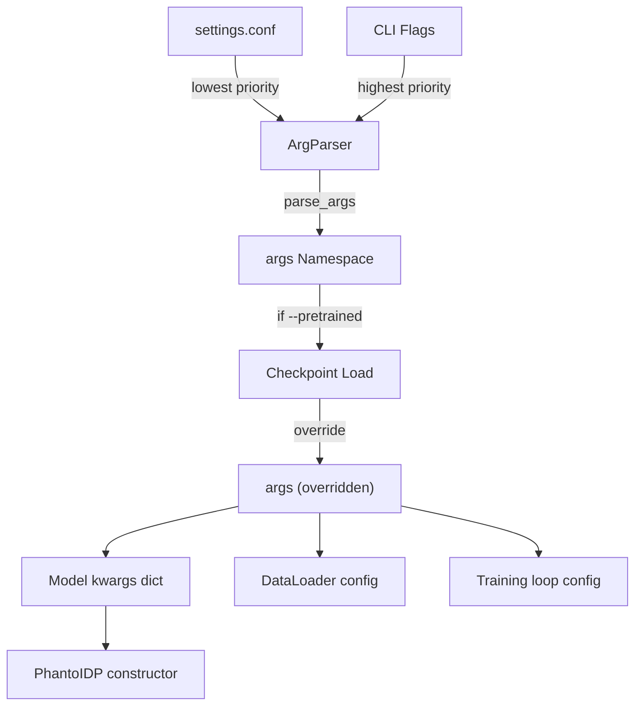
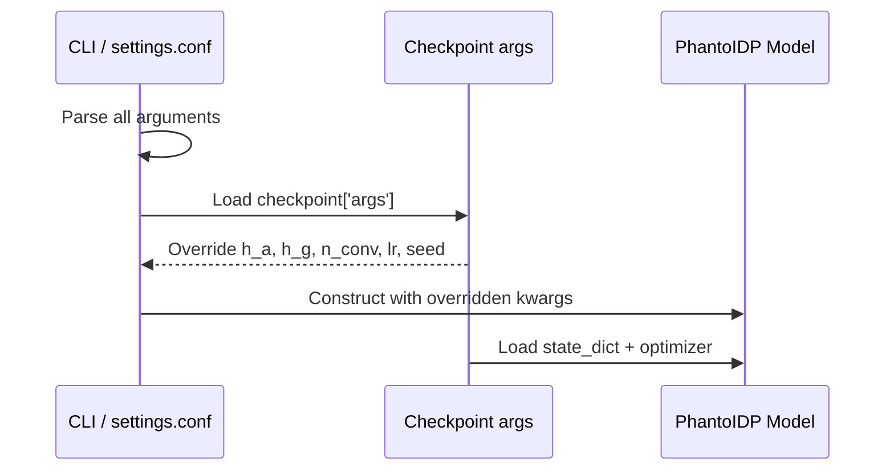

---
slug:15-configuration-and-arguments-reference
blog_type:normal
---


Phanto-IDP 的配置系统建立在双层架构之上：一个控制训练和生成的**主参数解析器**（`configargparse`），以及一个处理运行时张量分发的**辅助设备配置模块**。该参数解析器同时支持 CLI 标志和 `settings.conf` 配置文件以实现持久化配置，从而无需冗长的命令行即可复现实验。本参考文档详细梳理了训练流程、生成流程、模型内部机制、损失调度以及事后分析工具中的所有可配置参数。

来源：[arguments.py](/arguments.py#L1-L50), [config.py](/config.py#L1-L6)

## 配置加载架构

系统采用 `configargparse.ArgParser`，并默认读取 `settings.conf` 配置文件。这意味着参数可以通过以下三种方式指定，其优先级从高到低依次为：**CLI 标志** → **配置文件** → **默认值**。当加载预训练模型时，其保存的 `args` 字典会**覆盖**通过 CLI 指定的模型架构参数（`h_a`、`h_g`、`n_conv`、`lr`），从而确保训练与推理间的架构一致性。



来源：[arguments.py](/arguments.py#L1-L6), [main.py](/main.py#L62-L71)

## 全局设备配置

`config.py` 模块会自动检测 CUDA 的可用性，并导出整个代码库中使用的三个张量类型别名。这些别名**并非**用户可配置项——它们是在导入时根据硬件情况确定的。

| 导出项 | CUDA 路径 | CPU 路径 | 使用位置 |
|--------|-----------|----------|---------|
| `device` | `torch.device('cuda')` | `torch.device('cpu')` | `AverageMeter`、模型放置 |
| `FloatTensor` | `torch.cuda.FloatTensor` | `torch.FloatTensor` | `Normalizer`、`makeW`、`makeQ` |
| `LongTensor` | `torch.cuda.LongTensor` | `torch.LongTensor` | （预留） |

来源：[config.py](/config.py#L1-L6)

## 主参数 — 数据来源

这些参数控制输入数据的读取路径与结果写入路径。位置参数 `name` 为**必填项**，它决定了输出的子目录。

| 标志 | 类型 | 默认值 | 描述 |
|------|------|---------|-------------|
| `name` | str | *（必填）* | 实验名称；结果保存至 `save_dir + name + /` |
| `--pkl_dir` | str | `../IDPnet-main/data/pkl/PaaA2-simp/` | 包含预处理后的 `.pkl` 图文件和 `atom_init` JSON 的目录 |
| `--protein_dir` | str | `../Traj/PaaA2-simp/` | 用于训练/验证/测试划分及目标坐标提取的 PDB 文件目录 |
| `--save_dir` | str | `./data/pkl/results/` | 检查点和日志的根目标目录 |
| `--id_prop` | str | `protein_id_prop.csv` | ID-属性映射 CSV 的文件名 |
| `--atom_init` | str | `protein_atom_init.json` | 原子嵌入初始化 JSON 的文件名（相对于 `pkl_dir`） |
| `--pretrained` | str | *None* | `.pth.tar` 检查点路径；加载 `state_dict`、`optimizer`，并覆盖 `h_a`、`h_g`、`n_conv`、`lr` |
| `--no_train` | flag | `False` | 跳过训练；仅在测试集上进行评估 |
| `--avg_sample` | int | `2` | 生成阶段每批次重参数化采样数 |

<CgxTip>当指定 `--pretrained` 时，模型架构参数（`h_a`、`h_g`、`n_conv`）和学习率会被检查点 `args` 字典中存储的值**静默覆盖**。这能防止形状不匹配，但也意味着在恢复训练时，你为这些标志指定的 CLI 值将被忽略。</CgxTip>

来源：[arguments.py](/arguments.py#L7-L18), [main.py](/main.py#L62-L71)

## 主参数 — 训练配置

这些参数控制训练循环行为、数据集划分及可复现性。

| 标志 | 类型 | 默认值 | 描述 |
|------|------|---------|-------------|
| `--seed` | int | `1234` | `torch.manual_seed` 和 `torch.cuda.manual_seed_all` 的随机种子；同时传入 `ProteinDataset` |
| `--epochs` | int | `20` | 训练轮数 |
| `--batch_size` | int | `64` | `DataLoader` 的小批量大小（训练、验证和测试） |
| `--train` | float | `0.5` | 分配给训练的蛋白质目录比例 |
| `--val` | float | `0.25` | 分配给验证的比例 |
| `--test` | float | `0.25` | 分配给测试的比例 |
| `--testing` | flag | `False` | 若设置，则仅运行评估（不进行训练） |

训练/验证/测试的划分在**蛋白质目录层级**执行（而非结构层级），即给定蛋白质的所有构象均保留在同一划分中。划分比例通过 `math.floor` 应用于目录数量计算，因此实际比例可能与指定值略有偏差。

来源：[arguments.py](/arguments.py#L20-L27), [main.py](/main.py#L41-L54)

## 主参数 — 生成配置

这些参数主要由 `generate.py` 消耗，用于从学习到的潜空间中采样新构象。

| 标志 | 类型 | 默认值 | 描述 |
|------|------|---------|-------------|
| `-n` | int | `5` | 每个输入的采样结构数量 |
| `-var` | float | `0.1` | 采样方差；值越大构象多样性越高，但可能导致质量下降 |
| `-outdir` | str | `conf_gens/` | 生成结构的输出目录 |
| `-device` | str | `cuda` | 设备选择：`'cuda'` 或 `'cpu'` |

在生成过程中，模型的 `reparameterize` 方法会以固定的 `temp=0.05` 和单位方差（全 1 张量）被调用，从而覆盖学习到的对数方差。`-var` 标志虽作为 CLI 参数可用，但 `generate.py` 中实际的生成循环使用的是硬编码的温度值。

来源：[arguments.py](/arguments.py#L29-L34), [generate.py](/generate.py#L145-L151)

## 主参数 — 优化器

| 标志 | 类型 | 默认值 | 描述 |
|------|------|---------|-------------|
| `--lr` | float | `1e-3` | Adam 优化器的学习率 |

优化器在 `PhantoIDP.__init__` 中构建为 `optim.Adam(self.parameters(), lr, weight_decay=0)`。请注意，**权重衰减被硬编码为零**，且未作为 CLI 参数暴露。

来源：[arguments.py](/arguments.py#L37), [model.py](/model.py#L26-L27)

## 主参数 — 模型架构

这三个参数定义了图神经网络主干，对模型容量至关重要。

| 标志 | 类型 | 默认值 | 模型参数 | 描述 |
|------|------|---------|-----------------|-------------|
| `--h_a` | int | `64` | `self.h_a` | 原子隐藏嵌入维度；决定 `ConvLayer` 宽度及 `amino_to_mu`/`amino_to_var` 的输入大小（`h_a × 3`） |
| `--h_g` | int | `9` | `self.h_g` | VAE 瓶颈后的图隐藏嵌入维度；`amino_to_mu` 和 `amino_to_var` 的输出维度 |
| `--n_conv` | int | `3` | `self.n_conv` | GCN `ConvLayer` 模块数量 **及** `IdpGANBlock` Transformer 模块数量（共享计数） |

维度 `h_b`（键嵌入）**并非** CLI 参数——它在运行时从数据集的边特征形状推断得出：`h_b = structures[1].shape[-1]`。类似地，`h_init`（原子嵌入初始化维度）由加载的 `atom_init` JSON 文件决定。

来源：[arguments.py](/arguments.py#L39-L43), [main.py](/main.py#L78-L91), [model.py](/model.py#L38-L46)

## 主参数 — 运行时与日志

| 标志 | 类型 | 默认值 | 描述 |
|------|------|---------|-------------|
| `--save_checkpoints` | flag | `True` | 在每轮训练后保存 `checkpoint.pth.tar` 和 `model_best.pth.tar` |
| `--print_freq` | int | `50` | 每隔 N 个批次打印一次训练/验证状态；同时触发 `torch.cuda.empty_cache()` |
| `--workers` | int | `8` | `DataLoader` 的工作进程数 |

来源：[arguments.py](/arguments.py#L44-L47)

## 模型内部配置（硬编码）

若干关键模型参数**未**通过 CLI 暴露，而是硬编码在 `PhantoIDP.build()` 中。高级用户若要修改这些参数，必须直接修改源码。

| 参数 | 值 | 位置 | 描述 |
|-----------|-------|----------|-------------|
| `amino_to_fc` 输出维度 | `32` | `model.py` | VAE 瓶颈后的中间全连接维度，亦即 `IdpGANBlock` 的 `embed_dim` |
| `fc_amino_out` 输出维度 | `9` | `model.py` | 最终输出：3 个原子 (N, CA, C) × 3 个坐标 |
| `IdpGANBlock.d_model` | `128` | `model.py` | Transformer 注意力维度 |
| `IdpGANBlock.nhead` | `8` | `model.py` | 注意力头数 (head_dim = 128/8 = 16) |
| `IdpGANBlock.dim_feedforward` | `128` | `model.py` | Transformer 中的前馈隐藏维度 |
| `IdpGANBlock.dropout` | `0.1` | `model.py` | Dropout 率 |
| `IdpGANBlock.norm_pos` | `"post"` | `model.py` | 层归一化位置（后归一化） |
| `IdpGANBlock.activation` | `"relu"` | `model.py` | 激活函数 |
| `IdpGANBlock.dp_attn_norm` | `"d_model"` | `model.py` | 注意力缩放分母 (`1/√d_model`) |
| 原子嵌入冻结 | `True` | `model.py` | 预训练原子嵌入被冻结（不可训练） |
| Adam 权重衰减 | `0` | `model.py` | 无 L2 正则化 |
| 生成温度 | `0.05` | `generate.py` | 采样期间固定的重参数化温度 |

来源：[model.py](/model.py#L50-L70), [generate.py](/generate.py#L146-L148)

## 损失权重调度（硬编码）

FAPE 和 KL 损失权重遵循在 `trainModel()` 内部定义的**随轮次变化的调度策略**。它们不可通过 CLI 配置。

| 调度策略 | 值 | 轮次阈值 | 公式 |
|----------|--------|-----------------|---------|
| **FAPE 权重**（`weight[0]`） | `[10.0, 2.0, 1.0]` | `epoch < 400`，`400 ≤ epoch < 800`，`epoch ≥ 800` | `weight_fape_list[min(epoch // 400, 2)]` |
| **KL 权重**（`weight[1]`） | `[1e-4, 5e-4, 1e-3, 2.5e-3, 7.5e-3, 1e-2, 1.5e-2]` | 每 60 轮为一阶段 | `weight_list[min(epoch // 60, 6)]` |

总损失计算公式为：`loss = FAPE × weight[0] / 3 − KL_loss`，其中 FAPE 是 N、CA 和 C 骨架原子的损失之和，`/3` 用于计算其平均值。有关调度的详细原理，请参阅[损失权重调度](9-loss-weight-scheduling)。

来源：[main.py](/main.py#L173-L178), [model.py](/model.py#L215-L219)

## FAPE 损失内部参数

`utils.py` 中的 `FAPEloss` 类包含三个硬编码超参数：

| 参数 | 默认值 | 描述 |
|-----------|---------|-------------|
| `Z` | `10.0` | 距离归一化常数；距离除以 `1/Z` |
| `clamp` | `10.0` | 归一化前的最大截断距离值 |
| `epsion` | `-1e8` | 数值稳定性的 epsilon（预留项，当前前向传播中未使用） |

来源：[utils.py](/utils.py#L88-L129)

## 预处理器 C++ 选项

C++ 预处理流水线（`preprocess/src/`）通过 `Options.h` 定义了其专属的选项结构：

| 字段 | 类型 | 描述 |
|-------|------|-------------|
| `model` | `std::string` | 输入模型/结构路径 |
| `ref` | `std::string` | 参考结构路径（用于 LDDT 计算） |
| `json` | `std::string` | 输出 JSON 路径（原子级图数据） |
| `pdb` | `std::string` | 输入 PDB 路径 |
| `dmax` | `double` | 枚举邻居的最大距离 |
| `topn` | `int` | 每个原子保留的最近邻居数量 |
| `verb` | `int` | 详细输出级别 |

来源：[Options.h](/preprocess/src/Options.h#L7-L15)

## OpenMM 优化参数

`Analysis/refine_openmm.py` 脚本具有独立的基于 `argparse` 的配置，与主流水线互不依赖：

| 标志 | 类型 | 默认值 | 描述 |
|------|------|---------|-------------|
| `--inpath` / `-i` | str | `./pdbs/` | 包含待优化 PDB 文件的输入目录 |
| `--outpath` / `-o` | str | `./refined/` | 能量最小化后 PDB 文件的输出目录 |

此外，以下**硬编码**参数控制着最小化过程：

| 参数 | 值 | 描述 |
|-----------|-------|-------------|
| `max_iterations` | `0` | OpenMM 最小化器迭代限制（0 = 无限制） |
| `tolerance` | `2.39 kcal/mol` | 能量收敛容差 |
| `stiffness` | `10.0 kcal/mol/Ų` | 相对于参考结构的谐约束刚度 |
| `exclude_residues` | `[]` | 排除约束的残基索引 |
| `max_attempts` | `1000` | 最小化失败时的重试次数 |
| `use_gpu` | `False` | 是否使用 CUDA 平台 |
| `restraint_set` | `"non_hydrogen"` | 最小化期间受约束的原子 |
| `force_field` | `"amber99sb.xml"` | OpenMM 力场 |
| `constraints` | `HBonds` | 键约束类型 |

来源：[refine_openmm.py](/Analysis/refine_openmm.py#L13-L27)

## 分析脚本参数

分析脚本采用极简的、脚本专属的配置方式：

| 脚本 | 输入方式 | 关键参数 |
|--------|-------------|----------------|
| `pca.py` | `sys.argv[1]` | `dat_path` — 存放 `.dat` 坐标文件的目录；最多加载 60 个文件 |
| `ramachandran.py` | 硬编码 | `inpath = './optimed/'`；阈值为 20,000 个 φ-ψ 对；200×200 直方图分箱 |
| `rmsd_calculation.py` | 硬编码 | `subject` 和 `reference` 的 PDB 路径 |
| `rmsd_plot.py` | 硬编码 | 三个 `.dat` RMSD 文件；参考虚线位于 0.511, 0.885, 2.714 Å |
| `rg.py` | 硬编码 | 扫描 `./` 中以 `Rg_` 为前缀的文件；蛋白质：RS1, PaaA2, synuclein |

来源：[pca.py](/Analysis/pca.py#L10-L11), [ramachandran.py](/Analysis/ramachandran.py#L8-L9), [rmsd_calculation.py](/Analysis/rmsd_calculation.py#L4-L5), [rmsd_plot.py](/Analysis/rmsd_plot.py#L5-L7), [rg.py](/Analysis/rg.py#L4-L5)

## 完整 CLI 速查

```bash
# 从头开始训练
python main.py <name> \
  --pkl_dir ./data/pkl/<protein>/ \
  --protein_dir ./Traj/<protein>/ \
  --save_dir ./results/ \
  --seed 1234 --epochs 20 --batch_size 64 \
  --train 0.5 --val 0.25 --test 0.25 \
  --lr 1e-3 --h_a 64 --h_g 9 --n_conv 3 \
  --workers 8 --print_freq 50

# 从检查点恢复 / 微调
python main.py <name> \
  --pretrained ./ckpt/<protein>_best.pth.tar \
  --pkl_dir ./data/pkl/<protein>/ \
  --protein_dir ./Traj/<protein>/ \
  --epochs 20

# 仅评估（不训练）
python main.py <name> \
  --pretrained ./ckpt/<protein>_best.pth.tar \
  --no_train --testing

# 生成构象
python generate.py <name> \
  --pretrained ./ckpt/<protein>_best.pth.tar \
  -n 5 -var 0.1 -outdir conf_gens/ -device cuda

# OpenMM 优化
python Analysis/refine_openmm.py \
  --inpath ./pdbs/ --outpath ./refined/
```

<CgxTip>推荐使用 `settings.conf` 文件来持久化实验配置。在项目根目录创建该文件，每行指定一个 `--flag value`。`configargparse` 会在应用 CLI 覆盖之前自动读取此文件，这使其非常适合纳入版本控制的实验规范。</CgxTip>

来源：[arguments.py](/arguments.py#L1-L6), [main.py](/main.py#L17-L21), [generate.py](/generate.py#L17-L21)

## 配置文件格式

`settings.conf` 文件遵循标准的 `configargparse` INI 类格式——每行使用长标志形式指定一个参数：

```ini
# settings.conf — 示例实验配置
name : PaaA2_experiment
pkl_dir : ../IDPnet-main/data/pkl/PaaA2-simp/
protein_dir : ../Traj/PaaA2-simp/
save_dir : ./data/pkl/results/
seed : 42
epochs : 50
batch_size : 32
lr : 0.001
h_a : 64
h_g : 9
n_conv : 3
workers : 4
print_freq : 100
```

以 `#` 开头的行视为注释。解析器会在处理 CLI 标志之前读取该文件，因此在命令行上提供的任何标志都将覆盖 `settings.conf` 中的相应值。

来源：[arguments.py](/arguments.py#L5)

## 预训练检查点参数覆盖流程

当 `--pretrained` 指向有效检查点时，将发生以下覆盖序列。理解这一点至关重要：**你通过 CLI 指定的模型架构标志会被舍弃**，转而采用检查点中存储的值。



覆盖映射为：`args.h_a ← model_args.h_a`，`args.h_g ← model_args.h_g`，`args.n_conv ← model_args.n_conv`，`args.lr ← model_args.lr`，`args.random_seed ← model_args.seed`。数据源参数（`pkl_dir`、`protein_dir` 等）和训练循环参数（`epochs`、`batch_size` 等）**不会**被覆盖，将保留其 CLI/配置文件中的值。