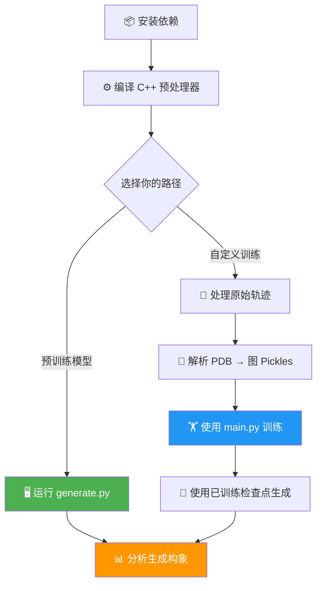

---
slug:2-quick-start
blog_type:normal
---


几分钟内让 Phanto-IDP 运行起来 —— 从环境配置到生成你的首个本征无序蛋白质（IDP）构象。本指南将引导你完成两大核心工作流：使用预训练检查点进行**即时生成**，以及基于你的轨迹数据进行**自定义训练**。


## 前置条件

Phanto-IDP 需要支持 CUDA 的 GPU 以及以下核心依赖。该模型使用 `torch.nn.DataParallel` 进行多 GPU 训练，无法在仅 CPU 的配置下运行训练或生成任务。

| 包 | 版本 | 用途 |
|---------|---------|---------|
| `numpy` | 1.19.5 | 数值运算与数据 I/O |
| `ConfigArgParse` | 1.2 | 配置与命令行参数解析 |
| `joblib` | 0.14.1 | 并行预处理任务 |
| `torch` | 1.8.0 | 深度学习框架（需 CUDA） |
| `einops` | 0.4.1 | 损失与层模块中的张量重塑 |

以下**可选**包仅用于事后分析与绘图：

| 包 | 版本 | 用途 |
|---------|---------|---------|
| `matplotlib` | 3.3.4 | Ramachandran 与 RMSD 图表 |
| `biotite` | 0.37.0 | 结构 I/O、骨架二面角、RMSD |

来源：[README.md](/README.md#L13-L22), [config.py](/config.py#L1-L6)

## 工作流概述

完整的 Phanto-IDP 流程遵循从原始 PDB 轨迹到生成构象的线性递进。下方的流程图展示了**预训练生成快捷路径**（左分支）和**完整自定义训练路径**（右分支）。



<CgxTip>选择**预训练生成**路径可快速获得结果 —— 本仓库内置了 14 个即用型检查点，涵盖 α-synuclein、Aβ42 和 RS1 等蛋白质。仅当处理所提供检查点集之外的蛋白质时，才需要使用自定义训练路径。</CgxTip>

来源：[generate.py](/generate.py#L1-L30), [main.py](/main.py#L1-L50), [pdb_parse.py](/pdb_parse.py#L1-L30)

## 步骤 1 — 环境配置

在专用的虚拟环境中安装核心包：

```bash
# 创建并激活 conda 环境
conda create -n phanto-idp python=3.8
conda activate phanto-idp

# 安装核心依赖
pip install numpy==1.19.5 ConfigArgParse==1.2 joblib==0.14.1 torch==1.8.0 einops==0.4.1

# 安装分析依赖（可选）
pip install matplotlib==3.3.4 biotite==0.37.0
```

设备配置会在导入时自动检测 —— `config.py` 在可用时选择 `cuda`，否则回退至 `cpu`。请验证你的配置：

```python
import torch
print(f"CUDA available: {torch.cuda.is_available()}")
print(f"CUDA version:   {torch.version.cuda}")
```

来源：[config.py](/config.py#L1-L6), [README.md](/README.md#L13-L22)

## 步骤 2 — 编译 C++ 预处理器

预处理流程依赖于一个已编译的 C++ 可执行文件（`get_features`），该文件从 PDB 文件中提取原子图特征。此步骤在**两种**工作流中都是必需的 —— 即便是生成流程，也至少需要构建一次预处理器，因为 `pdb_parse.py` 会引用该可执行文件的路径。

```bash
cd preprocess
make all
```

如果因编译器兼容性问题导致 `make` 失败，请手动编译：

```bash
cd preprocess/src
g++ -Wall -Wno-unused-result -pedantic -O3 -mtune=native -std=c++11 *.cpp -o ../get_features
cd ../..
```

验证构建是否成功 —— 你应能看到 `preprocess/get_features` 可执行文件。在 Linux 上，编译器要求 **GCC ≥ 6.1.0**。

来源：[preprocess/Makefile](/preprocess/Makefile#L1-L29), [preprocess/README.md](/preprocess/README.md#L1-L15)

## 步骤 3 — 使用预训练模型生成构象

这是获取结果的最快路径。本仓库提供了涵盖多种 IDP 系统的 **14 个预训练检查点**：

| 检查点文件 | 目标蛋白质 |
|-----------------|---------------|
| `RS1_best.pth.tar` | RS1 |
| `PaaA2_best.pth.tar` | PaaA2 |
| `synuclein_best.pth.tar` | α-synuclein |
| `abeta42_best.pth.tar` | Aβ42 |
| `Abeta40_best.pth.tar` | Aβ40 |
| `drkN_best.pth.tar` | drkN |
| `ACTR_best.pth.tar` | ACTR |
| `CspTm_best.pth.tar` | CspTm |
| `Histain5_best.pth.tar` | Histatin-5 |
| `R17_best.pth.tar` | R17 |
| `SPR17_best.pth.tar` | SPR17 |
| `p15PAF_best.pth.tar` | p15PAF |
| `ubiquitin_best.pth.tar` | ubiquitin |
| `AAQAA3.pth.tar` | AAQAA3 |

### 运行生成

运行前，请确保 `arguments.py` 中的 `--pretrained` 标志或 `settings.conf` 文件指向所需的检查点，并且 `--protein_dir` 和 `--pkl_dir` 指向相应的预处理数据。然后执行：

```bash
python generate.py <task_name> --temp 0.1
```

`<task_name>` 是一个必需的位置参数，用于命名输出目录。生成脚本会加载检查点，根据保存的超参数重建 `PhantoIDP` 模型架构，并通过 VAE 重参数化技巧采样新构象：

| 参数 | 默认值 | 描述 |
|-----------|---------|-------------|
| `--pretrained` | `None` | `.pth.tar` 检查点文件的路径 |
| `-n` | 5 | 每批采样的结构数量 |
| `-var` | 0.1 | 采样方差（越高 → 多样性越强，但质量可能越低） |
| `-outdir` | `conf_gens/` | 生成构象的输出目录 |
| `-device` | `cuda` | 计算设备选择 |

生成的构象会以 `.dat` 文件的形式保存在 `generates/` 目录下，命名规则为 `predicted.<batch>.<sample>.<conformation>.dat`。

<CgxTip>目前，该模型在使用**真实构象作为种子**进行生成（条件采样）时表现最佳。从纯噪声进行无条件生成仍是活跃的开发方向 —— 无条件样本的结构保真度预计会较低。</CgxTip>

来源：[generate.py](/generate.py#L1-L60), [arguments.py](/arguments.py#L30-L40), [README.md](/README.md#L47-L55)

## 步骤 4 — 基于自定义轨迹数据训练

当处理的蛋白质不在预训练检查点范围内时，你必须处理自己的 MD 轨迹数据并训练新模型。这包含三个子步骤。

### 4a. 处理原始轨迹

Shell 脚本 `traj_process.sh` 负责编排初始的轨迹清理工作 —— 从原始 PDB 文件中提取骨架原子（C、N、CA）并标准化残基名称：

```bash
# 编辑 traj_process.sh 中的 'path' 变量，使其与你的轨迹目录匹配
./traj_process.sh
```

该脚本在内部会调用 `get_list.py` 枚举 PDB 文件，然后使用 `awk` 过滤骨架原子，并使用 `sed` 将 `HIE → HIS` 残基命名标准化。运行前，你必须核实脚本内的 `path` 变量。

### 4b. 将 PDB 转换为图表示

在每个已处理的 PDB 上运行 C++ 特征提取器，然后将 JSON 输出转换为 PyTorch 数据集所使用的 pickle 文件：

```bash
# 步骤 1：从已处理的 PDB 中提取图特征 (JSON)
./preprocess/preprocessor.sh ./processed/ ./json/

# 步骤 2：转换 JSON → pickle 并构建原子初始化
python pdb_parse.py
```

`pdb_parse.py` 脚本会读取 JSON 特征文件，构建排序后的邻居映射（每个原子最多 50 个邻居），并将图数据序列化为 `.pkl` 文件。它还会生成 `protein_atom_init.json`（氨基酸独热嵌入）和 `protein_id_prop.csv`（蛋白质索引映射）。关键参数：

| 标志 | 默认值 | 描述 |
|------|---------|-------------|
| `-datapath` | `../Traj/processed/` | 存放已处理 PDB 文件的目录 |
| `-savepath` | `./data/pkl/` | pickle 文件的输出目录 |
| `-cpp_executable` | `./preprocess/get_features` | 编译后的特征提取器路径 |
| `-parallel_jobs` | 5 | 并行预处理线程数 |

### 4c. 训练模型

使用 `main.py` 启动训练。位置参数为你的实验名称（用于保存目录）：

```bash
python main.py my_experiment --epochs 400 --batch_size 32
```

你可能需要调整的关键训练参数：

| 参数 | 默认值 | 描述 |
|-----------|---------|-------------|
| `--epochs` | 20 | 训练轮数（建议 400 以实现收敛） |
| `--batch_size` | 64 | 训练批次大小 |
| `--lr` | 1e-3 | Adam 优化器学习率 |
| `--train` | 0.5 | 训练集数据比例 |
| `--val` | 0.25 | 验证集数据比例 |
| `--test` | 0.25 | 测试集数据比例 |
| `--h_a` | 64 | 原子隐藏嵌入维度 |
| `--h_g` | 9 | 图隐藏嵌入维度 |
| `--n_conv` | 3 | GCN + Transformer 层数 |
| `--save_checkpoints` | True | 是否保存模型检查点 |

在单 GPU 上，对约 38,000 个构象训练一个 epoch 约需 130 秒。该模型使用 `DataParallel` 实现自动多 GPU 分发。检查点将保存至 `./data/pkl/results/<task_name>/`，其中 `model_best.pth.tar` 会追踪最低的验证损失。

<CgxTip>训练收敛通常在 **400 个 epoch** 内达到。损失权重调度策略会在 360 个 epoch 内自动将 KL 散度权重从 1e-4 退火至 1.5e-2，并在 800 个 epoch 内将 FAPE 权重从 10.0 退火至 1.0，从而防止训练早期的后验坍塌。</CgxTip>

来源：[main.py](/main.py#L1-L80), [traj_process.sh](/traj_process.sh#L1-L9), [pdb_parse.py](/pdb_parse.py#L1-L25), [arguments.py](/arguments.py#L1-L50), [README.md](/README.md#L28-L46)

## 步骤 5 — 分析结果

生成构象后，使用 `Analysis/` 目录下的分析脚本评估结构质量：

| 脚本 | 计算内容 | 输入 |
|--------|-----------------|-------|
| `rmsd_calculation.py` | 预测 PDB 与目标 PDB 间的 RMSD | 两个 `.pdb` 文件 |
| `rmsd_plot.py` | RMSD 分布图 | 生成的 `.dat` 文件 |
| `ramachandran.py` | φ/ψ 二面角密度图 | 预测的 `.pdb` 文件目录 |
| `rg.py` | 回转半径分布 | 生成的结构 |
| `pca.py` | 构象系综的主成分分析 | 生成的构象 |
| `refine_openmm.py` | 使用 OpenMM 进行结构能量最小化 | 生成的 `.pdb` 文件 |

例如，计算生成结构与参考结构之间的 RMSD：

```bash
cd Analysis
python rmsd_calculation.py
```

从预测结构系综生成 Ramachandran 图：

```bash
cd Analysis
python ramachandran.py
```

`Scripts/biotite_utils.py` 模块提供了基于 `biotite` 库的可复用工具，用于序列提取、骨架二面角计算、pLDDT 提取和 RMSD 计算。

来源：[Analysis/rmsd_calculation.py](/Analysis/rmsd_calculation.py#L1-L12), [Analysis/ramachandran.py](/Analysis/ramachandran.py#L1-L54), [Scripts/biotite_utils.py](/Scripts/biotite_utils.py#L1-L30)

## 接下来去哪儿

现在你已经能够生成并分析 IDP 构象，接下来可以进一步加深对该系统的理解：

- **理解模型架构** → [架构概览](3-architecture-overview)
- **了解 VAE 编码器-解码器的工作原理** → [VAE 编码器-解码器设计](4-vae-encoder-decoder-design)
- **探索 GCN 与 Transformer 模块** → [GCN 卷积层](5-gcn-convolution-layers) · [Transformer 解码器块](6-transformer-decoder-blocks)
- **掌握训练流程与损失设计** → [训练流水线](7-training-pipeline) · [FAPE 损失函数](8-fape-loss-function)
- **深度自定义数据预处理** → [PDB 预处理流水线](10-pdb-preprocessing-pipeline) · [图数据集构建](11-graph-dataset-construction)
- **完整参数参考** → [配置与参数参考](15-configuration-and-arguments-reference)