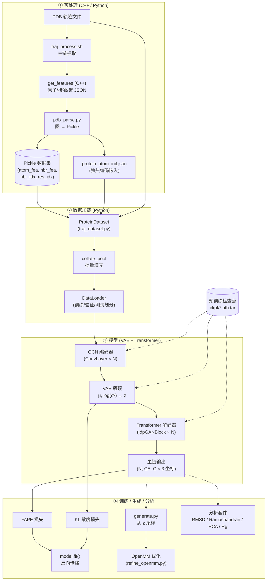
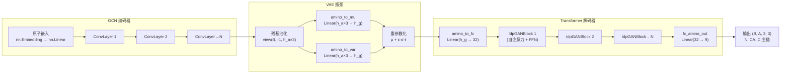

---
slug:3-architecture-overview
blog_type:normal
---


Phanto-IDP 是一个**基于 VAE 的生成式深度学习模型**，专为精确重建本质无序蛋白 (IDP) 构象系综及高速生成未观测的主链结构而设计。该系统将 C++ 特征提取流水线、带有 Transformer 解码的 PyTorch 图神经网络以及事后结构分析工具，整合为一个紧密的端到端工作流。本页映射了完整的架构——从数据摄入到构象生成——以便你能在清晰地了解各组件如何连接的心智模型下，轻松导航整个代码库。


来源: [README.md](/README.md#L1-L6), [model.py](/model.py#L13-L18)

## 系统架构图

下面的 Mermaid 图展示了四阶段流水线及各阶段内的主要模块。实线箭头表示数据流；虚线箭头表示可选或条件路径（如 OpenMM 优化、预训练检查点加载）。



来源: [main.py](/main.py#L17-L110), [model.py](/model.py#L29-L102), [traj_dataset.py](/traj_dataset.py#L105-L173), [pdb_parse.py](/pdb_parse.py#L54-L137), [preprocess/src/main.cpp](/preprocess/src/main.cpp#L8-L61)

## 核心组件概览

下表总结了每个顶层模块、其职责及暴露的关键类或函数。在深入各个子系统文档之前，此表可作为快速参考导航。

| 模块 | 文件 | 职责 | 关键抽象 |
|---|---|---|---|
| **参数解析器** | `arguments.py` | CLI + 配置文件参数定义 | `buildParser()` |
| **设备配置** | `config.py` | 全局 CUDA/CPU 张量类型选择 | `device`, `FloatTensor` |
| **模型核心** | `model.py` | VAE 编码器-解码器、损失计算、帧构建 | `PhantoIDP` (nn.Module) |
| **GCN 层** | `layers.py` → `ConvLayer` | 原子图上的消息传递与门控聚合 | `ConvLayer` |
| **Transformer 块** | `layers.py` → `IdpGANBlock` | 残基序列的残差自注意力 + 前馈更新 | `IdpGANBlock` |
| **注意力层** | `layers.py` → `IdpGANLayer` | 带可选 2D 偏置的多头点积注意力 | `IdpGANLayer` |
| **损失函数** | `utils.py` | FAPE 损失、KL 散度损失、RMSD 辅助函数 | `FAPEloss`, `KL_loss` |
| **训练循环** | `main.py` | 轮次迭代、损失调度、检查点管理 | `trainModel()` |
| **生成循环** | `generate.py` | 带温度控制的从已学习潜在空间采样 | `generate()` |
| **数据集** | `traj_dataset.py` | PDB 解析、Pickle 加载、带填充的批处理 | `ProteinDataset`, `collate_pool` |
| **PDB→图解析器** | `pdb_parse.py` | JSON→Pickle 转换、邻居排序、独热编码 | `createSortedNeighbors()` |
| **C++ 预处理器** | `preprocess/src/` | 原子特征提取、接触/键计算、LDDT 评分 | `get_features` 二进制文件 |
| **分析** | `Analysis/` | RMSD、Ramachandran、PCA、Rg、OpenMM 优化 | 各类脚本 |

来源: [arguments.py](/arguments.py#L1-L50), [config.py](/config.py#L1-L6), [model.py](/model.py#L13-L27), [layers.py](/layers.py#L7-L37), [layers.py](/layers.py#L40-L99), [layers.py](/layers.py#L146-L183), [utils.py](/utils.py#L88-L134), [main.py](/main.py#L164-L266), [generate.py](/generate.py#L134-L153), [traj_dataset.py](/traj_dataset.py#L42-L64), [pdb_parse.py](/pdb_parse.py#L79-L104)

## 数据流：从 PDB 到模型输入

理解数据转换链至关重要——每个阶段都将表示粒度从原始 3D 坐标改变为已学习的潜在向量。

**阶段 ① — 原始 PDB → JSON 特征。** `traj_process.sh` Shell 脚本首先过滤 PDB 文件，仅保留主链原子 (N, CA, C)，并规范化非标准残基名称（如 HIE → HIS）。随后，编译好的 C++ 二进制文件 `get_features` 解析每个过滤后的 PDB，生成包含以下内容的 JSON 文件：`atoms`（残基_原子类型标签）、`res_idx`（原子到残基的映射）、`bonds`（共价键对）和 `contacts`（前 N 个最近邻对，包含原子间距离和局部帧投影）。此步骤计算量大，通过 `pdb_parse.py` 使用 joblib 进行并行化处理。

**阶段 ② — JSON → Pickle 图。** `pdb_parse.py` 脚本读取所有 JSON 文件，按距离对每个原子的邻居进行排序（上限为 `max_neighbors=50`），并将每个构象的四个数组序列化为一个 Pickle 文件：原子特征、邻居特征（距离 + 局部帧坐标 + 键标志）、邻居索引邻接矩阵以及残基到原子的映射。同时，它生成 `protein_atom_init.json` —— 一个从 `groups20.txt` 读取的 20 种标准氨基酸组的独热编码映射。

**阶段 ③ — Pickle → 批量张量。** 在训练时，`ProteinDataset.__getitem__` 加载 Pickle 数据，并将其与直接从原始 PDB 文件解析的真实 N/CA/C 主链坐标配对。`collate_pool` 函数对一个批次内长度可变的蛋白质进行零填充，使其达到统一维度（最大原子数 × 最大邻居数），生成模型期望的三个输入张量：`atom_emb_idx` [B, N]、`nbr_emb` [B, N, M, h_b] 和 `nbr_adj_list` [B, N, M]。

来源: [traj_process.sh](/traj_process.sh#L1-L9), [pdb_parse.py](/pdb_parse.py#L54-L137), [preprocess/src/main.cpp](/preprocess/src/main.cpp#L86-L141), [traj_dataset.py](/traj_dataset.py#L105-L173), [traj_dataset.py](/traj_dataset.py#L42-L64)

## 模型架构：VAE + Transformer 解码器

`PhantoIDP` 模型实现了一个**三阶段前向传播**，通过变分瓶颈将原子级图表示逐步转换为残基级主链坐标。



**阶段 1 — GCN 编码器。** 原子索引通过一个冻结的 `nn.Embedding`（由 `protein_atom_init.json` 初始化）进行查找，并通过 `nn.Linear(h_init → h_a)` 进行投影。生成的嵌入通过 `n_conv` 个堆叠的 `ConvLayer` 模块进行精炼，每个模块执行**门控消息传递**：邻居嵌入与中心原子和键特征拼接后，通过一个线性层，然后分割成一个 sigmoid 门控滤波器和一个 ReLU 激活的核心。邻居的滤波求和残差地加到中心原子嵌入上。

**阶段 2 — VAE 瓶颈。** 原子嵌入通过将每三个原子 (N, CA, C) 分组为一个维度为 `h_a × 3` 的向量，从而重塑为残基级。两个并行的线性头将其映射到潜在分布的均值（`amino_to_mu`）和对数方差（`amino_to_var`）。**重参数化技巧**采样 z = μ + ε·exp(½·log σ²)·t，其中 t 是控制采样多样性的温度参数。

**阶段 3 — Transformer 解码器。** 采样的潜在向量通过 `amino_to_fc` 投影到维度 32，然后通过 `n_conv` 个堆叠的 `IdpGANBlock` 模块进行精炼。每个块应用带残差连接的多头自注意力（8 个头，d_model=128），随后是带另一个残差连接和后范数 LayerNorm 的前馈更新器（Linear → ReLU → Dropout → Linear）。最终的 `fc_amino_out` 线性层将每个残基嵌入映射到 9 个值，重塑为每个残基的 (3 个主链原子 × 3 个坐标)。

来源: [model.py](/model.py#L29-L102), [model.py](/model.py#L72-L102), [layers.py](/layers.py#L7-L37), [layers.py](/layers.py#L40-L143), [model.py](/model.py#L119-L123)

## 损失计算与训练信号

模型的 `fit` 方法根据两个互补信号计算复合损失：

| 损失组件 | 公式 | 作用 | 权重调度 |
|---|---|---|---|
| **FAPE** | 跨 N, CA, C 的帧对齐点误差 | SE(3) 不变性下的结构准确性 | `weight_fape_list`: [10.0, 2.0, 1.0]，在第 400、800 轮步进 |
| **KL 散度** | −0.5 · (1 + 2·log σ² − μ² − σ⁴) | 将潜在空间向 N(0,1) 正则化 | `weight_list`: [1e-4 → 1.5e-2]，每 60 轮步进 |
| **总计** | FAPE × w_fape / 3 − KL × w_kl | 在保持潜在空间覆盖的同时最大化结构拟合 | 依赖轮次的调度 |

FAPE 损失作用于使用 Gram-Schmidt 算法（`from_3_points`）从预测和目标主链三元组 (N, CA, C) 构建的**刚体帧**。对于三个主链原子中的每一个，FAPE 测量在对齐到各自局部帧后，目标点与预测点之间的平均距离，钳位在 10Å 并以 Z=10 归一化。KL 损失在总损失中以**负号**应用（最大化 ELBO），其权重从接近零积极退火，以允许 VAE 先学习重建，然后再正则化潜在空间。

<CgxTip>损失权重调度是训练稳定性的最关键超参数。FAPE 权重起始较高 (10.0) 并逐渐降低，迫使早期轮次关注结构准确性。KL 权重起始接近零 (1e-4) 并逐渐增加，通过逐步鼓励潜在空间正则化来防止后验坍塌。</CgxTip>

来源: [model.py](/model.py#L202-L224), [utils.py](/utils.py#L88-L129), [utils.py](/utils.py#L132-L134), [main.py](/main.py#L173-L178), [model.py](/model.py#L131-L171)

## 生成流水线

`generate.py` 脚本加载预训练检查点，将测试集输入通过编码器以获得 μ 和 log σ²，然后在低温度（默认 0.05）下**反复从潜在空间采样**以生成多样化的构象。`model.sample()` 方法完全绕过编码器——它接收一个预采样的潜在向量，仅运行 Transformer 解码器 + 输出投影，从而实现快速的迭代采样。

| 参数 | 默认值 | 效果 |
|---|---|---|
| `avg_sample` | 2 | 每个输入构象的采样数量 |
| `temp` (在重参数化中) | 0.05 | 采样温度；越低越接近 μ，越高多样性越大 |

生成的坐标保存为 `.dat` 文件，并可通过 **OpenMM 能量最小化**（`Analysis/refine_openmm.py`）进行可选优化，该过程通过 PDBFixer 修复缺失的原子/氢，然后使用 AMBER99SB 力场对非氢原子施加谐形势束缚（刚度 = 10.0 kcal/mol/Ų）进行受限能量最小化。

来源: [generate.py](/generate.py#L134-L153), [model.py](/model.py#L104-L117), [model.py](/model.py#L119-L123), [Analysis/refine_openmm.py](/Analysis/refine_openmm.py#L80-L116)

## 项目结构

```
Phanto-IDP/
├── main.py                  # 训练入口点
├── generate.py              # 构象生成入口点
├── model.py                 # PhantoIDP 模型 (VAE + GCN + Transformer)
├── layers.py                # ConvLayer, IdpGANBlock, IdpGANLayer
├── utils.py                 # FAPE 损失, KL 损失, RMSD, 实用工具
├── arguments.py             # CLI 参数定义
├── config.py                # 全局设备/张量配置
├── pdb_parse.py             # JSON → Pickle 图转换
├── traj_dataset.py          # ProteinDataset + 批处理
├── get_list.py              # PDB 文件列表工具
├── traj_process.sh          # 轨迹过滤脚本
├── ckpt/                    # 预训练模型检查点 (13 种蛋白质)
├── preprocess/              # C++ 特征提取 (mylddt 分支)
│   ├── src/                 #   Atom, Chain, Residue, MyLDDT 类
│   ├── Makefile             #   构建系统
│   └── preprocessor.sh      #   批量 JSON 提取脚本
├── Analysis/                # 生成后分析工具
│   ├── ramachandran.py      #   φ/ψ 二面角密度图
│   ├── rmsd_calculation.py  #   成对 RMSD 计算
│   ├── refine_openmm.py     #   基于物理的结构优化
│   ├── pca.py               #   距离矩阵 PCA 可视化
│   └── rg.py                #   回转半径统计
├── Scripts/
│   └── biotite_utils.py     #   基于 Biotite 的结构工具
└── StrucRef/                #   用于评估的参考结构
```

来源: [main.py](/main.py#L1-L15), [generate.py](/generate.py#L1-L14), [model.py](/model.py#L1-L12), [layers.py](/layers.py#L1-L6), [utils.py](/utils.py#L1-L8), [traj_dataset.py](/traj_dataset.py#L1-L13), [pdb_parse.py](/pdb_parse.py#L1-L31), [Analysis/ramachandran.py](/Analysis/ramachandran.py#L1-L10), [Analysis/refine_openmm.py](/Analysis/refine_openmm.py#L1-L18), [Scripts/biotite_utils.py](/Scripts/biotite_utils.py#L1-L12)

## 关键设计决策

| 决策 | 理由 | 实现 |
|---|---|---|
| **图表示而非序列** | IDP 缺乏稳定的三级结构；原子级图能捕获局部几何而无需假设折叠拓扑 | 带有邻居排序邻接的 GCN 编码器 [layers.py](/layers.py#L7-L37) |
| **VAE 而非 GAN** | VAE 的潜在空间支持可控采样和插值；KL 正则化防止模式坍塌 | 带温度的重参数化技巧 [model.py](/model.py#L119-L123) |
| **FAPE 而非 RMSD** | FAPE 是 SE(3) 不变且帧感知的，提供比全局 RMSD 更丰富的梯度信号 | 通过 Gram-Schmidt 构建帧 [model.py](/model.py#L131-L171)，损失在 [utils.py](/utils.py#L88-L129) |
| **C++ 预处理** | 大轨迹系综上的接触/键计算对性能要求极高；带 O3 优化的 C++ 相比 Python 提供 10-100 倍加速 | `get_features` 二进制文件 [preprocess/src/main.cpp](/preprocess/src/main.cpp#L8-L27) |
| **损失权重退火** | 防止后验坍塌（早期 KL 过强）和过度正则化（晚期 FAPE 过强） | 轮次步进权重列表 [main.py](/main.py#L173-L178) |
| **解码用 Transformer 而非 RNN** | 自注意力能捕获长程残基依赖，这对扩展的无序构象至关重要 | 带多头注意力的 `IdpGANBlock` [layers.py](/layers.py#L40-L143) |

<CgxTip>该架构将每个 PDB 构象视为独立的图——跨轨迹帧没有时间建模。此设计选择将 IDP 系综视为平衡分布，这适用于无序蛋白，但意味着动力学信息不会被保留。</CgxTip>

来源: [model.py](/model.py#L29-L70), [main.py](/main.py#L173-L178), [layers.py](/layers.py#L40-L99), [preprocess/src/main.cpp](/preprocess/src/main.cpp#L58-L61)

## 建议阅读路径

现在你已经掌握了架构蓝图，请按照以下顺序加深对每个子系统的理解：

1. **[VAE 编码器-解码器设计](4-vae-encoder-decoder-design)** — 变分瓶颈、重参数化技巧，以及编码器输出如何连接到解码器输入
2. **[GCN 卷积层](5-gcn-convolution-layers)** — 门控消息传递机制、邻居聚合及批量归一化策略
3. **[Transformer 解码器块](6-transformer-decoder-blocks)** — 自注意力公式、残差更新及前馈更新器模块
4. **[训练流水线](7-training-pipeline)** — 完整训练循环、检查点管理及评估协议
5. **[FAPE 损失函数](8-fape-loss-function)** — 帧对齐点误差推导、Gram-Schmidt 帧构建及 SE(3) 不变性
6. **[PDB 预处理流水线](10-pdb-preprocessing-pipeline)** — C++ 特征提取、JSON 模式及 Pickle 序列化格式
7. **[构象生成](12-conformation-generation)** — 从潜在空间采样、温度控制及 OpenMM 优化