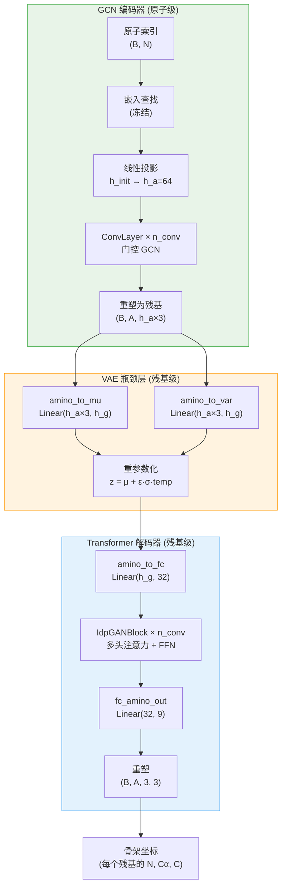
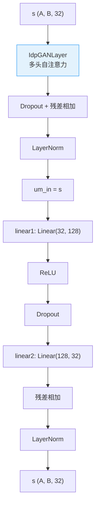

---
slug:4-vae-encoder-decoder-design
blog_type:normal
---


PhantoIDP 实现了一个**变分自编码器 (VAE)**，其编码器将本质无序蛋白的结构分布捕获为潜在的图表示，解码器则通过一叠 Transformer 模块重建每个残基的 3D 骨架坐标 (N, Cα, C)。该架构刻意采用了非对称设计——**基于 GCN 的编码器**处理原子级别的图拓扑，而**基于 Transformer 的解码器**则在潜在空间的残基级别上运行——这反映了一个深刻洞见：局部化学键编码了物理规律，而长程残基相互作用支配着无序蛋白的全局构象。

来源: [model.py](model.py#L13-L123), [layers.py](layers.py#L1-L247)

## 架构概述

完整的前向传播由 `PhantoIDP.forward()` 统一调度，它依次链式执行四个阶段：**(1)** 原子嵌入 + GCN 编码，**(2)** 残基池化 + VAE 参数化，**(3)** 重参数化，以及 **(4)** Transformer 解码 + 坐标投影。下图追溯了对于一个包含 `B` 个蛋白、`N` 个原子、`A` 个残基、每个原子有 `M` 个邻居，且隐藏维度为 `h_a=64`、`h_g`（可配置）的批次，在各阶段张量形状的变化过程。



**编码器**在分子图上运行，其中原子是节点，化学键是边。经过 `n_conv` 轮门控消息传递后，每个残基的三个骨架原子 (N, Cα, C) 的逐原子嵌入沿特征维度拼接——生成维度为 `h_a × 3 = 192` 的残基级描述符。随后，两个并行的线性头将该描述符映射到 VAE 参数 **μ** 和 **log σ²**，重参数化技巧则为每个残基采样一个潜在向量 **z** ∈ ℝ^{h_g}。**解码器**将 **z** 投影到 32 维嵌入中，通过 `n_conv` 个 Transformer 模块进行精炼（这些模块利用多头自注意力对残基间的依赖关系进行建模），最后将每个残基投影为 9 个标量值（3 个原子 × 3 个坐标）。

来源: [model.py](model.py#L72-L102)

## 编码器：带门控消息传递的 GCN

### 原子嵌入初始化

编码器以一个**冻结的嵌入查找**开始——原子类型被映射到从 JSON 文件 (`protein_atom_init.json`) 加载的预计算特征向量。这些向量源自 C++ 预处理流水线，编码了化学身份信息。`nn.Embedding.from_pretrained` 层被冻结 (`freeze=True`)，因此这些表征作为固定的先验而非可学习的参数。随后，一个可训练的 `nn.Linear` 将原始嵌入维度 `h_init` 投影到隐藏原子维度 `h_a`。

来源: [model.py](model.py#L30-L52)

### ConvLayer — 门控图卷积

每个 `ConvLayer` 实现了一种受 Gilmer 等人 (2017) 启发的**门控消息传递**机制。对于每个原子，从其 `M` 个最近邻收集消息，通过 sigmoid 门控机制进行过滤，并经求和聚合后再与残差连接相结合。

```mermaid
flowchart LR
    A["atom_emb<br/>&#40;B, N, h_a&#41;"] --> CAT
    B["neighbor_emb<br/>&#40;B, N, M, h_a&#41;"] --> CAT
    C["bond_emb<br/>&#40;B, N, M, h_b&#41;"] --> CAT
    CAT["拼接<br/>&#40;B, N, M, 2h_a+h_b&#41;"] --> FC["fc_full<br/>Linear → &#40;B,N,M,2h_a&#41;"]
    FC --> BN1["BatchNorm1d"]
    BN1 --> SPLIT["切分为 2"]
    SPLIT --> GATE["sigmoid &#40;过滤&#41;"]
    SPLIT --> CORE["ReLU &#40;核心&#41;"]
    GATE --> MUL["⊙ &#40;逐元素相乘&#41;"]
    CORE --> MUL
    MUL --> SUM["对 M 个邻居求和<br/>&#40;B, N, h_a&#41;"]
    SUM --> BN2["BatchNorm1d"]
    BN2 --> RES["+ atom_emb &#40;残差&#41;"]
    RES --> OUT["ReLU → 输出<br/>&#40;B, N, h_a&#41;"]
```



门控机制将线性输出切分为两个维度为 `h_a` 的部分：一个通过 **sigmoid**（门控/过滤分支），另一个通过 **ReLU**（核心/消息分支）。逐元素乘积 `σ(gate) ⊙ ReLU(core)` 充当了针对邻居特征的学习型软注意力——过滤分支学习传递*哪些*信息，而核心分支决定传递*什么*信息。该结果在所有 `M` 个邻居上求和，进行批次归一化，并通过残差连接与原始原子嵌入相结合。

| 组件 | 输入维度 | 输出维度 | 激活函数 | 用途 |
|-----------|-----------|------------|------------|---------|
| `fc_full` | 2·h_a + h_b | 2·h_a | 无 | 自身 + 邻居 + 化学键的联合变换 |
| 过滤分支 | h_a | h_a | Sigmoid | 门控：学习传播*哪些*特征 |
| 核心分支 | h_a | h_a | ReLU | 消息：学习传播*什么*特征 |
| `bn_hidden` | 2·h_a | 2·h_a | — | 在切分前稳定门控输出 |
| `bn_output` | h_a | h_a | — | 归一化聚合后的消息 |
| 残差 + ReLU | h_a | h_a | ReLU | 与自嵌入结合 |

来源: [layers.py](layers.py#L7-L37)

### 残基级池化

在最后的 GCN 层之后，原子级嵌入从 `(B, N, h_a)` 重塑为 `(B, A, h_a × 3)`，其中 `A` 是残基数量。这种重塑是一种**基于拼接的硬编码池化**——属于每个残基的三个骨架原子 (N, Cα, C) 沿特征轴拼接，而非取平均。这保留了残基表示中每种原子类型的独特化学身份。因子 3 受到结构上的强制约束：数据集的目标明确是 N, Cα 和 C 坐标，且邻接表确保了这些原子在每个残基内是连续分组的。

来源: [model.py](model.py#L84-L86), [traj_dataset.py](traj_dataset.py#L53-L61)

## VAE 瓶颈层：参数化与重参数化

### 映射到潜在空间

维度为 `h_a × 3` 的残基级描述符经过共享的 `ReLU` 激活函数后，被**两个并行的线性头**投影：

- **`amino_to_mu`**: `Linear(h_a × 3, h_g)` → 近似后验 q(z|x) 的均值 **μ**
- **`amino_to_var`**: `Linear(h_a × 3, h_g)` → 近似后验 q(z|x) 的对数方差 **log σ²**

两个头共享相同的输入（经 ReLU 激活的残基描述符），但拥有**独立的权重矩阵**，使其能够各司其职——均值头捕获确定性的结构倾向，而方差头量化构象的不确定性，这正是 IDP 的核心关注量。

### 重参数化技巧

```python
@staticmethod
def reparameterize(means, logvars, temp=1.0):
    std = torch.exp(0.5 * logvars)
    eps = torch.randn_like(std)
    return means + eps * std * temp
```

这实现了标准的 VAE 重参数化：**z = μ + ε · σ · temp**，其中 ε ~ N(0, I)。`temp` 参数控制采样的多样性——在训练期间 `temp=1.0`（默认值），而在生成期间它被设定为一个较小的值（例如 0.05），以产生靠近均值且方差可控的结构。`0.5 * logvars` 的公式计算了 σ = exp(0.5 · log σ²) = exp(log σ)，在保证数值稳定性的同时确保了结果为正数。

<CgxTip>`reparameterize()` 中的 `temp` 参数具有双重用途：在训练期间 `temp=1.0` 保持了穿过随机节点的梯度流；在生成期间（参见 `generate.py`）`temp=0.05` 充当多样性旋钮——较低的值产生更靠近众数的结构，较高的值则探索学习分布的尾部。</CgxTip>

来源: [model.py](model.py#L55-L56), [model.py](model.py#L119-L123), [generate.py](generate.py#L146-L148)

## 解码器：用于残基级精炼的 Transformer 模块

### 投影与 Transformer 堆叠

采样得到的潜在向量 **z** ∈ ℝ^{h_g} 首先通过 `amino_to_fc` 投影：`Linear(h_g, 32)`，在进入 Transformer 堆叠前降低维度。张量被转置为 `(A, B, 32)`——这是 PyTorch 风格的 Transformer 实现所期望的 `(序列长度, 批次大小, 嵌入维度)` 格式——然后通过 `n_conv` 个 `IdpGANBlock` 实例进行处理。

### IdpGANBlock — Transformer 解码器块

每个 `IdpGANBlock` 遵循标准的**后归一化 Transformer** 架构：一个多头自注意力子层后接一个逐位置前馈子层，每层都包裹了残差连接与层归一化。



| 参数 | 值 | 描述 |
|-----------|-------|-------------|
| `embed_dim` | 32 | 残基嵌入维度 |
| `d_model` | 128 | 内部注意力维度 (Q, K, V 投影空间) |
| `nhead` | 8 | 注意力头数量 |
| `dim_feedforward` | 128 | FFN 隐藏维度 |
| `dropout` | 0.1 | 注意力权重与 FFN 的 Dropout 率 |
| `norm_pos` | "post" | 在残差之后应用 LayerNorm (后归一化) |
| `activation` | "relu" | FFN 中间层激活函数 |

### IdpGANLayer — 多头自注意力

该注意力层实现了具有 `nhead=8` 个头的缩放点积注意力。每个头在 `head_dim = d_model / nhead = 16` 维的子空间上运行。查询、键和值通过无偏置线性层从输入维度 (`embed_dim=32`) 投影到 `d_model=128`，然后重塑为 `(batch × nhead, seq_len, head_dim)` 以进行并行的多头计算。

注意力亲和度计算公式为：**Attention(Q, K, V) = softmax(Q·K^T / √d_model) · V**，缩放因子为 `1/√128`。架构中存在一个 2D 成对分支 (`mlp_2d`)，但在当前配置中已被禁用 (`embed_dim_2d=None`))，使得纯点积注意力成为唯一的亲和度机制。

<CgxTip>16 的头维度 (128 / 8) 与标准 Transformer（通常为 64）相比显著较小。这是有意为之——IDP 属于短序列（通常 < 50 个残基），因此紧凑的头能防止过拟合，同时仍能捕获骨架间的局部结构相关性。</CgxTip>

来源: [model.py](model.py#L60-L70), [model.py](model.py#L92-L102), [layers.py](layers.py#L40-L143), [layers.py](layers.py#L146-L247)

## 坐标输出与坐标系构建

### 输出投影

在最后的 Transformer 块之后，张量被转置回 `(B, A, 32)` 并通过 `fc_amino_out` 投影：`Linear(32, 9)`。每个残基的 9 个输出值被重塑为 `(3, 3)`，代表三个骨架原子 N、Cα 和 C 的 **x, y, z 坐标**。模型的 `forward()` 返回一个元组：`(predicted_coords, amino_mu, amino_logvar)`，其中 `predicted_coords` 的形状为 `(B, A, 3, 3)`。

### 基于 Gram-Schmidt 的局部坐标系构建

在损失计算期间，预测和目标坐标通过 `from_3_points()` 被转换为**局部参考系**，该函数实现了 AlphaFold2 补充材料中的算法 21。给定三个点 (p_neg_x_axis, origin, p_xy_plane)，它通过 Gram-Schmidt 过程构建正交基：

1. **e₀** = normalize(origin − p_neg_x_axis) — 局部 x 轴
2. **e₁** = normalize(p_xy_plane − origin − (e₀ · (p_xy_plane − origin)) · e₀) — 局部 y 轴 (Gram-Schmidt 正交化)
3. **e₂** = e₀ × e₁ — 局部 z 轴 (叉积)

由此产生的 3×3 旋转矩阵与平移向量定义了每个残基的**刚体坐标系**，这是 FAPE 损失所需的几何基元。这种坐标系构建在数学上与 AlphaFold2 定义其骨架坐标系的方式完全一致，实现了预测结构与目标结构之间的旋转不变比较。

来源: [model.py](model.py#L99-L102), [model.py](model.py#L132-L171), [model.py](model.py#L210-L218)

## 采样与生成路径

该模型提供了两种不同的前向路径：

| 路径 | 方法 | 编码器 | 解码器 | 用例 |
|------|--------|---------|---------|----------|
| **训练** | `forward()` | ✅ GCN → μ, log σ² → z | ✅ Transformer → 坐标 | 学习 VAE 参数 |
| **生成** | `sample()` | ❌ 绕过 | ✅ Transformer → 坐标 | 采样新构象 |

在生成阶段（在 `generate.py` 中），编码器运行一次以获取每个残基的 **μ**，随后调用 `reparameterize()` 并传入 **μ** 与 `log σ² = 0`（单位方差）以及 `temp=0.05`——这实际上是在均值附近以极小扰动进行采样。针对每个输入会抽取多个样本（`avg_sample` 次迭代），以产生多样的构象系综，同时保持结构质量。这种受控方差采样策略对 IDP 至关重要：它在探索构象景观与避免生成物理上不合理结构之间取得了平衡。

来源: [model.py](model.py#L104-L117), [generate.py](generate.py#L141-L151)

## 维度流总结

下表追溯了在默认超参数 (`h_a=64`, `h_g=9`, `n_conv=3`) 下，完整的张量形状变换经过编码器和解码器的全过程：

| 阶段 | 操作 | 形状 |
|-------|-----------|-------|
| 输入 | 原子索引 | `(B, N)` |
| 嵌入 | 查找 + 线性 | `(B, N, 64)` |
| GCN × 3 | ConvLayer (门控) | `(B, N, 64)` |
| 池化 | 重塑为残基 | `(B, A, 192)` |
| VAE μ | Linear(192, 9) | `(B, A, 9)` |
| VAE log σ² | Linear(192, 9) | `(B, A, 9)` |
| 重参数化 | z = μ + ε·σ·temp | `(B, A, 9)` |
| 投影 | Linear(9, 32) | `(A, B, 32)` |
| Transformer × 3 | IdpGANBlock | `(A, B, 32)` |
| 输出投影 | Linear(32, 9) | `(B, A, 9)` |
| 重塑 | → 3 原子 × 3 坐标 | `(B, A, 3, 3)` |

来源: [model.py](model.py#L72-L102), [arguments.py](arguments.py#L40-L42)

## 设计原理与关键模式

该架构体现了多项刻意的设计选择，使其有别于通用的 VAE 或蛋白质结构预测模型：

**非对称编码器-解码器**：GCN 编码器处理细粒度的原子级信息（化学键类型、邻居几何结构），这些信息在残基级别是无法获取的；而 Transformer 解码器则在较粗的残基级别上运行，在此级别上，链中远端部分之间的长程依赖对于捕获 IDP 的构象异质性至关重要。

**残基级潜在空间**：VAE 瓶颈层为每个残基生成一个 **z**，而非为每个原子生成潜在向量。这不仅在计算上高效，且有物理依据——IDP 的构象柔性主要由残基级相互作用（疏水性、电荷、脯氨酸约束）决定，而非单个原子位置。

**门控 GCN 优于标准 GCN**：`ConvLayer` 中的 sigmoid 门控消息传递比简单的求和/平均聚合提供了更丰富的表达能力。过滤分支可以学习抑制来自化学上无关邻居的信息（例如，在更新埋藏原子的表示时忽略远处的溶剂暴露原子），这对于无序蛋白中异质性的局部环境尤为重要。

**紧凑的 Transformer 头**：在 `head_dim=16` 的设置下，每个注意力头捕获狭窄的结构相关性。8 个头共同跨越 128 维的注意力空间，但每个头的较小容量充当了隐式正则化——防止解码器过拟合于特定的训练构象，当训练集仅代表真实构象系综的极小一部分时，这一点至关重要。

来源: [model.py](model.py#L29-L70), [layers.py](layers.py#L7-L37), [layers.py](layers.py#L146-L181)

## 导航

- **下一步**: 深入了解 GCN 内部机制 → [GCN 卷积层](5-gcn-convolution-layers)
- **下一步**: 探索 Transformer 解码器内部机制 → [Transformer 解码器块](6-transformer-decoder-blocks)
- **下一步**: 理解 VAE 损失如何驱动训练 → [训练流水线](7-training-pipeline)
- **向上**: 返回架构概述 → [架构概述](3-architecture-overview)