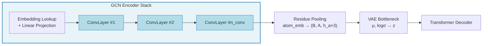
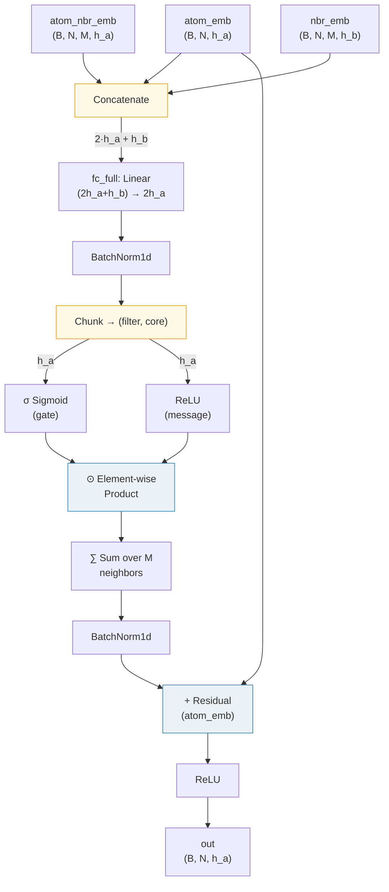
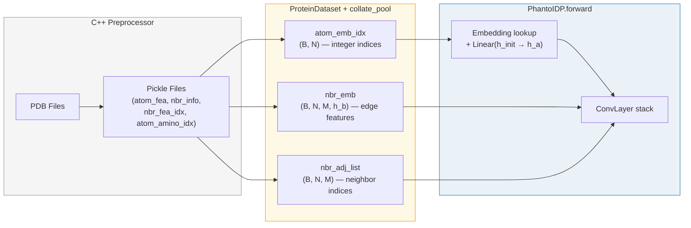

---
slug:5-gcn-convolution-layers
blog_type:normal
---

`ConvLayer` 是 Phanto-IDP 中的基础消息传递原语——一种**门控图卷积**，它通过聚合分子图中每个原子局部邻域的信息来转换原子级嵌入。这些卷积层顺序堆叠（默认 3–4 层），构成了 VAE 的**编码器**，在到达潜在瓶颈层之前，将每个原子的特征向量从初始化学嵌入逐步精炼为具备结构感知能力的隐藏表示。该设计遵循了 Xie 和 Grossman（CGCNN，2018）提出的 filter-core 门控范式，此处针对本质上无序的蛋白质构象进行了适配，其中图拓扑编码了单一结构快照内的原子间邻近度。

来源: [layers.py](/layers.py#L7-L37), [model.py](/model.py#L53-L53)

## 编码器流水线中的架构角色

GCN 卷积层位于 `PhantoIDP` 前向传播的最前端，紧接在原子嵌入查找和线性投影之后。它们是唯一在**原子级图**上操作的组件——每个下游模块（VAE 瓶颈层、Transformer 解码器）均在残基级别上工作。这使得卷积堆栈承担了将局部几何与化学信息转换为适用于残基级池化的稠密原子嵌入的关键任务。

在整个堆栈中，每个 `ConvLayer` 都接收相同的三个输入：当前的原子嵌入（`atom_emb`）、**固定的**键/边嵌入（`nbr_emb`）以及**固定的**邻居邻接索引（`nbr_adj_list`）。只有 `atom_emb` 会在层间更新；图结构和边特征保持不变——这是图神经网络中标准的设计选择，可避免重复计算拓扑结构。

来源: [model.py](/model.py#L72-L82), [model.py](/model.py#L44-L53)

## ConvLayer：门控消息传递机制

`ConvLayer` 实现了三阶段计算：**(1) 邻居收集**、**(2) 门控聚合** 和 **(3) 残差更新**。下图追踪了各阶段的张量变换过程：

### 阶段 1：邻居收集

给定形状为 `(B, N, M)` 的邻接表 `nbr_adj_list`——其中 **M** 是每个原子固定的最大邻居数——该层通过高级索引收集每个原子的 M 个邻居的嵌入：`atom_emb[torch.arange(B).unsqueeze(-1), nbr_adj_list.view(B, -1)]`。这将产生形状为 `(B, N, M, h_a)` 的 `atom_nbr_emb`，随后将其与中心原子的嵌入（在 M 维度上广播）以及每条边的键特征向量进行拼接，生成形状为 `(B, N, M, 2·h_a + h_b)` 的联合张量。

来源: [layers.py](/layers.py#L21-L27)

### 阶段 2：门控聚合

拼接后的张量经过 `fc_full`（一个将 `2·h_a + h_b → 2·h_a` 进行投影的线性层），随后在展平的 `(B·N·M)` 维度上进行批归一化。然后，结果被**拆分为两个相等的半区**：

| 分支 | 激活函数 | 作用 |
|--------|-----------|------|
| **Filter** (`nbr_filter`) | Sigmoid σ | 生成 [0, 1] 范围内的值，充当软门控，控制每个邻居的消息有多少能够通过 |
| **Core** (`nbr_core`) | ReLU | 生成实际的消息内容——将被传递的非负特征 |

随后，逐元素乘积 `nbr_filter ⊙ nbr_core` 在 M 个邻居上进行**求和**（维度 dim=2），折叠邻域维度，并为每个原子生成一个形状为 `(B, N, h_a)` 的单一聚合向量。对该聚合输出应用第二次批归一化。

Sigmoid 门控是区分标准 GCN 或 GAT 卷积的关键差异：它并非学习固定的注意力权重，而是让每个特征维度独立学习是传播还是抑制来自每个邻居的信息，从而在通道轴上实现**细粒度的特征选择**。

来源: [layers.py](/layers.py#L28-L34)

### 阶段 3：残差更新

将聚合后的邻域向量与**原始原子嵌入**相加作为残差连接：`atom_emb + nbr_sumed`。此跳跃连接确保每一层是精炼而非替代原子表示，为堆叠的卷积层提供稳定的梯度流。在返回前，对该和应用最终的 ReLU 激活。

鉴于默认堆叠深度为 3–4 层，残差设计尤为重要——若无跳跃连接，重复的消息传递可能导致过平滑，即所有原子嵌入坍缩为统一的表示。残差路径在层间保留了每个原子的身份信息。

来源: [layers.py](/layers.py#L35-L36)

## 张量形状契约

下表追踪了单次 `ConvLayer.forward` 调用中完整的张量形状演进过程，使用默认配置（`h_a = 64`，`h_b` 由数据决定）：

| 步骤 | 操作 | 输出形状 |
|------|-----------|-------------|
| 输入 `atom_emb` | — | `(B, N, 64)` |
| 输入 `nbr_emb` | — | `(B, N, M, h_b)` |
| 输入 `nbr_adj_list` | — | `(B, N, M)` |
| 邻居收集 | 索引 `atom_emb` | `(B, N, M, 64)` |
| 拼接 | `[center, neighbor, bond]` | `(B, N, M, 128+h_b)` |
| `fc_full` | 线性投影 | `(B, N, M, 128)` |
| `bn_hidden` | 批归一化 | `(B, N, M, 128)` |
| 拆分 | 切分维度 dim=3 | 2 × `(B, N, M, 64)` |
| Filter ⊙ Core | 逐元素乘积 | `(B, N, M, 64)` |
| 邻居求和 | 归约维度 dim=2 | `(B, N, 64)` |
| `bn_output` | 批归一化 | `(B, N, 64)` |
| 残差 + ReLU | 相加 + 激活 | `(B, N, 64)` |

<CgxTip>`fc_full` 线性层是每个 ConvLayer 实例所**独有的唯一可学习参数**（两个批归一化模块除外）。这意味着每层的参数量主要由 `(2·h_a + h_b) × 2·h_a + 2·h_a` 的权重/偏置决定——在为更大的蛋白质缩放 `h_a` 时请牢记这一点，因为其二次增长会迅速增加内存占用。</CgxTip>

来源: [layers.py](/layers.py#L7-L37)

## 配置与堆叠

卷积堆栈通过三个模型级超参数进行配置，它们共同控制编码器的容量和感受野：

| 参数 | 默认值 | CLI 标志 | 作用 |
|-----------|---------|----------|--------|
| `h_a` | 64 | `--h_a` | 原子隐藏嵌入维度——决定 `fc_full` 及所有中间张量的宽度 |
| `h_b` | 数据推导 | — | 键/边特征维度——在运行时从预处理后的 pickle 文件中推断 |
| `n_conv` | 3 | `--n_conv` | 堆叠的 `ConvLayer` 实例数量——每层将图中的有效感受野扩展一个跃距 |

`n_conv` 层在 `PhantoIDP.build()` 中作为 `nn.ModuleList` 实例化，并在前向传播中通过简单循环顺序执行。每一层都是独立的 `ConvLayer`，拥有各自的 `fc_full`、`bn_hidden` 和 `bn_output` 参数——层间**无参数共享**。在最终卷积之后，原子嵌入从 `(B, N, h_a)` 重塑为 `(B, A, h_a × 3)`，其中 **A** 是氨基酸残基的数量，假设每个残基包含 3 个骨架原子（N, Cα, C），并将其分组用于随后的 VAE 瓶颈层。

<CgxTip>`n_conv` 层后的有效感受野为分子图中的 `n_conv` 个跃距。对于具有扩展构象的 IDP，增加 `n_conv`（例如从 3 增至 5–6）有助于捕获更长程的结构依赖关系，但需注意过平滑问题——残差连接只能缓解而不能消除此风险。在训练期间监控各层的原子嵌入方差以检测坍缩现象。</CgxTip>

来源: [model.py](/model.py#L43-L53), [model.py](/model.py#L81-L85), [arguments.py](/arguments.py#L40-L43)

## 从图构建到 ConvLayer 的数据流

`ConvLayer` 的输入源自预处理和数据集流水线。理解它们的来源有助于阐明卷积在整个系统中的角色：

- **`atom_emb_idx`** `(B, N)`：原子嵌入表的整数索引，源自 `AtomCustomJSONInitializer` 生成的独热原子类型编码。通过 `nn.Embedding.from_pretrained` 查找并随后经过 `nn.Linear(h_init → h_a)` 投影，生成初始的 `atom_emb` 张量。
- **`nbr_emb`** `(B, N, M, h_b)`：键/边特征向量，编码每个原子与其 M 个最近邻之间的几何关系（距离、角度）。由 C++ 预处理器计算并存储在 pickle 文件中。
- **`nbr_adj_list`** `(B, N, M)`：标识每个原子的 M 个最近邻的整数索引。用于阶段 1 的收集操作。

`collate_pool` 函数将批次中的所有结构填充至最大原子数 **N** 和最大残基数 **A**，确保变长蛋白质具有统一的张量形状。

来源: [traj_dataset.py](/traj_dataset.py#L42-L64), [traj_dataset.py](/traj_dataset.py#L154-L173), [model.py](/model.py#L72-L82)

## 设计对比：门控卷积 vs. 替代方案

`ConvLayer` 中的 filter-core 门控机制在图卷积变体空间中占据着独特的设计位置。下表将其与两种常见替代方案进行了对比：

| 方面 | 门控卷积（本工作） | 标准 GCN | 图注意力（GAT） |
|--------|----------------------|-------------|----------------------|
| **聚合权重** | 按特征学习的门控 σ(f₁) ∈ [0,1] | 固定的 1/√(d_i·d_j) 归一化 | 通过 softmax 学习的逐边标量 |
| **粒度** | 逐通道门控 | 每边单一标量 | 每头每边单一标量 |
| **非线性位置** | 线性层之后，聚合之前 | 聚合之后 | 注意力分数计算中 |
| **残差连接** | 显式 `atom_emb + agg` | 通常无 | 可选跳跃 |
| **批归一化** | 两个 BN 层（聚合前/后） | 单个 BN 或 LayerNorm | 不定 |
| **表达力** | 高——每个特征维度独立门控 | 低——基于拓扑的固定权重 | 中——学习到的边重要性 |

逐通道门控为**特征选择性消息传递**提供了一种自然机制：网络能够学习在每个邻居的基础上传播某些几何特征（如键角），同时抑制其他特征（如冗余的距离信息）。这对于 IDP 构象生成尤为有利，因为在构象系综的不同区域中，相关的结构特征会有所差异。

来源: [layers.py](/layers.py#L28-L33)

## 集成点与后续步骤

GCN 卷积层在 `PhantoIDP.forward` 的残基池化重塑处终止，此后架构过渡到 VAE 瓶颈层（`amino_to_mu` / `amino_to_var` 线性映射及重参数化技巧）。因此，原子级图结构被卷积堆栈**完全消耗**——Transformer 解码器在残基级序列上操作，不再包含显式的图拓扑。

关于 ConvLayer 输出如何馈入 VAE 瓶颈层及后续 Transformer 解码器的完整图景，请参见 [VAE Encoder-Decoder Design](4-vae-encoder-decoder-design) 和 [Transformer Decoder Blocks](6-transformer-decoder-blocks)。有关如何从原始 PDB 文件构建输入图数据的详细信息，请参见 [Graph Dataset Construction](11-graph-dataset-construction)。