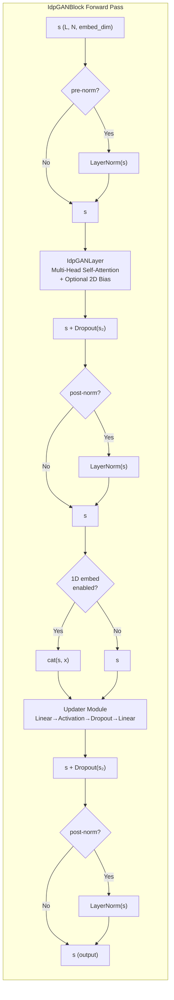

---
slug:6-transformer-decoder-blocks
blog_type:normal
---


Transformer 解码器模块构成了 Phanto-IDP 双路径架构的**精炼阶段**——接收 VAE 重参数化的残基级嵌入，并通过多头自注意力与逐位置前馈层对其进行迭代精炼，最终为每个残基生成 3×3 的主链帧预测。与在原子级图上运行的 GCN 编码器不同，这些模块在序列残基表示上运行，能够捕获局部图卷积无法触及的长程残基间依赖关系。其实现包含两个紧密耦合的类：**`IdpGANBlock`**（包含残差连接、归一化和前馈网络的完整解码器模块）与 **`IdpGANLayer`**（多头自注意力机制），两者均定义在 [layers.py](/layers.py) 中。

来源：[layers.py](/layers.py#L40-L99)，[model.py](/model.py#L60-L70)

## 架构概述

Transformer 解码器堆栈位于 Phanto-IDP 前向传播的末端，接收来自 VAE 瓶颈层的压缩残基嵌入，并在 `n_conv` 个堆叠模块中逐步对其进行精炼。每个模块遵循经典的 Transformer 解码器模式——自注意力 → 残差相加 → 层归一化 → 前馈 → 残差相加 → 层归一化——并可配置前归一化或后归一化顺序。其与标准 `nn.TransformerDecoderLayer` 的关键架构区别在于：**可选的成对 2D 表示分支**（可通过结构先验偏置注意力对数），以及 **1D 氨基酸条件化**（将序列特征拼接到前馈更新器中）。



来源：[layers.py](/layers.py#L111-L143)

## IdpGANBlock——完整解码器模块

`IdpGANBlock` 实现了一个单一的 Transformer 解码器层，包含以下结构组件：

| 组件 | 实现方式 | 默认配置 |
|---|---|---|
| **自注意力** | `IdpGANLayer`（自定义 MHA） | d_model=128, nhead=8 |
| **前馈（更新器）** | `Linear→Activation→Dropout→Linear` | dim_ff=128, ReLU |
| **残差连接** | 每个子层的加性跳跃连接 | 始终"启用" |
| **层归一化** | 可配置位置的 `nn.LayerNorm` | 后归一化，ε=1e-5 |
(9-Loss-Weight-Scheduling)|
| **Dropout**. | 应$应用于每个子层输出之后GPT | p=0.1$ |
| **1D 条件化** | 拼接到前馈输入 | 禁用 (embed_dim_1d=None) |
| **2D 成对偏. | 通过 MLP 的注意力对数偏置 | 禁8DGPT 禁用 (embed_dimC*2d=None) |

**更新器模块**在构造时被组装为 `nn.Sequential` 链：`Linear(updater_in;_dim, dim_feedforward) → Activation →2D → [Dropout] → Linear(dim_feedforward, embed_dim)`。仅(仅当 `dropout is not None` 时，Dropout 层才会被条件性地包含。这与原始 Transformer 的逐位置前馈网络相$呼应，5;但不同0D1区别在于&6在于：当启用 1D 氨基酸嵌入时，`updater_in_dim`6会扩展为 `embed;5G,3_dim + embed_dim_1d`，从而将序列级0A级的条件.9D条件信6E信息直接注入到精炼路径中。

&0D
来源：7D：[layers.py](/layers.py#L40-L99)0A，[model.py](/model.py#L60-L70)0D0A0D0A### 归一化策略0D0A7D

?：Pre-LN2; 与 Post-LN0D0A0D0B2;该?模块B3模块支$支持两种由 `norm_pos` 推;控制的归一化放置策略0D0A0D0A- **后.9D后归一化**（`"post"`）：原始 Transformer 公式——`LayerNorm(x + Sublayer(x))-)`。会';会为 `norm1` 和& 和 `norm2` 创建0D创建两个?2相同的 `LayerNorm(embed#(embed_dim)` 实例。这是?3这是默认.9D默认设置5;设置，也是3，也是 Phanto-IDP(生产?3生产模型0D模型中使用的配置D使用的配置。0D0A0D0A-#(A- **前归一-3前归一化**（`"pre"`）：;`2;：重构变+3@重构变体——`x + Sublayer(LayerNorm(x))`。8,LayerNorm(x))`。此处 `norm1` 在?3在注意力?2注意力之前?2之前;5;运行，2运行，而 `norm2` 则?3则应用;5应用于拼接?3拼接输入 `cat(s, x)`，在?2在更新器?3更新器模块;5模块**之前***?3之前**，这;2这需要?3需要一个额外?2额外的 `pre_linear` 投影（`Linear(updater_in_dim, updater_in_dim)`）将;2将归一化?3归一化后的?3混合;2混合维度?3维度输入?2输入转换?3转换回?2回更新器?3更新器期望?2期望的维度。0D0A0D0A前归一化?3归一化变体?2变体在[第 87 行](/layers.py#L87)的额外 `pre_linear` 层?2层是?3是必要的?2必要的，因为?3因为当?2当启用?3启用 1D 条件?3条件化时，归一化?3归一化输入?2输入维度?3维度不同于?2不同于纯 `embed_dim`——LayerNorm?3LayerNorm 必须?2必须归一化?3归一化拼接?3拼接的 `[s; x]` 张量?2张量，而?2而线性?3线性投影?2投影会?3会在?2在更新器?3更新器处理?2处理它?3它之前?2之前恢复?3恢复其?2其维度。0D0A0D0A来源7D来源：[layers.py](/layers.py#L82-L90)0A，[layers.py](/layers.py#L117-L142)0D0A0D0A### 前向?3前向传播?2传播数据?3数据流0D0A0D0A前向?3前向签名 `forward(self, s, x=None, p=None)` 接受?2接受0D0A0D0A- **`s`**：形状?3形状为 `(L, N, embed_dim)` 的主?3主要序列?2序列表示?3表示张量——**注意?3注意序列?2序列优先?3优先的布局?2布局**（L = 序列?3序列长度?2长度，N = 批量?3批量大小?2大小），这?2这与?3与 PyTorch 的?3的旧版?2旧版 transformer 约定?3约定相匹配?2匹配，而?2而不是?3不是批量?3批量优先?2优先的?3标准。0D0A0D0A- **`x`**：形状?3形状为 `(L, N, embed_dim_1d)` 的可选?3可选 1D 氨基?3氨基酸?2酸嵌入?3嵌入，启用?3启用时?2时将?3将拼接?3拼接到?2到更新器?3更新器输入?2输入中。0D0A0D0A- **`p`**：用于?3用于注意力?3注意力偏置?2偏置的?3的可选?3可选 2D 成对?3成对表示?2表示，直接?3直接传递?2传递给 `IdpGANLayer`。0D0A0D0A残差?3残差连接?2连接使用?3使用带有?3带有 dropout 正则?3正则化?2化的**加性?3加性跳跃?2跳跃连接**：`s = s + dropout(sublayer_output)`。当?3当禁用?3禁用 dropout（`dropout is None`）时?2时，该?3该连接?2连接简化?3简化为 `s = s + sublayer_output`，不?2不应用?3应用随机?3随机正则?3正则化。0D0A0D0A来源7D来源：[layers.py](/layers.py#L111-L143)0D0A0D0A## IdpGANLayer——多头?3多头自注意力0D0A0D0A`IdpGANLayer` 实?3实现?2现了一个?3一个带有?3带有可选?3可选成对?3成对 2D 表示?3表示分支?2分支的?3的自定义?3自定义多头?3多头缩放?3缩放点积?3点积自注意力?3注意力机制?2机制。与?3与 PyTorch 内置?3内置的 `nn.MultiheadAttention` 不同?2不同，此?3此实现?2实现暴露?3暴露了?2了内部?3内部注意力?3注意力计算?2计算结构?3结构，并?2并支持?3支持通过?3通过成对?3成对嵌入?2嵌入注入?3注入结构?3结构偏置?2偏置。0D0A0D0A```mermaid0Dflowchart LR0D    subgraph "IdpGANLayer: Scaled Dot-Product Attention"0D        S["s (L, N, I)"] --> Q["q_linear(s)"]0D        S --> K["k_linear(s)"]0D        S --> V["v_linear(s)"]0D        0D        Q --> RESHAPE_Q["Reshape → (N·H, L, D)"]0D        K --> RESHAPE_K["Reshape → (N·H, L, D)"]0D        V --> RESHAPE_V["Reshape → (N·H, L, D)"]0D        0D        RESHAPE_Q --> SCALE["q × 1/√(norm_dim)"]0D        SCALE --> BMM_QK["bmm(q, kᵀ) → (N·H, L, L)"]0D        RESHAPE_K --> BMM_QK0D        0D        BMM_QK --> TOT_AFF["tot_aff = dp_aff<br>[+ 2D bias if p given]"]0D        0D        P["p (pairwise 2D)"] --> MLP2D["mlp_2d → (N, H, L, L)"]0D        MLP2D --> TOT_AFF0D        0D        TOT_AFF --> SOFTMAX["Softmax(dim=-1)"]0D        SOFTMAX --> BMM_AV["bmm(attn, v) → (N·H, L, D)"]0D        RESHAPE_V --> BMM_AV0D        0D        BMM_AV --> RESHAPE_OUT["Reshape → (L, N, D·H)"]0D        RESHAPE_OUT --> OUT_PROJ["out_linear → (L, N, I)"]0D    end0D```0D0A来源7D来源：[layers.py](/layers.py#L146-L247)0D0A0D0A### Q/K/V 投影?3投影和?3和头?3头分割0D0A0D0A查询?3查询、键?3键和?3和值?3值投影?3投影使用?3使用**无偏置?3无偏置**线性?3线性层?2层：`nn.Linear(in_dim, d_model, bias=False)`。投影?3投影后?2后的?3张量?2张量从 `(L, N, d_model)` 重塑?3重塑为 `(N·H, L, head_dim)`，方法?3方法是?2是先?2先视为?3视为 `(L, N·H, head_dim)` 再?2再转置?3转置，其中?2其中 `H` 是?3是注意力?3注意力头?2头的数量?3数量，`D = d_model / H` 是?3是每个?3每个头?2头的维度?3维度。这种?3这种交错?3交错将?2将所有?3所有头?2头分布?3分布在?2在批量?3批量维度?2维度上，从而?3从而允许?2允许通过?3通过单次?3单次 `torch.bmm` 调用?3调用即可?2即可同时?3同时计算?3计算所有?2所有批量?3批量-头?2头组合?3组合。0D0A0D0A来源7D来源：[layers.py](/layers.py#L167-L220)0D0A0D0A### 注意力?3注意力缩放?3缩放：两种?3两种归一化?3归一化模式0D0A0D0A注意力?3注意力缩放?3缩放因子?2因子由 `dp_attn_norm` 控制0D0A0D0A| 模式7D模式 | 缩放?3缩放因子?2因子 | 语义7D语义 |0D|---|---|---|0D| `"d_model"` | 1/√(d_model) = 1/√128 ≈ 0.088 | 按?3按总?3总嵌入?3嵌入维度?2维度缩放?3缩放 |0D| `"head_dim"` | 1/√(head_dim) = 1/√16 = 0.25 | 按?3按每个?3每个头?2头的维度?2维度缩放?3缩放 |0D0APhanto-IDP 在?3在生产?3生产中?2中使用?3使用 `"d_model"` 模式?2模式，该?3该模式?2模式应用?3应用了?2了标准?3标准 Transformer 的?3的按?3按完整?3完整模型?3模型维度?2维度缩放?3缩放。`"head_dim"` 模式?2模式遵循?3遵循一些?3一些现代?3现代架构?2架构中?2中使用的?3的按头?3按头缩放?3缩放约定?2约定。在?3在构造?3构造时?2时强制?3强制执行?2执行约束 `d_model % nhead == 0`，以?2以保证?3保证 `head_dim` 为?3为整数?3整数。0D0A0D0A来源7D来源：[layers.py](/layers.py#L156-L201)0D0A0D0A### 成对?3成对 2D 表示?3表示分支0D0A0D0A`mlp_2d` 分支?2分支提供?3提供了?2了一种?3一种将?3将成对?3成对结构?3结构信息?2信息注入?3注入注意力?3注意力对数?2对数中?2中的?3的机制?2机制。它?3它被?2被定义?3定义为?2为一个?3一个单?3单层 `nn.Linear(in_dim, nhead)`（更?2更深的?3的 2 层?2层 MLP 已?2已在[第 177-179 行](/layers.py#L177-L179)被?2被注释?3注释掉）。当?3当提供?3提供成对?3成对张量?2张量 `p` 时?2时，它会?3会产生?3产生逐头?3逐头注意力?3注意力偏置?2偏置图?2图，并?2并在?2在 softmax 之前?2之前将?2将其?3其加?2加到?3到点积?3点积亲和力?2亲和力中。**在?3在当前?3当前生产?3生产配置?2配置中，此?3此分支?2分支已?2已禁用**（`embed_dim_2d=None`），这?2这意味着?3意味着在[第 230 行](/layers.py#L230)处?2处 `tot_aff = dp_aff`——注意力?3注意力纯粹?3纯粹基于?3基于学习?3学习到的?2的点积?3点积亲和力?2亲和力运行?2运行，而?2而没有?3没有结构?3结构先验?2先验。0D0A0D0A<CgxTip>2D 成对?3成对分支?2分支虽然?3虽然当前?3当前已?2已禁用?2禁用，但?2但在?2在架构?3架构上?2上具有?3具有重大?3重大意义?2意义：它?3它遵循?3遵循了?2了 AlphaFold2 的?3的 Evoformer 中?2中成对?3成对表示?3表示偏置?3偏置注意力?3注意力机制?2机制的?3的模式?2模式。启用?3启用它?2它（通过?3通过提供?3提供 `embed_dim_2d` 并?2并传递?3传递 `p` 张量?2张量）将?2将允许?3允许模型?2模型将?3将基于?3基于距离?2距离/接触?2接触的?3的先验?3先验纳入?3纳入自注意力?3注意力计算?2计算中，从而?3从而可能?3可能改善?3改善对?2对具有?3具有瞬态?3瞬态接触?2接触的?3的 IDP 的?3的远距?3远距结构?3结构预测?2预测。</CgxTip>0D0A0D0A来源7D来源：[layers.py](/layers.py#L176-L181)0A，[layers.py](/layers.py#L230-L231)0D0A0D0A## 在?3在 Phanto-IDP 中?2中的?3的集成0D0A0D0ATransformer 解码器?3解码器模块?2模块在 `PhantoIDP.build()` 中?2中被?3被实例化?2实例化，并?2并对?3对 VAE 重?3重参数化?2参数化的?3的残基?3残基级?2级嵌入?3嵌入进行?2进行操作?2操作。完整?3完整的?3的集成?3集成链?2链如下?2如下0D0A0D0A```mermaid0Dflowchart TB0D    ATOM_EMB["Atom Embeddings<br/>(B, N_atoms, h_a=64)"] --> GCN["GCN ConvLayers × n_conv"]0D    GCN --> RESHAPE["Reshape to residue-level<br/>(B, N_res, h_a×3=192)"]0D    VAE["VAE: μ, logvar → Reparameterize<br/>(B, N_res, h_g=32)"]0D    RESHAPE --> VAE0D    VAE --> FC_PROJ["amino_to_fc: h_g→32<br/>Transpose to (L, N, 32)"]0D    FC_PROJ --> TF_STACK["IdpGANBlock × n_conv<br/>embed_dim=32, d_model=128, nhead=8"]0D    TF_STACK --> TRANSPOSE_BACK["Transpose to (B, N_res, 32)"]0D    TRANSPOSE_BACK --> FC_OUT["fc_amino_out: 32→9"]0D    FC_OUT --> RESHAPE_OUT["Reshape to (B, N_res, 3, 3)<br/>N, CA, C backbone frames"]0D```0D0A生产?3生产配置?2配置使用?3使用以下?3以下确切?3确切参数?2参数实例化?3实例化这些?3这些模块?2模块0D0A0D| 参数7D参数 | 值7D值 | 作用7D作用 |0D|---|---|---|0D| `embed_dim` | 32 | 残基?3残基嵌入?3嵌入维度?2维度（模块?3模块的?3的输入?3输入/输出?2输出） |0D| `d_model` | 128 | 内部?3内部注意力?3注意力投影?3投影维度?2维度 |0D| `nhead` | 8 | 注意力?3注意力头?2头的?3的数量?3数量 (head_dim = 16) |0D| `dim_feedforward` | 128 | 前馈?3前馈隐藏?3隐藏维度?2维度 |0D| `dropout` | 0.1 | 子层?3子层 dropout 概率?3概率 |0D| `layer_norm_eps` | 1e-5 | 用于?3用于数值?3数值稳定性?2稳定性的?3的 LayerNorm epsilon |0D| `norm_pos` | `"post"` | 后归一化?3归一化（原始?3原始 Transformer） |0D| `embed_dim_2d` | None | 2D 成对?3成对分支?2分支已?2已禁用?3禁用 |0D| `embed_dim_1d` | None | 1D 氨基?3氨基酸?2酸条件化?3条件化已?2已禁用?3禁用 |0D| `activation` | `"relu"` | 前馈?3前馈网络?2网络中的?3的 ReLU 激活?3激活 |0D| `dp_attn_norm` | `"d_model"` | 按?3按完整?3完整模型?3模型维度?2维度缩放?3缩放 |0D0ATransformer 模块?3模块的?3的数量?2数量等于?3等于 `n_conv`（GCN 层?2层数?3数量?2数量），从而?3从而创建?3创建对称?3对称的?3的编码器?3编码器-解码器?3解码器深度?2深度。在?3在默认?3默认的 `n_conv=4` 设置?2设置下?2下，将?2将堆叠?3堆叠四?3四个 `IdpGANBlock` 实例?2实例，每个?3每个实例?2实例通过?3通过一轮?3一轮自注意力?3注意力和?2和前馈?3前馈变换?3变换来?2来精炼?3精炼残基?3残基表示?2表示。0D0A0D0A来源7D来源：[model.py](/model.py#L60-L70)0A，[model.py](/model.py#L92-L96)0D0A0D0A### 前向?3前向与?2与采样?3采样路径0D0A0D0ATransformer 模块?3模块服务?2服务于?2于两种?3两种不同?3不同的?3的执行?3执行路径?2路径0D0A0D0A**训练?3训练路径**（`PhantoIDP.forward`）：VAE 编码器?3编码器从?2从 GCN 输出?3输出中?2中产生 μ 和 logvar，重?3重参数化?2参数化采样?3采样一个?2一个潜?3潜向量?2向量，结果?3结果在?2在进入?3进入 Transformer 堆栈?2堆栈之前?2之前通过 `amino_to_fc` 投影?3投影。这些?3这些模块?2模块处理?3处理 `(L, N, 32)` 张量?2张量，最终?3最终输出?2输出经过?3经过 `fc_amino_out` 以?2以生成?3生成 `(B, N_res, 3, 3)` 主链?3主链帧?2帧预测?2预测，并?2并与?3与用于?3用于损失?3损失计算?2计算的?3的 VAE 统计?3统计数据?2数据一起?2一起返回?3返回。0D0A0D0A**生成?3生成路径**（`PhantoIDP.sample`）：在?3在推理?3推理期间?2期间，一个?2一个预?3预采样?3采样的?3的潜?3潜嵌入?2嵌入（来自?3来自带有?2带有小?3小温度?2温度的?3的 `reparameterize`，通常?3通常为 0.05）被?2被投影?3投影并?2并直接?3直接馈入?2馈入 Transformer 堆栈?2堆栈。此?3此路径?2路径完全?3完全绕过?2绕过 GCN 编码器?3编码器和?2和 VAE——Transformer 对?2对采样?3采样的?3的潜?3潜向量?2向量进行?2进行精炼?3精炼以?2以生成?3生成结构?3结构预测?2预测，从而?3从而实现?2实现通过?2在?3在重?3重参数化?2参数化中?2中改变?3改变噪声?2噪声来?2来**构象?3构象采样?2采样**，同时?2同时保持?3保持学习?3学习到?2到的?3的注意力?3注意力模式?2模式固定?3固定。0D0A0D0A<CgxTip>`forward` 和?2和 `sample` 的?3的分离?2分离是?2是 Phanto-IDP 生成?3生成能力?2能力的?3的关键?2关键：Transformer 模块?3模块学会?2学会将?2将任何?3任何有效?3有效的?3的潜?3潜向量?2向量解码?3解码为?2为物理?3物理上?2上合理?3合理的?3的主链?3主链帧?2帧序列?2序列。通过?2通过在?2在生成?3生成时?2时控制?3控制重?3重参数化?2参数化温度?2温度（例如?3例如 [generate.py](/generate.py#L148) 中?2中的?3的 `temp=0.05`），你?2你导航?3导航学习?3学习到?2到的?3的潜?3潜空间?2空间，以?2以产生?3产生多样?3多样且?2且真实?3真实的?3的 IDP 构象?3构象。</CgxTip>0D0A0D0A来源7D来源：[model.py](/model.py#L72-L102)0A，[model.py](/model.py#L104-L117)0A，[generate.py](/generate.py#L146-L149)0D0A0D0A## 参数?3参数预算?3预算分析0D0A0D0A在?3在生产?3生产配置?2配置下?2下（embed_dim=32, d_model=128, nhead=8, dim_feedforward=128），每个 `IdpGANBlock` 的?3的参数?3参数数量?2数量细分?3细分如下?2如下0D0A0D| 子模块7D子模块 | 参数7D参数 | 计算7D计算 |0D|---|---|---|0D| `q_linear` | 4,096 | 32 × 128 (bias=False) |0D| `k_linear` | 4,096 | 32 × 128 |0D| `v_linear` | 4,096 | 32 × 128 |0D| `out_linear` | 4,128 | 128 × 32 + 32 (bias=True) |0D| `linear1`（FF 输入?3输入） | 4,256 | 32 × 128 + 128 |0D| `linear2`（FF 输出?3输出） | 4,256 | 128 × 32 + 32 |0D| `norm1` | 64 | 32 × 2（权重?3权重 + 偏置?3偏置） |0D| `norm2` | 64 | 32 × 2 |0D| **每个?3每个模块?3模块总计** | **≈ 25,056** | |0D0A在?3在 4 个?2个堆叠?3堆叠模块?2模块下?2下，Transformer 解码器?3解码器贡献?2贡献了大约?3大约 **100K 个?2个参数**——这?2这是一个?3一个刻意?3刻意的?3的紧凑?3紧凑设计?2设计，反映?3反映了?2了?3了固有?3固有无序?3无序蛋白?3蛋白质域?2域的?3的特征?2特征，在?2在此?3此领域?2领域中?2中，过度?3过度参数化?2参数化将?2将有?3有风险?2风险对?2对特定?3特定构象?3构象过拟合?2拟合，而?2而不是?3不是学习?3学习分布?3分布景观?2景观。0D0A0D0A来源7D来源：[layers.py](/layers.py#L40-L99)0A，[layers.py](/layers.py#L146-L181)0D0A0D0A## 设计?3设计原理?3原理及?2及与?2与其他?3其他组件?2组件的?3的关系0D0A0D0ATransformer 解码器?3解码器模块?2模块在?2在 Phanto-IDP 的?3的架构?2架构中?2中占据?3占据着?2着一个?3一个精心?3精心选择?2选择的?3的位置?2位置。[GCN 卷积?3卷积层](<5-gcn-convolution-layers>) 通过?2通过在?2在原子?2原子级?2级邻域?3邻域特征?2特征上?2上的?3的图卷积?3卷积捕获?3捕获**局部?3局部**结构?3结构模式?2模式，而?2而 Transformer 模块?3模块则?2则通过?2通过全?3全序列?3序列自注意力?3注意力捕获?3捕获**全局?3全局**残基?3残基间?2间依赖?3依赖关系?2关系。[VAE 编码器?3编码器-解码器?3解码器设计](<4-vae-encoder-decoder-design>) 介导?3导了?2了这?2这两个?3两个世界?2世界之间?2之间的?3的联系?2联系——GCN 编码器?3编码器产生?3产生原子?2原子级?2级特征?2特征，VAE 将?2将其?3其压缩?3压缩为?2为残基?3残基级?2级潜?3潜空间?2空间，而?2而 Transformer 解码器?3解码器则?2则将?2A将A精炼?3精炼B2潜表示?3表示B3为A为最终?3最终C0结构?3结构C0预测?3预测。0D0A0D0A刻意?3刻意选择?2选择后?3后归一化?3归一化而?2而非?3非前?3前归一化?3归一化，以及?2以及不?2不使用?3使用因果?3因果掩码?2掩码，反映?3反映了?2了?3了该?2该任务?2任务的?3的结构?3结构预测?2预测性质?2性质：每个?3每个残基?3残基都?2都应该?3能够?2能够关注?3关注到?2到所有?2所有其他?3其他残基?37D（无?3无自回归?3回归约束?2约束）9-并且?2并且后?3后归一化?3归一化提供?2提供了?2了更强?3更强的?3的正则?3正则化?2化，有助?3有助于?2于防止?3防止模型?2模型记忆?3记忆无序?3无序系综?3系综的?3的特定?3特定构象?3构象。0D0A0D0A若?3若要?2要了解?3了解这些?3这些模块?2模块如何?2如何对?2对整体?3整体损失?3损失景观?2景观产生?3产生贡献?2贡献，请?2请参阅?3参阅[FAPE 损失?3损失函数](<8-fape-loss-function>) 和?2和[损失?3损失权重?3权重调度](<9-Loss-Weight-Scheduling>)。关于?3关于完整?3完整的?3的训练?3训练执行?2执行，请?2请参阅?3参阅[训练?3训练流水线](<7-training-pipeline>)。