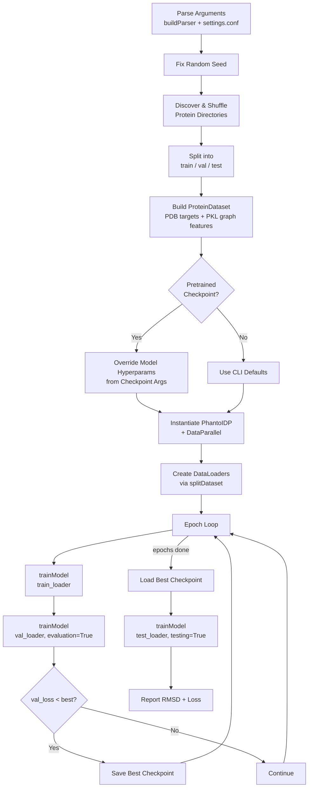
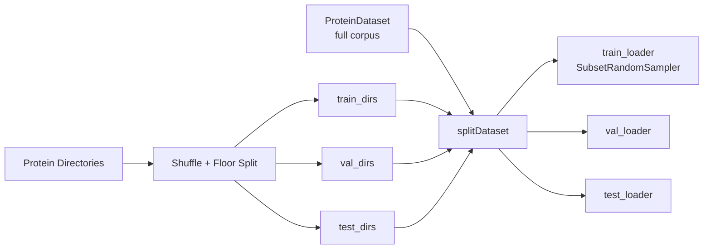
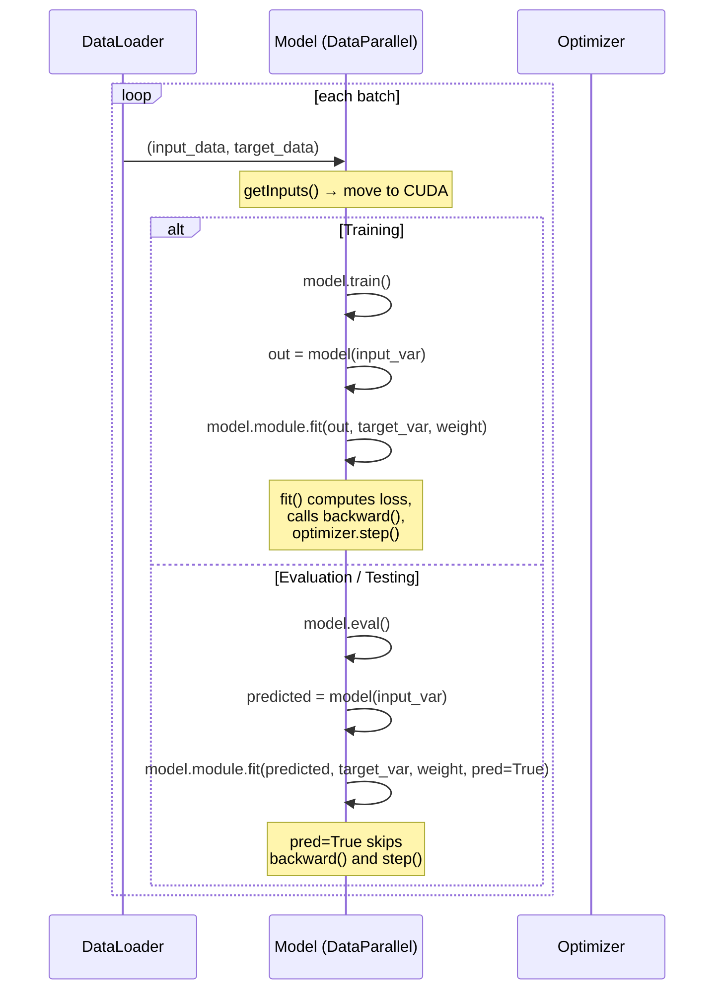

---
slug:7-training-pipeline
blog_type:normal
---

训练流水线是 Phanto-IDP 的编排核心——它将数据集构建、模型实例化、损失计算、权重调度和检查点持久化串联成一个单一的可复现循环。理解该流水线对于修改训练行为、诊断收敛问题或将框架扩展到新的蛋白质系统至关重要。

## 流水线概述

整个训练生命周期由 `main.py` 中的单一入口点驱动。在宏观层面上，流水线遵循严格的顺序契约：**解析配置 → 构建数据集 → 划分数据 → 实例化模型 → 迭代轮次 → 保存最佳检查点**。给定相同的随机种子，每个阶段都是确定性的，该种子在任何随机操作发生之前已被固定。

来源: [main.py](/main.py#L17-L162), [arguments.py](/arguments.py#L4-L49)

## 配置与参数解析

流水线始于 `buildParser()`，它使用 **configargparse** 将 `settings.conf` 文件置于 CLI 参数之下。这意味着每个 CLI 标志都有一个对应的配置文件键，从而无需 shell 脚本即可实现可复现的实验。关键的训练相关参数如下：

| 参数 | 默认值 | 作用 |
|---|---|---|
| `--seed` | 1234 | 固定 `torch.manual_seed` 和 `torch.cuda.manual_seed_all` 以保证可复现性 |
| `--epochs` | 20 | 总训练轮次 |
| `--batch_size` | 64 | 每次梯度更新的样本数 |
| `--train` / `--val` / `--test` | 0.5 / 0.25 / 0.25 | 蛋白质目录的分数划分比例 |
| `--lr` | 1e-3 | Adam 学习率 |
| `--pretrained` | None | 用于热启动的 `.pth.tar` 检查点路径 |
| `--no_train` | False | 跳过训练，直接进行评估 |
| `--save_checkpoints` | True | 将最佳模型持久化到磁盘 |
| `--workers` | 8 | DataLoader 并行度 |

解析后，随机种子通过 `randomSeed(args.seed)` 全局应用，该函数在一次调用中同时设置 PyTorch 的 CPU 和 CUDA 种子。这发生在数据集打乱和模型初始化**之前**，从而确保完全的确定性。

来源: [arguments.py](/arguments.py#L4-L49), [main.py](/main.py#L20-L33), [utils.py](/utils.py#L171-L176)

## 数据集构建与划分

流水线**不**划分单个样本——它划分的是**蛋白质目录**。这是一个关键的设计决策：属于同一蛋白质的所有构象快照保留在同一划分中，从而防止数据泄漏，即模型在训练时记忆了某种蛋白质的结构基序，并在验证时再次遇到它。

划分逻辑如下：列出 `--protein_dir` 下的所有子目录，将其打乱，并使用向下取整除法按 `--train`、`--val`、`--test` 比例进行分区。然后使用完整语料库构建一次 `ProteinDataset`，`splitDataset()` 通过根据每个划分中的目录名称过滤数据集的 `id_prop_data` 列表，创建三个独立的 `DataLoader` 实例。每个加载器使用 `SubsetRandomSampler` 进行划分内随机化，并使用自定义的 `collate_pool` 函数将变长蛋白质图填充为统一的批量张量。

`collate_pool` 函数执行零填充，将其填充至批次中的最大原子数 `N` 和最大氨基酸数 `A`，生成形状为 `(B, N, ...)` 的原子特征统一张量，以及形状为 `(B, A, 3)` 的坐标目标 (N, CA, C) 统一张量。

来源: [main.py](/main.py#L36-L109), [traj_dataset.py](/traj_dataset.py#L15-L64)

## 模型实例化与预训练加载

模型采用两阶段参数解析策略构建。当 `--pretrained` 指向有效检查点时，保存的 `args` 命名空间会**覆盖**四个关键超参数——`h_a`、`h_g`、`n_conv` 和 `lr`——从而确保与保存的权重保持架构一致性。键嵌入维度 `h_b` **不是**超参数；它是从数据集的边特征形状（`structures[1].shape[-1]`）推断出来的，使其依赖于数据而非由用户配置。

构建后，模型被包装入 `torch.nn.DataParallel` 并移至 CUDA。优化器是一个权重衰减为零的 **Adam** 实例，在 `PhantoIDP.__init__` 内部创建——这意味着优化器是一个模块属性，而非外部对象，这简化了检查点序列化，因为 `state_dict` 和 `optimizer.state_dict` 可以一起保存。

当提供预训练检查点时，加载分两阶段进行：(1) 模型构建前的超参数覆盖，然后 (2) 在 `DataParallel` 包装**之后**对模型权重和优化器状态执行 `load_state_dict`。全程使用 `.module` 访问器，因为 `DataParallel` 嵌套了原始模型。

来源: [main.py](/main.py#L62-L101), [model.py](/model.py#L15-L27)

## 训练循环

`main()` 中的外层轮次循环被刻意保持极简——它将所有每轮逻辑委托给 `trainModel()`，该函数根据其布尔标志承担三重职责，作为**训练**、**验证**和**测试**的驱动器。循环契约如下：

1. **训练阶段**：`trainModel(train_loader, model, epoch=epoch)` —— 启用梯度，`model.train()`
2. **验证阶段**：`trainModel(val_loader, model, epoch=epoch, evaluation=True)` —— `torch.no_grad()`，`model.eval()`
3. **最佳模型跟踪**：若 `val_loss < best_val_loss`，则标记为最佳并保存检查点
4. **训练后测试**：加载最佳检查点，`trainModel(test_loader, model, testing=True)` —— 计算每样本 RMSD

### 逐批次执行流程

在 `trainModel` 内部，每个批次遵循以下序列：

`fit()` 中的 `pred=True` 标志是区分纯前向评估与梯度更新训练的机制——当 `pred=True` 时，该方法计算损失但**跳过** `optimizer.zero_grad()`、`loss.backward()` 和 `optimizer.step()`。这使得损失记录器得以填充以便日志记录，而不会改变模型权重。

在测试期间，使用 `calc_rmsd()` 计算每样本 RMSD，该函数通过四元数特征值分解实现 Kabsch 算法。目标和预测的坐标文件也会写入磁盘，以供外部分析。

来源: [main.py](/main.py#L129-L162), [main.py](/main.py#L164-L266)

## 损失计算：`fit()` 方法

`fit()` 方法是训练流水线的数学核心。它接收模型的三元输出 `(predicted_frames, mu, logvar)` 以及真实主干坐标和当前轮次的损失权重。计算分三阶段进行：

### 阶段 1 — 刚性变换构建

预测和目标坐标均为骨干原子三元组：**(N, CA, C)**。`from_3_points()` 静态方法应用 **Gram-Schmidt 算法**（AlphaFold2 的算法 21）从这些三元组构造 3×3 旋转矩阵。对于预测，三个输出帧 `torch.split(outputs[0], 1, dim=-2)` 各自被压缩并视为独立的点三元组。目标的旋转矩阵则从真实的 N、CA、C 位置计算一次。

### 阶段 2 — FAPE 损失

**帧对齐点误差**计算三次——每种骨干原子类型 (N, CA, C) 各一次——并取平均值。每次 FAPE 计算度量的是**对齐到目标的局部帧后**预测与目标原子位置之间的距离。这使得损失在构造上是 **SE(3) 不变的**，意味着模型绝不会因预测了全局旋转或平移的结构而受到惩罚。

### 阶段 3 — KL 散度

VAE 的 KL 散度使用标准的闭式表达式从编码器的 `(mu, logvar)` 输出计算，并按序列长度归一化：

$$\mathcal{L}_{KL} = \frac{0.5}{N} \cdot \text{mean}\left(\sum_i \left(1 + 2\log\sigma_i - \mu_i^2 - \sigma_i^2\right)\right) \cdot w_{KL}$$

### 组合损失

最终训练目标为：

$$\mathcal{L} = \frac{w_{FAPE}}{3} \cdot \mathcal{L}_{FAPE} - \mathcal{L}_{KL}$$

注意 KL 上的**负号**——这是因为计算出的 KL 项已经是负数（标准 VAE 目标最大化包含 −KL 的 ELBO）。减法有效地加上了 KL 正则化，将学习到的后验推向先验。

<CgxTip>组合损失公式 `fape * weight_fape / 3 - kl_loss` 意味着在早期训练期间（高 FAPE 权重，低 KL 权重），模型优先考虑结构准确性。随着 KL 权重在轮次中增加，潜空间被逐步正则化，从而在生成时提高采样质量。</CgxTip>

来源: [model.py](/model.py#L202-L224), [utils.py](/utils.py#L88-L134)

## 损失权重调度

流水线实现了一个**双轴**权重调度，分别为 FAPE 和 KL 独立演化，并以轮次编号为索引。这不是连续调度——它是一个带有离散步长边界的**分段常数**调度：

### KL 权重调度

| 轮次范围 | KL 权重 | 依据 |
|---|---|---|
| 0–59 | 1e-4 | 近零正则化；模型专注于重建 |
| 60–119 | 5e-4 | 开始温和的潜空间塑造 |
| 120–179 | 1e-3 | 中等 KL 压力 |
| 180–239 | 2.5e-3 | |
| 240–299 | 7.5e-3 | |
| 300–359 | 1e-2 | 强正则化 |
| 360+ | 1.5e-2 | 最大 KL 权重；潜空间良好正则化 |

### FAPE 权重调度

| 轮次范围 | FAPE 权重 | 依据 |
|---|---|---|
| 0–399 | 10.0 | 高权重：早期结构准确性至关重要 |
| 400–799 | 2.0 | 降低：模型已学习骨干几何 |
| 800+ | 1.0 | 标称：微调阶段 |

调度通过 `min(epoch // 60, 6)` 和 `min(epoch // 400, 2)` 索引至权重列表来计算，使得边界被硬编码但列表易于修改。当 `epoch` 为 `None`（例如在独立评估期间）时，两个权重均回退至其终值 `(10.0, 1e-2)`。

<CgxTip>两个调度之间的不对称性是有意为之的：KL 以 60 轮步长递增（在约 360 轮内 7 次过渡），而 FAPE 以 400 轮间隔递减（在约 800 轮内仅 3 次过渡）。这意味着 FAPE 在前约 400 轮中占主导地位，此后 KL 正则化变得日益具影响力——这是一种体现“先学结构，后正则化潜空间”原则的课程。</CgxTip>

来源: [main.py](/main.py#L172-L178)

## 检查点持久化

当启用 `--save_checkpoints` 时，模型在每个轮次都会保存，而**最佳**模型（验证损失最低）会额外复制到 `model_best.pth.tar`。检查点字典包含：

| 键 | 内容 |
|---|---|
| `epoch` | 当前轮次索引 |
| `state_dict` | 所有模型参数 |
| `optimizer` | Adam 状态（动量缓冲区，步数） |
| `args` | 完整参数命名空间（经由 `vars(args)`） |

保存 `args` 命名空间使得预训练加载逻辑能够重构精确的模型架构，而无需用户重新指定超参数。保存路径遵循 `{save_dir}/{name}/checkpoint.pth.tar` 模式，其中 `model_best.pth.tar` 为最佳轮次检查点的硬链接/副本。

训练后，最佳检查点被重新加载至模型以进行测试集评估，确保报告的测试指标始终对应于具有最低验证损失的模型——而非最终轮次的模型。

来源: [main.py](/main.py#L143-L161), [model.py](/model.py#L125-L129)

## 监控与诊断

流水线在每个阶段跟踪四个 `AverageMeter` 实例：**批次时间**、**数据加载时间**、**总损失**和 **KL 损失**。进度每 `--print_freq`（默认 50）个批次打印一次，带有不同的前缀：`##` 代表训练，`*` 代表验证，`**` 代表测试。CUDA 缓存以相同频率通过 `torch.cuda.empty_cache()` 清除，以防止长时训练运行中的碎片化。

在测试期间，每样本 RMSD 值被写入 `rmsd.dat`，各个坐标张量被导出为 NumPy 文本文件（`outputs/target.*.dat` 和 `outputs/predicted.*.dat`），从而能够使用 [RMSD 与 Ramachandran 分析](13-rmsd-and-ramachandran-analysis) 中记录的工具进行下游分析。

来源: [main.py](/main.py#L164-L266), [utils.py](/utils.py#L55-L85)

## 执行总结

从调用到最终测试指标的完整训练流水线可总结如下：

| 阶段 | 组件 | 关键操作 |
|---|---|---|
| 1. 配置 | `buildParser()` | 叠加 `settings.conf` + CLI 参数 |
| 2. 种子 | `randomSeed()` | 固定 PyTorch CPU + CUDA 种子 |
| 3. 数据 | `ProteinDataset` | 加载 PDB 目标 + PKL 图特征 |
| 4. 划分 | `splitDataset()` | 使用 `SubsetRandomSampler` 进行蛋白质级训练/验证/测试划分 |
| 5. 模型 | `PhantoIDP` + `DataParallel` | 带有 Adam 优化器的 VAE 编码器-解码器 |
| 6. 训练 | `trainModel()` | 具有 FAPE + KL 损失和权重调度的轮次循环 |
| 7. 保存 | `model.save()` | 按验证损失持久化最佳检查点 |
| 8. 测试 | `trainModel(testing=True)` | 加载最佳检查点，计算 RMSD |

有关 FAPE 损失的数学细节，请参见 [FAPE 损失函数](8-fape-loss-function)。有关动态权重课程，请参见 [损失权重调度](9-loss-weight-scheduling)。有关馈入此流水线的数据准备，请参见 [图数据集构建](11-graph-dataset-construction)。