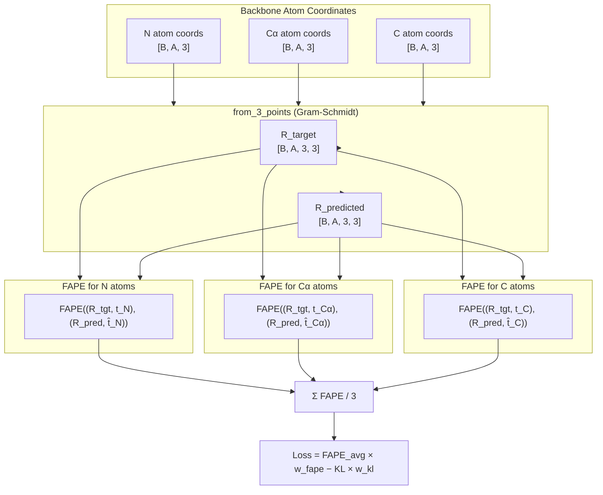

---
slug:8-fape-loss-function
blog_type:normal
---


**帧对齐点误差 (FAPE)** 损失是 Phanto-IDP 中的主要几何监督信号。它通过比较局部坐标系下所有成对位移向量，来衡量预测构象与真实构象之间的结构差异——从构造上使其具有 **SE(3) 不变性**。与需要显式最优对齐预处理步骤的 RMSD 不同，FAPE 将帧对齐直接嵌入损失计算中，产生密集的逐残基对梯度信号，这对于本质上无序蛋白质的高度异质性构象景观特别有效。

来源: [utils.py](utils.py#L88-L129), [model.py](model.py#L202-L224)

## 数学基础

FAPE 作用于**刚体变换**——每个残基都与一个旋转矩阵 **R** ∈ SO(3) 和一个平移向量 **t** ∈ ℝ³ 相关联。给定预测帧 (R̂, t̂) 和真实帧 (R, t)，该损失通过在计算距离之前将所有 N² 个成对位移向量旋转到各自的局部帧来进行比较：

```
Δt̂_ij = t̂_j − t̂_i          (预测成对位移)
Δt_ij  = t_j  − t_i           (真实成对位移)

X̂_ij = R̂_i · Δt̂_ij          (局部帧 i 中的预测位移)
X_ij  = R_i  · Δt_ij          (局部帧 i 中的真实位移)

FAPE = (1/Z) · clamp(‖X̂_ij − X_ij‖, max=C)
```

核心思想在于 **R** 将位移向量旋转至残基 *i* 的局部坐标系中，因此该比较对全局旋转和平移具有不变性。通过评估*所有*有序对 (i, j)，该损失密集地监督整个结构的相对几何，而不仅仅是局部距离。

来源: [utils.py](utils.py#L88-L129)

## 实现架构

下图说明了从骨干原子坐标经过帧构建到最终 FAPE 计算的完整数据流：



来源: [model.py](model.py#L202-L224), [utils.py](utils.py#L102-L129)

## FAPEloss 类

`FAPEloss` 模块将核心计算封装为一个 `nn.Module`，包含三个可配置的超参数：

| 参数 | 默认值 | 作用 |
|-----------|---------|------|
| `Z` | 10.0 | 归一化除数——将截断距离缩放至数值稳定的范围 |
| `clamp` | 10.0 | 归一化前每对距离的上界；防止长程误差产生异常梯度 |
| `epsion` | −1e8 | 保留参数（在当前前向传播中未使用） |

`forward` 方法接受两个变换元组和可选的掩码：

| 参数 | 形状 | 描述 |
|----------|-------|-------------|
| `predict_T` | `([B, N, 3, 3], [B, N, 3])` | 预测的（旋转，平移）对 |
| `transformation` | `([B, N, 3, 3], [B, N, 3])` | 真实的（旋转，平移）对 |
| `pdb_mask` | `[B, N, N]` | 有效残基对的可选掩码（例如链内） |
| `padding_mask` | `[B, N, N]` | 用于排除变长序列中填充位置的可选掩码 |

来源: [utils.py](utils.py#L88-L129)

## 计算步骤

前向传播执行以下序列：

**步骤 1 — 成对位移向量。** 使用 `einops.rearrange`，平移向量被广播为成对差张量。对于预测和真实值，跨所有残基对 (i, j) 计算操作 `t_j − t_i`，产生形状为 `[B, N, N, 3]` 的张量。

**步骤 2 — 局部帧旋转。** 爱因斯坦求和 (`torch.einsum`) 将残基 *i* 的旋转矩阵应用于对 (i, j) 的位移向量：`X̂_ij = R̂_i · Δt̂_ij` 和 `X_ij = R_i · Δt_ij`。收缩模式 `'bikq, bjik -> bijq'` 正确索引了每个对的*源*帧的旋转。

**步骤 3 — 距离、截断与归一化。** 沿坐标维度计算残差 `X̂ − X` 的欧几里得范数，然后截断至 `[0, clamp]` 并除以 `Z`。这在默认设置下产生一个在 `[0, clamp/Z]` = `[0, 1.0]` 范围内的逐对标量。

**步骤 4 — 掩码与归约。** 可选的 `pdb_mask` 和 `padding_mask` 按元素应用，以将无效对置零。最终标量损失通过 `torch.mean` 对所有有效条目求均值获得。

<CgxTip>截断阈值 10.0 Å 结合 Z=10.0，有效地使位移 ≥ 10 Å 的逐对损失饱和至 1.0。这是有意为之：它限制了严重错位残基产生的梯度幅度，同时在 0–10 Å 范围内提供强信号，该范围是骨干几何在结构上最具影响力的区间。</CgxTip>

来源: [utils.py](utils.py#L102-L129)

## 通过 Gram-Schmidt 构建帧

在计算 FAPE 之前，每个残基必须关联一个局部坐标系。Phanto-IDP 使用 `from_3_points` 静态方法从三个骨干原子 (N, Cα, C) 构建这些帧，该方法实现了 **算法 21**（来自 AlphaFold2 的 Gram-Schmidt 正交化过程）：

1. **e₀** = normalize(origin − p_neg_x_axis) → 从 Cα 指向 N，定义局部 x 轴
2. **e₁** = normalize(p_xy_plane − origin − (e₀ · v)e₀) → 从 C 指向 Cα，定义 y 轴分量，针对 e₀ 正交化
3. **e₂** = e₀ × e₁ → 通过叉积完成右手坐标系

旋转矩阵组装为 **R** = [e₀ | e₁ | e₂]（列向量），平移为 Cα 位置 (origin)。这确保了**相同的骨干几何产生相同的帧**，而与全局方向无关——这是 FAPE 的 SE(3) 不变性的前提。

来源: [model.py](model.py#L132-L171)

## 三原子 FAPE 组合

在 Phanto-IDP 的 `fit` 方法中，FAPE 不是计算一次，而是**三次**——每种骨干原子类型各一次。相同的旋转矩阵（通过 Gram-Schmidt 从所有三个原子导出）用作帧对齐，但平移向量不同：

```python
fape_n  = FAPEloss()((R_tgt, t_N),  (R_pred, t̂_N))
fape_ca = FAPEloss()((R_tgt, t_Cα), (R_pred, t̂_Cα))
fape_c  = FAPEloss()((R_tgt, t_C),  (R_pred, t̂_C))
fape_avg = (fape_n + fape_ca + fape_c) / 3
```

对三种原子类型取平均确保了损失对**所有**骨干自由度中的误差敏感——N–Cα 键方向、Cα–C 键方向和肽平面方向——而不是被任何单一原子的位置误差所主导。

来源: [model.py](model.py#L202-L224)

## 总训练损失

最终训练目标将平均 FAPE 与 VAE 的 KL 散度结合，由调度对 `(w_fape, w_kl)` 加权：

```
L = fape_avg × w_fape − KL × w_kl
```

KL 项上的**负号**反映了标准 VAE 目标：KL 散度作为正则化项，鼓励潜空间趋向标准正态先验，而 FAPE 提供重建信号。权重调度策略（详见[损失权重调度](9-loss-weight-scheduling)）在训练周期中逐步退火这两个权重。

来源: [model.py](model.py#L215-L219), [main.py](main.py#L172-L178)

## 与 RMSD 的比较

| 属性 | FAPE | RMSD |
|----------|------|------|
| **SE(3) 不变性** | 内置（帧对齐比较） | 需要显式最优叠合 |
| **梯度密度** | O(N²) 逐残基对信号 | 单一全局标量 |
| **局部敏感性** | 每对独立监督 | 全局平均可能掩盖局部误差 |
| **截断** | 内置异常值抵抗力 | 无原生截断 |
| **计算成本** | O(N²) 成对操作 | SVD 对齐后 O(N) |
| **在 Phanto-IDP 中的用途** | 训练损失 | 仅评估指标 |

FAPE 的 O(N²) 梯度密度对 IDP 特别有价值：因为无序蛋白质占据广阔的构象系综，密集的成对监督有助于模型学习残基间几何的完整分布，而不是收敛到单一误导性的平均结构。

<CgxTip>虽然 FAPE 的 O(N²) 成对计算比 RMSD 的 O(N) 成本更高，但它可以通过 einsum 和广播在 GPU 上完全并行化。对于典型的 IDP 序列长度（40–140 个残基），N² ≈ 1.6K–19.6K 的成对操作与 Transformer 前向传播相比可以忽略不计。</CgxTip>

来源: [utils.py](utils.py#L88-L129), [model.py](model.py#L173-L200)

## 后续步骤

- 在[损失权重调度](9-loss-weight-scheduling)中了解 `(w_fape, w_kl)` 如何在各周期中演变
- 在[训练流水线](7-training-pipeline)中追踪调用 `fit()` 的完整训练循环
- 在[图数据集构建](11-graph-dataset-construction)中考察骨干坐标如何从 PDB 文件流向损失