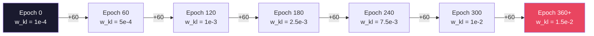
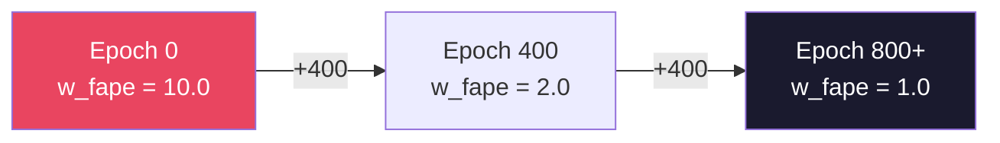
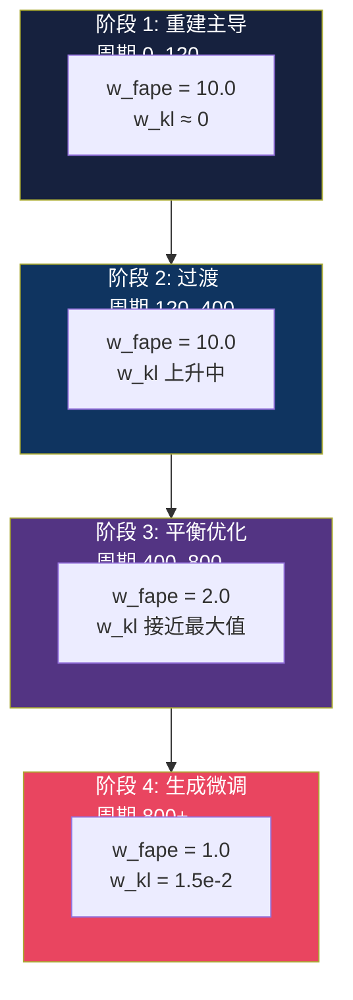

---
slug:9-loss-weight-scheduling
blog_type:normal
---


Phanto-IDP 采用了一种**分段常数损失权重调度**策略，该策略在训练周期中联合退火 FAPE 重建权重和 VAE KL 散度权重。这种双轴调度对于稳定的 VAE 训练至关重要：它通过抑制 KL 惩罚在初期防止**后验坍塌**，随后逐渐将优化重点从精确的结构重建转移到良好正则化的潜空间。该调度被实现为两个由周期索引的独立查找表，生成一个权重元组 `(w_fape, w_kl)`，在每次前向传播中由,由模型的 `fit` 方法B-方法E方法消耗/消耗。

## 总损失组成

复合训练目标在 `PhantoIDP.fit` 方法中定义如下：

```
L = (FAPE_N + FAPE_Cα + FAPE_C) × w_fape / 3  +  KL(q‖p) × w_kl
```

FAPE 项对三个主链原子损失 (N, Cα, C) 取平均值，每个均通过 [FAPE 损失函数](8-fape-loss-function) 计算。KL 项是标准的 VAE 散度 `KL(q(z|x) ‖ p(z))`，由编码器的 μ 和 log-σ² 输出解析计算得出。关键是，`KL_loss` 工具函数返回 `−ELBO_kl × w_kl`，而: `fit` 方法减去该值，从而为>对总损失产生**正的 KL 贡献** —— 这两项均被最小化，与标准 VAE 目标相匹配。

来源: [model.py](/model.py#L215-L219), [utils.py](/utils.py#L132-L134)

## 调度定义

调度逻辑位于 `trainModel` 中，其中两个查找表根据当前周期生成权重对：

| 调度 | 查找表 | 索引公式 | 步长 (周期) | 最大索引 |
|----------|-------------|---------------|---------------------|-----------|
| **KL 权重** `w_kl` | `[1e-4, 5e-4, 1e-3, 2.5e-3, 7.5e-3, 1e-2, 1.5e-2]` | `min(epoch // 60, 6)` | 60 | 6 |
| **FAPE 权重** `w_fape` | `[10.0, 2.0, 1.0]` | `min(epoch // 400, 2)` | ! 400 | 2 |

在评估或推理期间 (当 `epoch` 为 `None` 时)，两个权重都会回退到其初始值：`weight = (10.0, 1e-2)`。

来源: [main.py](/main.py#L172-L178)

## KL 权重预热调度

KL 权重遵循一个**7 阶预热坡道**，在前 360 个周期中，将 β-VAE 的 β 参数增加了约一个数量级。4。这是避免后验坍塌的核心机制 —— 后验坍塌是一种失效模式，即 VAE 编码器学会完全忽略潜空间，产生一个匹配先验但不捕获有用结构信息的退化后验。

| 周期范围 | 索引 | `w_kl` | 目的 |
|-------------|-------|--------|---------|
| [0, 60) | 0 | 1×10⁻⁴ | 近零 KL：编码器纯粹专注于重建 |
| [60, 120) | 1 | 5×10⁻⁴ | 温和引入 KL |
| [120, 180) | 2 | 1×10⁻³ | β 开始显著塑造潜空间 |
| [180, 240) | 3 | 2.5×10⁻³ | 过渡区 |
| [240, 300) | 4 | 7.5×10⁻³ | KL 正则化增强 |
| [300, 360) | 5 | 1×10⁻² | 接近最终的 KL 压力 |
| [360, ∞) | 6 | 1.5×10⁻² | 完全 KL 正则化 —— 潜空间完全成型 |



60 个周期的步长提供了一个**渐进、非振荡**的调度。与反复升降 β 的周期性退火策略不同，Phanto-IDP 的单调坡道确保潜空间正则化只会增强 —— 编码器永远不会得到“缓刑”以放弃其已学习到的后验结构。

<CgxTip>1e-4 的初始 KL 权重比 1.5e-2 的终值低两个数量级。这 150 倍的动态范围至关重要 —— 过于激进的初始 β (例如，从 1e-2 开始) 会导致编码器立即遵从各向同性高斯先验，在解码器学会利用潜表示之前就使其坍塌。</CgxTip>

来源: [main.py](/main.py#L174-L176)

## FAPE 权重衰减调度

FAPE 权重遵循一个**3 阶衰减**，在前 800 个周期中将重建压力降低了 10 倍。这与 KL 预热相平衡：随着 β-VAE 正则化增强并开始约束潜空间，FAPE 权重同时降低，允许模型为了获得更好的潜空间几何结构而容忍稍微不精确的重建。

| 周期范围 | 索引 | `w_fape` | 实际效果 |
|-------------|-------|----------|-----------------|
| [0, 400) | 0 | 10.0 | 强重建：结构必须紧密匹配目标 |
| [400, 800) | 1 | 2.0 | 中等重建：潜空间可以表达更多多样性 |
| [800, ∞) | 2 | 1.0 | 宽松重建：完全的 VAE 生成能力 |



400 个周期的步长是刻意设定的粗粒度 —— 在典型的训练运行中，FAPE 权重仅改变两次，确保了过渡之间较长的优化稳定期。10× → 2× → 1× 的衰减曲线将重建重点前置到了训练的前半段。

来源: [main.py](/main.py#L175-L176)

## 联合调度动态

这两个调度以不同的时间尺度且沿相反方向运作，在整个周期时间线上创建了一个**训练阶段分解**：



| 阶段 | 周期 | `w_fape` | `w_kl` | 特征 |
|-------|--------|----------|--------|-----------|
| **重建主导** | 0–120 | 10.0 | 1e-4 → 1e-3 | 编码器学习忠实的坐标映射；KL 可忽略不计 |
| **过渡** | 120–400 | 10.0 | 1e-3 → 1e-2 | KL 开始塑造潜空间，同时 FAPE 维持结构 |
| **平衡优化** | 400–800 | 2.0 | 1e-2 → 1.5e-2 | 降低的 FAPE 允许潜空间多样性；KL 接近终值 |
| **生成微调** | 800+ | 1.0 | 1.5e-2 | 同等侧重；模型达到稳态 VAE 行为 |

<CgxTip>第 400 个周期的阶段边界是最关键的过渡点 —— FAPE 权重从 10.0 降至 2.0，同时 KL 权重已升至 1e-2。如果训练在此周期附近表现出不稳定性 (突发损失峰值、KL 坍塌)，请考虑减小 FAPE 步长 (例如，`epoch // 600`) 以实现更平滑的交接。</CgxTip>

来源: [main.py](/main.py#L172-L178)

## 优化步骤中的权重应用

调度的权重元组从 `trainModel` 流经训练循环进入 `PhantoIDP.fit`，在此被解构并应用：

1. **`weight[1]` → `KL_loss`**：KL 权重在 `KL_loss` 函数内部与原始散度相乘后返回，因此 `self.kl_loss` 已包含了调度的 β
2. **`weight[0]` → FAPE 缩放**：FAPE 权重直接与求和后的三原子 FAPE 损失相乘，并除以 3 以实现单原子归一化
3. **梯度步**：`self.loss.backward()` 基于完全加权的损失计算梯度；未应用单独的梯度缩放

默认评估权重 `(10.0, 1e-2)` 匹配 KL 终值但保留初始 FAPE 权重，确保验证损失在完全重建侧重下计算，以实现有意义的模型选择。

来源: [model.py](/model.py#L215-L224), [main.py](/main.py#L177-L178)

## 设计原理与比较

分段常数方法与几种替代调度策略的对比：

| 策略 | Phanto-IDP (分段常数) | 线性退火 | 周期性退火 | 连续 β-VAE |
|----------|--------------------------------|------------------|--------------------|-------------------|
| **KL 轨迹** | 7 阶阶梯，60 周期步长 | 从 0 到 β_max 的线性坡道 | 重复的三角波 | 平滑的 S 型/逻辑斯蒂曲线 |
| **稳定性** | 高 —— 长期稳定的平台期 | 中 —— 持续漂移 | 低 —— 周期性扰动 | 高 —— 平滑单调 |
| **超参数** | 查找表 + 步长 (2 个参数) | 起始、终止、持续时间 (3 个) | 周期、比率 (3 个) | 中心、斜率 (2 个) |
| **调参难度** | 中等 —— 查找表直观明确 | 低 | 高 —— 周期比率敏感 | 低 |

Phanto-IDP 的选择优先考虑**显式控制**和**训练稳定性**：每个平台期都给予优化器在下次权重偏移前收敛的时间，且查找表使得确切的调度立即可查，无需计算函数。权衡之处在于过渡是突变的 —— 在第 60、120、180 等周期，KL 权重发生不连续跳变，这可能导致暂时的损失峰值。在实践中，60 个周期的间隔足够宽，优化器可在几个批次内恢复。

来源: [main.py](/main.py#L174-L176)

## 扩展调度

调度表在 `trainModel` 中被硬编码。若要针对不同的训练体制修改调度 (例如，使用更精细步长进行更长时间的训练)：

- **添加 KL 步数**：扩展 `weight_list` 并增加 `min(epoch // 60, N)` 中的最大索引
- **更改步长**：将 `epoch // 60` 替换为 `epoch // step_size` 以实现更精细或更粗粒度的过渡
- **调整 FAPE 衰减**：修改 `weight_fape_list` 条目或将 `epoch // 400` 更改为不同的除数
- **评估默认值**：更新回退元组 `(10.0, 1e-2)` 以匹配你的终态调度值，从而保持验证的一致性

有关这些权重调节的底层损失函数的详细信息，请参阅 [FAPE 损失函数](8-fape-loss-function) 和 [训练流水线](7-training-pipeline)。