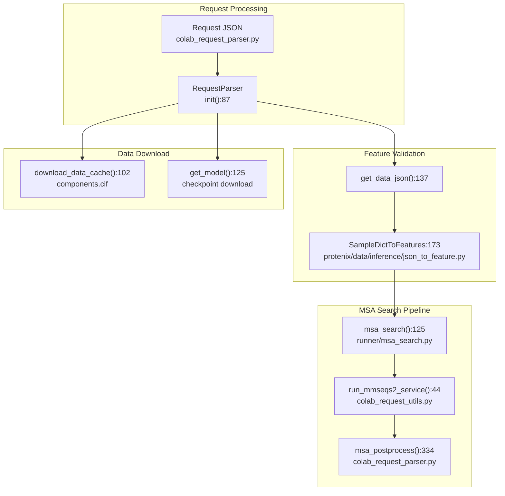
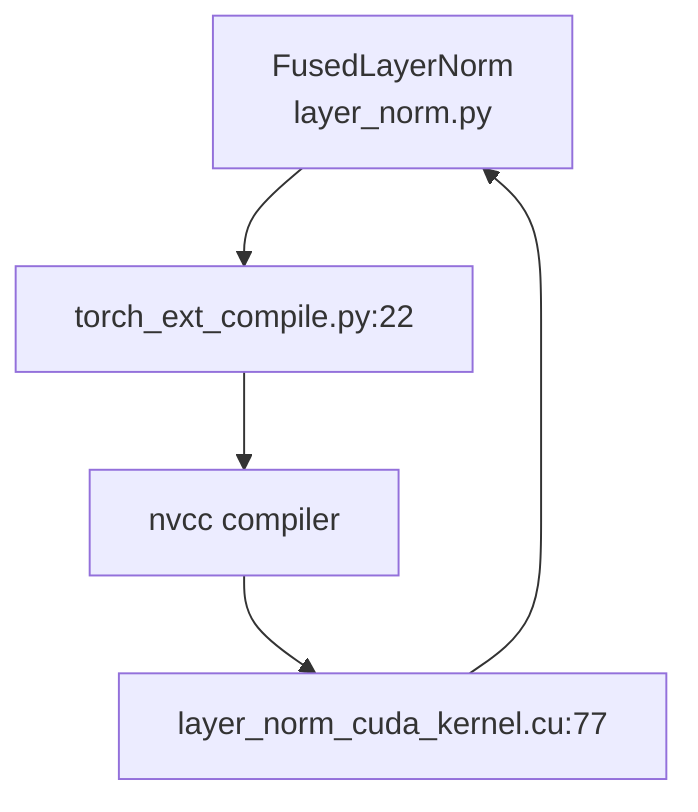

# Advanced Topics

> **Relevant source files**
> * [protenix/model/layer_norm/kernel/layer_norm_cuda_kernel.cu](https://github.com/bytedance/Protenix/blob/c3bfc365/protenix/model/layer_norm/kernel/layer_norm_cuda_kernel.cu)
> * [protenix/model/layer_norm/layer_norm.py](https://github.com/bytedance/Protenix/blob/c3bfc365/protenix/model/layer_norm/layer_norm.py)
> * [protenix/model/layer_norm/torch_ext_compile.py](https://github.com/bytedance/Protenix/blob/c3bfc365/protenix/model/layer_norm/torch_ext_compile.py)
> * [protenix/web_service/colab_request_parser.py](https://github.com/bytedance/Protenix/blob/c3bfc365/protenix/web_service/colab_request_parser.py)
> * [protenix/web_service/colab_request_utils.py](https://github.com/bytedance/Protenix/blob/c3bfc365/protenix/web_service/colab_request_utils.py)
> * [runner/msa_search.py](https://github.com/bytedance/Protenix/blob/c3bfc365/runner/msa_search.py)

This page covers advanced usage patterns, optimization techniques, and specialized features in Protenix. Topics include web service integration with external MSA APIs, performance optimizations including dynamic precision management and fused kernels, and the symmetric permutation system for training.

---

## Web Service and MSA API

Protenix integrates with external web services for MSA generation through the `RequestParser` system, enabling remote inference submissions and distributed MSA search.

### RequestParser Architecture

The `RequestParser` class in [protenix/web_service/colab_request_parser.py L86-L93](https://github.com/bytedance/Protenix/blob/c3bfc365/protenix/web_service/colab_request_parser.py#L86-L93)

 orchestrates the complete web-based inference workflow. It handles the lifecycle of a request from parsing JSON inputs to launching the inference runner.

**Key Capabilities:**

* **Remote Search:** Uses `run_mmseqs2_service` [protenix/web_service/colab_request_utils.py L44-L57](https://github.com/bytedance/Protenix/blob/c3bfc365/protenix/web_service/colab_request_utils.py#L44-L57)  to communicate with a remote MMseqs2 server (default: `https://protenix-server.com/api/msa` [protenix/web_service/colab_request_parser.py L38-L40](https://github.com/bytedance/Protenix/blob/c3bfc365/protenix/web_service/colab_request_parser.py#L38-L40) ).
* **Resource Limits:** Enforces hard limits on input size, rejecting complexes with more than 60,000 atoms or 5,000 tokens [protenix/web_service/colab_request_parser.py L41-L42](https://github.com/bytedance/Protenix/blob/c3bfc365/protenix/web_service/colab_request_parser.py#L41-L42)
* **Format Conversion:** The `msa_search` utility in [runner/msa_search.py L125-L152](https://github.com/bytedance/Protenix/blob/c3bfc365/runner/msa_search.py#L125-L152)  can convert old MSA formats to the new `pairedMsaPath` and `unpairedMsaPath` structure [runner/msa_search.py L62-L84](https://github.com/bytedance/Protenix/blob/c3bfc365/runner/msa_search.py#L62-L84)

For details, see [Web Service and MSA API](/bytedance/Protenix/8.1-web-service-and-msa-api).

**Sources:** [protenix/web_service/colab_request_parser.py L38-L192](https://github.com/bytedance/Protenix/blob/c3bfc365/protenix/web_service/colab_request_parser.py#L38-L192)

 [protenix/web_service/colab_request_utils.py L44-L57](https://github.com/bytedance/Protenix/blob/c3bfc365/protenix/web_service/colab_request_utils.py#L44-L57)

 [runner/msa_search.py L125-L152](https://github.com/bytedance/Protenix/blob/c3bfc365/runner/msa_search.py#L125-L152)

---

## Performance Optimization

Protenix includes several specialized optimizations to handle large biomolecular complexes and reduce GPU memory pressure.

### Dynamic Precision Management

The system adjusts Mixed Precision (AMP) settings based on the complexity of the input sequence to prevent Out-of-Memory (OOM) errors.

| Token Count | Strategy | Implementation |
| --- | --- | --- |
| **Small (< 2560)** | Full Precision | `skip_amp.confidence_head = True` |
| **Medium (2560 - 3840)** | Partial AMP | `skip_amp.sample_diffusion = True` |
| **Large (> 3840)** | Full AMP | Both diffusion and confidence use AMP |

### Fused Kernels and Compilation

Protenix utilizes custom CUDA kernels for performance-critical operations like LayerNorm. The `FusedLayerNorm` [protenix/model/layer_norm/layer_norm.py L190-L205](https://github.com/bytedance/Protenix/blob/c3bfc365/protenix/model/layer_norm/layer_norm.py#L190-L205)

 class provides an interface to optimized C++/CUDA implementations.

**Optimization Features:**

* **JIT Compilation:** The system dynamically compiles kernels using `torch.utils.cpp_extension.load` [protenix/model/layer_norm/torch_ext_compile.py L70-L96](https://github.com/bytedance/Protenix/blob/c3bfc365/protenix/model/layer_norm/torch_ext_compile.py#L70-L96)  targeting the specific GPU architecture detected (e.g., SM 8.0 for A100) [protenix/model/layer_norm/torch_ext_compile.py L51-L64](https://github.com/bytedance/Protenix/blob/c3bfc365/protenix/model/layer_norm/torch_ext_compile.py#L51-L64)
* **Welford Algorithm:** The CUDA kernel implements the Welford online algorithm for numerically stable variance calculation [protenix/model/layer_norm/kernel/layer_norm_cuda_kernel.cu L40-L59](https://github.com/bytedance/Protenix/blob/c3bfc365/protenix/model/layer_norm/kernel/layer_norm_cuda_kernel.cu#L40-L59)
* **GPU Compatibility:** The runner automatically falls back to standard PyTorch implementations for older architectures (Compute Capability < 8.0) to ensure stability [protenix/model/layer_norm/torch_ext_compile.py L42-L49](https://github.com/bytedance/Protenix/blob/c3bfc365/protenix/model/layer_norm/torch_ext_compile.py#L42-L49)

For details, see [Performance Optimization](/bytedance/Protenix/8.2-performance-optimization).

**Sources:** [protenix/model/layer_norm/layer_norm.py L53-L66](https://github.com/bytedance/Protenix/blob/c3bfc365/protenix/model/layer_norm/layer_norm.py#L53-L66)

 [protenix/model/layer_norm/torch_ext_compile.py L22-L96](https://github.com/bytedance/Protenix/blob/c3bfc365/protenix/model/layer_norm/torch_ext_compile.py#L22-L96)

 [protenix/model/layer_norm/kernel/layer_norm_cuda_kernel.cu L40-L132](https://github.com/bytedance/Protenix/blob/c3bfc365/protenix/model/layer_norm/kernel/layer_norm_cuda_kernel.cu#L40-L132)

---

## Symmetric Permutation System

When training on symmetric molecules (e.g., homomers), the same physical structure can be represented by multiple equivalent token orderings. Protenix implements a permutation system to handle these symmetries during loss calculation and evaluation.

**Key Concepts:**

* **Symmetry Groups:** Identifies groups of identical chains or entities that can be permuted without changing the biological meaning.
* **Permutation Alignment:** During training, the system finds the optimal permutation of predicted coordinates that minimizes the distance to the ground truth.
* **Metric Calculation:** Evaluation metrics like RMSD and LDDT are calculated by considering all valid symmetric permutations to provide the most accurate quality assessment.

For details, see [Symmetric Permutation System](/bytedance/Protenix/8.3-symmetric-permutation-system).

**Sources:** [protenix/web_service/colab_request_parser.py L109](https://github.com/bytedance/Protenix/blob/c3bfc365/protenix/web_service/colab_request_parser.py#L109-L109)

 (PDB cluster logic reference)