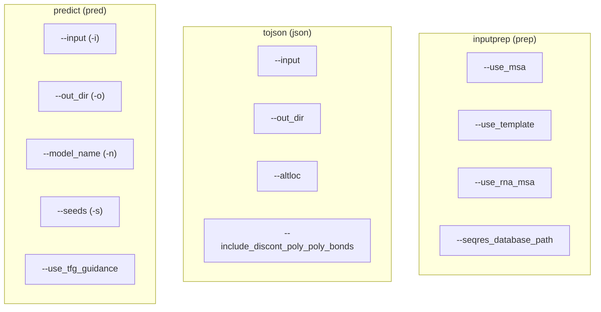

# Command Line Interface

> **Relevant source files**
> * [docs/msa_template_pipeline.md](https://github.com/bytedance/Protenix/blob/c3bfc365/docs/msa_template_pipeline.md?plain=1)
> * [docs/training_inference_instructions.md](https://github.com/bytedance/Protenix/blob/c3bfc365/docs/training_inference_instructions.md?plain=1)
> * [examples/2lwu.cif](https://github.com/bytedance/Protenix/blob/c3bfc365/examples/2lwu.cif)
> * [protenix/version.py](https://github.com/bytedance/Protenix/blob/c3bfc365/protenix/version.py)
> * [runner/batch_inference.py](https://github.com/bytedance/Protenix/blob/c3bfc365/runner/batch_inference.py)

This document covers the Protenix command line interface (CLI), which provides the primary entry point for users to interact with the system. The CLI offers a unified interface for protein structure prediction workflows, including structure prediction, data format conversion, and sequence database searching.

For details about the underlying inference processes, see [Inference Pipeline Overview](/bytedance/Protenix/3.1-inference-pipeline-overview).

## CLI Architecture Overview

The Protenix CLI is implemented as a Click-based command group. If installed via `pip`, the entry point is the `protenix` command [docs/training_inference_instructions.md L45](https://github.com/bytedance/Protenix/blob/c3bfc365/docs/training_inference_instructions.md?plain=1#L45-L45)

 The CLI routes requests to specific handlers in `runner/batch_inference.py`.


**CLI Entry Point Flow**

Sources: [runner/batch_inference.py L560-L575](https://github.com/bytedance/Protenix/blob/c3bfc365/runner/batch_inference.py#L560-L575)

 [runner/batch_inference.py L612-L628](https://github.com/bytedance/Protenix/blob/c3bfc365/runner/batch_inference.py#L612-L628)

 [runner/batch_inference.py L726-L735](https://github.com/bytedance/Protenix/blob/c3bfc365/runner/batch_inference.py#L726-L735)

 [docs/training_inference_instructions.md L48-L54](https://github.com/bytedance/Protenix/blob/c3bfc365/docs/training_inference_instructions.md?plain=1#L48-L54)

## Command Structure and Parameters

Protenix provides five main commands to handle different stages of the biomolecular structure prediction pipeline.

| Command | Alias | Description |
| --- | --- | --- |
| `predict` | `pred` | Perform model inference on JSON input(s) [docs/training_inference_instructions.md L50](https://github.com/bytedance/Protenix/blob/c3bfc365/docs/training_inference_instructions.md?plain=1#L50-L50) |
| `tojson` | `json` | Convert PDB or CIF files to Protenix-compatible JSON [docs/training_inference_instructions.md L51](https://github.com/bytedance/Protenix/blob/c3bfc365/docs/training_inference_instructions.md?plain=1#L51-L51) |
| `msa` | `msa` | Generate Multiple Sequence Alignments (MSA) for proteins [docs/training_inference_instructions.md L52](https://github.com/bytedance/Protenix/blob/c3bfc365/docs/training_inference_instructions.md?plain=1#L52-L52) |
| `msatemplate` | `mt` | Run sequential MSA and template search [docs/training_inference_instructions.md L53](https://github.com/bytedance/Protenix/blob/c3bfc365/docs/training_inference_instructions.md?plain=1#L53-L53) |
| `inputprep` | `prep` | Full preprocessing: MSA, Template, and RNA MSA search [docs/training_inference_instructions.md L54](https://github.com/bytedance/Protenix/blob/c3bfc365/docs/training_inference_instructions.md?plain=1#L54-L54) |

### Command Parameter Mapping



**CLI Command Parameters**

Sources: [runner/batch_inference.py L560-L608](https://github.com/bytedance/Protenix/blob/c3bfc365/runner/batch_inference.py#L560-L608)

 [runner/batch_inference.py L686-L724](https://github.com/bytedance/Protenix/blob/c3bfc365/runner/batch_inference.py#L686-L724)

 [runner/batch_inference.py L737-L775](https://github.com/bytedance/Protenix/blob/c3bfc365/runner/batch_inference.py#L737-L775)

## Predict Command

The `predict` command is the primary interface for running inference. It loads model weights and executes the diffusion sampling process.

### Key Inference Flags

* `--model_name`: Selection of model variant (e.g., `protenix_base_default_v1.0.0`, `protenix_mini_default_v0.5.0`) [docs/training_inference_instructions.md L106](https://github.com/bytedance/Protenix/blob/c3bfc365/docs/training_inference_instructions.md?plain=1#L106-L106)
* `--use_default_params`: When `true`, it automatically configures cycles and steps based on the selected model [docs/training_inference_instructions.md L107](https://github.com/bytedance/Protenix/blob/c3bfc365/docs/training_inference_instructions.md?plain=1#L107-L107)
* `--dtype`: Sets calculation precision to `bf16` (default) or `fp32` [docs/training_inference_instructions.md L110](https://github.com/bytedance/Protenix/blob/c3bfc365/docs/training_inference_instructions.md?plain=1#L110-L110)
* `--trimul_kernel` / `--triatt_kernel`: Selection of specialized kernels for hardware acceleration [docs/training_inference_instructions.md L111](https://github.com/bytedance/Protenix/blob/c3bfc365/docs/training_inference_instructions.md?plain=1#L111-L111)

### Model-Specific Parameter Defaults

The system applies logic to determine cycles and steps based on the version and size of the model provided in the `--model_name` argument [runner/batch_inference.py L633-L655](https://github.com/bytedance/Protenix/blob/c3bfc365/runner/batch_inference.py#L633-L655)

:

* **v1.0.0 Base**: 10 cycles, 200 steps.
* **v0.5.0 Base**: 10 cycles, 200 steps.
* **Mini models**: 4 cycles, 5 steps.

Sources: [runner/batch_inference.py L633-L655](https://github.com/bytedance/Protenix/blob/c3bfc365/runner/batch_inference.py#L633-L655)

 [docs/training_inference_instructions.md L104-L113](https://github.com/bytedance/Protenix/blob/c3bfc365/docs/training_inference_instructions.md?plain=1#L104-L113)

## Input Preparation Commands

Protenix requires MSA and template information for optimal accuracy. Three commands are provided for this purpose:

### 1. tojson (json)

Converts PDB/CIF files into the Protenix JSON format.

* `--altloc`: Determines how to handle alternative locations (e.g., "first") [runner/batch_inference.py L696](https://github.com/bytedance/Protenix/blob/c3bfc365/runner/batch_inference.py#L696-L696)
* `--include_discont_poly_poly_bonds`: If set, keeps bonds between discontinuous polymers, useful for cyclic peptides [runner/batch_inference.py L700](https://github.com/bytedance/Protenix/blob/c3bfc365/runner/batch_inference.py#L700-L700)  [docs/training_inference_instructions.md L67](https://github.com/bytedance/Protenix/blob/c3bfc365/docs/training_inference_instructions.md?plain=1#L67-L67)

### 2. inputprep (prep)

The most comprehensive preprocessing command. It executes `preprocess_input` which orchestrates [runner/batch_inference.py L70-L87](https://github.com/bytedance/Protenix/blob/c3bfc365/runner/batch_inference.py#L70-L87)

:

1. **Protein MSA search**: Via `update_infer_json` [runner/batch_inference.py L113](https://github.com/bytedance/Protenix/blob/c3bfc365/runner/batch_inference.py#L113-L113)
2. **Template search**: Via `update_template_info` if `--use_template` is enabled [runner/batch_inference.py L124-L131](https://github.com/bytedance/Protenix/blob/c3bfc365/runner/batch_inference.py#L124-L131)
3. **RNA MSA search**: Via `update_rna_msa_info` if `--use_rna_msa` is enabled [runner/batch_inference.py L134-L146](https://github.com/bytedance/Protenix/blob/c3bfc365/runner/batch_inference.py#L134-L146)

### 3. msatemplate (mt)

A subset of `prep` that focuses on protein-related features, running sequential Protein MSA and Template searches [docs/training_inference_instructions.md L77](https://github.com/bytedance/Protenix/blob/c3bfc365/docs/training_inference_instructions.md?plain=1#L77-L77)

Sources: [runner/batch_inference.py L70-L165](https://github.com/bytedance/Protenix/blob/c3bfc365/runner/batch_inference.py#L70-L165)

 [docs/training_inference_instructions.md L56-L83](https://github.com/bytedance/Protenix/blob/c3bfc365/docs/training_inference_instructions.md?plain=1#L56-L83)

## Configuration Integration

The CLI commands integrate with the hierarchical configuration system. The `batch_inference` function initializes the environment and merges CLI arguments into the `ConfigDict` [runner/batch_inference.py L612-L684](https://github.com/bytedance/Protenix/blob/c3bfc365/runner/batch_inference.py#L612-L684)

```

```

**Configuration Flow Integration**

The `InferenceRunner` is instantiated with the final merged configuration, which includes hardware-specific optimizations like `enable_cache` and `enable_fusion` [runner/batch_inference.py L674-L678](https://github.com/bytedance/Protenix/blob/c3bfc365/runner/batch_inference.py#L674-L678)

Sources: [runner/batch_inference.py L30-L35](https://github.com/bytedance/Protenix/blob/c3bfc365/runner/batch_inference.py#L30-L35)

 [runner/batch_inference.py L612-L684](https://github.com/bytedance/Protenix/blob/c3bfc365/runner/batch_inference.py#L612-L684)

 [runner/inference.py L46-L48](https://github.com/bytedance/Protenix/blob/c3bfc365/runner/inference.py#L46-L48)