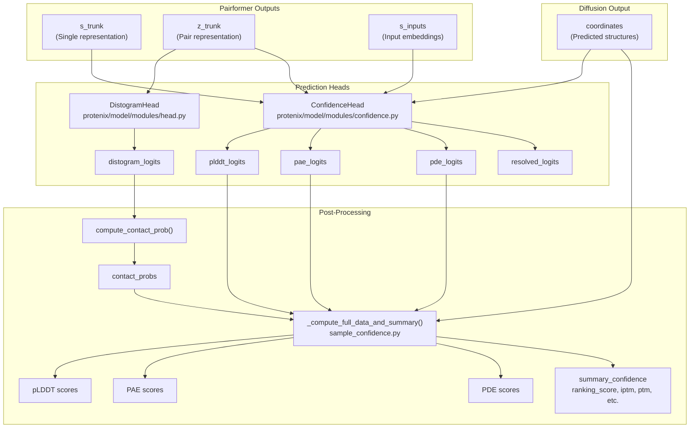
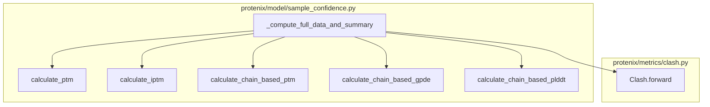

# Confidence and Quality Metrics

> **Relevant source files**
> * [protenix/metrics/clash.py](https://github.com/bytedance/Protenix/blob/c3bfc365/protenix/metrics/clash.py)
> * [protenix/model/modules/confidence.py](https://github.com/bytedance/Protenix/blob/c3bfc365/protenix/model/modules/confidence.py)
> * [protenix/model/modules/head.py](https://github.com/bytedance/Protenix/blob/c3bfc365/protenix/model/modules/head.py)
> * [protenix/model/sample_confidence.py](https://github.com/bytedance/Protenix/blob/c3bfc365/protenix/model/sample_confidence.py)

This page documents the confidence and quality metrics produced by Protenix models to assess prediction reliability. These metrics include per-token confidence scores (pLDDT), inter-residue error estimates (PAE, PDE), contact probabilities, and aggregate ranking scores used to evaluate and rank predicted structures.

For information about the diffusion-based structure generation that produces the coordinates these metrics evaluate, see [5.3 Diffusion and Structure Generation](https://github.com/bytedance/Protenix/blob/c3bfc365/5.3 Diffusion and Structure Generation)

 For details on the overall model architecture, see [5.2 Neural Network Components](https://github.com/bytedance/Protenix/blob/c3bfc365/5.2 Neural Network Components)

## Overview

Protenix produces two categories of quality metrics during structure prediction:

1. **Prediction Heads**: Neural network modules that output confidence logits. * `DistogramHead`: Predicts inter-token distance distributions [protenix/model/modules/head.py:22-33]. * `ConfidenceHead`: Predicts pLDDT, PAE, PDE, and resolved probabilities [protenix/model/modules/confidence.py:26-47].
2. **Derived Metrics**: Post-processed confidence scores computed in `protenix/model/sample_confidence.py`. * Contact probabilities from distogram logits. * Summary confidence scores for structure ranking (pTM, ipTM, etc.). * Clash detection and ranking scores.

These metrics are computed after diffusion sampling generates coordinate predictions and are used both for structure ranking during inference and as training targets.

**Sources:** [protenix/model/modules/head.py L22-L33](https://github.com/bytedance/Protenix/blob/c3bfc365/protenix/model/modules/head.py#L22-L33)

 [protenix/model/modules/confidence.py L26-L47](https://github.com/bytedance/Protenix/blob/c3bfc365/protenix/model/modules/confidence.py#L26-L47)

 [protenix/model/sample_confidence.py L46-L177](https://github.com/bytedance/Protenix/blob/c3bfc365/protenix/model/sample_confidence.py#L46-L177)

## Architecture: From Model Outputs to Confidence Metrics



This diagram shows the complete flow from Pairformer trunk representations through prediction heads to final confidence metrics. The `DistogramHead` operates solely on the pair representation `z_trunk`, while the `ConfidenceHead` integrates single representations, pair representations, and predicted coordinates.

**Sources:** [protenix/model/modules/head.py L43-L56](https://github.com/bytedance/Protenix/blob/c3bfc365/protenix/model/modules/head.py#L43-L56)

 [protenix/model/modules/confidence.py L133-L146](https://github.com/bytedance/Protenix/blob/c3bfc365/protenix/model/modules/confidence.py#L133-L146)

 [protenix/model/sample_confidence.py L46-L62](https://github.com/bytedance/Protenix/blob/c3bfc365/protenix/model/sample_confidence.py#L46-L62)

## DistogramHead and Contact Probabilities

### DistogramHead Module

The `DistogramHead` predicts the distribution of inter-token distances by processing the pair representation `z_trunk`. It outputs logits over 64 distance bins [protenix/model/modules/head.py:33-41].

The logits are symmetrized by adding them to their transpose: `logits = logits + logits.transpose(-2, -3)` [protenix/model/modules/head.py:55].

### Contact Probability Computation

Contact probabilities are derived from distogram logits by summing probabilities for bins representing distances below a threshold (typically 8 Å). This is handled during post-processing to provide a mask for weighting error estimates like GPDE (Generalized Predicted Distance Error) [protenix/model/sample_confidence.py:113-115].

**Sources:** [protenix/model/modules/head.py L54-L56](https://github.com/bytedance/Protenix/blob/c3bfc365/protenix/model/modules/head.py#L54-L56)

 [protenix/model/sample_confidence.py L113-L115](https://github.com/bytedance/Protenix/blob/c3bfc365/protenix/model/sample_confidence.py#L113-L115)

## ConfidenceHead Module

### Architecture and Inputs

The `ConfidenceHead` implements Algorithm 31 from AlphaFold 3 [protenix/model/modules/confidence.py:28]. It uses a `PairformerStack` [protenix/model/modules/confidence.py:99-106] to process coordinates and trunk embeddings.

| Input Component | Code Entity | Description |
| --- | --- | --- |
| **Coordinates** | `x_pred_coords` | Atom coordinates from diffusion [protenix/model/modules/confidence.py:158] |
| **Trunk Single** | `s_trunk` | Single embedding from Pairformer [protenix/model/modules/confidence.py:152] |
| **Trunk Pair** | `z_trunk` | Pair embedding from Pairformer [protenix/model/modules/confidence.py:154] |
| **Input Single** | `s_inputs` | Initial single embedding [protenix/model/modules/confidence.py:150] |

### Confidence Head Internal Logic

1. **Coordinate Encoding**: Atom coordinates are converted to pairwise distances and binned into 38 bins [protenix/model/modules/confidence.py:85-91].
2. **Feature Integration**: Single and pair embeddings are integrated with the binned distances using linear layers [protenix/model/modules/confidence.py:196-213].
3. **Refinement**: A series of `PairformerStack` blocks (default 4) refines the integrated representations [protenix/model/modules/confidence.py:218-226].
4. **Projection**: Final linear layers project the refined embeddings into logits for pLDDT, PAE, PDE, and resolved status [protenix/model/modules/confidence.py:228-251].

**Sources:** [protenix/model/modules/confidence.py L133-L251](https://github.com/bytedance/Protenix/blob/c3bfc365/protenix/model/modules/confidence.py#L133-L251)

## Output Metrics

### pLDDT (Predicted Local Distance Difference Test)

pLDDT provides a per-atom confidence score. In Protenix, it is calculated by taking the mean of atom pLDDT values [protenix/model/sample_confidence.py:112].

### PAE (Predicted Aligned Error)

PAE estimates the error between token pairs. The `pae_prob` is used to calculate higher-level metrics like `ptm` (Predicted TM-score) and `iptm` (Interface Predicted TM-score) [protenix/model/sample_confidence.py:117-125].

### PDE (Predicted Distance Error)

PDE estimates the error in distances between token pairs. It is used to compute `gpde` (Generalized Predicted Distance Error), which is weighted by contact probabilities [protenix/model/sample_confidence.py:113-115].

### Clash Detection

The `Clash` class in `protenix/metrics/clash.py` identifies atomic overlaps. It checks for two types of clashes:

1. **AF3 Clash**: Based on a fixed threshold (default 1.1 Å) [protenix/metrics/clash.py:38].
2. **VDW Clash**: Based on Van der Waals radii from RDKit (default 0.75 relative distance) [protenix/metrics/clash.py:39].

The presence of a clash significantly penalizes the final ranking score [protenix/model/sample_confidence.py:176].

**Sources:** [protenix/model/sample_confidence.py L112-L125](https://github.com/bytedance/Protenix/blob/c3bfc365/protenix/model/sample_confidence.py#L112-L125)

 [protenix/metrics/clash.py L35-L42](https://github.com/bytedance/Protenix/blob/c3bfc365/protenix/metrics/clash.py#L35-L42)

 [protenix/model/sample_confidence.py L172-L177](https://github.com/bytedance/Protenix/blob/c3bfc365/protenix/model/sample_confidence.py#L172-L177)

## Summary Confidence and Ranking

The final `ranking_score` is a weighted combination of several metrics:

```
ranking_score = (    0.8 * iptm    + 0.2 * ptm    + 0.5 * disorder    - 100 * has_clash)
```

[protenix/model/sample_confidence.py:172-177]

### Aggregate Metrics Implementation

Protenix computes chain-based and interface-based versions of these metrics:

* `calculate_chain_based_ptm`: Computes `chain_ptm`, `chain_iptm`, and `chain_pair_iptm` [protenix/model/sample_confidence.py:137-144].
* `calculate_chain_based_gpde`: Computes GPDE for individual chains and chain pairs [protenix/model/sample_confidence.py:129-134].
* `calculate_chain_pair_pae`: Computes mean and minimum PAE for chain pairs [protenix/model/sample_confidence.py:153-158].

**Sources:** [protenix/model/sample_confidence.py L127-L158](https://github.com/bytedance/Protenix/blob/c3bfc365/protenix/model/sample_confidence.py#L127-L158)

 [protenix/model/sample_confidence.py L172-L177](https://github.com/bytedance/Protenix/blob/c3bfc365/protenix/model/sample_confidence.py#L172-L177)

## Code Entity Map: Metrics Calculation



**Sources:** [protenix/model/sample_confidence.py L117-L166](https://github.com/bytedance/Protenix/blob/c3bfc365/protenix/model/sample_confidence.py#L117-L166)

## Training vs. Inference Differences

### Inference Mode

During inference, metrics are calculated on the final sampled coordinates to select the best structure among multiple diffusion samples. The system aggregates scores across samples using `merge_per_sample_confidence_scores` [protenix/model/sample_confidence.py:24-43].

### Training Mode

During training, the `ConfidenceHead` is trained to predict the quality of structures generated during a "mini-rollout" (a shortened diffusion process).

* **Stop Gradient**: By default, gradients are stopped before the confidence head to prevent confidence training from affecting the main trunk [protenix/model/modules/confidence.py:45].
* **Permutation**: In training, coordinates are permuted to account for molecular symmetries before confidence is calculated [protenix/model/sample_confidence.py:183-195].

**Sources:** [protenix/model/sample_confidence.py L24-L43](https://github.com/bytedance/Protenix/blob/c3bfc365/protenix/model/sample_confidence.py#L24-L43)

 [protenix/model/modules/confidence.py L45](https://github.com/bytedance/Protenix/blob/c3bfc365/protenix/model/modules/confidence.py#L45-L45)

 [protenix/model/sample_confidence.py L183-L195](https://github.com/bytedance/Protenix/blob/c3bfc365/protenix/model/sample_confidence.py#L183-L195)