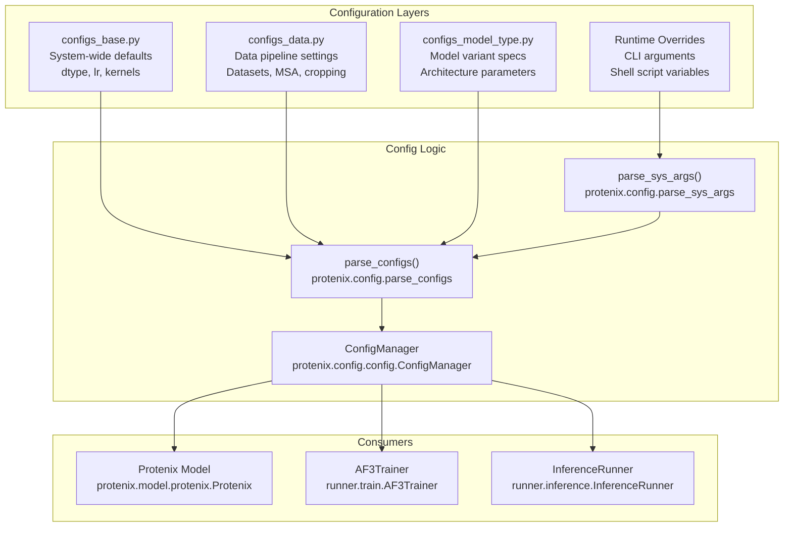
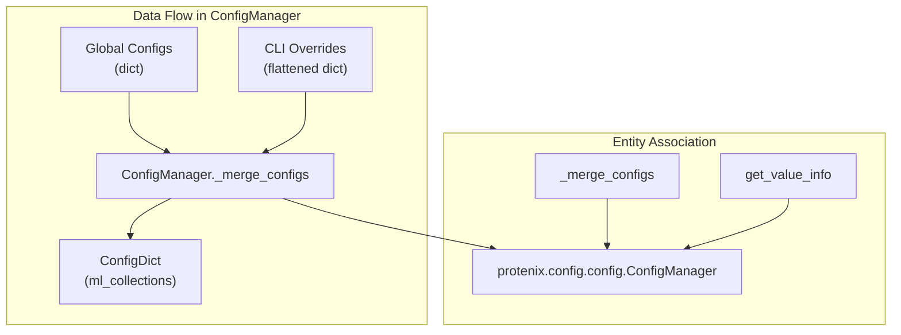

# Configuration Architecture

> **Relevant source files**
> * [LICENSE](https://github.com/bytedance/Protenix/blob/c3bfc365/LICENSE)
> * [configs/configs_base.py](https://github.com/bytedance/Protenix/blob/c3bfc365/configs/configs_base.py)
> * [protenix/config/__init__.py](https://github.com/bytedance/Protenix/blob/c3bfc365/protenix/config/__init__.py)
> * [protenix/config/config.py](https://github.com/bytedance/Protenix/blob/c3bfc365/protenix/config/config.py)
> * [protenix/config/extend_types.py](https://github.com/bytedance/Protenix/blob/c3bfc365/protenix/config/extend_types.py)
> * [protenix/model/protenix.py](https://github.com/bytedance/Protenix/blob/c3bfc365/protenix/model/protenix.py)

## Purpose and Scope

This document explains Protenix's hierarchical configuration system, which coordinates all components of the system through a tiered architecture: base configurations, data configurations, model-type configurations, and runtime overrides. The system enables flexible experimentation, model variant selection, and customization without code modification by leveraging a recursive merging strategy.

For details on specific model parameters, see [Model Variants and Configuration](/bytedance/Protenix/5.1-model-variants-and-configuration). For training-specific usage, see [Training Execution](/bytedance/Protenix/6.2-training-execution). For inference details, see [Running Inference](/bytedance/Protenix/3.4-running-inference).

## Configuration Hierarchy

Protenix employs a layered configuration architecture where settings cascade from general to specific. The `ConfigManager` class in `protenix/config/config.py` is responsible for handling the logic of type checking and recursive merging [protenix/config/config.py L37-L50](https://github.com/bytedance/Protenix/blob/c3bfc365/protenix/config/config.py#L37-L50)



**Sources:** [protenix/config/config.py L37-L50](https://github.com/bytedance/Protenix/blob/c3bfc365/protenix/config/config.py#L37-L50)

 [configs/configs_base.py L23-L55](https://github.com/bytedance/Protenix/blob/c3bfc365/configs/configs_base.py#L23-L55)

 [protenix/model/protenix.py L91-L169](https://github.com/bytedance/Protenix/blob/c3bfc365/protenix/model/protenix.py#L91-L169)

## Configuration Files

### configs_base.py

The foundation layer containing system-wide parameters. These define computational resources, optimization strategies, and global feature toggles.

| Category | Key Parameters | Default Value | Description |
| --- | --- | --- | --- |
| **Precision** | `dtype` | `"bf16"` | Default training dtype [configs/configs_base.py L135](https://github.com/bytedance/Protenix/blob/c3bfc365/configs/configs_base.py#L135-L135) |
| **Optimization** | `grad_clip_norm` | `10` | Gradient clipping threshold [configs/configs_base.py L80](https://github.com/bytedance/Protenix/blob/c3bfc365/configs/configs_base.py#L80-L80) |
|  | `iters_to_accumulate` | `1` | Gradient accumulation steps [configs/configs_base.py L32](https://github.com/bytedance/Protenix/blob/c3bfc365/configs/configs_base.py#L32-L32) |
| **Learning Rate** | `lr` | `0.0018` | Base learning rate [configs/configs_base.py L74](https://github.com/bytedance/Protenix/blob/c3bfc365/configs/configs_base.py#L74-L74) |
|  | `lr_scheduler` | `"af3"` | Scheduler type [configs/configs_base.py L75](https://github.com/bytedance/Protenix/blob/c3bfc365/configs/configs_base.py#L75-L75) |
| **Checkpointing** | `load_checkpoint_path` | `""` | Path to resume from [configs/configs_base.py L37](https://github.com/bytedance/Protenix/blob/c3bfc365/configs/configs_base.py#L37-L37) |
|  | `load_strict` | `True` | Require exact parameter match [configs/configs_base.py L39](https://github.com/bytedance/Protenix/blob/c3bfc365/configs/configs_base.py#L39-L39) |
| **Diffusion** | `diffusion_batch_size` | `48` | Batch size for diffusion [configs/configs_base.py L122](https://github.com/bytedance/Protenix/blob/c3bfc365/configs/configs_base.py#L122-L122) |
| **Kernels** | `triangle_attention` | `"cuequivariance"` | Attention implementation [configs/configs_base.py L130](https://github.com/bytedance/Protenix/blob/c3bfc365/configs/configs_base.py#L130-L130) |
|  | `triangle_multiplicative` | `"cuequivariance"` | Multiplicative layer choice [configs/configs_base.py L129](https://github.com/bytedance/Protenix/blob/c3bfc365/configs/configs_base.py#L129-L129) |

**Sources:** [configs/configs_base.py L23-L145](https://github.com/bytedance/Protenix/blob/c3bfc365/configs/configs_base.py#L23-L145)

### configs_data.py

Manages data pipelines and dataset specifications. It includes settings for MSA generation, cropping strategies, and training/test set definitions.

#### Key Data Settings

* **Cropping**: `train_crop_size` defaults to 256 [configs/configs_base.py L58](https://github.com/bytedance/Protenix/blob/c3bfc365/configs/configs_base.py#L58-L58)
* **MSA**: Configured via the `msa` key, specifying database paths and strategies [protenix/model/protenix.py L130-L131](https://github.com/bytedance/Protenix/blob/c3bfc365/protenix/model/protenix.py#L130-L131)
* **ESM**: Support for ESM embeddings can be toggled via `esm.enable` [configs/configs_base.py L67](https://github.com/bytedance/Protenix/blob/c3bfc365/configs/configs_base.py#L67-L67)

**Sources:** [configs/configs_base.py L56-L71](https://github.com/bytedance/Protenix/blob/c3bfc365/configs/configs_base.py#L56-L71)

 [protenix/model/protenix.py L120-L131](https://github.com/bytedance/Protenix/blob/c3bfc365/protenix/model/protenix.py#L120-L131)

### configs_model_type.py

Defines model variants (e.g., `protenix_base_default_v1.0.0`). These configurations specify architecture dimensions like `c_s` (single representation dimension) and `c_z` (pair representation dimension).

| Parameter | Default (Base) | Description |
| --- | --- | --- |
| `c_s` | 384 | Single representation channel [configs/configs_base.py L112](https://github.com/bytedance/Protenix/blob/c3bfc365/configs/configs_base.py#L112-L112) |
| `c_z` | 128 | Pair representation channel [configs/configs_base.py L113](https://github.com/bytedance/Protenix/blob/c3bfc365/configs/configs_base.py#L113-L113) |
| `n_blocks` | 48 | Number of Pairformer blocks [configs/configs_base.py L118](https://github.com/bytedance/Protenix/blob/c3bfc365/configs/configs_base.py#L118-L118) |
| `N_cycle` | 10 (v1.0.0) | Recycling iterations [protenix/model/protenix.py L105](https://github.com/bytedance/Protenix/blob/c3bfc365/protenix/model/protenix.py#L105-L105) |

**Sources:** [configs/configs_base.py L108-L128](https://github.com/bytedance/Protenix/blob/c3bfc365/configs/configs_base.py#L108-L128)

 [protenix/model/protenix.py L105-L106](https://github.com/bytedance/Protenix/blob/c3bfc365/protenix/model/protenix.py#L105-L106)

## Configuration Merging Process

The `ConfigManager` implements the logic for resolving special types and merging dictionaries.

### Special Configuration Types

Protenix uses extended types in `protenix/config/extend_types.py` to handle complex configuration requirements:

* **`GlobalConfigValue`**: A placeholder that references a top-level key [protenix/config/extend_types.py L28-L31](https://github.com/bytedance/Protenix/blob/c3bfc365/protenix/config/extend_types.py#L28-L31)  For example, `adam.lr` often points to the global `lr` [configs/configs_base.py L86](https://github.com/bytedance/Protenix/blob/c3bfc365/configs/configs_base.py#L86-L86)
* **`RequiredValue`**: Marks a parameter that must be provided via CLI or model-specific configs [protenix/config/extend_types.py L33-L36](https://github.com/bytedance/Protenix/blob/c3bfc365/protenix/config/extend_types.py#L33-L36)
* **`ValueMaybeNone`**: Explicitly allows a value to be `None` while maintaining type info [protenix/config/extend_types.py L21-L26](https://github.com/bytedance/Protenix/blob/c3bfc365/protenix/config/extend_types.py#L21-L26)
* **`ListValue`**: Ensures comma-separated CLI strings are parsed into lists of the correct type [protenix/config/extend_types.py L38-L46](https://github.com/bytedance/Protenix/blob/c3bfc365/protenix/config/extend_types.py#L38-L46)

### Merging Logic

The merge occurs in `_merge_configs` [protenix/config/config.py L123-L164](https://github.com/bytedance/Protenix/blob/c3bfc365/protenix/config/config.py#L123-L164)

 The system recursively traverses the hierarchical dictionary, applying overrides from `new_configs` (usually CLI arguments) to the `local_configs` (the defaults).



**Sources:** [protenix/config/config.py L52-L164](https://github.com/bytedance/Protenix/blob/c3bfc365/protenix/config/config.py#L52-L164)

 [protenix/config/extend_types.py L16-L46](https://github.com/bytedance/Protenix/blob/c3bfc365/protenix/config/extend_types.py#L16-L46)

## Implementation in the Model

The `Protenix` class (the main model) receives the merged `configs` object in its constructor [protenix/model/protenix.py L96](https://github.com/bytedance/Protenix/blob/c3bfc365/protenix/model/protenix.py#L96-L96)

 It uses these values to initialize all sub-modules:

1. **Embedders**: `InputFeatureEmbedder`, `RelativePositionEncoding`, `TemplateEmbedder`, and `ConstraintEmbedder` [protenix/model/protenix.py L121-L134](https://github.com/bytedance/Protenix/blob/c3bfc365/protenix/model/protenix.py#L121-L134)
2. **Trunk**: `MSAModule` and `PairformerStack` [protenix/model/protenix.py L128-L135](https://github.com/bytedance/Protenix/blob/c3bfc365/protenix/model/protenix.py#L128-L135)
3. **Heads**: `DiffusionModule`, `DistogramHead`, and `ConfidenceHead` [protenix/model/protenix.py L136-L138](https://github.com/bytedance/Protenix/blob/c3bfc365/protenix/model/protenix.py#L136-L138)
4. **Schedulers**: `TrainingNoiseSampler` and `InferenceNoiseScheduler` [protenix/model/protenix.py L113-L116](https://github.com/bytedance/Protenix/blob/c3bfc365/protenix/model/protenix.py#L113-L116)

```markdown
# Example of config usage in model initself.input_embedder = InputFeatureEmbedder(    **configs.model.input_embedder, esm_configs=esm_configs) # [protenix/model/protenix.py:121-123]
```

**Sources:** [protenix/model/protenix.py L91-L169](https://github.com/bytedance/Protenix/blob/c3bfc365/protenix/model/protenix.py#L91-L169)

## Configuration Access Patterns

### CLI Override Syntax

Parameters can be overridden from the command line using dot-notation:

```
python runner/train.py --model_name protenix_base_default_v1.0.0 --lr 0.001 --model.n_blocks 16
```

The `parse_sys_args` function converts these into a flattened dictionary where keys are joined by dots [protenix/config/config.py L132-L137](https://github.com/bytedance/Protenix/blob/c3bfc365/protenix/config/config.py#L132-L137)

### Runtime Precision Control

The system allows disabling Automatic Mixed Precision (AMP) for specific modules via the `skip_amp` config [configs/configs_base.py L137-L145](https://github.com/bytedance/Protenix/blob/c3bfc365/configs/configs_base.py#L137-L145)

 This is critical for the `DiffusionModule` and `loss` calculation to maintain numerical stability [configs/configs_base.py L138-L144](https://github.com/bytedance/Protenix/blob/c3bfc365/configs/configs_base.py#L138-L144)

**Sources:** [protenix/config/config.py L123-L164](https://github.com/bytedance/Protenix/blob/c3bfc365/protenix/config/config.py#L123-L164)

 [configs/configs_base.py L137-L145](https://github.com/bytedance/Protenix/blob/c3bfc365/configs/configs_base.py#L137-L145)