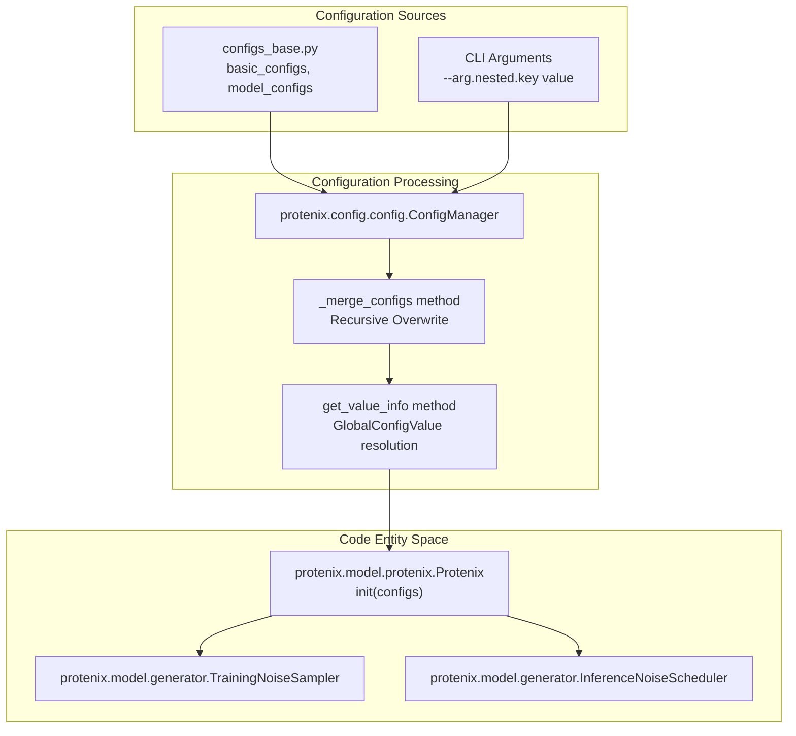
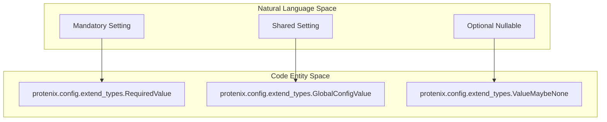

# Configuration System

> **Relevant source files**
> * [LICENSE](https://github.com/bytedance/Protenix/blob/c3bfc365/LICENSE)
> * [configs/configs_base.py](https://github.com/bytedance/Protenix/blob/c3bfc365/configs/configs_base.py)
> * [protenix/config/__init__.py](https://github.com/bytedance/Protenix/blob/c3bfc365/protenix/config/__init__.py)
> * [protenix/config/config.py](https://github.com/bytedance/Protenix/blob/c3bfc365/protenix/config/config.py)
> * [protenix/config/extend_types.py](https://github.com/bytedance/Protenix/blob/c3bfc365/protenix/config/extend_types.py)
> * [protenix/model/protenix.py](https://github.com/bytedance/Protenix/blob/c3bfc365/protenix/model/protenix.py)

This document describes Protenix's configuration system, which manages all parameters for model architecture, training, inference, and data processing. The configuration system uses a hierarchical dictionary-based approach with support for dynamic value resolution and CLI overrides.

For information about running inference with specific configurations, see [Running Inference](/bytedance/Protenix/3.4-running-inference). For training-specific configuration usage, see [Training Execution](/bytedance/Protenix/6.2-training-execution). For detailed parameter explanations, see [Model Configuration](/bytedance/Protenix/7.2-model-configuration) and [Data and Inference Configuration](/bytedance/Protenix/7.3-data-and-inference-configuration).

## Configuration Architecture Overview

Protenix uses a multi-layered configuration system where settings are organized into separate modules and merged at runtime. The system is centered around the `ConfigManager` class [protenix/config/config.py L37-L47](https://github.com/bytedance/Protenix/blob/c3bfc365/protenix/config/config.py#L37-L47)

 which handles recursive merging and type validation.

Key features include:

* **Hierarchical configuration dictionaries** with nested keys [protenix/config/config.py L101-L118](https://github.com/bytedance/Protenix/blob/c3bfc365/protenix/config/config.py#L101-L118)
* **Dynamic value resolution** through special types like `GlobalConfigValue` [protenix/config/extend_types.py L28-L31](https://github.com/bytedance/Protenix/blob/c3bfc365/protenix/config/extend_types.py#L28-L31)
* **Model-specific overrides** defined in `model_configs` [configs/configs_base.py L108-L206](https://github.com/bytedance/Protenix/blob/c3bfc365/configs/configs_base.py#L108-L206)
* **CLI-based runtime overrides** using dot-notation access [protenix/config/config.py L130-L164](https://github.com/bytedance/Protenix/blob/c3bfc365/protenix/config/config.py#L130-L164)

**Diagram: Configuration Flow from Code Sources to Model Entities**

Sources: [protenix/config/config.py L37-L185](https://github.com/bytedance/Protenix/blob/c3bfc365/protenix/config/config.py#L37-L185)

 [protenix/model/protenix.py L96-L138](https://github.com/bytedance/Protenix/blob/c3bfc365/protenix/model/protenix.py#L96-L138)

 [configs/configs_base.py L23-L108](https://github.com/bytedance/Protenix/blob/c3bfc365/configs/configs_base.py#L23-L108)

## Configuration File Structure

### Base Configuration Module

The base configuration [configs/configs_base.py](https://github.com/bytedance/Protenix/blob/c3bfc365/configs/configs_base.py)

 defines the core parameters for the project, including training intervals, optimization settings, and model hyperparameters.

| Configuration Category | Variable Name | Purpose |
| --- | --- | --- |
| **Project Settings** | `basic_configs` | Project name, run name, and base directories [configs/configs_base.py L23-L55](https://github.com/bytedance/Protenix/blob/c3bfc365/configs/configs_base.py#L23-L55) |
| **Optimization** | `optim_configs` | LR, scheduler, and Adam parameters [configs/configs_base.py L72-L96](https://github.com/bytedance/Protenix/blob/c3bfc365/configs/configs_base.py#L72-L96) |
| **Fine-tuning** | `finetune_optim_configs` | LR and steps for fine-tuning stages [configs/configs_base.py L99-L107](https://github.com/bytedance/Protenix/blob/c3bfc365/configs/configs_base.py#L99-L107) |
| **Model** | `model_configs` | Architecture dimensions and diffusion settings [configs/configs_base.py L108-L206](https://github.com/bytedance/Protenix/blob/c3bfc365/configs/configs_base.py#L108-L206) |

For details, see [Model Configuration](/bytedance/Protenix/7.2-model-configuration).

Sources: [configs/configs_base.py L23-L206](https://github.com/bytedance/Protenix/blob/c3bfc365/configs/configs_base.py#L23-L206)

## Special Configuration Types

Protenix uses extended types to manage complex configuration logic during the merging process. These are defined in `protenix/config/extend_types.py`.

| Class Name | Purpose |
| --- | --- |
| `GlobalConfigValue` | References a top-level key to ensure consistency across nested configs [protenix/config/extend_types.py L28-L31](https://github.com/bytedance/Protenix/blob/c3bfc365/protenix/config/extend_types.py#L28-L31) |
| `RequiredValue` | Marks a parameter that must be provided by the user/CLI [protenix/config/extend_types.py L33-L35](https://github.com/bytedance/Protenix/blob/c3bfc365/protenix/config/extend_types.py#L33-L35) |
| `ValueMaybeNone` | Explicitly allows a value to be `None` [protenix/config/extend_types.py L21-L26](https://github.com/bytedance/Protenix/blob/c3bfc365/protenix/config/extend_types.py#L21-L26) |
| `ListValue` | Wraps lists to prevent incorrect merging behavior [protenix/config/extend_types.py L38-L46](https://github.com/bytedance/Protenix/blob/c3bfc365/protenix/config/extend_types.py#L38-L46) |

**Diagram: Mapping Conceptual Requirements to Configuration Types**

Sources: [protenix/config/extend_types.py L16-L46](https://github.com/bytedance/Protenix/blob/c3bfc365/protenix/config/extend_types.py#L16-L46)

 [protenix/config/config.py L52-L84](https://github.com/bytedance/Protenix/blob/c3bfc365/protenix/config/config.py#L52-L84)

## Configuration Architecture

The `ConfigManager` handles the lifecycle of configurations from parsing to runtime distribution. It uses `ml_collections.ConfigDict` as the underlying container [protenix/config/config.py L21](https://github.com/bytedance/Protenix/blob/c3bfc365/protenix/config/config.py#L21-L21)

1. **Initialization**: The manager is initialized with a global dictionary of defaults [protenix/config/config.py L47-L50](https://github.com/bytedance/Protenix/blob/c3bfc365/protenix/config/config.py#L47-L50)
2. **Merging**: It recursively updates local configurations while resolving `GlobalConfigValue` references [protenix/config/config.py L123-L164](https://github.com/bytedance/Protenix/blob/c3bfc365/protenix/config/config.py#L123-L164)
3. **Validation**: It checks for required values and correct data types [protenix/config/config.py L170-L185](https://github.com/bytedance/Protenix/blob/c3bfc365/protenix/config/config.py#L170-L185)

For details, see [Configuration Architecture](/bytedance/Protenix/7.1-configuration-architecture).

Sources: [protenix/config/config.py L37-L185](https://github.com/bytedance/Protenix/blob/c3bfc365/protenix/config/config.py#L37-L185)

## Model and Data Configuration

### Model Architecture

The `Protenix` class [protenix/model/protenix.py L91](https://github.com/bytedance/Protenix/blob/c3bfc365/protenix/model/protenix.py#L91-L91)

 consumes the configuration object to instantiate sub-modules like `InputFeatureEmbedder`, `MSAModule`, and `DiffusionModule`.

* **Dimensions**: `c_s`, `c_z`, and `c_atom` are configurable [configs/configs_base.py L112-L115](https://github.com/bytedance/Protenix/blob/c3bfc365/configs/configs_base.py#L112-L115)
* **Precision**: `enable_tf32` and `dtype` control hardware acceleration [configs/configs_base.py L133-L135](https://github.com/bytedance/Protenix/blob/c3bfc365/configs/configs_base.py#L133-L135)

### Data and Inference

Configurations also control the inference behavior, such as:

* **Diffusion Steps**: `N_step` in `sample_diffusion` [configs/configs_base.py L181](https://github.com/bytedance/Protenix/blob/c3bfc365/configs/configs_base.py#L181-L181)
* **Chunking**: `dynamic_chunk_size` and thresholds to manage memory [configs/configs_base.py L150-L156](https://github.com/bytedance/Protenix/blob/c3bfc365/configs/configs_base.py#L150-L156)

For details, see [Model Configuration](/bytedance/Protenix/7.2-model-configuration) and [Data and Inference Configuration](/bytedance/Protenix/7.3-data-and-inference-configuration).

Sources: [protenix/model/protenix.py L96-L138](https://github.com/bytedance/Protenix/blob/c3bfc365/protenix/model/protenix.py#L96-L138)

 [configs/configs_base.py L108-L185](https://github.com/bytedance/Protenix/blob/c3bfc365/configs/configs_base.py#L108-L185)