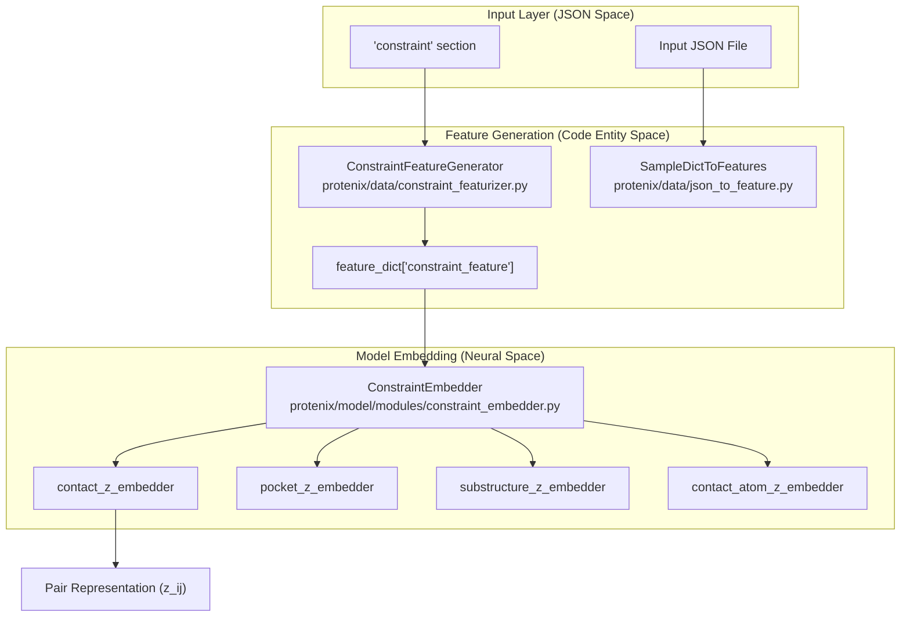

# Constraint-Guided Predictions

> **Relevant source files**
> * [configs/configs_data.py](https://github.com/bytedance/Protenix/blob/c3bfc365/configs/configs_data.py)
> * [examples/example_constraint_msa.json](https://github.com/bytedance/Protenix/blob/c3bfc365/examples/example_constraint_msa.json)
> * [runner/batch_inference.py](https://github.com/bytedance/Protenix/blob/c3bfc365/runner/batch_inference.py)
> * [scripts/database/download_protenix_data.sh](https://github.com/bytedance/Protenix/blob/c3bfc365/scripts/database/download_protenix_data.sh)

## Purpose and Scope

This document describes the constraint-guided prediction system in Protenix, which allows users to provide structural priors to improve prediction accuracy. The system supports multiple types of constraints: **contact constraints** (residue/atom-level distance priors), **pocket constraints** (binding interface guidance), and **substructure constraints** (fixed geometry). These are implemented as soft constraints that guide the model's diffusion sampling and pair representations.

For general inference workflow, see [3.4 Running Inference](https://github.com/bytedance/Protenix/blob/c3bfc365/3.4 Running Inference)

 For input/output format details beyond constraints, see [3.5 Output Formats and Interpretation](https://github.com/bytedance/Protenix/blob/c3bfc365/3.5 Output Formats and Interpretation)

---

## System Overview

Constraint-guided predictions enhance Protenix's structure prediction by incorporating prior knowledge about expected distances between specific residues or atoms, binding pockets, and structural fragments.

The following diagram maps the logical flow of constraints from JSON specification to the model's neural network entities.

**Constraint Data Flow: JSON to Code Entities**



**Sources:** [protenix/data/json_to_feature.py L306-L321](https://github.com/bytedance/Protenix/blob/c3bfc365/protenix/data/json_to_feature.py#L306-L321)

 [configs/configs_model_type.py L41-L113](https://github.com/bytedance/Protenix/blob/c3bfc365/configs/configs_model_type.py#L41-L113)

 [runner/batch_inference.py L167-L195](https://github.com/bytedance/Protenix/blob/c3bfc365/runner/batch_inference.py#L167-L195)

---

## Constraint Types and Configuration

Protenix defines constraints in `configs/configs_data.py` for training and supports them in inference via specific JSON fields.

### Contact Constraints

Contact constraints specify distance bounds between pairs of residues or atoms.

* **Token-level contact**: Uses the center atom of each token (residue/ligand).
* **Atom-level contact**: Specifies exact atom names (e.g., "CA", "N").

| JSON Field | Type | Description |
| --- | --- | --- |
| `entity1`/`2` | int | 1-indexed entity ID from `sequences` |
| `copy1`/`2` | int | 1-indexed copy number |
| `position1`/`2` | int | 1-indexed residue position |
| `atom1`/`2` | str | (Optional) Specific atom name |
| `max_distance` | float | Upper bound in Å |
| `min_distance` | float | Lower bound in Å (default 0) |

**Sources:** [configs/configs_data.py L82-L91](https://github.com/bytedance/Protenix/blob/c3bfc365/configs/configs_data.py#L82-L91)

 [configs/configs_data.py L112-L123](https://github.com/bytedance/Protenix/blob/c3bfc365/configs/configs_data.py#L112-L123)

 [examples/example_constraint_msa.json L153-L167](https://github.com/bytedance/Protenix/blob/c3bfc365/examples/example_constraint_msa.json#L153-L167)

### Pocket Constraints

Pocket constraints define a binding interface between a "binder" chain and a set of "contact residues".

* **Implementation**: During training, these are sampled with specific probabilities (`prob: 0.2` for PP/LP pairs) [configs/configs_data.py L75-L81](https://github.com/bytedance/Protenix/blob/c3bfc365/configs/configs_data.py#L75-L81)
* **Logic**: It guides the model to place the `binder_chain` within the `max_distance` of the specified `contact_residues`.

**Sources:** [configs/configs_data.py L74-L81](https://github.com/bytedance/Protenix/blob/c3bfc365/configs/configs_data.py#L74-L81)

 [examples/example_constraint_msa.json L53-L68](https://github.com/bytedance/Protenix/blob/c3bfc365/examples/example_constraint_msa.json#L53-L68)

### Substructure Constraints

These provide known geometric conformations for fragments.

* **Feature Type**: Typically `one_hot` [configs/configs_data.py L100](https://github.com/bytedance/Protenix/blob/c3bfc365/configs/configs_data.py#L100-L100)
* **Noise**: A `coord_noise_scale` (default 0.05) is applied during training to ensure the model learns to refine these priors [configs/configs_data.py L109](https://github.com/bytedance/Protenix/blob/c3bfc365/configs/configs_data.py#L109-L109)

---

## Implementation and Data Flow

The constraint system is integrated into the `SampleDictToFeatures` pipeline.

### Feature Generation

The `ConstraintFeatureGenerator` (invoked in `protenix/data/json_to_feature.py`) transforms raw JSON dictionaries into tensor features:

1. **Mapping**: It maps entity/copy/position identifiers to global token indices using the `TokenArray`.
2. **Masking**: It generates binary masks for tokens and atoms involved in constraints.
3. **Distance Tensors**: It creates tensors representing the `min_distance` and `max_distance` bounds.

```css
# protenix/data/json_to_feature.py:306-313constraint_feature, token_array, atom_array = (    ConstraintFeatureGenerator.generate_from_json(        token_array,        atom_array,        self.input_dict["sequences"],        self.input_dict.get("constraint", {}),    ))
```

### Model Integration (The Constraint Model)

The model variant `protenix_base_constraint_v0.5.0` enables specialized embedders in its configuration.

**Model Configuration Mapping**

| Component | Code Entity | Config Path |
| --- | --- | --- |
| **Pocket** | `PocketEmbedder` | `model.constraint_embedder.pocket_embedder` |
| **Contact** | `ContactEmbedder` | `model.constraint_embedder.contact_embedder` |
| **Atom Contact** | `ContactAtomEmbedder` | `model.constraint_embedder.contact_atom_embedder` |
| **Substructure** | `SubstructureEmbedder` | `model.constraint_embedder.substructure_embedder` |

**Sources:** [configs/configs_model_type.py L47-L61](https://github.com/bytedance/Protenix/blob/c3bfc365/configs/configs_model_type.py#L47-L61)

 [protenix/data/json_to_feature.py L306-L321](https://github.com/bytedance/Protenix/blob/c3bfc365/protenix/data/json_to_feature.py#L306-L321)

---

## Example Specification

The following example demonstrates how multiple constraint types are structured in the inference JSON.

```
{    "name": "5sak_atom_example",    "sequences": [...],    "constraint": {        "contact": [            {                "entity1": 1, "copy1": 1, "position1": 311, "atom1": "CG2",                "entity2": 2, "copy2": 1, "position2": 1, "atom2": "C10",                "max_distance": 5, "min_distance": 3            }        ],        "pocket": {            "binder_chain": {"entity": 2, "copy": 1},            "contact_residues": [{"entity": 1, "copy": 1, "position": 69}],            "max_distance": 8        }    }}
```

**Sources:** [examples/example_constraint_msa.json L53-L68](https://github.com/bytedance/Protenix/blob/c3bfc365/examples/example_constraint_msa.json#L53-L68)

 [examples/example_constraint_msa.json L152-L167](https://github.com/bytedance/Protenix/blob/c3bfc365/examples/example_constraint_msa.json#L152-L167)

---

## Training-Time Constraint Generation

During training, constraints are not always provided by the user but are generated on-the-fly from the ground truth structures to teach the model how to use them. This is controlled by `default_weighted_pdb_configs` in `configs/configs_data.py`.

**Training Logic for Constraints:**

* **Probabilities**: Constraints are applied stochastically (e.g., `prob: 0.0` by default, increased during specific training stages) [configs/configs_data.py L75-L113](https://github.com/bytedance/Protenix/blob/c3bfc365/configs/configs_data.py#L75-L113)
* **Distance Sampling**: The `max_distance_range` defines the distribution from which priors are sampled (e.g., `PP: [6, 30]` for protein-protein contacts) [configs/configs_data.py L86-L89](https://github.com/bytedance/Protenix/blob/c3bfc365/configs/configs_data.py#L86-L89)
* **Symmetry**: The system accounts for symmetric molecules when mapping constraints to tokens [configs/configs_data.py L67](https://github.com/bytedance/Protenix/blob/c3bfc365/configs/configs_data.py#L67-L67)

**Sources:** [configs/configs_data.py L71-L124](https://github.com/bytedance/Protenix/blob/c3bfc365/configs/configs_data.py#L71-L124)

 [configs/configs_data.py L45-L67](https://github.com/bytedance/Protenix/blob/c3bfc365/configs/configs_data.py#L45-L67)