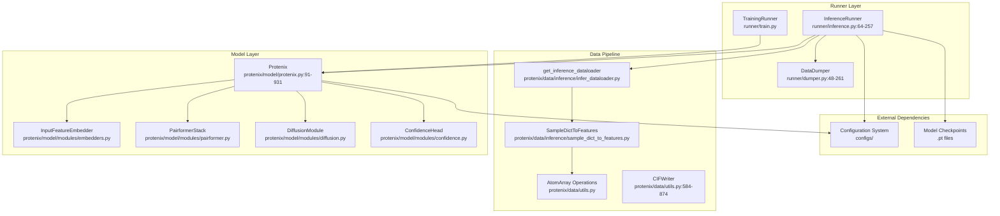
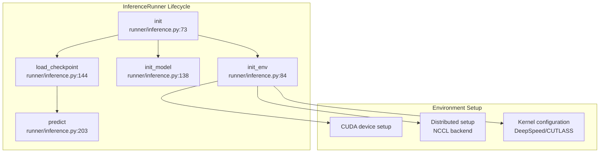
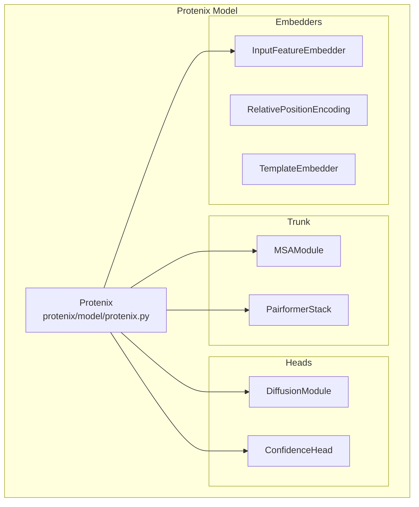

# Core Components

> **Relevant source files**
> * [configs/configs_base.py](https://github.com/bytedance/Protenix/blob/c3bfc365/configs/configs_base.py)
> * [configs/configs_inference.py](https://github.com/bytedance/Protenix/blob/c3bfc365/configs/configs_inference.py)
> * [protenix/model/generator.py](https://github.com/bytedance/Protenix/blob/c3bfc365/protenix/model/generator.py)
> * [protenix/model/protenix.py](https://github.com/bytedance/Protenix/blob/c3bfc365/protenix/model/protenix.py)
> * [runner/dumper.py](https://github.com/bytedance/Protenix/blob/c3bfc365/runner/dumper.py)
> * [runner/inference.py](https://github.com/bytedance/Protenix/blob/c3bfc365/runner/inference.py)

This document provides an overview of the main system components in Protenix: the **runner layer**, **model layer**, and **data pipeline**. These three component groups work together to orchestrate the end-to-end workflow from input data to structural predictions.

## System Component Overview

Protenix is organized into three primary layers that handle different aspects of the prediction workflow:

**Sources:** [runner/inference.py L64-L257](https://github.com/bytedance/Protenix/blob/c3bfc365/runner/inference.py#L64-L257)

 [protenix/model/protenix.py L91-L169](https://github.com/bytedance/Protenix/blob/c3bfc365/protenix/model/protenix.py#L91-L169)

 [protenix/data/utils.py L584-L874](https://github.com/bytedance/Protenix/blob/c3bfc365/protenix/data/utils.py#L584-L874)

 [runner/dumper.py L48-L261](https://github.com/bytedance/Protenix/blob/c3bfc365/runner/dumper.py#L48-L261)

## Runner Components

The runner layer provides execution orchestration. Runners handle environment initialization, model loading, data processing coordination, and result output.

### InferenceRunner

The `InferenceRunner` class manages the complete inference pipeline. It is responsible for initializing the execution environment (CUDA/Distributed), loading model checkpoints, and coordinating predictions.

**Key Methods:**

| Method | Purpose | Key Operations |
| --- | --- | --- |
| `init_env()` | Setup execution environment | Configure CUDA, `dist.init_process_group`, and check `CUTLASS_PATH` [runner/inference.py L84-L128](https://github.com/bytedance/Protenix/blob/c3bfc365/runner/inference.py#L84-L128) |
| `init_model()` | Create model instance | Instantiate `Protenix(self.configs)` and move to device [runner/inference.py L138-L142](https://github.com/bytedance/Protenix/blob/c3bfc365/runner/inference.py#L138-L142) |
| `load_checkpoint()` | Load model weights | Load `.pt` file, handle DDP `module.` prefix, and count parameters [runner/inference.py L144-L185](https://github.com/bytedance/Protenix/blob/c3bfc365/runner/inference.py#L144-L185) |
| `predict()` | Run inference | Execute model forward pass with `torch.cuda.amp.autocast` [runner/inference.py L203-L236](https://github.com/bytedance/Protenix/blob/c3bfc365/runner/inference.py#L203-L236) |

**Sources:** [runner/inference.py L64-L257](https://github.com/bytedance/Protenix/blob/c3bfc365/runner/inference.py#L64-L257)

### DataDumper

The `DataDumper` handles the persistence of model outputs. It converts raw model tensors into standardized structural formats (CIF) and quality metrics (JSON).

| Method | Purpose | Implementation Detail |
| --- | --- | --- |
| `dump_predictions` | Main entry for saving | Orchestrates structure and confidence saving [runner/dumper.py L110-L166](https://github.com/bytedance/Protenix/blob/c3bfc365/runner/dumper.py#L110-L166) |
| `_save_structure` | Save CIF files | Updates `AtomArray` with `pred_coordinates` and saves via `save_structure_cif` [runner/dumper.py L168-L216](https://github.com/bytedance/Protenix/blob/c3bfc365/runner/dumper.py#L168-L216) |
| `_save_confidence` | Save metrics | Dumps `pLDDT`, `PAE`, and `ranking_score` to JSON [runner/dumper.py L218-L261](https://github.com/bytedance/Protenix/blob/c3bfc365/runner/dumper.py#L218-L261) |

**Sources:** [runner/dumper.py L48-L261](https://github.com/bytedance/Protenix/blob/c3bfc365/runner/dumper.py#L48-L261)

## Model Component

The core model is implemented in the `Protenix` class, which follows the AlphaFold3 architecture.

### Protenix Class Structure

The `Protenix` class initializes all sub-modules including the `InputFeatureEmbedder`, `MSAModule`, `PairformerStack`, and `DiffusionModule` [protenix/model/protenix.py L121-L138](https://github.com/bytedance/Protenix/blob/c3bfc365/protenix/model/protenix.py#L121-L138)

**Sources:** [protenix/model/protenix.py L91-L169](https://github.com/bytedance/Protenix/blob/c3bfc365/protenix/model/protenix.py#L91-L169)

### Main Execution Pathways

The `Protenix` model provides distinct logic for inference and training:

* **Recycling Loop**: Implemented in `get_pairformer_output`, it iterates `N_cycle` times to refine representations `s` and `z` [protenix/model/protenix.py L170-L304](https://github.com/bytedance/Protenix/blob/c3bfc365/protenix/model/protenix.py#L170-L304)
* **Diffusion Sampling**: During inference, `sample_diffusion` (Algorithm 18) is called to generate coordinates from the trunk representations [protenix/model/protenix.py L381-L397](https://github.com/bytedance/Protenix/blob/c3bfc365/protenix/model/protenix.py#L381-L397)
* **Training Loop**: Includes `sample_diffusion_training` and `SymmetricPermutation` to handle ground truth alignment [protenix/model/protenix.py L650-L841](https://github.com/bytedance/Protenix/blob/c3bfc365/protenix/model/protenix.py#L650-L841)

**Sources:** [protenix/model/protenix.py L170-L841](https://github.com/bytedance/Protenix/blob/c3bfc365/protenix/model/protenix.py#L170-L841)

 [protenix/model/generator.py L123-L188](https://github.com/bytedance/Protenix/blob/c3bfc365/protenix/model/generator.py#L123-L188)

## Configuration System

Protenix uses a hierarchical configuration system defined in `configs/`.

| Config File | Role | Key Contents |
| --- | --- | --- |
| `configs_base.py` | Global settings | Project names, seed (default 42), training intervals [configs/configs_base.py L23-L55](https://github.com/bytedance/Protenix/blob/c3bfc365/configs/configs_base.py#L23-L55) |
| `configs_inference.py` | Inference defaults | `dump_dir`, `use_msa`, `enable_tf32` [configs/configs_inference.py L22-L39](https://github.com/bytedance/Protenix/blob/c3bfc365/configs/configs_inference.py#L22-L39) |
| `configs_model_type.py` | Architecture params | `c_s`, `c_z`, `n_blocks`, `N_step` (200 for inference) [configs/configs_base.py L108-L181](https://github.com/bytedance/Protenix/blob/c3bfc365/configs/configs_base.py#L108-L181) |

**Sources:** [configs/configs_base.py](https://github.com/bytedance/Protenix/blob/c3bfc365/configs/configs_base.py)

 [configs/configs_inference.py](https://github.com/bytedance/Protenix/blob/c3bfc365/configs/configs_inference.py)

## Data Pipeline Components

The data pipeline transforms raw inputs into the tensor format required by the `Protenix` model.

### Structure Handling

The system relies heavily on `biotite.structure.AtomArray` for molecular representation.

* **CIFWriter**: A specialized class for writing mmCIF files, handling `_entity`, `_entity_poly`, and `_atom_site` categories [protenix/data/utils.py L584-L874](https://github.com/bytedance/Protenix/blob/c3bfc365/protenix/data/utils.py#L584-L874)
* **Coordinate Updates**: The utility `update_atom_array_coords` allows mapping model-predicted tensors back to `AtomArray` objects for visualization [protenix/data/utils.py L446-L460](https://github.com/bytedance/Protenix/blob/c3bfc365/protenix/data/utils.py#L446-L460)

**Sources:** [protenix/data/utils.py L446-L874](https://github.com/bytedance/Protenix/blob/c3bfc365/protenix/data/utils.py#L446-L874)

### Noise Scheduling

Generation is governed by noise schedulers that define the diffusion process:

* **TrainingNoiseSampler**: Samples noise levels using a log-normal distribution [protenix/model/generator.py L26-L61](https://github.com/bytedance/Protenix/blob/c3bfc365/protenix/model/generator.py#L26-L61)
* **InferenceNoiseScheduler**: Implements the Karras-style power-law schedule (Algorithm 18) [protenix/model/generator.py L64-L120](https://github.com/bytedance/Protenix/blob/c3bfc365/protenix/model/generator.py#L64-L120)

**Sources:** [protenix/model/generator.py L26-L120](https://github.com/bytedance/Protenix/blob/c3bfc365/protenix/model/generator.py#L26-L120)