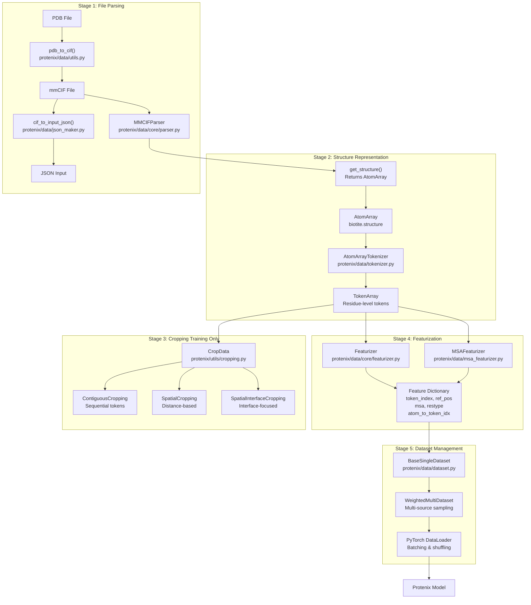
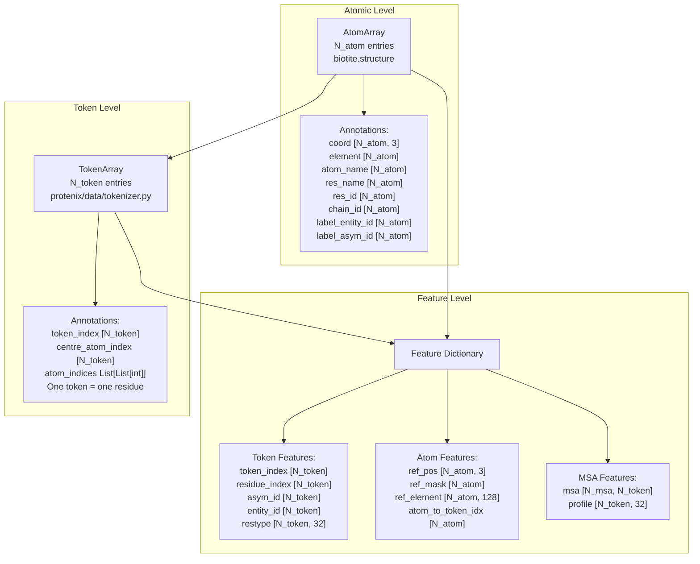
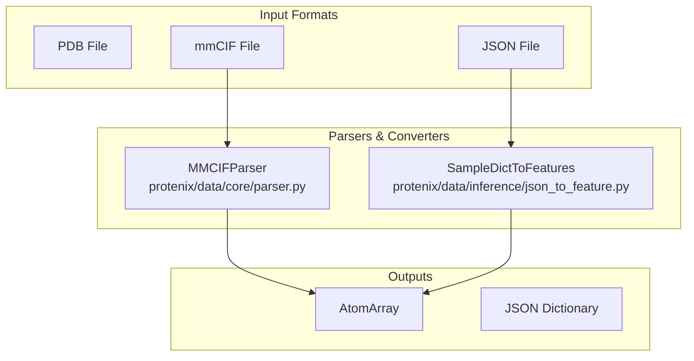

# Data Processing Pipeline

> **Relevant source files**
> * [protenix/data/core/featurizer.py](https://github.com/bytedance/Protenix/blob/c3bfc365/protenix/data/core/featurizer.py)
> * [protenix/data/core/parser.py](https://github.com/bytedance/Protenix/blob/c3bfc365/protenix/data/core/parser.py)
> * [protenix/data/inference/json_to_feature.py](https://github.com/bytedance/Protenix/blob/c3bfc365/protenix/data/inference/json_to_feature.py)
> * [protenix/data/utils.py](https://github.com/bytedance/Protenix/blob/c3bfc365/protenix/data/utils.py)
> * [scripts/prepare_training_data.py](https://github.com/bytedance/Protenix/blob/c3bfc365/scripts/prepare_training_data.py)

The Data Processing Pipeline transforms raw molecular structure data into model-ready numerical features. This document covers the complete workflow from parsing PDB/CIF files through tokenization, featurization, and dataset management for both training and inference.

For information about:

* JSON input specification format: see [Input Data Formats](/bytedance/Protenix/4.1-input-data-formats)
* Structure file parsing and manipulation: see [Structure Parsing and Conversion](/bytedance/Protenix/4.2-structure-parsing-and-conversion)
* Token and atom feature construction: see [Feature Generation](/bytedance/Protenix/4.3-feature-generation)
* Dataset classes and cropping strategies: see [Training Data Pipeline](/bytedance/Protenix/4.4-training-data-pipeline)
* MSA generation and integration: see [Multiple Sequence Alignment](/bytedance/Protenix/3.3-multiple-sequence-alignment)
* Inference-specific data preparation: see [Input Preparation and Conversion](/bytedance/Protenix/3.2-input-preparation-and-conversion)

---

## Pipeline Architecture Overview

The data processing pipeline consists of major stages that transform raw structural files into dense numerical tensors. The pipeline handles both training (with cropping and augmentation) and inference (full structures without cropping) workflows.

**Diagram 1: End-to-End Data Flow**

**Sources:**

* [protenix/data/core/parser.py L93-L124](https://github.com/bytedance/Protenix/blob/c3bfc365/protenix/data/core/parser.py#L93-L124)
* [protenix/data/core/featurizer.py L29-L53](https://github.com/bytedance/Protenix/blob/c3bfc365/protenix/data/core/featurizer.py#L29-L53)
* [protenix/data/inference/json_to_feature.py L37-L43](https://github.com/bytedance/Protenix/blob/c3bfc365/protenix/data/inference/json_to_feature.py#L37-L43)
* [scripts/prepare_training_data.py L29-L60](https://github.com/bytedance/Protenix/blob/c3bfc365/scripts/prepare_training_data.py#L29-L60)

---

## Core Data Structures

The pipeline operates on fundamental representations that bridge raw atomic data to neural network inputs.

**Diagram 2: Data Structure Hierarchy**

**Sources:**

* [protenix/data/core/featurizer.py L89-L142](https://github.com/bytedance/Protenix/blob/c3bfc365/protenix/data/core/featurizer.py#L89-L142)
* [protenix/data/tokenizer.py L30](https://github.com/bytedance/Protenix/blob/c3bfc365/protenix/data/tokenizer.py#L30-L30)
* [protenix/data/utils.py L66-L96](https://github.com/bytedance/Protenix/blob/c3bfc365/protenix/data/utils.py#L66-L96)

### AtomArray

`AtomArray` is a Biotite data structure representing atomic-level information. The Protenix pipeline extends the standard `AtomArray` with custom annotations retrieved via `get_atom_mask_by_name` and other utilities.

| Annotation | Description |
| --- | --- |
| `coord` | 3D Cartesian coordinates |
| `element` | Element symbols (C, N, O, etc.) |
| `atom_name` | PDB atom names (CA, CB, etc.) |
| `res_name` | Residue names (ALA, GLY, etc.) |
| `res_id` | Residue sequence numbers |
| `label_entity_id` | Entity ID from mmCIF |
| `label_asym_id` | Asymmetric unit chain ID |
| `copy_id` | A asym chain id in N copies of an entity |

**Sources:**

* [protenix/data/utils.py L66-L96](https://github.com/bytedance/Protenix/blob/c3bfc365/protenix/data/utils.py#L66-L96)
* [protenix/data/core/parser.py L45-L47](https://github.com/bytedance/Protenix/blob/c3bfc365/protenix/data/core/parser.py#L45-L47)

### TokenArray

`TokenArray` represents residue-level tokens. Most tokens correspond to single residues, but some (ligands, ions) may contain multiple atoms. The `AtomArrayTokenizer` groups atoms into tokens.

**Sources:**

* [protenix/data/tokenizer.py L30](https://github.com/bytedance/Protenix/blob/c3bfc365/protenix/data/tokenizer.py#L30-L30)
* [protenix/data/inference/json_to_feature.py L30](https://github.com/bytedance/Protenix/blob/c3bfc365/protenix/data/inference/json_to_feature.py#L30-L30)

---

## Stage 1: File Parsing and Conversion

The pipeline handles multiple input formats. The `MMCIFParser` is the primary entry point for structural data.

**Diagram 3: File Format Processing**

**Sources:**

* [protenix/data/core/parser.py L93-L124](https://github.com/bytedance/Protenix/blob/c3bfc365/protenix/data/core/parser.py#L93-L124)
* [protenix/data/inference/json_to_feature.py L37-L43](https://github.com/bytedance/Protenix/blob/c3bfc365/protenix/data/inference/json_to_feature.py#L37-L43)

### MMCIFParser

`MMCIFParser` extracts categorical tables and metadata from mmCIF files using `biotite.structure.io.pdbx`.

**Key Methods:**

* `get_category_table(name)`: Retrieves a category table as a pandas DataFrame [protenix/data/core/parser.py L125-L141](https://github.com/bytedance/Protenix/blob/c3bfc365/protenix/data/core/parser.py#L125-L141)
* `resolution`: Extracts X-ray or cryoEM resolution [protenix/data/core/parser.py L182-L205](https://github.com/bytedance/Protenix/blob/c3bfc365/protenix/data/core/parser.py#L182-L205)
* `pdb_id`: Extracts the entry ID [protenix/data/core/parser.py L143-L154](https://github.com/bytedance/Protenix/blob/c3bfc365/protenix/data/core/parser.py#L143-L154)

---

## Stage 2: Tokenization

Tokenization reduces sequence length for modeling. The `AtomArrayTokenizer` handles proteins, nucleic acids, ligands, and ions.

**Tokenization Rules:**

| Molecule Type | Tokenization Strategy | Centre Atom |
| --- | --- | --- |
| Protein | 1 residue = 1 token | CA |
| Nucleic Acid | 1 nucleotide = 1 token | C1' |
| Ligand | 1 residue = 1 token | First heavy atom |
| Ion | 1 atom = 1 token | The atom itself |

**Sources:**

* [protenix/data/core/featurizer.py L145-L173](https://github.com/bytedance/Protenix/blob/c3bfc365/protenix/data/core/featurizer.py#L145-L173)
* [protenix/data/inference/json_to_feature.py L94-L127](https://github.com/bytedance/Protenix/blob/c3bfc365/protenix/data/inference/json_to_feature.py#L94-L127)

---

## Stage 3: Feature Generation

The `Featurizer` class implements AlphaFold3-style encoding for residues, elements, and atom names.

**Key Encoding Methods:**

* `restype_onehot_encoded`: One-hot encoding for 32 residue types [protenix/data/core/featurizer.py L89-L104](https://github.com/bytedance/Protenix/blob/c3bfc365/protenix/data/core/featurizer.py#L89-L104)
* `elem_onehot_encoded`: One-hot encoding for atomic numbers up to 128 [protenix/data/core/featurizer.py L107-L119](https://github.com/bytedance/Protenix/blob/c3bfc365/protenix/data/core/featurizer.py#L107-L119)
* `ref_atom_name_chars_encoded`: Character-level encoding of atom names padded to length 4 [protenix/data/core/featurizer.py L122-L143](https://github.com/bytedance/Protenix/blob/c3bfc365/protenix/data/core/featurizer.py#L122-L143)

**Sources:**

* [protenix/data/core/featurizer.py L55-L87](https://github.com/bytedance/Protenix/blob/c3bfc365/protenix/data/core/featurizer.py#L55-L87)  (Generic encoder)
* [protenix/data/core/featurizer.py L145-L173](https://github.com/bytedance/Protenix/blob/c3bfc365/protenix/data/core/featurizer.py#L145-L173)  (Frame construction)

---

## Stage 4: Training Data Pipeline

The training pipeline prepares large-scale datasets from mmCIF files, often caching bioassemblies as compressed pickles.

**Workflow:**

1. **Bioassembly Generation**: `gen_a_bioassembly_data` processes mmCIFs into `WeightedPDB` or `Distillation` datasets [scripts/prepare_training_data.py L29-L60](https://github.com/bytedance/Protenix/blob/c3bfc365/scripts/prepare_training_data.py#L29-L60)
2. **Parallel Processing**: `gen_data_from_mmcifs` uses `joblib.Parallel` to process structural files at scale [scripts/prepare_training_data.py L63-L95](https://github.com/bytedance/Protenix/blob/c3bfc365/scripts/prepare_training_data.py#L63-L95)
3. **Index Creation**: Results are aggregated into a CSV index for the `WeightedMultiDataset` [scripts/prepare_training_data.py L97-L103](https://github.com/bytedance/Protenix/blob/c3bfc365/scripts/prepare_training_data.py#L97-L103)

**Sources:**

* [scripts/prepare_training_data.py L106-L152](https://github.com/bytedance/Protenix/blob/c3bfc365/scripts/prepare_training_data.py#L106-L152)
* [protenix/data/utils.py L156-L185](https://github.com/bytedance/Protenix/blob/c3bfc365/protenix/data/utils.py#L156-L185)  (Clustering utilities)

---

## Summary Table: Key Classes and Their Roles

| Class | Location | Primary Responsibility |
| --- | --- | --- |
| `MMCIFParser` | [protenix/data/core/parser.py L93-L124](https://github.com/bytedance/Protenix/blob/c3bfc365/protenix/data/core/parser.py#L93-L124) | Extract metadata and tables from mmCIF |
| `SampleDictToFeatures` | [protenix/data/inference/json_to_feature.py L37-L43](https://github.com/bytedance/Protenix/blob/c3bfc365/protenix/data/inference/json_to_feature.py#L37-L43) | Convert inference JSON inputs to features |
| `Featurizer` | [protenix/data/core/featurizer.py L29-L53](https://github.com/bytedance/Protenix/blob/c3bfc365/protenix/data/core/featurizer.py#L29-L53) | Numerical encoding of atomic and token data |
| `DataPipeline` | [protenix/data/pipeline/data_pipeline.py L25](https://github.com/bytedance/Protenix/blob/c3bfc365/protenix/data/pipeline/data_pipeline.py#L25-L25) | High-level data preparation entry point |

**Sources:**

* [protenix/data/core/parser.py](https://github.com/bytedance/Protenix/blob/c3bfc365/protenix/data/core/parser.py)
* [protenix/data/core/featurizer.py](https://github.com/bytedance/Protenix/blob/c3bfc365/protenix/data/core/featurizer.py)
* [protenix/data/inference/json_to_feature.py](https://github.com/bytedance/Protenix/blob/c3bfc365/protenix/data/inference/json_to_feature.py)
* [scripts/prepare_training_data.py](https://github.com/bytedance/Protenix/blob/c3bfc365/scripts/prepare_training_data.py)