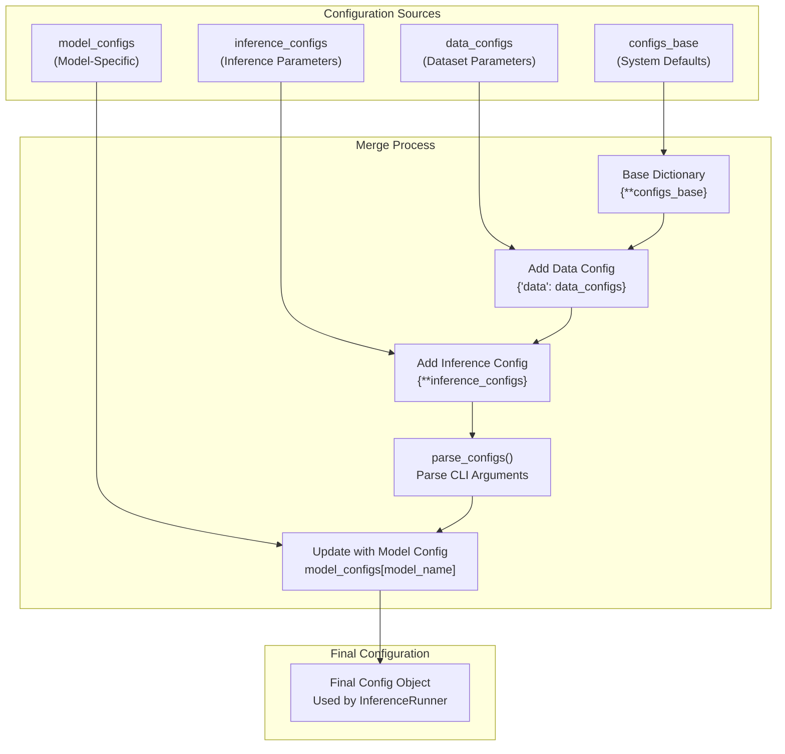
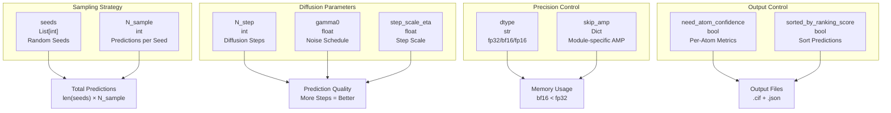

# Data and Inference Configuration

> **Relevant source files**
> * [configs/configs_data.py](https://github.com/bytedance/Protenix/blob/c3bfc365/configs/configs_data.py)
> * [configs/configs_inference.py](https://github.com/bytedance/Protenix/blob/c3bfc365/configs/configs_inference.py)
> * [protenix/data/pipeline/dataset.py](https://github.com/bytedance/Protenix/blob/c3bfc365/protenix/data/pipeline/dataset.py)
> * [protenix/model/generator.py](https://github.com/bytedance/Protenix/blob/c3bfc365/protenix/model/generator.py)
> * [runner/dumper.py](https://github.com/bytedance/Protenix/blob/c3bfc365/runner/dumper.py)
> * [scripts/database/download_protenix_data.sh](https://github.com/bytedance/Protenix/blob/c3bfc365/scripts/database/download_protenix_data.sh)

This document describes the data pipeline and inference configuration system in Protenix. It covers inference-specific parameters (seeds, samples, diffusion steps), data loading configurations (MSA, training datasets, batch processing), and dynamic configuration updates based on input characteristics.

## Configuration Sources and Hierarchy

Protenix uses a hierarchical configuration system that merges configurations from multiple sources. The final configuration is assembled from four primary sources, with model-specific configurations taking precedence over base configurations.

### Configuration Merge Flow



**Configuration Assembly Process:**

The configuration merge happens during the initialization of the inference runner [runner/inference.py L384-L397](https://github.com/bytedance/Protenix/blob/c3bfc365/runner/inference.py#L384-L397)

 The `configs_base` provides global settings, while `data_configs` [configs/configs_data.py L128-L212](https://github.com/bytedance/Protenix/blob/c3bfc365/configs/configs_data.py#L128-L212)

 and `inference_configs` [configs/configs_inference.py L22-L39](https://github.com/bytedance/Protenix/blob/c3bfc365/configs/configs_inference.py#L22-L39)

 provide domain-specific defaults.

**Sources:**

* [runner/inference.py L384-L397](https://github.com/bytedance/Protenix/blob/c3bfc365/runner/inference.py#L384-L397)
* [configs/configs_data.py L128-L212](https://github.com/bytedance/Protenix/blob/c3bfc365/configs/configs_data.py#L128-L212)
* [configs/configs_inference.py L22-L39](https://github.com/bytedance/Protenix/blob/c3bfc365/configs/configs_inference.py#L22-L39)

## Inference Parameters

Inference configurations control the prediction execution strategy, including sampling parameters, precision settings, and output options.

### Core Inference Parameters



**Inference Parameters Table:**

| Parameter | Type | Default | Description |
| --- | --- | --- | --- |
| `seeds` | List[int] | `[101]` | Random seeds for reproducibility [configs/configs_inference.py L24](https://github.com/bytedance/Protenix/blob/c3bfc365/configs/configs_inference.py#L24-L24) |
| `N_sample` | int | Model-specific | Number of samples per seed [protenix/model/generator.py L133](https://github.com/bytedance/Protenix/blob/c3bfc365/protenix/model/generator.py#L133-L133) |
| `N_step` | int | 200 | Diffusion sampling steps [protenix/model/generator.py L90](https://github.com/bytedance/Protenix/blob/c3bfc365/protenix/model/generator.py#L90-L90) |
| `dtype` | str | `"bf16"` | Computation precision [runner/inference.py L64](https://github.com/bytedance/Protenix/blob/c3bfc365/runner/inference.py#L64-L64) |
| `need_atom_confidence` | bool | `False` | Include per-atom confidence scores in output [configs/configs_inference.py L26](https://github.com/bytedance/Protenix/blob/c3bfc365/configs/configs_inference.py#L26-L26) |
| `sorted_by_ranking_score` | bool | `True` | Sort output predictions by ranking score [configs/configs_inference.py L27](https://github.com/bytedance/Protenix/blob/c3bfc365/configs/configs_inference.py#L27-L27) |

**Diffusion Scheduling:**
The `InferenceNoiseScheduler` [protenix/model/generator.py L64-L121](https://github.com/bytedance/Protenix/blob/c3bfc365/protenix/model/generator.py#L64-L121)

 manages the noise levels during inference using parameters like `s_max` (160.0), `s_min` (4e-4), and `rho` (7.0).

**Sources:**

* [configs/configs_inference.py L22-L39](https://github.com/bytedance/Protenix/blob/c3bfc365/configs/configs_inference.py#L22-L39)
* [protenix/model/generator.py L64-L121](https://github.com/bytedance/Protenix/blob/c3bfc365/protenix/model/generator.py#L64-L121)
* [protenix/model/generator.py L123-L183](https://github.com/bytedance/Protenix/blob/c3bfc365/protenix/model/generator.py#L123-L183)

### Dynamic Precision Configuration

Protenix dynamically adjusts precision settings based on input size to prevent out-of-memory errors. The `update_inference_configs()` function modifies `skip_amp` settings based on token count.

[runner/inference.py L281-L295](https://github.com/bytedance/Protenix/blob/c3bfc365/runner/inference.py#L281-L295)

 implements token-based configuration adjustment:

```python
def update_inference_configs(configs: Any, N_token: int):    if N_token > 3840:        configs.skip_amp.confidence_head = False        configs.skip_amp.sample_diffusion = False    elif N_token > 2560:        configs.skip_amp.confidence_head = False        configs.skip_amp.sample_diffusion = True    else:        configs.skip_amp.confidence_head = True        configs.skip_amp.sample_diffusion = True    return configs
```

**Sources:**

* [runner/inference.py L281-L295](https://github.com/bytedance/Protenix/blob/c3bfc365/runner/inference.py#L281-L295)
* [runner/inference.py L334-L335](https://github.com/bytedance/Protenix/blob/c3bfc365/runner/inference.py#L334-L335)

## Data Pipeline and Dataset Configuration

The data pipeline configuration handles both inference input preparation and training dataset management.

### Base Dataset Configuration

The `BaseSingleDataset` [protenix/data/pipeline/dataset.py L50-L126](https://github.com/bytedance/Protenix/blob/c3bfc365/protenix/data/pipeline/dataset.py#L50-L126)

 class is the foundation for data loading, supporting various augmentation and filtering flags:

| Parameter | Type | Default | Purpose |
| --- | --- | --- | --- |
| `ref_pos_augment` | bool | `True` | Reference position augmentation [protenix/data/pipeline/dataset.py L77](https://github.com/bytedance/Protenix/blob/c3bfc365/protenix/data/pipeline/dataset.py#L77-L77) |
| `shuffle_mols` | bool | `False` | Shuffle molecules in the assembly [protenix/data/pipeline/dataset.py L82](https://github.com/bytedance/Protenix/blob/c3bfc365/protenix/data/pipeline/dataset.py#L82-L82) |
| `max_n_token` | int | `-1` | Filter samples by maximum token count [protenix/data/pipeline/dataset.py L98](https://github.com/bytedance/Protenix/blob/c3bfc365/protenix/data/pipeline/dataset.py#L98-L98) |
| `is_distillation` | bool | `False` | Flag for using distillation data [protenix/data/pipeline/dataset.py L95](https://github.com/bytedance/Protenix/blob/c3bfc365/protenix/data/pipeline/dataset.py#L95-L95) |

### Training Data Specifications

Training sets are defined with specific weights and samplers in `configs_data.py`. For example, the `weightedPDB` dataset uses a weighted sampler to balance protein, nucleic acid, and ligand samples [configs/configs_data.py L45-L58](https://github.com/bytedance/Protenix/blob/c3bfc365/configs/configs_data.py#L45-L58)

**Sampler Configuration:**

```
"sampler_configs": {    "sampler_type": "weighted",    "beta_dict": {"chain": 0.5, "interface": 1},    "alpha_dict": {"prot": 3, "nuc": 3, "ligand": 1},}
```

**Sources:**

* [protenix/data/pipeline/dataset.py L50-L126](https://github.com/bytedance/Protenix/blob/c3bfc365/protenix/data/pipeline/dataset.py#L50-L126)
* [configs/configs_data.py L45-L58](https://github.com/bytedance/Protenix/blob/c3bfc365/configs/configs_data.py#L45-L58)
* [configs/configs_data.py L144-L164](https://github.com/bytedance/Protenix/blob/c3bfc365/configs/configs_data.py#L144-L164)

### Data Download and Versioning

Protenix provides a script `download_protenix_data.sh` to fetch necessary databases and model weights.

**Data Versions:**

* `2024.05.22`: Default version for base models [scripts/database/download_protenix_data.sh L49](https://github.com/bytedance/Protenix/blob/c3bfc365/scripts/database/download_protenix_data.sh#L49-L49)
* `2026.01.01`: Required for v1.0.0 models [scripts/database/download_protenix_data.sh L24](https://github.com/bytedance/Protenix/blob/c3bfc365/scripts/database/download_protenix_data.sh#L24-L24)

**Download Components:**

* **Inference Mode**: Downloads `common.tar.gz` and `search_database.tar.gz` [scripts/database/download_protenix_data.sh L91-L96](https://github.com/bytedance/Protenix/blob/c3bfc365/scripts/database/download_protenix_data.sh#L91-L96)
* **Full Mode**: Downloads MSAs, templates, bioassemblies, and indices for training [scripts/database/download_protenix_data.sh L97-L110](https://github.com/bytedance/Protenix/blob/c3bfc365/scripts/database/download_protenix_data.sh#L97-L110)

**Sources:**

* [scripts/database/download_protenix_data.sh L17-L45](https://github.com/bytedance/Protenix/blob/c3bfc365/scripts/database/download_protenix_data.sh#L17-L45)
* [scripts/database/download_protenix_data.sh L91-L110](https://github.com/bytedance/Protenix/blob/c3bfc365/scripts/database/download_protenix_data.sh#L91-L110)

## Output and Dumping Configuration

The `DataDumper` [runner/dumper.py L48-L166](https://github.com/bytedance/Protenix/blob/c3bfc365/runner/dumper.py#L48-L166)

 class handles the persistence of model predictions to the filesystem.

### Dumper Configuration

| Parameter | Type | Default | Description |
| --- | --- | --- | --- |
| `base_dir` | str | - | Base directory for saving results [runner/dumper.py L60](https://github.com/bytedance/Protenix/blob/c3bfc365/runner/dumper.py#L60-L60) |
| `need_atom_confidence` | bool | `False` | Save detailed per-atom confidence [runner/dumper.py L61](https://github.com/bytedance/Protenix/blob/c3bfc365/runner/dumper.py#L61-L61) |
| `sorted_by_ranking_score` | bool | `True` | Rank output files by model confidence [runner/dumper.py L62](https://github.com/bytedance/Protenix/blob/c3bfc365/runner/dumper.py#L62-L62) |

### Output Files

1. **Structure Files**: Predicted coordinates are saved as CIF files using `_save_structure` [runner/dumper.py L168-L191](https://github.com/bytedance/Protenix/blob/c3bfc365/runner/dumper.py#L168-L191)  B-factors in these files are populated with predicted LDDT scores [runner/dumper.py L147](https://github.com/bytedance/Protenix/blob/c3bfc365/runner/dumper.py#L147-L147)
2. **Confidence Files**: Metrics like pLDDT, PAE, and ranking scores are saved as JSON files. The `get_clean_full_confidence` [runner/dumper.py L28-L45](https://github.com/bytedance/Protenix/blob/c3bfc365/runner/dumper.py#L28-L45)  function cleans these dictionaries by removing coordinate data and rounding values for storage efficiency.

**Sources:**

* [runner/dumper.py L28-L45](https://github.com/bytedance/Protenix/blob/c3bfc365/runner/dumper.py#L28-L45)
* [runner/dumper.py L48-L67](https://github.com/bytedance/Protenix/blob/c3bfc365/runner/dumper.py#L48-L67)
* [runner/dumper.py L133-L166](https://github.com/bytedance/Protenix/blob/c3bfc365/runner/dumper.py#L133-L166)
* [runner/dumper.py L168-L191](https://github.com/bytedance/Protenix/blob/c3bfc365/runner/dumper.py#L168-L191)