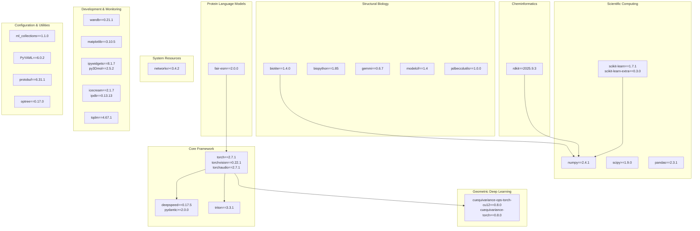
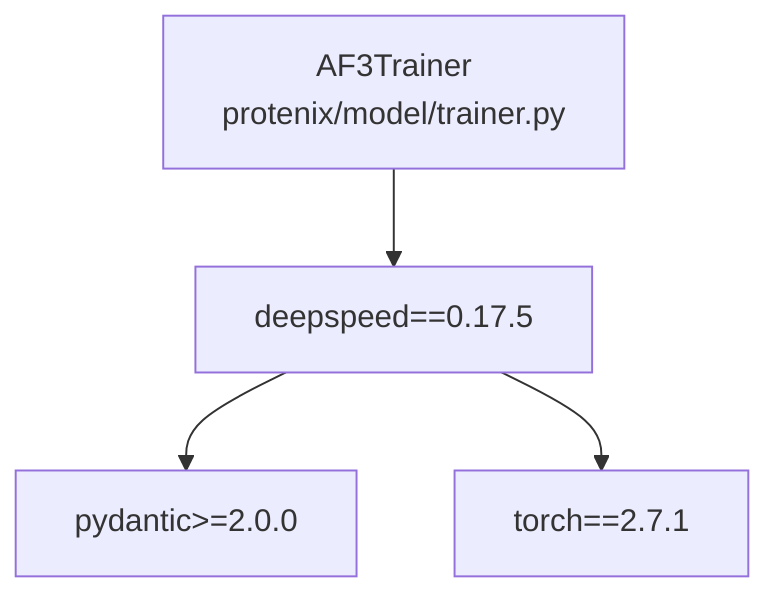
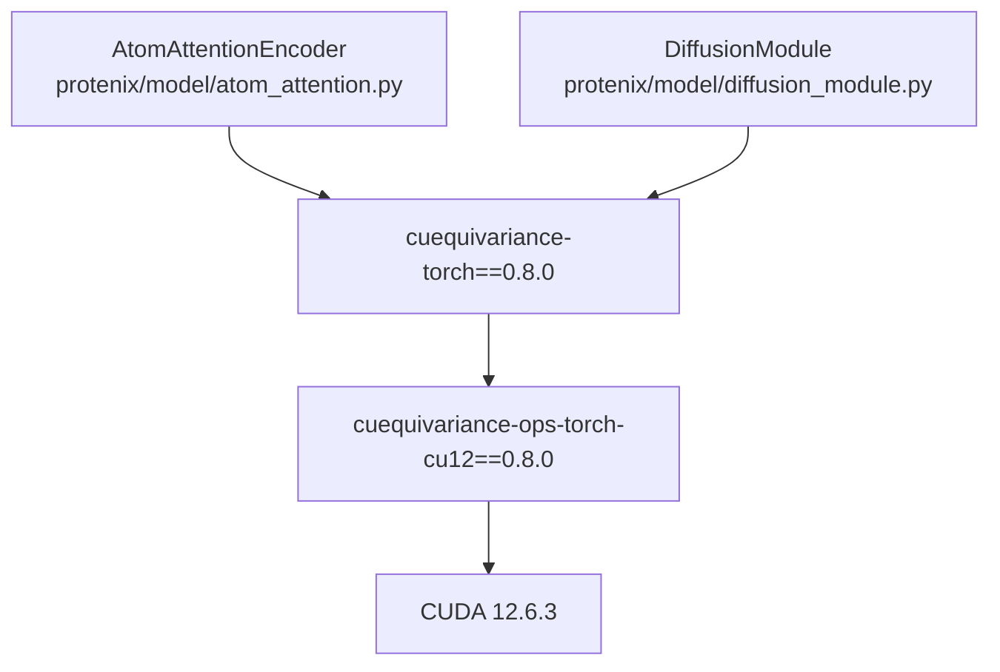
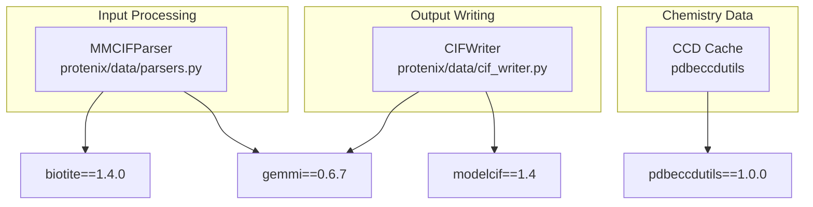
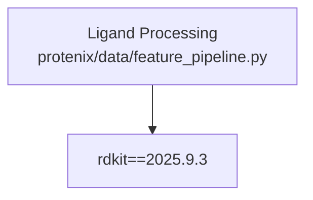
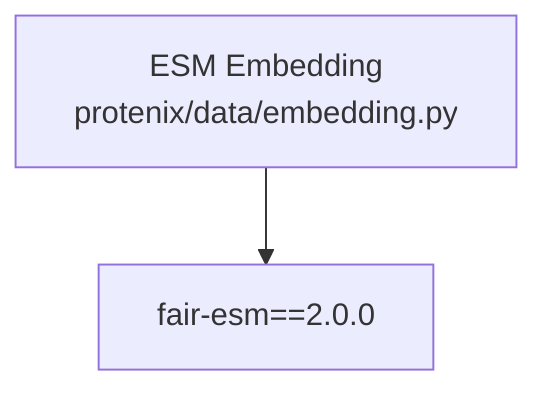
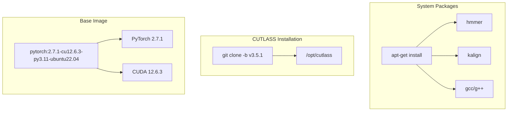
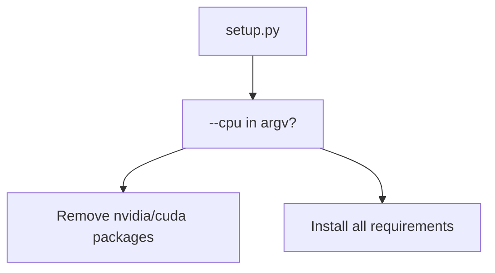

# Dependencies and Environment

> **Relevant source files**
> * [Dockerfile](https://github.com/bytedance/Protenix/blob/c3bfc365/Dockerfile)
> * [protenix/__init__.py](https://github.com/bytedance/Protenix/blob/c3bfc365/protenix/__init__.py)
> * [requirements.txt](https://github.com/bytedance/Protenix/blob/c3bfc365/requirements.txt)
> * [setup.py](https://github.com/bytedance/Protenix/blob/c3bfc365/setup.py)

This document details the complete dependency stack required to run Protenix, including Python packages, system libraries, and hardware-specific requirements. It explains the purpose of each dependency category, version constraints, and CPU/GPU considerations based on the current system configuration.

For Docker-based deployment, see [Docker Deployment](/bytedance/Protenix/9.2-docker-deployment). For package installation modes and setup.py configuration, see [Package Structure and Entry Points](/bytedance/Protenix/9.3-package-structure-and-entry-points). For GPU kernel options and compute capability requirements, see [GPU Compatibility and Kernels](/bytedance/Protenix/9.4-gpu-compatibility-and-kernels).

---

## Dependency Overview

Protenix requires a multi-layered dependency stack organized into functional categories: deep learning frameworks, structural biology tools, scientific computing libraries, and cheminformatics packages. The environment is built on Python 3.11 and requires CUDA 12.6.3 for GPU acceleration.

### Dependency Categories

**Dependency Category Hierarchy**: Dependencies are organized into functional layers. The core framework (PyTorch, DeepSpeed, Triton) provides the neural network infrastructure. Geometric deep learning (cuequivariance) enables equivariant operations. Structural biology packages (biotite, gemmi, biopython) handle molecular structure parsing and manipulation. Scientific computing (NumPy, SciPy) provides mathematical operations. Configuration utilities (ml_collections, PyYAML) manage settings. Development tools (wandb, matplotlib) support monitoring and visualization.

Sources: [requirements.txt L1-L33](https://github.com/bytedance/Protenix/blob/c3bfc365/requirements.txt#L1-L33)

 [setup.py L33-L34](https://github.com/bytedance/Protenix/blob/c3bfc365/setup.py#L33-L34)

 [Dockerfile L11-L22](https://github.com/bytedance/Protenix/blob/c3bfc365/Dockerfile#L11-L22)

---

## Core Framework Dependencies

### PyTorch Ecosystem

Protenix is built on **PyTorch 2.7.1**, which provides the neural network framework, automatic differentiation, and GPU acceleration. The specific version is pinned to ensure consistent behavior across deployments.

| Package | Version | Purpose |
| --- | --- | --- |
| `torch` | 2.7.1 | Core deep learning framework, tensor operations |
| `torchvision` | 0.22.1 | Image processing utilities (indirect dependency) |
| `torchaudio` | 2.7.1 | Audio processing utilities (indirect dependency) |

The torchvision and torchaudio packages are included as part of the standard PyTorch distribution but are not directly used by Protenix's structure prediction pipeline.

Sources: [requirements.txt L1-L3](https://github.com/bytedance/Protenix/blob/c3bfc365/requirements.txt#L1-L3)

 [Dockerfile L1](https://github.com/bytedance/Protenix/blob/c3bfc365/Dockerfile#L1-L1)

### Distributed Training Infrastructure

**DeepSpeed 0.17.5** enables distributed training with ZeRO optimization for memory efficiency. A critical dependency note: DeepSpeed requires **Pydantic ≥2.0.0** for compatibility.

**Distributed Training Dependencies**: The `AF3Trainer` class uses DeepSpeed for distributed training with ZeRO optimization stages. DeepSpeed requires Pydantic v2.x for configuration management.

Sources: [requirements.txt L23-L24](https://github.com/bytedance/Protenix/blob/c3bfc365/requirements.txt#L23-L24)

### Custom GPU Kernels

**Triton 3.3.1** provides a Python-based kernel language and compiler for writing custom GPU operations. Protenix uses Triton for optimized attention mechanisms and triangle operations.

Sources: [requirements.txt L25](https://github.com/bytedance/Protenix/blob/c3bfc365/requirements.txt#L25-L25)

---

## Geometric Deep Learning Dependencies

### Equivariance Operations

The **cuequivariance** package family implements equivariant neural network operations that respect geometric symmetries:

| Package | Version | Purpose |
| --- | --- | --- |
| `cuequivariance-ops-torch-cu12` | 0.8.0 | CUDA-accelerated equivariant operations |
| `cuequivariance-torch` | 0.8.0 | PyTorch interface for equivariant layers |

**Equivariant Operations in Protenix**: The `AtomAttentionEncoder` and `DiffusionModule` utilize cuequivariance for geometric operations that maintain rotational and translational symmetries. These operations are critical for processing 3D molecular coordinates.

The `-cu12` suffix in `cuequivariance-ops-torch-cu12` indicates CUDA 12.x compatibility. This package contains compiled CUDA kernels and must match the system CUDA version.

Sources: [requirements.txt L4-L5](https://github.com/bytedance/Protenix/blob/c3bfc365/requirements.txt#L4-L5)

 [Dockerfile L1](https://github.com/bytedance/Protenix/blob/c3bfc365/Dockerfile#L1-L1)

---

## Structural Biology Dependencies

### Molecular Structure Libraries

Protenix requires multiple structural biology packages for parsing, manipulating, and writing molecular structures:

| Package | Version | Purpose |
| --- | --- | --- |
| `biotite` | 1.4.0 | Primary structure manipulation, AtomArray operations |
| `biopython` | 1.85 | PDB parsing, sequence utilities |
| `gemmi` | 0.6.7 | CIF/mmCIF parsing and writing |
| `modelcif` | 1.4 | ModelCIF format writing (for predicted structures) |
| `pdbeccdutils` | 1.0.0 | Chemical Component Dictionary (CCD) access |

**Structural Biology Workflow**: Input files are parsed using `MMCIFParser` (gemmi-based). Structures are represented internally as biotite `AtomArray` objects. The CCD cache (pdbeccdutils) provides chemical component definitions for ligands and modified residues. Output structures are written in ModelCIF format using `CIFWriter`.

Sources: [requirements.txt L15-L19](https://github.com/bytedance/Protenix/blob/c3bfc365/requirements.txt#L15-L19)

---

## Cheminformatics Dependencies

### RDKit

**RDKit 2025.9.3** provides cheminformatics capabilities for small molecule processing:

**RDKit in Protenix**: RDKit processes small molecule ligands by parsing SMILES strings, generating 3D conformers, inferring bond types, and validating chemical structures.

Sources: [requirements.txt L14](https://github.com/bytedance/Protenix/blob/c3bfc365/requirements.txt#L14-L14)

---

## Protein Language Model Dependencies

### Fair-ESM

**fair-esm 2.0.0** (from Meta AI) provides pre-trained protein language models for generating sequence embeddings:

**ESM Language Model Integration**: The model uses fair-esm embeddings to capture evolutionary information from protein language modeling.

Sources: [requirements.txt L20](https://github.com/bytedance/Protenix/blob/c3bfc365/requirements.txt#L20-L20)

---

## Scientific Computing Dependencies

### Numerical Computing Stack

Core numerical and scientific computing libraries:

| Package | Version | Purpose |
| --- | --- | --- |
| `numpy` | 2.4.1 | Array operations, linear algebra |
| `scipy` | ≥1.9.0 | Scientific computing, optimization, sparse matrices |
| `pandas` | 2.3.1 | Data structures, CSV/table processing |
| `scikit-learn` | 1.7.1 | Machine learning utilities, clustering |
| `scikit-learn-extra` | 0.3.0 | Additional clustering algorithms |

**Scientific Computing Dependencies**: NumPy serves as the foundational array library for all numerical operations. SciPy provides specialized scientific functions. Pandas handles tabular data processing. Scikit-learn is used for clustering chains in the data pipeline.

Sources: [requirements.txt L6-L31](https://github.com/bytedance/Protenix/blob/c3bfc365/requirements.txt#L6-L31)

---

## Configuration and Utility Dependencies

### Configuration Management

| Package | Version | Purpose |
| --- | --- | --- |
| `ml_collections` | 1.1.0 | Configuration dictionaries with dot notation access |
| `PyYAML` | 6.0.2 | YAML parsing for configuration files |
| `optree` | 0.17.0 | Optimized tree operations |
| `protobuf` | 6.31.1 | Protocol buffer serialization |

**Configuration and Serialization**: `ml_collections` provides `ConfigDict` objects used throughout Protenix's configuration system. PyYAML parses YAML files. `optree` handles nested dictionary operations. `protobuf` is used for efficient checkpoint serialization.

Sources: [requirements.txt L7-L27](https://github.com/bytedance/Protenix/blob/c3bfc365/requirements.txt#L7-L27)

### Development and Monitoring Tools

| Package | Version | Purpose |
| --- | --- | --- |
| `wandb` | 0.21.1 | Weights & Biases experiment tracking |
| `tqdm` | 4.67.1 | Progress bars |
| `matplotlib` | 3.10.5 | Plotting and visualization |
| `ipywidgets` | 8.1.7 | Jupyter notebook widgets |
| `py3Dmol` | 2.5.2 | 3D molecular visualization in notebooks |
| `icecream` | 2.1.7 | Debug printing |
| `ipdb` | 0.13.13 | Interactive debugger |

Sources: [requirements.txt L8-L30](https://github.com/bytedance/Protenix/blob/c3bfc365/requirements.txt#L8-L30)

---

## System-Level Dependencies

### Python Runtime

Protenix requires **Python 3.11** or higher as specified in the package configuration and Docker base image.

Sources: [setup.py L50](https://github.com/bytedance/Protenix/blob/c3bfc365/setup.py#L50-L50)

 [Dockerfile L1](https://github.com/bytedance/Protenix/blob/c3bfc365/Dockerfile#L1-L1)

### CUDA and GPU Infrastructure

For GPU acceleration, Protenix requires:

| Component | Version | Purpose |
| --- | --- | --- |
| CUDA | 12.6.3 | NVIDIA GPU compute platform |
| CUTLASS | v3.5.1 | NVIDIA CUDA Templates for Linear Algebra |
| HMMER | - | Profile hidden Markov models for MSA |
| Kalign | - | Fast multiple sequence alignment |

**System Infrastructure**: The Docker base image provides PyTorch 2.7.1 and CUDA 12.6.3. CUTLASS v3.5.1 is cloned during the build process to `/opt/cutlass`. System packages like `hmmer` and `kalign` are required for MSA generation pipelines.

Sources: [Dockerfile L1-L33](https://github.com/bytedance/Protenix/blob/c3bfc365/Dockerfile#L1-L33)

---

## CPU vs GPU Considerations

### GPU-Specific Dependencies

Certain packages are only required for GPU execution. The `setup.py` script contains logic to filter these out if the `--cpu` flag is provided during installation.

| Package | GPU Package Identifier |
| --- | --- |
| `cuequivariance-ops-torch-cu12` | `nvidia` / `cuda` |
| `triton` | GPU dependent |

**CPU vs GPU Installation**: The `setup.py` script identifies GPU-specific packages by searching for "nvidia" or "cuda" in the dependency strings when the `--cpu` flag is set.

Sources: [setup.py L37-L46](https://github.com/bytedance/Protenix/blob/c3bfc365/setup.py#L37-L46)

---

## Environment Variables

### Required Environment Variables

The environment is configured with several key variables to ensure consistent runtime behavior:

| Variable | Value | Purpose |
| --- | --- | --- |
| `CUTLASS_PATH` | `/opt/cutlass` | Path to CUTLASS installation for custom kernels |
| `PYTHONDONTWRITEBYTECODE` | `1` | Prevents .pyc file creation |
| `PYTHONUNBUFFERED` | `1` | Ensures immediate log output |
| `DEBIAN_FRONTEND` | `noninteractive` | Prevents interactive prompts during installation |

Sources: [Dockerfile L4-L8](https://github.com/bytedance/Protenix/blob/c3bfc365/Dockerfile#L4-L8)