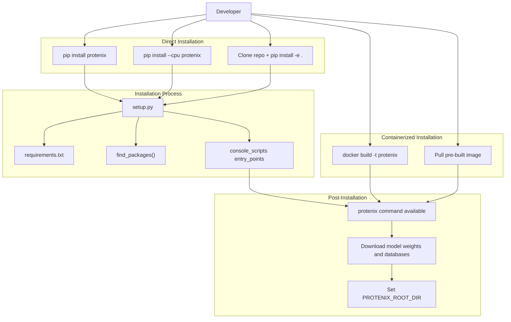
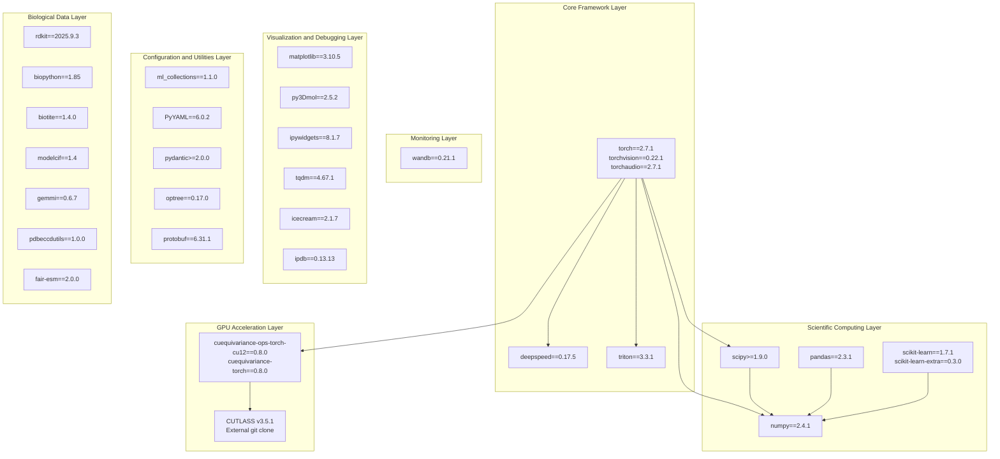
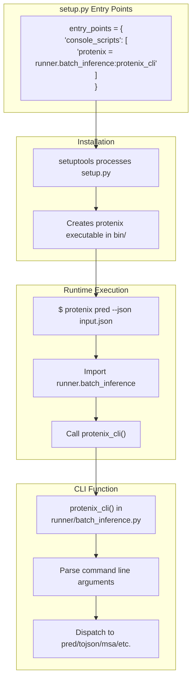
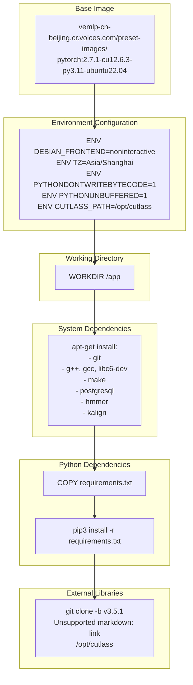

# Development and Deployment

> **Relevant source files**
> * [.github/workflows/ci.yml](https://github.com/bytedance/Protenix/blob/c3bfc365/.github/workflows/ci.yml)
> * [.github/workflows/publish_to_pypi.yml](https://github.com/bytedance/Protenix/blob/c3bfc365/.github/workflows/publish_to_pypi.yml)
> * [CONTRIBUTING.md](https://github.com/bytedance/Protenix/blob/c3bfc365/CONTRIBUTING.md?plain=1)
> * [Dockerfile](https://github.com/bytedance/Protenix/blob/c3bfc365/Dockerfile)
> * [requirements.txt](https://github.com/bytedance/Protenix/blob/c3bfc365/requirements.txt)

This document provides a comprehensive guide for developers working on Protenix, covering environment setup, dependency management, package structure, and deployment strategies. It is intended for contributors, maintainers, and organizations deploying Protenix in production environments.

For information about using Protenix from a user perspective, see [Installation and Setup](/bytedance/Protenix/1.2-installation-and-setup) and [Quick Start Guide](/bytedance/Protenix/1.3-quick-start-guide). For details about configuring GPU kernels and performance optimization, see [GPU Compatibility and Kernels](/bytedance/Protenix/9.4-gpu-compatibility-and-kernels).

---

## Development Environment Setup

Protenix requires Python 3.11 or higher and is designed to run on Linux systems with NVIDIA GPUs. The development environment can be set up either through direct installation or containerized deployment.

### Installation Methods



**Installation Workflow from Source to CLI**

Sources: [setup.py L1-L67](https://github.com/bytedance/Protenix/blob/c3bfc365/setup.py#L1-L67)

 [Dockerfile L1-L34](https://github.com/bytedance/Protenix/blob/c3bfc365/Dockerfile#L1-L34)

### Package Configuration

The [setup.py L38-L67](https://github.com/bytedance/Protenix/blob/c3bfc365/setup.py#L38-L67)

 file defines the package metadata and installation configuration:

| Configuration | Value | Purpose |
| --- | --- | --- |
| Package Name | `protenix` | PyPI package identifier |
| Python Version | `>=3.11` | Minimum required Python version |
| Current Version | `1.0.4` | Release version |
| License | Apache 2.0 | Open-source license |
| Entry Point | `protenix = runner.batch_inference:protenix_cli` | Main CLI command |

The setup process supports a `--cpu` flag [setup.py L27-L36](https://github.com/bytedance/Protenix/blob/c3bfc365/setup.py#L27-L36)

 that removes GPU-dependent packages (`nvidia`, `cuda`) from the installation, enabling CPU-only deployment for testing or development on machines without NVIDIA GPUs.

Sources: [setup.py L38-L67](https://github.com/bytedance/Protenix/blob/c3bfc365/setup.py#L38-L67)

---

## Dependency Architecture

Protenix has a complex dependency tree organized into several functional layers. Understanding these dependencies is crucial for development and troubleshooting.

### Dependency Layers



**Dependency Hierarchy and Relationships**

Sources: [requirements.txt L1-L32](https://github.com/bytedance/Protenix/blob/c3bfc365/requirements.txt#L1-L32)

### Core Dependencies Breakdown

#### Framework Layer

* **torch 2.7.1** [requirements.txt L1](https://github.com/bytedance/Protenix/blob/c3bfc365/requirements.txt#L1-L1) : Core deep learning framework providing neural network primitives, automatic differentiation, and GPU acceleration.
* **deepspeed 0.17.5** [requirements.txt L23](https://github.com/bytedance/Protenix/blob/c3bfc365/requirements.txt#L23-L23) : Distributed training optimization library for multi-GPU and multi-node training.
* **triton 3.3.1** [requirements.txt L25](https://github.com/bytedance/Protenix/blob/c3bfc365/requirements.txt#L25-L25) : GPU programming language for writing custom CUDA kernels.

#### GPU Acceleration Layer

* **cuequivariance-torch 0.8.0** [requirements.txt L5](https://github.com/bytedance/Protenix/blob/c3bfc365/requirements.txt#L5-L5) : Symmetry-preserving neural network operations for SE(3) equivariant architectures.
* **cuequivariance-ops-torch-cu12 0.8.0** [requirements.txt L4](https://github.com/bytedance/Protenix/blob/c3bfc365/requirements.txt#L4-L4) : Optimized CUDA operators for cuequivariance.

#### Biological Data Processing

* **rdkit 2025.9.3** [requirements.txt L14](https://github.com/bytedance/Protenix/blob/c3bfc365/requirements.txt#L14-L14) : Cheminformatics library for handling molecular structures, SMILES parsing, and ligand processing.
* **biopython 1.85** [requirements.txt L15](https://github.com/bytedance/Protenix/blob/c3bfc365/requirements.txt#L15-L15) : Sequence analysis, FASTA parsing, and biological file format handling.
* **biotite 1.4.0** [requirements.txt L16](https://github.com/bytedance/Protenix/blob/c3bfc365/requirements.txt#L16-L16) : Advanced structure analysis, PDB/CIF parsing, and AtomArray operations.
* **gemmi 0.6.7** [requirements.txt L18](https://github.com/bytedance/Protenix/blob/c3bfc365/requirements.txt#L18-L18) : High-performance mmCIF parser for structural data.
* **modelcif 1.4** [requirements.txt L17](https://github.com/bytedance/Protenix/blob/c3bfc365/requirements.txt#L17-L17) : ModelCIF format output generation for predicted structures.
* **pdbeccdutils 1.0.0** [requirements.txt L19](https://github.com/bytedance/Protenix/blob/c3bfc365/requirements.txt#L19-L19) : Chemical Component Dictionary (CCD) utilities for ligands and small molecules.
* **fair-esm 2.0.0** [requirements.txt L20](https://github.com/bytedance/Protenix/blob/c3bfc365/requirements.txt#L20-L20) : Protein language model embeddings (ESM-2) for sequence features.

#### Configuration Management

* **ml_collections 1.1.0** [requirements.txt L7](https://github.com/bytedance/Protenix/blob/c3bfc365/requirements.txt#L7-L7) : Hierarchical configuration system using ConfigDict.
* **PyYAML 6.0.2** [requirements.txt L10](https://github.com/bytedance/Protenix/blob/c3bfc365/requirements.txt#L10-L10) : YAML parsing for configuration files.
* **pydantic >=2.0.0** [requirements.txt L24](https://github.com/bytedance/Protenix/blob/c3bfc365/requirements.txt#L24-L24) : Data validation and settings management with type hints.

Sources: [requirements.txt L1-L32](https://github.com/bytedance/Protenix/blob/c3bfc365/requirements.txt#L1-L32)

---

## Package Structure and Entry Points

The Protenix package is organized to separate user-facing interfaces from internal implementation details.

### Entry Point Configuration



**Entry Point Execution Flow**

The [setup.py L62-L66](https://github.com/bytedance/Protenix/blob/c3bfc365/setup.py#L62-L66)

 configuration creates a console script that maps the `protenix` command to `runner.batch_inference:protenix_cli`. When installed, this creates an executable script in the Python environment's `bin/` directory that can be invoked from the command line.

Sources: [setup.py L62-L66](https://github.com/bytedance/Protenix/blob/c3bfc365/setup.py#L62-L66)

### Package Discovery

The [setup.py L48-L54](https://github.com/bytedance/Protenix/blob/c3bfc365/setup.py#L48-L54)

 call to `find_packages()` automatically discovers all Python packages in the repository, excluding specific directories:

```
packages=find_packages(    exclude=(        "assets",        "benchmark",        "*.egg-info",    ))
```

This ensures that test assets, benchmark scripts, and build artifacts are not included in the distributed package.

Sources: [setup.py L48-L54](https://github.com/bytedance/Protenix/blob/c3bfc365/setup.py#L48-L54)

### Package Data Inclusion

Custom CUDA kernels are included as package data [setup.py L56-L58](https://github.com/bytedance/Protenix/blob/c3bfc365/setup.py#L56-L58)

:

```
package_data={    "protenix": ["model/layer_norm/kernel/*"],}
```

This ensures that optimized CUTLASS kernels for layer normalization operations are distributed with the package and can be loaded at runtime.

Sources: [setup.py L56-L58](https://github.com/bytedance/Protenix/blob/c3bfc365/setup.py#L56-L58)

---

## Docker Deployment

The Dockerfile provides a reproducible containerized environment for deploying Protenix in production or cloud environments.

### Docker Image Architecture



**Docker Build Stages**

Sources: [Dockerfile L1-L34](https://github.com/bytedance/Protenix/blob/c3bfc365/Dockerfile#L1-L34)

### Base Image Selection

The Dockerfile uses [Dockerfile L1](https://github.com/bytedance/Protenix/blob/c3bfc365/Dockerfile#L1-L1)

 a pre-configured PyTorch image:

* **PyTorch Version**: 2.7.1
* **CUDA Version**: 12.6.3
* **Python Version**: 3.11
* **OS**: Ubuntu 22.04

This base image provides a complete GPU-accelerated deep learning environment with CUDA drivers, cuDNN, and PyTorch pre-installed.

Sources: [Dockerfile L1](https://github.com/bytedance/Protenix/blob/c3bfc365/Dockerfile#L1-L1)

### Environment Variables

The [Dockerfile L4-L8](https://github.com/bytedance/Protenix/blob/c3bfc365/Dockerfile#L4-L8)

 environment configuration optimizes container behavior:

| Variable | Value | Purpose |
| --- | --- | --- |
| `DEBIAN_FRONTEND` | `noninteractive` | Prevents interactive prompts during package installation |
| `TZ` | `Asia/Shanghai` | Sets timezone for logging |
| `PYTHONDONTWRITEBYTECODE` | `1` | Disables `.pyc` file generation, reducing image size |
| `PYTHONUNBUFFERED` | `1` | Forces stdout/stderr to be unbuffered for real-time logging |
| `CUTLASS_PATH` | `/opt/cutlass` | Specifies CUTLASS library location |

Sources: [Dockerfile L4-L8](https://github.com/bytedance/Protenix/blob/c3bfc365/Dockerfile#L4-L8)

### System Dependencies

The [Dockerfile L11-L22](https://github.com/bytedance/Protenix/blob/c3bfc365/Dockerfile#L11-L22)

 installs essential system packages:

* **Build Tools**: `git`, `g++`, `gcc`, `libc6-dev`, `make` for compiling custom kernels.
* **Database**: `postgresql` for potential data storage needs.
* **Bioinformatics Tools**: * `hmmer`: For template search via `hmmsearch` and RNA MSA via `nhmmer`. * `kalign`: For MSA alignment operations.

Sources: [Dockerfile L11-L22](https://github.com/bytedance/Protenix/blob/c3bfc365/Dockerfile#L11-L22)

### CUTLASS Integration

The [Dockerfile L33-L34](https://github.com/bytedance/Protenix/blob/c3bfc365/Dockerfile#L33-L34)

 clones NVIDIA's CUTLASS library:

```dockerfile
RUN git clone -b v3.5.1 https://github.com/NVIDIA/cutlass.git /opt/cutlass
```

CUTLASS (CUDA Templates for Linear Algebra Subroutines) provides highly optimized GPU kernels for linear algebra operations. Version 3.5.1 is specifically required for compatibility with Protenix's custom layer normalization and attention kernels.

Sources: [Dockerfile L33-L34](https://github.com/bytedance/Protenix/blob/c3bfc365/Dockerfile#L33-L34)

---

## Continuous Integration and Publishing

Protenix uses GitHub Actions for automated testing and distribution.

### CI Workflow

The `Python package` workflow [.github/workflows/ci.yml L1-L44](https://github.com/bytedance/Protenix/blob/c3bfc365/ .github/workflows/ci.yml#L1-L44)

 triggers on pushes and pull requests to the `main` branch. It performs:

* **Environment Setup**: Configures Python 3.11 [.github/workflows/ci.yml L22-L29](https://github.com/bytedance/Protenix/blob/c3bfc365/ .github/workflows/ci.yml#L22-L29)
* **Linting**: Uses `flake8` to check for syntax errors and complexity [.github/workflows/ci.yml L35-L40](https://github.com/bytedance/Protenix/blob/c3bfc365/ .github/workflows/ci.yml#L35-L40)
* **Testing**: Executes unit and integration tests using `pytest` from the `tests/` directory [.github/workflows/ci.yml L41-L43](https://github.com/bytedance/Protenix/blob/c3bfc365/ .github/workflows/ci.yml#L41-L43)

### Release Workflow

The `Publish Protenix to PyPI` workflow [.github/workflows/publish_to_pypi.yml L1-L36](https://github.com/bytedance/Protenix/blob/c3bfc365/ .github/workflows/publish_to_pypi.yml#L1-L36)

 automates package distribution:

* **Trigger**: Runs when a new tag starting with `v*` is pushed [.github/workflows/publish_to_pypi.yml L3-L6](https://github.com/bytedance/Protenix/blob/c3bfc365/ .github/workflows/publish_to_pypi.yml#L3-L6)
* **Build**: Generates source distributions and wheels using `setup.py` [.github/workflows/publish_to_pypi.yml L25-L27](https://github.com/bytedance/Protenix/blob/c3bfc365/ .github/workflows/publish_to_pypi.yml#L25-L27)
* **Verification**: Checks the package integrity with `twine` [.github/workflows/publish_to_pypi.yml L29-L31](https://github.com/bytedance/Protenix/blob/c3bfc365/ .github/workflows/publish_to_pypi.yml#L29-L31)
* **Publishing**: Uploads the verified package to PyPI [.github/workflows/publish_to_pypi.yml L33-L36](https://github.com/bytedance/Protenix/blob/c3bfc365/ .github/workflows/publish_to_pypi.yml#L33-L36)

Sources: [.github/workflows/ci.yml L1-L44](https://github.com/bytedance/Protenix/blob/c3bfc365/ .github/workflows/ci.yml#L1-L44)

 [.github/workflows/publish_to_pypi.yml L1-L36](https://github.com/bytedance/Protenix/blob/c3bfc365/ .github/workflows/publish_to_pypi.yml#L1-L36)

---

## Contributing Guidelines

Contributors should follow the standards defined in the project's documentation to ensure high-quality code and maintainable history.

* **Pull Requests**: Keep PRs small and functional. The repository uses "Squash and Commit" [CONTRIBUTING.md L11-L13](https://github.com/bytedance/Protenix/blob/c3bfc365/CONTRIBUTING.md?plain=1#L11-L13)  PRs must include appropriate documentation and tests [CONTRIBUTING.md L15](https://github.com/bytedance/Protenix/blob/c3bfc365/CONTRIBUTING.md?plain=1#L15-L15)
* **Issue Tracking**: Use GitHub Issues for bugs, work items, and feature requests. Check existing issues before filing new ones [CONTRIBUTING.md L25-L32](https://github.com/bytedance/Protenix/blob/c3bfc365/CONTRIBUTING.md?plain=1#L25-L32)
* **Design Proposals**: Major changes should be proposed via PRs to allow for community discussion [CONTRIBUTING.md L21-L24](https://github.com/bytedance/Protenix/blob/c3bfc365/CONTRIBUTING.md?plain=1#L21-L24)

Sources: [CONTRIBUTING.md L1-L62](https://github.com/bytedance/Protenix/blob/c3bfc365/CONTRIBUTING.md?plain=1#L1-L62)

---

## CPU-Only Installation

For development and testing on machines without NVIDIA GPUs, Protenix supports a CPU-only installation mode.

The [setup.py L27-L36](https://github.com/bytedance/Protenix/blob/c3bfc365/setup.py#L27-L36)

 implementation detects the `--cpu` flag and filters GPU-specific packages by identifying strings like `nvidia` or `cuda` in the dependency list and removing them before passing to `setuptools`.

Sources: [setup.py L27-L36](https://github.com/bytedance/Protenix/blob/c3bfc365/setup.py#L27-L36)

---

## Summary

The Development and Deployment infrastructure of Protenix is designed for flexibility and reproducibility:

1. **Package Management**: [setup.py](https://github.com/bytedance/Protenix/blob/c3bfc365/setup.py)  provides both user-friendly PyPI installation and developer-friendly editable installation.
2. **Dependency Architecture**: Organized layers from core frameworks (PyTorch) to biological data processing (rdkit, biotite) [requirements.txt](https://github.com/bytedance/Protenix/blob/c3bfc365/requirements.txt)
3. **Docker Deployment**: Self-contained containerized environment with all dependencies and CUTLASS library pre-configured [Dockerfile](https://github.com/bytedance/Protenix/blob/c3bfc365/Dockerfile)
4. **Automation**: CI/CD pipelines ensure code quality and streamline releases to PyPI [.github/workflows/](https://github.com/bytedance/Protenix/blob/c3bfc365/.github/workflows/)

For detailed information about specific subsystems, see:

* [Dependencies and Environment](/bytedance/Protenix/9.1-dependencies-and-environment) for detailed dependency analysis.
* [Docker Deployment](/bytedance/Protenix/9.2-docker-deployment) for container orchestration.
* [Package Structure and Entry Points](/bytedance/Protenix/9.3-package-structure-and-entry-points) for CLI system details.
* [GPU Compatibility and Kernels](/bytedance/Protenix/9.4-gpu-compatibility-and-kernels) for CUDA and CUTLASS integration.

Sources: [setup.py L1-L67](https://github.com/bytedance/Protenix/blob/c3bfc365/setup.py#L1-L67)

 [requirements.txt L1-L32](https://github.com/bytedance/Protenix/blob/c3bfc365/requirements.txt#L1-L32)

 [Dockerfile L1-L34](https://github.com/bytedance/Protenix/blob/c3bfc365/Dockerfile#L1-L34)

 [.github/workflows/ci.yml L1-L44](https://github.com/bytedance/Protenix/blob/c3bfc365/ .github/workflows/ci.yml#L1-L44)

 [.github/workflows/publish_to_pypi.yml L1-L36](https://github.com/bytedance/Protenix/blob/c3bfc365/ .github/workflows/publish_to_pypi.yml#L1-L36)

 [CONTRIBUTING.md L1-L62](https://github.com/bytedance/Protenix/blob/c3bfc365/CONTRIBUTING.md?plain=1#L1-L62)