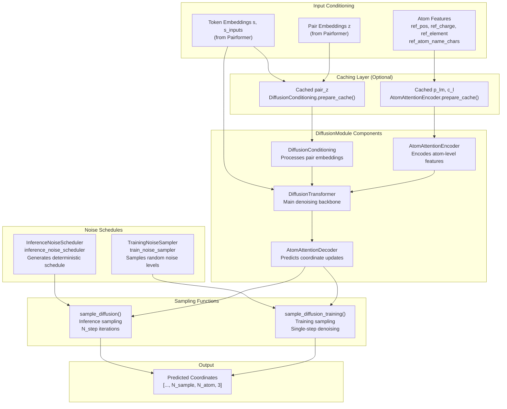
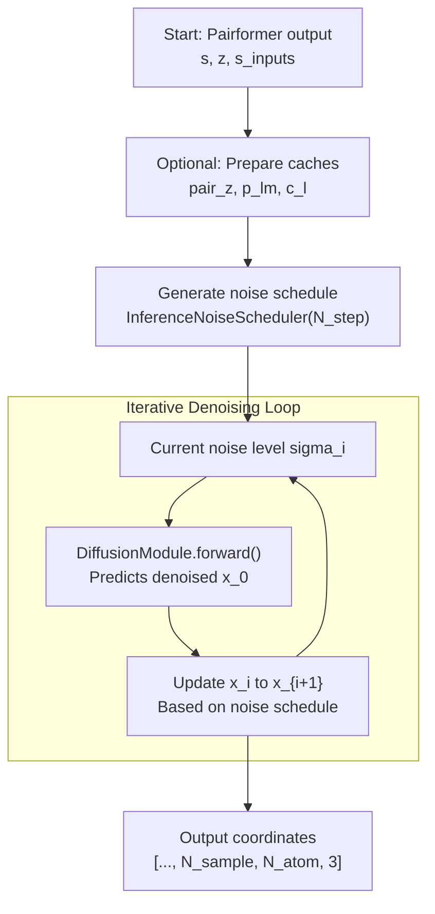

# Diffusion and Structure Generation

> **Relevant source files**
> * [protenix/model/modules/diffusion.py](https://github.com/bytedance/Protenix/blob/c3bfc365/protenix/model/modules/diffusion.py)
> * [protenix/model/modules/transformer.py](https://github.com/bytedance/Protenix/blob/c3bfc365/protenix/model/modules/transformer.py)

This document describes the diffusion-based structure generation system in Protenix, which produces 3D atomic coordinates from learned embeddings. This includes noise schedules, the sampling process, and the underlying architecture of the diffusion module.

For information about the Pairformer stack that produces token embeddings fed into diffusion, see [5.2](https://github.com/bytedance/Protenix/blob/c3bfc365/5.2)

 For confidence metrics computed from generated structures, see [5.4](https://github.com/bytedance/Protenix/blob/c3bfc365/5.4)

## Overview of the Diffusion Process

Protenix uses a denoising diffusion probabilistic model to generate atomic coordinates. The system progressively refines noisy coordinates through multiple denoising steps, conditioned on learned token and pair representations from the Pairformer stack.

The diffusion process operates differently during training and inference:

* **Training**: Uses a noise sampler to generate training pairs (noisy coordinates, noise levels) and trains the model to denoise them. Also performs a "mini-rollout" for confidence head training.
* **Inference**: Uses a deterministic noise schedule to progressively denoise from pure noise to final coordinates through `N_step` iterations.

**Sources:** [protenix/model/protenix.py L91-L169](https://github.com/bytedance/Protenix/blob/c3bfc365/protenix/model/protenix.py#L91-L169)

 [protenix/model/modules/diffusion.py L180-L210](https://github.com/bytedance/Protenix/blob/c3bfc365/protenix/model/modules/diffusion.py#L180-L210)

## Diffusion Architecture

The diffusion system bridges high-level learned representations with low-level atomic coordinates through a specialized transformer-based denoising network.



**Sources:** [protenix/model/modules/diffusion.py L31-L50](https://github.com/bytedance/Protenix/blob/c3bfc365/protenix/model/modules/diffusion.py#L31-L50)

 [protenix/model/modules/diffusion.py L86-L107](https://github.com/bytedance/Protenix/blob/c3bfc365/protenix/model/modules/diffusion.py#L86-L107)

 [protenix/model/modules/transformer.py L254-L323](https://github.com/bytedance/Protenix/blob/c3bfc365/protenix/model/modules/transformer.py#L254-L323)

 [protenix/model/modules/transformer.py L534-L585](https://github.com/bytedance/Protenix/blob/c3bfc365/protenix/model/modules/transformer.py#L534-L585)

 [protenix/model/protenix.py L113-L136](https://github.com/bytedance/Protenix/blob/c3bfc365/protenix/model/protenix.py#L113-L136)

## Noise Schedules

### DiffusionSchedule and Samplers

The `DiffusionSchedule` class provides the base mathematical framework for noise levels [protenix/model/modules/diffusion.py L180-L210](https://github.com/bytedance/Protenix/blob/c3bfc365/protenix/model/modules/diffusion.py#L180-L210)

* **TrainingNoiseSampler**: Generates random noise levels $\sigma$ during training using a log-normal distribution [protenix/model/modules/diffusion.py L255-L274](https://github.com/bytedance/Protenix/blob/c3bfc365/protenix/model/modules/diffusion.py#L255-L274)  This is used in `sample_diffusion_training()` to create training examples by adding noise to ground-truth coordinates.
* **InferenceNoiseScheduler**: Produces a deterministic schedule of noise levels for the iterative denoising process [protenix/model/modules/diffusion.py L213-L252](https://github.com/bytedance/Protenix/blob/c3bfc365/protenix/model/modules/diffusion.py#L213-L252)

During inference, the scheduler generates a sequence of noise levels $\sigma_i$ for `N_step` iterations:

```
noise_schedule = self.inference_noise_scheduler(    N_step=N_step, device=s_inputs.device, dtype=s_inputs.dtype)
```

The schedule is derived using a power-law distribution defined by `P_step` [protenix/model/modules/diffusion.py L236-L248](https://github.com/bytedance/Protenix/blob/c3bfc365/protenix/model/modules/diffusion.py#L236-L248)

**Sources:** [protenix/model/modules/diffusion.py L180-L274](https://github.com/bytedance/Protenix/blob/c3bfc365/protenix/model/modules/diffusion.py#L180-L274)

 [protenix/model/protenix.py L525-L527](https://github.com/bytedance/Protenix/blob/c3bfc365/protenix/model/protenix.py#L525-L527)

## Diffusion Conditioning

The `DiffusionConditioning` class implements the conditioning logic (Algorithm 21 in AF3) [protenix/model/modules/diffusion.py L31-L41](https://github.com/bytedance/Protenix/blob/c3bfc365/protenix/model/modules/diffusion.py#L31-L41)

It processes the trunk embeddings and the noise level to create a conditioned representation for the denoising network:

1. **Pair Conditioning**: Combines the trunk pair embedding `z_trunk` with relative position encodings `relpe` [protenix/model/modules/diffusion.py L93-L100](https://github.com/bytedance/Protenix/blob/c3bfc365/protenix/model/modules/diffusion.py#L93-L100)
2. **Single Conditioning**: Merges trunk single embeddings `s_trunk` with input features `s_inputs` and a Fourier embedding of the noise level `t_hat_noise_level` [protenix/model/modules/diffusion.py L157-L170](https://github.com/bytedance/Protenix/blob/c3bfc365/protenix/model/modules/diffusion.py#L157-L170)
3. **Fourier Embedding**: The noise level is transformed into a high-dimensional feature using `FourierEmbedding` [protenix/model/modules/diffusion.py L74-L80](https://github.com/bytedance/Protenix/blob/c3bfc365/protenix/model/modules/diffusion.py#L74-L80)  [protenix/model/modules/embedders.py L254-L288](https://github.com/bytedance/Protenix/blob/c3bfc365/protenix/model/modules/embedders.py#L254-L288)

**Sources:** [protenix/model/modules/diffusion.py L31-L178](https://github.com/bytedance/Protenix/blob/c3bfc365/protenix/model/modules/diffusion.py#L31-L178)

 [protenix/model/modules/embedders.py L254-L288](https://github.com/bytedance/Protenix/blob/c3bfc365/protenix/model/modules/embedders.py#L254-L288)

## Structure Generation During Inference

### Main Sampling Process

The inference sampling process is orchestrated by `sample_diffusion()`, which is called from `main_inference_loop()` [protenix/model/protenix.py L306-L336](https://github.com/bytedance/Protenix/blob/c3bfc365/protenix/model/protenix.py#L306-L336)

 It follows a deterministic ODE-like solver approach.



**Sources:** [protenix/model/protenix.py L555-L568](https://github.com/bytedance/Protenix/blob/c3bfc365/protenix/model/protenix.py#L555-L568)

 [protenix/model/modules/diffusion.py L213-L252](https://github.com/bytedance/Protenix/blob/c3bfc365/protenix/model/modules/diffusion.py#L213-L252)

### Caching Mechanism

To improve efficiency, Protenix can cache intermediate computations that don't change across denoising steps. This is controlled by `enable_diffusion_shared_vars_cache` [protenix/model/protenix.py L529-L530](https://github.com/bytedance/Protenix/blob/c3bfc365/protenix/model/protenix.py#L529-L530)

* **Pair Cache**: `DiffusionConditioning.prepare_cache()` pre-processes pair features [protenix/model/modules/diffusion.py L86-L107](https://github.com/bytedance/Protenix/blob/c3bfc365/protenix/model/modules/diffusion.py#L86-L107)
* **Atom Cache**: `AtomAttentionEncoder.prepare_cache()` pre-computes atom-level attention features `p_lm` and `c_l` [protenix/model/modules/transformer.py L325-L393](https://github.com/bytedance/Protenix/blob/c3bfc365/protenix/model/modules/transformer.py#L325-L393)

When caching is enabled, these values are passed to the `DiffusionModule` instead of being recomputed at each step [protenix/model/protenix.py L541-L554](https://github.com/bytedance/Protenix/blob/c3bfc365/protenix/model/protenix.py#L541-L554)

**Sources:** [protenix/model/protenix.py L528-L554](https://github.com/bytedance/Protenix/blob/c3bfc365/protenix/model/protenix.py#L528-L554)

 [protenix/model/modules/diffusion.py L86-L107](https://github.com/bytedance/Protenix/blob/c3bfc365/protenix/model/modules/diffusion.py#L86-L107)

 [protenix/model/modules/transformer.py L325-L393](https://github.com/bytedance/Protenix/blob/c3bfc365/protenix/model/modules/transformer.py#L325-L393)

## Structure Generation During Training

### Mini-Rollout and Label Permutation

Training involves a "mini-rollout" phase where a short diffusion process is run in evaluation mode [protenix/model/protenix.py L714-L725](https://github.com/bytedance/Protenix/blob/c3bfc365/protenix/model/protenix.py#L714-L725)

 This predicted structure is used to resolve molecular symmetries by permuting the ground truth labels to match the prediction [protenix/model/protenix.py L754-L760](https://github.com/bytedance/Protenix/blob/c3bfc365/protenix/model/protenix.py#L754-L760)

### Training Denoising

The primary diffusion loss is calculated via `sample_diffusion_training()` [protenix/model/protenix.py L792-L826](https://github.com/bytedance/Protenix/blob/c3bfc365/protenix/model/protenix.py#L792-L826)

 This function:

1. Samples a noise level from `TrainingNoiseSampler`.
2. Adds Gaussian noise to the (permuted) ground truth coordinates.
3. Performs a single denoising step to predict the original coordinates.
4. Calculates the weighted MSE loss between the predicted and actual coordinates.

**Sources:** [protenix/model/protenix.py L713-L826](https://github.com/bytedance/Protenix/blob/c3bfc365/protenix/model/protenix.py#L713-L826)

 [protenix/model/modules/diffusion.py L255-L274](https://github.com/bytedance/Protenix/blob/c3bfc365/protenix/model/modules/diffusion.py#L255-L274)

## Denoising Network (Atom-Level Transformer)

The structure generation relies on an atom-level transformer architecture to handle the fine-grained geometry of the molecule.

| Component | Class | Description |
| --- | --- | --- |
| **Encoder** | `AtomAttentionEncoder` | Maps atom features and noisy coordinates to an atom-level latent space [protenix/model/modules/transformer.py L254-L323](https://github.com/bytedance/Protenix/blob/c3bfc365/protenix/model/modules/transformer.py#L254-L323) |
| **Backbone** | `DiffusionTransformer` | A stack of transformer blocks that process atom-level features, conditioned by token-level embeddings [protenix/model/modules/transformer.py L534-L585](https://github.com/bytedance/Protenix/blob/c3bfc365/protenix/model/modules/transformer.py#L534-L585) |
| **Decoder** | `AtomAttentionDecoder` | Maps the refined latent features back to 3D coordinate updates ($\Delta x$) [protenix/model/modules/transformer.py L651-L702](https://github.com/bytedance/Protenix/blob/c3bfc365/protenix/model/modules/transformer.py#L651-L702) |

### Atom Attention Mechanism

The `AttentionPairBias` class (Algorithm 24 in AF3) is used within the atom transformer to incorporate pair-level biases into the atom-level attention [protenix/model/modules/transformer.py L40-L105](https://github.com/bytedance/Protenix/blob/c3bfc365/protenix/model/modules/transformer.py#L40-L105)

 It supports both standard multi-head attention and a local windowed attention for efficiency [protenix/model/modules/transformer.py L106-L182](https://github.com/bytedance/Protenix/blob/c3bfc365/protenix/model/modules/transformer.py#L106-L182)

**Sources:** [protenix/model/modules/transformer.py L40-L182](https://github.com/bytedance/Protenix/blob/c3bfc365/protenix/model/modules/transformer.py#L40-L182)

 [protenix/model/modules/transformer.py L534-L702](https://github.com/bytedance/Protenix/blob/c3bfc365/protenix/model/modules/transformer.py#L534-L702)

## Optimization and Precision

### Dynamic Precision Management

During inference, precision settings for diffusion are dynamically adjusted based on the total number of tokens to manage memory and stability [runner/inference.py L385-L407](https://github.com/bytedance/Protenix/blob/c3bfc365/runner/inference.py#L385-L407)

```markdown
if n_token > 3840:    configs.skip_amp.sample_diffusion = False # Force FP32elif n_token > 2560:    configs.skip_amp.sample_diffusion = True  # Use AMP
```

### Efficient Fusion

The `enable_efficient_fusion` flag [protenix/model/protenix.py L104](https://github.com/bytedance/Protenix/blob/c3bfc365/protenix/model/protenix.py#L104-L104)

 enables optimized kernels for the `AttentionPairBias` module, where the bias calculation is fused into the attention mechanism to speed up the denoising steps [protenix/model/modules/transformer.py L185-L251](https://github.com/bytedance/Protenix/blob/c3bfc365/protenix/model/modules/transformer.py#L185-L251)

**Sources:** [runner/inference.py L385-L407](https://github.com/bytedance/Protenix/blob/c3bfc365/runner/inference.py#L385-L407)

 [protenix/model/modules/transformer.py L185-L251](https://github.com/bytedance/Protenix/blob/c3bfc365/protenix/model/modules/transformer.py#L185-L251)

 [protenix/model/protenix.py L104](https://github.com/bytedance/Protenix/blob/c3bfc365/protenix/model/protenix.py#L104-L104)